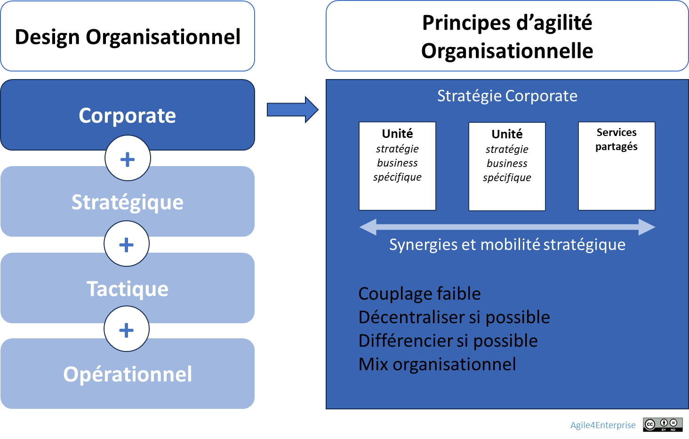

# L’agilité organisationnelle au niveau corporate

✨**Objectif**

Ce chapitre traduit les principes de l’agilité organisationnelle, plus spécifiquement un niveau de l’entreprise : là où se conçoivent les grandes unités, se jouent les synergies, et se pilote l’adaptation continue de l’entreprise.

🧑‍🎓**Ce que vous allez apprendre ici**

- Quels sont les leviers structurels pour aligner design organisationnel et stratégie corporate ?
- Comment créer des unités stratégiques modulaires, autonomes et reconfigurables ?

📚**Petit lexique**

- **Design stratégique** : manière de structurer l’entreprise (départements, fonctions, services) pour exécuter la stratégie de manière fluide et alignée.

- **Avantage parental** : valeur créée par l’entreprise en orchestrant ses unités mieux qu’elles ne pourraient le faire seules (effets de synergie, partage, arbitrage).

- **Services partagés** : fonctions transverses (RH, IT, Finance, etc.) mises au service des unités sans générer de dépendances essentielles.

- **Unité stratégique** : ensemble autonome centré sur un marché, une clientèle ou une zone stratégique, avec son propre modèle d’affaires, ses objectifs, et ses ressources.

## Pourquoi le design à ce niveau compte-t-il vraiment ?

> On ne transforme pas seulement une entreprise par les équipes, mais aussi par les structures qui les soutiennent.

C’est la réponse structurelle à la stratégie corporate. Elle cherche à obtenir un **avantage parental** : créer plus de valeur en pilotant les synergies que chaque unité n’aurait pu générer seule. Sans elle, l’organisation multiplie les changements locaux, mais reste figée à l’échelle globale.

### Design stratégique de l’entreprise

**Objectifs fondamentaux** :

- Identifier et concevoir les **unités stratégiques**.
- Augmenter les **synergies** sans créer de dépendances bloquantes.
- Organiser la cohérence et la cohabitation de plusieurs logiques : Exploration, expansion, exploitation et exclusion.
- Favoriser la **reconfiguration rapide** entre unités.

**Enjeux et périmètre** :

- **Cadre de référence** : Entreprise
- **Transformation organisationnelle** : centralisée et descendante pour les grands choix, appuyée sur des capacités locales d’adaptation.
- **Capacité agile clé** : Adaptabilité systémique
- **Portée** : Structure formelle de l’organisation.

**Spécificité des entreprises spécialisées** :

| | Stratégie business vs corporate | Agilité Corporate |
| --- | --- | --- |
| **Entreprises diversifiées** (multiactivités) | Séparation claire | Active |
| **Entreprises spécialisées** (monométier) | Imbriquées | Liée à l’agilité stratégique |

➿**TechNova**

**Quand le design freine la stratégie** :

> *« On investissait dans l’avenir avec une organisation d’hier. » — responsable Domotique*

**2017.** TechNova veut se tourner vers la domotique. Mais la structure reste organisée autour de ses capteurs :

- La R&D domotique dépend du support industriel,
- Les décisions passent par les fonctions centrales,
- Les délais s’allongent, l’innovation s’éteint.

**2025.** Changement de logique. TechNova lance une **unité Smart Home**, indépendante et évolutive.

> La stratégie a marché, parce que l’organisation a bougé avec elle.

## Les 5 leviers structurels du design d’entreprise

### Des unités stratégiques modulaires

- Structure principale (groupe) minimale

    Seuls les fonctions corporate et les services partagés sont centralisés. Plus l’entreprise en compte, plus on recherche de synergies, mais plus on risque de bureaucratiser l’organisation. Les unités stratégiques sont décentralisées.

- Faible couplage entre unités, mix organisationnel assumé :

    Chaque unité dispose de son propre modèle opératoire. La direction doit donc savoir gérer cette hétérogénéité.

### Des unités stratégiques autonomes

- Chaque unité stratégique gère son propre **modèle d’affaires**, son **compte de résultat** et ses **marges de manœuvre**.

    Elle ne dépend pas de la fonction corporate pour les décisions business. Elle définit où concentrer l’expérience à développer. Cette expérience doit avant tout se construire autour des ressources critiques qui soutiennent ses avantages concurrentiels spécifiques.

- Combiner autorité et responsabilité
- Taille cible inférieure à 150-200 individus pour minimiser l’inertie et maximiser la collaboration.
- Rattachement explicite à une zone du modèle **Agile4E**. L’organisation n’est pas revue par à-coup, elle évolue avec le business. Elle est conçue pour pouvoir **se repositionner** sans dépendre du reste de l’organisation.

➿**TechNova**

Le Product Manager domotique dispose de l’autorité complète sur le compte de résultat et sur les décisions de développement. Responsable de l’atteinte des objectifs, il contrôle également, en tant que manager senior, les ressources nécessaires et leur affectation à l’exécution de sa stratégie.

### Des services partagés sans dépendances essentielles

- Les fonctions support sont partagées intelligemment.

    C’est un point clé : l’agilité encourage l’autonomie et limite les dépendances. Mais cela peut conduire à dupliquer les fonctions support dans chaque unité, au risque de réduire les synergies attendues.

- Tout goulet structurel constitue un risque structurel : RH, IT, Finance, Achats, etc., doivent être pensés comme des facilitateurs, non en centres de contrôle.

🧑‍🎓

Une dépendance devient essentielle lorsqu’elle est incertaine, critique, et qu’elle a un impact fort. Toutes les autres seulement peuvent être gérées en tant que service partagé.

## 👣 Et concrètement, lundi matin ?

Pour se mettre en action :

- Identifiez une unité dont la structure ne correspond pas à sa stratégie. Utilisez les 5 leviers.
- Décidez d’une reconfiguration mineure et réversible à tester sur une unité.
- Identifiez 1 dépendance à transformer en service partagé.
- Ajoutez « Design organisationnel » à l’ordre du jour du prochain COMEX. Observez.

## 🔑 Points clés à retenir

- Le **design organisationnel de l’entreprise** est un levier stratégique, pas une conséquence RH.
- L’organisation doit pouvoir changer de forme pour rester alignée avec sa stratégie.

> Une organisation agile ne se contente pas de suivre le mouvement. Elle a été conçue pour le précéder et pour accueillir toutes les saisons de la stratégie.

