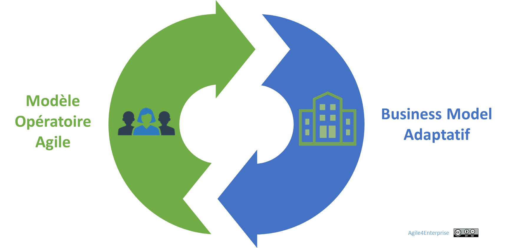
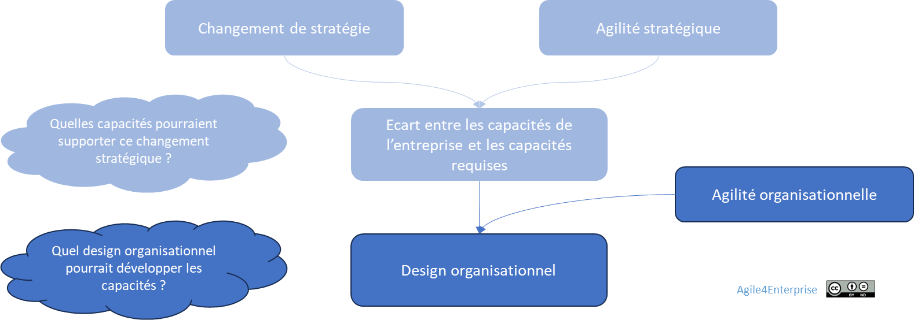

# L’agilité organisationnelle

✨ **Objectif** Définir l’agilité organisationnelle comme la capacité d’une entreprise à réaligner en dynamique sa structure sur sa stratégie. Il ne s’agit pas de changer pour changer, mais d’adapter l’organisation à la fréquence des mouvements stratégiques, même en l’absence de crise — et d’éviter que la stratégie ne reste qu’une déclaration d’intention.

🧑‍🎓 **Ce que vous allez apprendre** - Ce qu’est **l’agilité organisationnelle** : un mécanisme d’alignement vivant, pas une réorganisation tous les 3 ans. - Comment structurer une organisation autour des **natures de décision** (corporate, stratégique, tactique, opérationnelle). - Quels **principes de design organisationnel** permettent d’allier réactivité, cohérence et adaptabilité.

📚 **Petit lexique** **Design organisationnel** = Il désigne la manière dont une entreprise structure ses rôles, ses équipes, ses processus et ces flux de décision pour aligner sa stratégie et ses capacités organisationnelles.

# **Pourquoi l'agilité organisationnelle ?**

> « Tant que l’organisation ne bouge pas, la stratégie est une fiction à haute valeur PowerPoint. »
> 

## Aligner modèle d’affaires et modèle opératoire

Une stratégie ne peut réussir sans une organisation capable de la porter. Dans un monde où les changements s'accélèrent, une structure rigide devient un frein — et parfois même un piège.

**Ce que produit l’absence d’agilité organisationnelle :**

- La stratégie change, mais rien ne change dans l’organisation, hormis quelques projets « phares » isolés.
- Les priorités du COMEX ne se traduisent pas dans les métiers.
- Les réorganisations sont tardives, brutales, inefficaces — et potentiellement vécues comme des traumatismes.

**Résultat** : 

Un désalignement croissant entre le **business model** et le **modèle opératoire**. Le business évolue plus vite que l'organisation qui le supporte. L'inertie organisationnelle crée un écart critique.

Ce décalage s'explique par la persistance de modèles hérités, parfois empilés, une gouvernance inadaptée, ou une exécution stratégique déconnectée du terrain.

## L'agilité organisationnelle, en une phrase

> C’est la capacité à ajuster son organisation au rythme de la stratégie — sans attendre une grande réorganisation, sans subir l’inertie, sans se perdre dans la dispersion.
> 

Plutôt que de tout repenser d’un coup, **l’agilité organisationnelle privilégie des ajustements progressifs**, ciblés, activables rapidement. On passe d’une logique de **grands “batchs” de transformation** à une approche en **petits “batchs” adaptatifs** :

- **La réorganisation classique** : conçue en silo, planifiée sur des mois, déployée sur des années — au point qu’on n’ose plus y retoucher une fois lancée.
- **L’agilité organisationnelle** : testée sur un projet, une équipe, une période. On expérimente, on ajuste, on garde ce qui fonctionne. **Pas de grand plan figé dès le départ**, mais une mise en mouvement continue.

Ce n’est **ni une méthode, ni une finalité** : c’est un **mécanisme vivant d’alignement** entre la stratégie et la structure réelle de l’entreprise. C’est lui qui permet de rester pertinent, cohérent et performant, même quand les orientations évoluent.

Autrement dit :

👉 **L’agilité organisationnelle pour la structure, c’est ce que l’agilité stratégique est pour la stratégie.**

Les deux forment un tandem d’**alignement vivant** entre intentions et capacités.

❌ **Le contre-exemple : Xerox** Dans les années 1990-2000, Xerox anticipe la fin de son modèle centré sur la vente de photocopieurs, en raison de la pression croissante du numérique et de la baisse des marges sur le matériel. L’entreprise entreprend alors un virage stratégique majeur : **devenir un fournisseur de services**, en particulier dans la gestion documentaire, les services de back-office, et le BPO (Business Process Outsourcing). Mais cette mutation stratégique **échoue partiellement dans sa mise en œuvre**, car **la structure de l’entreprise reste largement héritée du modèle industriel**. Plusieurs facteurs structurels ont freiné l’intégration effective de ce virage : - **Les synergies entre services et matériel sont restées faibles** : les unités historiques, conçus autour de leur produits, n’ont pas été redessinées autour des nouvelles offres, les équipes commerciales et opérationnelles sont restées cloisonnées. - **La culture orientée “produit” a continué de dominer**, freinant l’émergence d’une véritable logique “client-service” dans les processus internes. - **Les outils de pilotage, les indicateurs et la gouvernance** sont restés centrés sur les volumes de vente et la performance industrielle, pas sur la satisfaction, la récurrence ou la co-construction. Pendant ce temps, **le marché s’est structuré rapidement autour d’acteurs plus agiles**, capables de proposer des solutions SaaS, cloud, ou à forte valeur ajoutée sans les lourdeurs historiques de Xerox. Résultat : **la nouvelle stratégie a été captée par d'autres**, pendant que Xerox peinait à sortir de ses logiques passées. **Sa capacité organisationnelle à l’opérer à temps n’était pas au rendez-vous.** Cette inertie a scellé une forme de déclassement : **Xerox s’est retrouvé à jouer la défense sur ses marchés historiques**, sans parvenir à s’imposer comme acteur de référence sur les marchés émergents. Dix ans plus tard, le retard est irrattrapable.

## Trois enjeux systémiques

1. **Aligner modèle d'affaires et modèle opératoire** : la stratégie évolue plus vite que l'organisation. Sans alignement, l'énergie se dissipe.
2. **Sortir du mode "réorganisation"** : l'agilité ne repose pas sur une refonte tous les 3 ans, mais sur une évolution incrémentale.
3. **Rendre l'organisation stratégiquement lisible** : chaque partie doit pouvoir répondre à : "Que fais-tu pour la stratégie ?"

## **Les tensions à piloter**

> L’agilité organisationnelle n’est pas l’absence de structure. C’est l’orchestration dynamique des tensions.
> 

L’agilité organisationnelle ne supprime pas les tensions. Elle doit les **mettre en mouvement**.

| Tension | Lecture agile | Risque si non traité |
| --- | --- | --- |
| Cohérence globale vs autonomie locale | Autonomie couplée à un cap stratégique | Fragmentation, silos |
| Stabilité des équipes vs flexibilité structurelle | Équipes stables, mais reconfigurations possibles | Figement ou chaos |
| Optimisation globale plutôt que locale | Arbitrage pour la stratégie, pas pour l'efficacité locale | Déphasage structurel |
| **Centralisation ≠ Uniformité** | Centraliser ce qui renforce la stratégie. Décentraliser ce qui renforce la vitesse. | Bureaucratie |
| **Différenciation ≠ Fragmentation** | Spécialiser sans casser les flux. Intégrer sans rigidifier. | Cloisonnement, rupture de chaîne de valeur |

Le **défi de l’agilité organisationnelle** est de naviguer entre ces tensions et de les transformer en **leviers de performance durable :**

⇒ Si la structure de l’entreprise est en réorganisation permanente, elle risque de ne pas accumuler les compétences et les savoir-faire nécessaires à la création d’un **avantage concurrentiel durable**.

⇒ À l’inverse, une structure trop figée limite les choix stratégiques, limite la capacité d’adaptation et expose l’entreprise à l’obsolescence.

⇒ Il faut concilier des équipes, des chaînes de valeur et des produits stables tout en recherchant une organisation flexible et dynamique.

## **Une trajectoire de transformation continue**

Le choix d’une stratégie soulève deux questions essentielles : l’organisation est-elle en mesure de l’exécuter ? Est-elle optimisée pour celle-ci ?

*L’écart entre ses capacités actuelles et celles requises pour atteindre ses ambitions détermine la nécessité d’une transformation organisationnelle*.

Pour l’entreprise agile, ces capacités sont principalement la **réactivité**, **flexibilité**, **adaptabilité**, et **proactivité.**

Mais ce n’est pas un projet ponctuel. C’est un **processus adaptatif** à piloter dans la durée. Il repose sur :

- **Une approche itérative** : on évolue sans tout casser.
- **Un pilotage par impact** : on juge chaque évolution à ses effets réels.
- **Une gouvernance distribuée** : on prend les décisions au plus près du réel.

Sinon, l’organisation ne pourra pas évoluer par elle-même, c'est-à-dire à travers ses propres acteurs, pour s’adapter aux changements qui surviendront après la transformation.

---

# Le design organisationnel au service de l’agilité organisationnelle

## Le design organisationnel comme levier

> Une stratégie se gagne sur le terrain, mais se perd souvent dans l’organisation.
> 

L’agilité ne repose pas sur des postures mais sur des arbitrages structurels. C’**est un enjeu de design organisationnel** en recherchant un **modèle favorisant l’adaptabilité** tout en maintenant une cohérence stratégique et opérationnelle.

La structure ne fait pas l’agilité organisationnelle mais crée les conditions de son succès. Elle constitue **un levier facilitateur**. Un bon design :

- Évite les dépendances bloquantes,
- Favorise les apprentissages croisés,
- Permet à chaque unité de se reconfigurer en restant aligné.

## Les 4 dimensions d'agilité organisationnelle

> Une organisation agile se conçoit comme un **système multi-niveaux**, structuré autour de **quatre types de décisions** : corporate, stratégique, tactique, opérationnelle.
> 

Le découpage par nature de décision permet d’**aligner structure et stratégie** — plutôt que de s’enfermer dans un organigramme figé.

- **Corporate** : c’est l’entreprise, là où se pilotent la vision, le portefeuille et les grands arbitrages.
- **Stratégique** : les unités stratégiques prennent des décisions propres à un marché, un client, un segment ou une région. Elles possèdent leur propre modèle d’affaires.
- **Tactique** : les unités tactiques portent sur les chaînes de valeur. Cela permet une autonomie de décision dans l’exécution, l’ajustement et l’apprentissage.
- **Opérationnel** : ce sont les équipes de terrain. Elles réalisent, livrent, observent, remontent les signaux.

**Piège fréquent** : Croire que l’on peut garder les mêmes unités stratégiques ou tactiques… alors que la stratégie a changé. Une organisation agile évolue avec ses décisions — pas l’inverse.

## Les grands principes de design organisationnel

> Une organisation agile se conçoit **de l’extérieur vers l’intérieur**, à partir de ce qui change : le client, le marché, l’usage.
> 

Pour cela :

1. **Partir du réel** : concevoir l’organisation à partir des besoins, des parcours et des signaux externes — pas depuis l’organigramme existant.
2. **Maximiser la surface d’exposition au changement** : les équipes doivent être **au contact direct du terrain**, sans filtres ni intermédiaires, pour capter les signaux faibles, tester rapidement, ajuster en continu.
3. **Découper en unités petites, autonomes, alignées** : chaque unité est reliée à une zone stratégique, avec un mandat clair, une capacité d'action, et une cohérence avec la stratégie globale.

> L’agilité organisationnelle commence là où les décisions stratégiques rencontrent les usages réels.
> 

💡 En savoir plus sur les grands principes en annexe.

➿ **TechNova : du patch IA à la BU Smart Home** En 2025, après avoir exploré plusieurs prototypes IA intégrés à ses capteurs, **TechNova ne se contente plus de lancer des projets isolés** dans ses BU existantes. L’entreprise crée une **véritable unité stratégique dédiée à la Smart Home**, dotée de sa propre équipe, de son budget, et d’un accès direct aux clients pilotes. Cette décision marque un **changement de design organisationnel** : - **Les équipes IA sont sorties de la R&D historique**, pour être au plus près du terrain. - **La BU Smart Home est conçue comme une zone d’exploration** : structurée autour d’un nouveau modèle d’affaires, capable de s’ajuster vite à un marché émergent. > “Ce n’est pas qu’on a réorganisé. C’est qu’on a conçu une unité autour du changement lui-même.” — Responsable Business Dev, TechNova >

## 👣 Et concrètement, lundi matin ?

On teste votre agilité organisationnelle :

- La structure a-t-elle évolué **depuis le dernier mouvement stratégique** ?
- Combien de temps vous faut-il pour réorganiser une unité autour d'une nouvelle priorité ?
- Avez-vous des zones floues : initiatives stratégiques portées par personne, ou sans structure ?
- Qui bloque une réorganisation utile ? Par quels mécanismes ?
- Le design organisationnel est vue comme une conséquence RH, plus que comme un levier stratégique ?

> Si répondre à ces questions gène, c'est que votre agilité organisationnelle est un levier inexploité. Et une organisation qui ne se transforme pas elle-même ne survivra pas aux transformations stratégiques.
> 

---

#