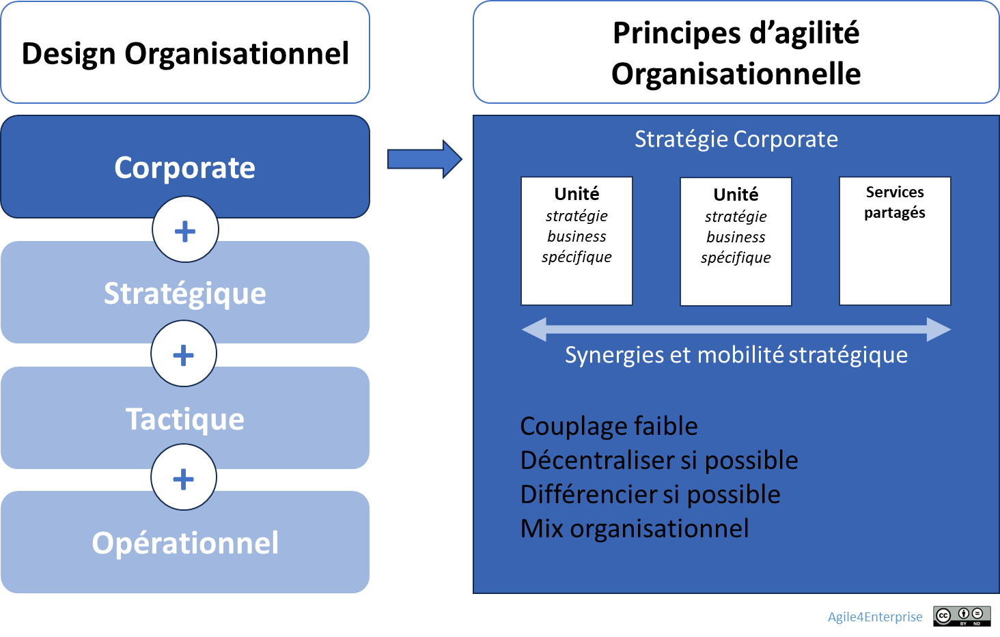

# L’agilité organisationnelle au niveau corporate

✨ **Objectif** Ce chapitre traduit les principes de l’agilité organisationnelle à l’échelle de l’entreprise, de son portefeuille d’investissement : là où se conçoivent les grandes unités, se redistribuent les ressources, se jouent les synergies, et se pilote l’adaptation continue de l’entreprise.

🧑‍🎓 **Ce que vous allez apprendre** - Quels sont les **leviers structurels** pour aligner design organisationnel et stratégie corporate. - Comment créer des **unités stratégiques modulaires, autonomes et reconfigurables**.

📚 **Petit lexique** **Design stratégique** = Manière de structurer l’entreprise (BU, fonctions, services) pour exécuter la stratégie corporate de manière fluide et alignée. **Avantage parental** = Valeur créée par l’entreprise en orchestrant ses unités mieux qu’elles ne pourraient le faire seules (effets de synergie, partage, arbitrage). **Services partagés** = Fonctions transverses (RH, IT, Finance, etc.) mises au service des unités sans générer de dépendances essentielles. **Unité stratégique** = Ensemble autonome centré sur un marché, un client ou une zone stratégique, avec son propre business model, ses objectifs, et ses ressources.

# Pourquoi ce niveau est important

> *“On ne transforme pas seulement une entreprise par les équipes, mais aussi par les structures qui les soutiennent.”*
> 

L’agilité organisationnelle au niveau corporate est le rouage **entre la stratégie corporate et l’exécution dynamique**. Elle permet de transformer un portefeuille d’activités en **système évolutif**, aligné sur les priorités réelles, les tensions stratégiques, et les cycles d’investissement.

Sans elle, l’entreprise multiplie les transformations en local, mais reste rigide à l’échelle globale.

## Le modèle opératoire doit devenir vivant

> *Un portefeuille dynamique impose un design vivant. Une entreprise traverse les saisons stratégiques comme un organisme vivant traverse le temps : elle doit savoir germer, croître, récolter... et se reposer.*
> 

Agilité organisationnelle au niveau corporate

## **Design stratégique de l’entreprise**

> Le design stratégique d’entreprise est la **réponse structurelle à la stratégie corporate.** Il permet d’obtenir un **avantage parental** : créer plus de valeur en pilotant les synergies que chaque unité n’aurait pu générer seule.
> 

**Objectifs fondamentaux**

- Identifier et piloter les **unités stratégiques** à impact différencié.
- Augmenter les **synergies sans créer de dépendances bloquantes**.
- Organiser la cohérence et la **cohabitation de plusieurs logiques stratégiques** (Exploration, Expansion, Exploitation, Exclusion).
- Favoriser la **reconfiguration rapide** des unités et des ressources.

**Spécificité des entreprises spécialisées**

|  | Stratégie business vs corporate | Agilité Corporate |
| --- | --- | --- |
| **Entreprises diversifiées** (multi-activités)  | Séparation claire | Active |
| **Entreprises spécialisées** (mono-métier) | Imbriquées | Imbriquée avec l’agilité stratégique |

## **Enjeux et périmètre**

- **Cadre de référence** : Entreprise
- **Transformation organisationnelle** : Centralisée et descendante pour les grands choix, appuyée sur des capacités locales d’adaptation.
- **Capacité agile clé** : Adaptabilité systémique
- **Portée** : Structure formelle de l’organisation.

> *Par exemple, une direction produit partagée entre deux BU, l’une pour le marketing, l’autre pour l’IT : les délais s’allongent, la redevabilité devient floue, l’innovation s’éteint.*
> 

➿ **TechNova — Quand le design freine la stratégie** > *“On investissait dans les produits d’avenir avec une organisation d’hier.”* > **2017.** TechNova veut se tourner vers la domotique. Mais la structure reste centrée sur les capteurs : - R&D domotique dépend du support industriel, - Les décisions passent par des fonctions centrales, - Les délais s’allongent, l’innovation s’éteint. **2025.** Changement de logique. TechNova crée une **BU Smart Home & IA**, indépendante, modulaire, alignée sur sa zone stratégique. > La stratégie a marché, parce que l’organisation a changé avec elle. >

# **Les 6 leviers structurels du design d’entreprise**

## Des unités stratégiques modulaires

- Structure principale minimale, adaptée au niveau d’intervention de la fonction corporate.
    
    Seules les fonctions corporate et les services partagés sont centralisés, les unités stratégiques sont décentralisées.
    
- Faible couplage entre unités, mix organisationnel assumé :
    
    Chaque unité stratégique a son propre modèle organisationnel adapté, ce qui veut dire au niveau entreprise, de savoir gérer cette hétérogénéité organisationnelle.
    

> L’entreprise devient un écosystème d’unités stratégiques, et non un organigramme figé.
> 

## Des unités stratégiques autonomes

- Chaque unité stratégique a son propre **business model**, ses **marges de manœuvre**, son **compte de résultat**.
    
    L’unité stratégique doit définir les contours des organisations là où l’expérience doit être accumulée en mettant l’accent sur les sources critiques d’avantages concurrentiels.
    
    Aucune BU ne peut être stratégique si elle dépend pour chaque décision de la fonction corporate.
    
- Combinant autorité et responsabilité
- Taille cible : < 200 collaborateurs pour préserver la réactivité.
- Alignement explicite à une zone stratégique du modèle 4E. L’organisation n’est pas revue par à-coup, elle évolue avec le business.  Elle est conçue pour pouvoir **se repositionner** sans dépendre du reste de l’organisation.

Technova

*Le Product Manager domotique a toute autorité sur le compte de résultat du produit, et pouvoir décider de développements. Il a la responsabilité d’atteindre les objectifs du produit, et en tant que manager senior, il a également le contrôle des ressources nécessaires pour exécuter sa stratégie produit.*

## Des services partagés sans dépendances essentielles

- Les fonctions support sont **partagées intelligemment** — mais jamais **imposées comme des points de blocage**.
    
    C’est un point important car l’agilité promeut des unités autonomes, en cherchant à éviter toute dépendance.
    
- Tout **goulet structurel** est un risque stratégique : RH, IT, Finance, Achats, etc. doivent être pensés **comme catalyseurs**, non comme centres de contrôle.

🧑‍🎓 Une dépendance est dite “essentielle” si elle est incertaine, critique, et fortement impactante. Toute autre dépendance peut être gérée en tant que services partagés, avec des boucles de feedbacks adaptées.

## La mobilité stratégique comme mode de fonctionnement

Une activité change de zone stratégique ?

**Avant** : Le travail passait de d’une équipe à une autre – par exemple, de la R&D vers l’exploitation.

**Après** : L’équipe suit le travail. Elle adapte ses pratiques, ses indicateurs, sa gouvernance. Et avec elle, l’apprentissage se consolide.

## Une gouvernance multi-cadencée et adaptative

- Une **cadence stratégique annuelle** (reconfiguration d’ensemble).
- Une **cadence tactique trimestrielle** (réorientation partielle, décisions d’impact).
- Une **cadence continue d’opportunité**.

> *Gouverner, ce n’est plus planifier. C’est décider au bon moment.*
> 

## Un design respirant, pas saturé

Un portefeuille saturé est un portefeuille fragile. L’agilité impose **du slack intégré** à la conception même du système :  **financier, humain et temporel**. Le slack n’est pas un luxe, c’est une **marge stratégique** intentionnelle indispensable.

Ce Slack est intégré par design :

- Pour absorber les variations,
- Pour catalyser l'innovation continue,
- Pour fluidifier la mobilité stratégique.

📚 En savoir plus sur l’agilité organisationnelle dans notre wiki, ou dans notre livre.

## 👣 Et concrètement, lundi matin ?

- Listez les 3 unités stratégiques dont la structure est en décalage avec leur stratégie. Utilisez les 6 leviers structurels.
- Identifiez 2 dépendances critiques à transformer en services partagés.
- Décidez d’une reconfiguration mineure et réversible à tester sur une unité en moins d’un mois.
- Ajoutez « Design organisationnel » à l’ordre du jour du prochain COMEX. Observez.

---

#