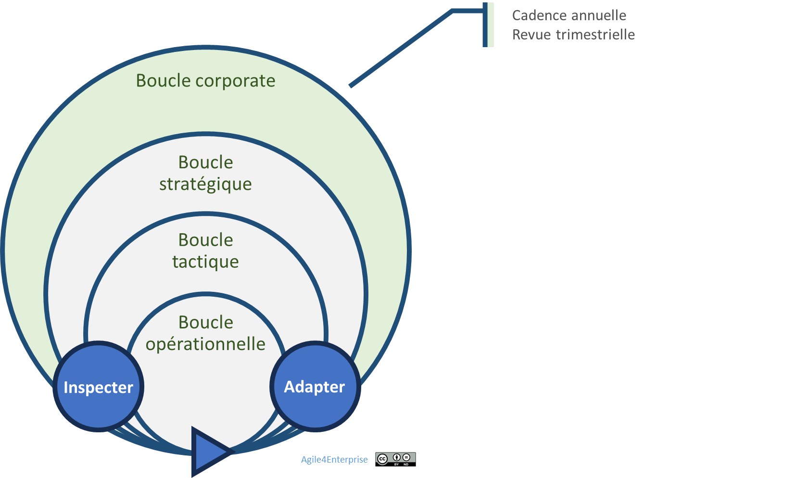

# La gouvernance adaptative corporate

✨**Objectif**

Faire évoluer la gouvernance du portefeuille stratégique pour la rendre vivante : capable d’écouter, de s’adapter et de réallouer les ressources, plutôt que de figer et verrouiller les décisions.
Il ne s’agit plus de suivre un plan immuable, mais de piloter en continu des ajustements guidés par les signaux du marché et les initiatives du terrain.

Au centre : un COMEX qui apprend, arbitre, distribue et concentre l’énergie là où elle apporte le plus de valeur.

🧑‍🎓**Ce que vous allez apprendre ici**

- Comment appliquer le modèle de gouvernance dans une entreprise complexe.
- Comment rythmer les décisions avec les **cadences d’orchestration**.

📚**Petit lexique**

- **Slack** = marge de manœuvre volontaire (en budget, temps, compétences) permettant de saisir les opportunités ou de réagir rapidement sans attendre un cycle planifié.

- **COMEX** (Comité Exécutif) = instance de direction de l’entreprise. Le COMEX élargi est souvent mobilisé pour les revues stratégiques annuelles : il arbitre les grandes orientations, réalloue les budgets et valide les décisions structurantes.

- **CODIR** (Comité de Direction) = instance de coordination entre directions métiers. Le CODIR pilote l’exécution à moyen terme, en lien avec les priorités stratégiques et les résultats opérationnels.

## Le modèle de gouvernance d’entreprise

### La métaphore : gouverner comme un jardinier

Pour filer une nouvelle métaphore, la gouvernance d’entreprise classique adopte l’approche du planificateur : il trace, chiffre et assigne. Celle du jardinier est **adaptative** : il observe, taille, arrose, redistribue, choisit ce qui doit pousser ou être composté. Elle repose sur **des saisons stratégiques**. Elle accepte que certaines branches doivent être taillées pour que d’autres fleurissent.

Pour l’agilité, gouverner ne signifie pas contrôler : il faut orchestrer, synchroniser, régénérer, en suivant les phases du modèle Agile4E — exploration, expansion, exploitation et exclusion.

### Principes de gouvernance

**Ce que l’on veut éviter** :

- Des cycles longs, linéaires, sourds aux signaux faibles,
- Des COMEX qui décident sans véritablement réallouer les ressources, le budget ou les équipes en conséquence,
- Des arbitrages qui perpétuent l’existant par inertie — et non par conviction.

**Ce que l’approche adaptative propose à la place** :

- Une boucle d’apprentissage collective,
- Des cadences stratégiques connectées aux flux réels,
- Une marge de manœuvre intentionnelle (Slack) pour accueillir l’inattendu,
- Une lecture partagée de la valeur et de l’impact.

#### Une approche participative et itérative

- **Participative**

    Le choix entre une approche descendante ou ascendante dépend souvent du style de leadership de la direction :

  - Dans une approche uniquement descendante, la direction fixe le plan et le cascade le long de la ligne hiérarchique, sans laisser de place aux remontées terrain ni aux opportunités locales.

  - Dans une approche uniquement ascendante, la stratégie résulte de la somme des plans des unités, ce qui conduit à négliger les opportunités transversales, qu’elles soient communes à plusieurs unités ou n’en concernent aucune (relais de croissance).

  L’approche mixte retenue privilégie l’adaptation au contexte plutôt qu’au style du dirigeant. Elle associe les parties prenantes aux décisions stratégiques.

- **Itérative**

    La gouvernance fonctionne par cycles d’apprentissage réguliers (revues stratégiques, tactiques, opérationnelles). Accueillir le changement commence ici.

#### Le contrat social

L’entreprise agile fonctionne sur un **contrat social** de confiance et d’engagement mutuel :

- L’organisation s’engage à rendre ses choix transparents, à traiter les tensions de façon constructive et à offrir un cadre vivant qui favorise l’autonomie des équipes.
- Ces dernières s’engagent à décider au plus près du terrain, à partager leurs apprentissages et à contribuer à la cohérence collective.

Ce pacte évolue en permanence, au gré des situations. Il est à écrire pour chaque entreprise. Des garants peuvent veiller à ce contrat, comme le **coach agile d’entreprise**.

⚠️
Si une entreprise agile agit dans l’intérêt collectif, elle ne fonctionne pas pour autant comme une démocratie d’entreprise. Ce modèle de gouvernance existe, mais rien n’oblige à l’utiliser.

## Gouverner par les cadences du changement

### Les cadences d’orchestration

L’agilité d’entreprise ne remet pas en question la nécessité d’un pilotage structuré, mais redéfinit la façon de l’exécuter. C’est pourquoi, autant que possible, les cadences du changement doivent s’intégrer aux instances existantes : COMEX, COMEX élargi, CODIR.

Ces instances ne remplissent pas de rôle de points de contrôle ou de reporting, et ne reflètent pas l’organigramme.
Elles doivent être conçues comme des forums d’apprentissage collectif, où les décisions reposent sur les retours du terrain et la performance réelle des stratégies.

### Les revues de pilotage repensées

>Piloter, ce n’est pas réviser les chiffres : c’est redistribuer la capacité d’agir.

#### Revue corporate (annuelle)

- Synchronise stratégie et portefeuille (**PACTE**)
- Suit l’évolution des actifs dans les zones **Agile4E**,
- Réoriente les grandes allocations,
- Active la **mobilité stratégique**

#### Synchronisation avec les revues stratégiques business (trimestrielle)

Les revues annuelles s’accompagnent d’ajustements trimestriels. La clé réside dans la synchronisation et l’alignement avec les revues business, notamment par le suivi des OKR stratégiques.

*Ce qui dysfonctionne quand cela manque* :

Le pilotage séparé des sujets, sans synergie ni mobilité entre activités, installe des silos entre unités d’affaires.

➿**TechNova**

**À l’épreuve du réel** :

> « La revue stratégique avait lieu, mais rien ne changeait. » — CTO TechNova

**2024.** TechNova multiplie les projets : domotique, capteurs industriels, IA embarquée, SRE… Mais rien ne bouge vraiment. Les revues stratégiques restent trop formelles, les décisions budgétaires figées, les signaux terrain ignorés.

**2025.** Changement de cap : TechNova adopte une **gouvernance adaptative**.

**Résultat** :

| Rythme | Cadence | Décisions | Instance TechNova |
| --- | --- | --- | --- |
| **Revue stratégique** | Annuelle | Retrait du projet SRE, recentrage sur la domotique. | COMEX élargi |
| **Revue tactique** | Trimestrielle | Réaffectation du budget de l’IA selon les retours du marché | CODIR + responsable Stratégie |
| **Revue opérationnelle** | Mensuelle | Ajustements terrain avec l’équipe capteurs (ex. : maintenance automatisée) | Pôle technique + métier |
| **Slack stratégique** | Continue | Activation d’une opportunité santé| Budget exploratoire activé par CTO |

En trois mois, les décisions gagnent en fluidité, les ressources se déplacent facilement, et un chantier se ferme en 30 jours — contre 12 mois autrefois.

> TechNova démontre qu’agilité ne rime pas seulement avec réactivité : c’est pouvoir reconfigurer vite.

## Les leviers concrets pour activer la gouvernance

### Arbitrer par l’impact

À chaque cycle, on :

- Réévalue les activités selon leur valeur stratégique,
- Dirige les investissements vers les initiatives à haut potentiel,
- Transforme ou désengage les actifs non alignés.

### Utiliser le Slack stratégique

Le portefeuille intègre volontairement de la marge de manœuvre :

- Budget d’investissement libre (10-20 % non affecté).
- Capacité humaine modulable (polyvalence).
- Fenêtres de décisions opportunistes (hors cycle trimestriel si nécessaire).

> Sans Slack, pas de mobilité. Sans mobilité, pas d’agilité stratégique réelle.

### Aligner les processus clés

Voici la liste des processus à synchroniser pour faire vivre l’agilité corporate :

- **Gestion du portefeuille** : revues trimestrielles.
- **Gestion du budget** : sur une fenêtre glissante 3 mois ou sur un modèle d’investissement incrémental.
- **Ressources** : les équipes sont affectées selon les objectifs.
- **Talents** : pilotage des compétences en lien avec les besoins stratégiques.
- **Pilotage des risques**.

## 👣 Et concrètement, lundi matin ?

Posez-vous les questions suivantes :

- Où avez-vous promis de l’agilité sans allouer de Slack ?
- Quel projet mobilise des talents sans générer d’impact mesuré ?
- Qui, dans votre COMEX, a le mandat pour dire stop ?
- Avez-vous redirigé au moins 10 % de vos ressources en fonction des signaux de terrain depuis un an ?

>On reconnaît une gouvernance adaptative au fait qu’elle ferme, ralentit ou réalloue régulièrement des initiatives, par exemple au cours des 90 derniers jours.

## 🔑 Points clés à retenir

- La gouvernance corporate devient une **boucle adaptative**, pas une planification annuelle.
- Le portefeuille est un **flux stratégique vivant**, piloté par l’impact.
- La **mobilité stratégique** est une compétence organisationnelle essentielle.
- Le **Slack stratégique** est un facteur d’agilité réel, pas une indulgence.
- La cartographie 4E permet de suivre, arbitrer et activer les décisions clés en temps réel.

Réinventer la gouvernance corporate, c’est rendre la stratégie vivante dans l’exécution.

