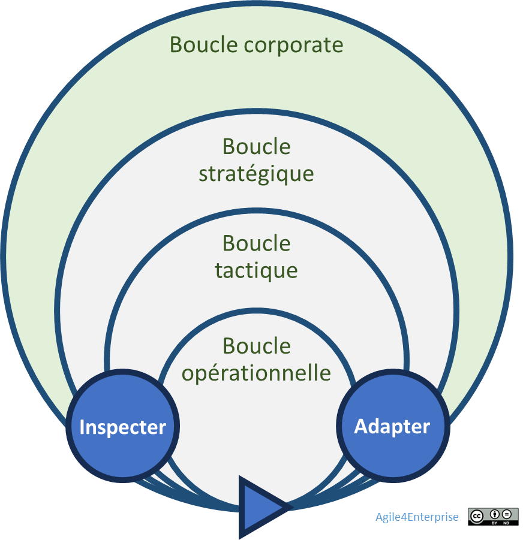

# L’agilité Corporate : vue d’ensemble

Propriétaire: Laurent Morisseau
Étiquettes: Agilité Portfolio, Principes

- Sommaire

✨ **Objectif** Piloter votre portefeuille stratégique : détecter en continu les opportunités, redistribuer talents et budgets en temps réel, et maximiser la création de valeur. **Les enjeux** Bâtir des synergies entre activités et garantir une mobilité stratégique fluide, pour rester à l’avant-poste face à la concurrence.

🧑‍🎓 **Ce que vous allez apprendre ici** - Pourquoi **l’agilité corporate** est devenue un impératif stratégique dans un monde VUCA. - Quels sont les **piliers et processus clés** à activer pour permettre cette agilité à l’échelle corporate. - Comment arbitrer entre **stabilité et flexibilité**, **court terme et vision long terme**, sans perdre de vue la création de valeur.

📚 **Petit lexique** **Mobilité stratégique** : Facilité à redéployer rapidement talents, budgets, priorités entre différentes unités stratégiques ou activités selon les signaux émergents. **Zone stratégique** : Position d’une activité dans le cycle de vie stratégique (exploration, expansion, exploitation, exclusion).

# Un panorama stratégique

➿ ***Fil rouge : TechNova, une entreprise fictive*** *Courant 2024, l’entreprise détecte une demande montante pour l’IA. Plutôt que d’attendre son cycle budgétaire annuel, elle réalloue immédiatement 10 % de ses équipes R&D vers un prototype de capteurs intelligents. En moins de trois mois, le MVP est testé sur le marché.*

Imaginez que votre portefeuille puisse faire de même : il ne s’agit plus d’un inventaire figé, mais d’un **système dynamique** qui s’ajuste au fil des signaux du marché. Dans un environnement où l’incertitude et la complexité sont devenues la norme, la **capacité d’adaptation d’activités stratégiques** est l’essence de l’**Agilité Corporate** !

## Définitions clés

La place de l’agilité corporate dans les boucles adaptatives

💡 **Agilité Corporate** C’est cette capacité à transformer votre portefeuille d’activités stratégiques – produits, marchés, projets, innovations – en un système vivant, capable de s’ajuster à l’évolution du marché.

🔎 Portefeuille stratégique Il regroupe l’ensemble des activités et investissements d’une entreprise. L’objectif ? **Maximiser la valeur globale** de votre entreprise en répartissant ressources et priorités entre des initiatives aux horizons et risques variés.

**Nom alternatif** : Portefeuille d’activités stratégiques, portefeuille d’investissement.

➿ *Le ****portefeuille stratégique de **TechNova** rassemble :* - *des projets IoT résidentiel,* - *des capteurs pour l’industrie,* - *un programme R&D en IA embarquée,* - *des partenariats RSE sur les smart grids.* Les enjeux : - **Réévaluer en continu** vos initiatives (ex. : détecter un nouveau segment de clientèle). *TechNova surveille cinq prototypes en temps réel* - **Réallouer immédiatement** talents, budgets et technologies vers les priorités émergentes. *Plutôt que d’attendre son budget annuel, elle réalloue 10 % de ses équipes R&D vers son prototype IA, en cours d’année. Cette réallocation rapide a mis en pause deux projets IoT.* *Mais cette agilité reste réactive : c’est la pression marché, et non une anticipation stratégique, qui a déclenché le pivot IA.* - **Itérer** : financer par étapes et ajuster selon les premiers résultats. *Le pilote est démarré en octobre, et testé en mars.*

Le but est de le faire avant la concurrence ou de manière plus efficace pour en faire un facteur clé de compétitivité.

## Pourquoi adopter l’Agilité Corporate ?

1. **Volatilité** : marchés et technologies changent plus vite que vos cycles budgétaires.
    
    ***TechNova** a dû réagir à une offre concurrente dans l’année.*
    
2. **Complexité** : interdépendances entre business units, partenaires et écosystèmes.
    
     ***TechNova** doit combiner IoT, cloud et IA, et cela entre différentes unités d’affaires.*
    
3. **Performance durable** : un cercle vertueux d’innovation, d’apprentissage et de réinvestissement.
    
    *Chaque prototype réussi alimente la roadmap 2025*
    

Sans adaptation permanente, vous risquez d’investir dans un projet obsolète et de manquer la vague suivante.

### Les 4 piliers à haut niveau

Une gestion agile du portefeuille stratégique s’appuie sur 4 piliers :

1. **Gouvernance adaptative**
2. **Pilotage dynamique**
3. **Cartographie stratégique 4E**
    
    Un modèle simple – **Exploration**, **Expansion**, **Exploitation**, **Exclusion** – pour visualiser et prioriser vos zones stratégiques.
    
4. **Mobilité stratégique**.

## Les tensions clés à piloter

L’Agilité Corporate n’est pas une évidence : elle bouscule plusieurs équilibres fondamentaux :

- **Stabilité vs flexibilité**
    
    *TechNova a dû sacrifier un peu de prévisibilité pour gagner en réactivité.*
    
- **Court terme vs moyen/long terme**
    
    *Elle équilibre livraisons rapides de prototype et vision 2030 sur l’IA embarquée.*
    
- **Autonomie locale vs cohérence globale**
    
    Les business units disposent de leur budget, mais cette diversité peut dérouter la stratégie corporate si elle n’est pas cadrée.
    
    Une trop forte autonomie peut également diminuer les synergies réelles recherchées au travers du portefeuille. Une trop forte synergie augmente les interdépendances limitant la marge de manœuvre.
    
- **Décisions descendantes vs émergentes**
    
    Qui tranche : le comité exécutif ou les managers de terrain ? Comment concilier direction claire et prises d’initiatives locales ?
    

Chacune de ces polarités doit être arbitrée, pas masquée. Cela ne se décide pas dans un comité mais s’ajuste avec des boucles adaptatives*.*

🔎 En savoir plus sur les typologies de portefeuilles

## Les processus clés impactés

Listez vos processus à synchroniser pour vivre l’Agilité Corporate :

- **Gestion du portefeuille** (revues trimestrielles, dashboards vivants)
- **Gestion du budget** (fenêtre glissante 3 mois, investissements incrémentaux)
- **Instances décisionnelles** (COMEX)
- **Pilotage des risques** (suivi continu sur indicateurs externes)

## 👣 Et concrètement, lundi matin ?

Évaluez votre besoin en Agilité Corporate !

**✅Confiance dans le système**

Pouvez-vous déployer une décision corporate en < 1 mois dans toutes vos unités ?

**✅Mobilité stratégique**

Pouvez-vous redéployer 10% de vos équipes en < 1 mois ?

**✅Budget dynamique**

Révisez-vous vos allocations au moins chaque trimestre selon la performance ? Ou vos budgets restent-ils bloqués sur l’enveloppe initiale ?

**✅Fréquence des décisions**

Tenez-vous plus de 4 revues/an ou des réunions ad hoc dès qu’une opportunité majeure surgit ?

**✅Délégation aux unités business**

Vos business units disposent-elles d’une autonomie budgétaire et décisionnelle clairement définie ?

**Interprétez vos réponses**

- ≤ 2 « oui » → portefeuille trop statique, besoin d’Agilité Corporate
- ≥ 4 « oui » → fondations solides, cap sur l’optimisation des cadences et tensions

---

#