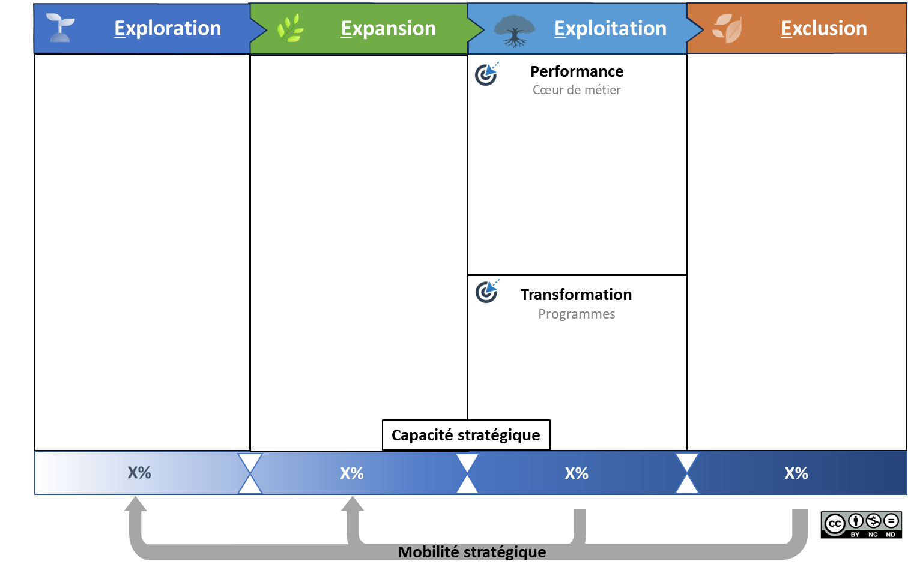
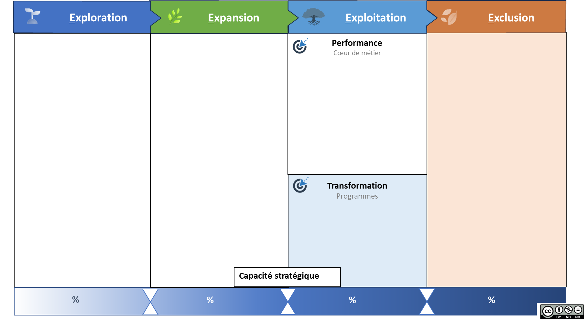

# La mobilité stratégique

Propriétaire: Laurent Morisseau
Étiquettes: Agilité Portfolio, Principes

- Sommaire

✨ **Objectif** Mettre en place une capacité de réallocation rapide des talents et budgets vers les priorités stratégiques — sans attendre le prochain cycle budgétaire. Créer une mobilité alignée sur la valeur, synchronisée à la gouvernance corporate, sans sacrifier la stabilité.

🧑‍🎓 **Ce que vous allez apprendre** - Les 3 grandes questions pour diagnostiquer une **mobilité stratégique déficiente**. - Les **principes clés** d’une mobilité pilotée : impact, cadence, continuité. - Les 4 leviers concrets pour activer la mobilité : cartographie, déclencheurs, modularité, slack. - Comment articuler **mobilité** et **désengagement structuré**.

📚 **Petit lexique** **Micro-upskilling** = Formation ciblée et rapide pour repositionner des collaborateurs vers une nouvelle priorité stratégique.

# Pourquoi la mobilité stratégique ?

> *"La stratégie évolue en continu. Vos ressources aussi ?"*
> 

C’est la capacité à réallouer rapidement les ressources (budgets, talents, compétences) vers les zones stratégiques prioritaires, sans attendre un cycle figé.

C’est un maillon faible entre une ambition affirmée et sa réalisation. Sans elle, les projets prioritaires stagnent, les ressources s’enracinent là où l’enjeu n’est plus, et les opportunités s’évanouissent. Une opportunité ne peut attendre l’exercice budgétaire suivant. Le problème est que la mobilité entre unités stratégiques est encore difficile dans les entreprises.

➿ **TechNova — quand tout change, sauf les ressources** > *"On avait tout aligné, sauf la capacité à réallouer.”* > **2017.** L’entreprise décide de réorienter son portefeuille vers les services domotiques. La stratégie est claire, les unités sont redessinées… mais les ressources, elles, restent bloquées : - Les **budgets** restent assignés à l’activité capteurs, - Les **talents clés** sont enfermés dans des plans RH obsolètes, - Les **mécanismes de mobilité** sont absents. Résultat : - L’unité domotique prend du retard, - L’opportunité de croissance se referme, - L’entreprise perd un an… sans pouvoir bouger. **La leçon ?** Le design seul ne suffit pas. Sans capacité à **reconfigurer les ressources en dynamique**, l’agilité reste théorique.

## **Diagnostic — Vos 3 questions clés**

1. **Alignement Ressources ↔ Stratégie**
    
    Vos ressources (humaines, financières, technologiques) suivent-elles automatiquement vos décisions stratégiques, ou restent-elles bloquées dans l’enveloppe budgétaire annuelle ?
    
2. **Pilotage par événements**
    
    Votre réallocation s’active-t-elle à chaque signal marché (nouveau concurrent, rupture technologique), ou seulement lors des arbitrages budgétaires planifiés ?
    
3. **Agilité des talents**
    
    Au-delà des fiches de poste, disposez-vous d’un dispositif pour reconfigurer rapidement les compétences en fonction des priorités ?
    

> Si vous répondez « non » à deux de ces trois questions : la mobilité est votre point faible systémique.
> 

# Les caractéristiques clés de la mobilité stratégique

💡 Les caractéristiques de la **mobilité stratégique** : - Réallocation rapide en réponse aux zones stratégiques du modèle 4E - Pilotage par l’impact (et non par plan ou priorité RH) - Multi compétences - Synchronisation avec la cadence corporate

## Les 3 principes d’une mobilité stratégique pilotée

Visualisation de la mobilité stratégique dans PACTE

1. **Impact d’abord**
    
    Toute réallocation doit viser un impact mesurable : revenu, time-to-market, marge, alignement stratégique. Typiquement, ce sont des décisions qui doivent contribuer à vos OKR stratégiques.
    
2. **Cadence maîtrisée**
    
    Synchroniser mobilité et gouvernance à travers :
    
    - Revue corporate trimestrielle
    - Flash Review mensuel (revue éclair déclenchée par un écart KPI ou une tension)
    
    💡 Dans PACTE, la capacité de chaque zone (Exploration, Expansion…) guide la mobilité.
    
3. **Continuité protégée**
    
    Ajuster les ressources sans casser la dynamique des activités en cours. Lorsqu’une équipe est dépriorisée ou arrêtée, c’est une décision stratégique assumée, tel qu’un décommissionnement.
    
    Mais déplacer des personnes d'une équipe à l'autre sans alignement global, simplement pour répondre à une urgence locale, revient à déshabiller Jacques pour habiller Paul. Et cela fragilise l’ensemble.
    
    > La mobilité est stratégique si elle augmente la valeur sans fragiliser l'organisation.
    > 

## Les 4 leviers concrets

### 1. **Cartographie dynamique des ressources**

Un référentiel vivant des compétences, capacités et charges, non pas une base RH statique, mais un radar stratégique.

### 2. **Mécanisme d’activation clair**

- Qui peut déclencher une réaffectation ?
- Sur quels critères ?
- Avec quel niveau d’autonomie ?

### 3. **Micro-upskilling et modularité des équipes**

- Former rapidement pour repositionner
- Favoriser des unités avec des compétences hybrides, capables d’évoluer d’une zone stratégique à une autre

### 4. **Slack stratégique intégré**

Sans slack, pas de mobilité. Sans mobilité, pas d’agilité stratégique réelle.

Mettre en place des Slack Review Adhoc pour gérer les opportunités hors cycle.

## Du transfert de compétences à la mobilité stratégique

La gestion des talents évolue :

| Aspect | Entreprise traditionnelle | Entreprise agile |
| --- | --- | --- |
| Gestion des ressources | Transfert de compétence | Réallocations pilotées par l’impact |
| Vitesse d’adaptation | Mois à années | Semaines |
| Vision du talent | Spécialisation progressive | Modularité & hybridation |
| Réponse au changement | Prévisible, lente, faible réactivité face aux disruptions | Itérative, déclenchée par signaux |
| Avantages | Consolidation des expertises, parcours de développement clair | Réactivité maximale, expérimentation rapide |

> La mobilité stratégique ne remplace pas le plan de carrière. Elle ajoute une dynamique d’adaptation continue.
> 

## Tension clé : Stabilité vs Mobilité

- **Stabilité opérationnelle**
    
    Des équipes stables optimisent la performance et réduisent les coûts d’ancrage.
    
- **Mobilité stratégique**
    
    Des réallocations fréquentes assurent la réactivité et la capture d’opportunités.
    

⚠️ Le vrai enjeu ? Trouver une organisation qui stabilise sans rigidifier, et qui bouge sans désarticuler.

# Désengagement : le pendant de la mobilité

> On investit partout. Mais on n’arrête nulle part.
> 

La **mobilité stratégique** inclut non seulement le **redéploiement des ressources**, mais aussi **l’optimisation et le désengagement** des actifs devenus non pertinents. Réallouer, ce n’est pas seulement renforcer. C’est aussi **désengager sans brutalité**.

Deux zones à traiter, deux logiques à activer :

### 1. **Optimisation de l’exploitation (**Zone Exploitation > transformation**)**

Avant de désengager :

- Rendre un actif plus rentable ou transférable
- Excellence opérationnelle, innovation d’efficience

### 2. **Désengagement structuré (Zone d’exclusion)**

- Identifier les actifs à faible valeur future ou zombies (maintien par inertie)
- Planifier : arrêt progressif, revente, transfert

Ce processus peut inclure :

- **Revente ou cession**.
- **Externalisation ou mutualisation**.
- **Arrêt progressif et redirection des ressources vers des initiatives plus stratégiques**.

> Le désengagement est un acte stratégique — pas un abandon par défaut.
> 

📚 En savoir plus sur le désengagement

## 👣 Et concrètement, lundi matin ?

- Cartographiez les 3 unités avec le plus fort décalage impact/ressources
- Proposez une flash review pour une opportunité émergente
- Identifiez 2 compétences à reconfigurer via micro-upskilling
- Évaluez votre slack : avez-vous de quoi bouger vite si besoin ?
- Intégrez la mobilité stratégique dans la prochaine revue corporate. Observez.

---

#