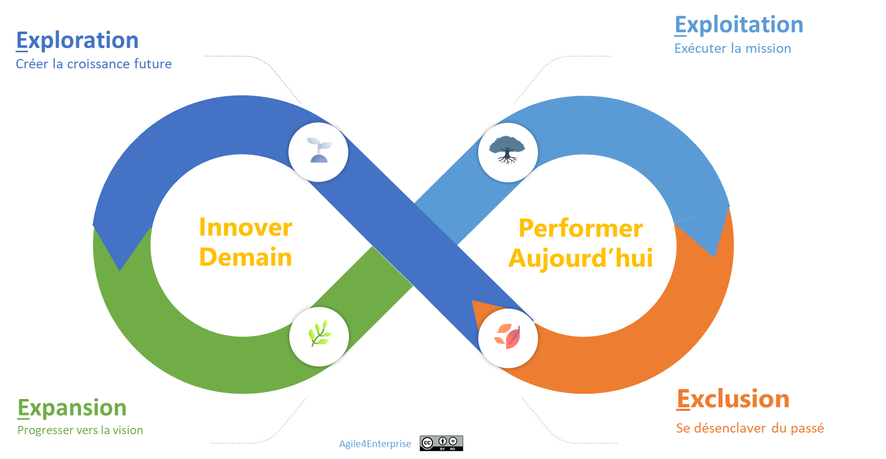
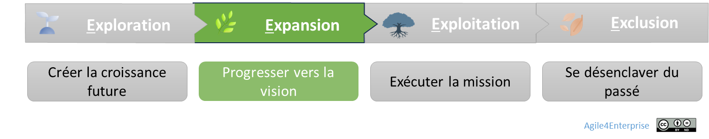
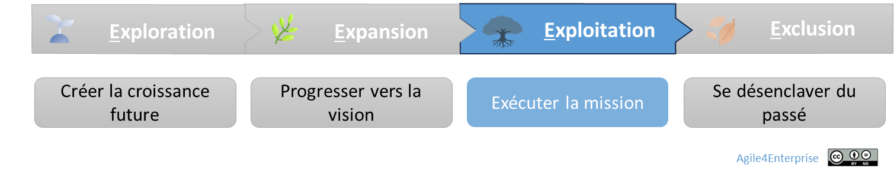
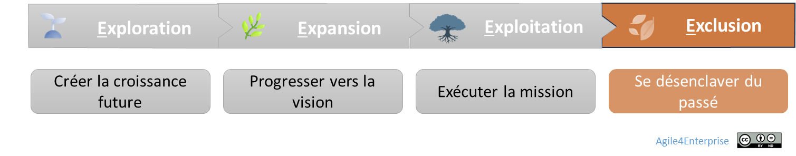

# Agile4E : La cartographie stratégique vivante

✨**Objectif**

Le but de ce chapitre est d’offrir un cadre immédiatement activable pour piloter en continu le portefeuille stratégique à travers quatre zones : **Exploration, Expansion, Exploitation et Exclusion**.

🧑‍🎓**Ce que vous allez apprendre ici**

- Les **4 zones stratégiques** du portefeuille : comment les reconnaître, quelles tensions elles impliquent, et quelles capacités elles sollicitent.
- Comment **éviter les dérives fréquentes** : rester trop longtemps dans une zone, ou enchaîner les initiatives sans réel pilotage.

➿**TechNova**

En 2025, TechNova est à la croisée des chemins. Sa R&D a lancé cinq pistes autour de l’IA, ses produits domotiques trouvent leur marché, ses capteurs industriels tournent à plein rendement, mais son initiative SRE s’essouffle.

Depuis six mois, le conseil de direction hésite. L’entreprise doit-elle abandonner le projet SRE ? Le transformer ? Les arbitrages sont gelés, les budgets figés. L’entreprise active alors le modèle **Agile4E** pour clarifier ses intentions et réallouer ses ressources.

## Le modèle Agile4E en un coup d’œil

### Une lecture saisonnière du portefeuille

Le modèle **Agile4E** ne décrit pas des cases statiques, mais le cycle de vie des initiatives stratégiques. Après la métaphore de la canopée, voici celle des saisons :

- **Exploration** : c’est le **printemps** — on sème, on tente, tout reste fragile.
- **Expansion** : c’est l’**été** — les fruits commencent à mûrir, on entretient, irrigue et développe.
- **Exploitation** : c’est **l’automne** — on savoure la récolte, en évitant l’épuisement.
- **Exclusion** : c’est **l’hiver** — on taille, on laisse reposer et on prépare les ressources pour le cycle suivant.

> Une organisation équilibrée vit toutes les saisons en parallèle, sans chercher à tout faire mûrir en même temps.

### Zone d’exploration, un printemps d’innovation

L’exploration joue un rôle clé pour anticiper les évolutions du marché. C’est une zone VUCA par nature.

**Caractéristiques clés** :

- **Enjeu** : développer de nouveaux modèles d’affaires avant la concurrence.
- **Tensions clés** : tester sans surinvestir et éviter le biais des coûts irrécupérables, ne pas se disperser.
- **Agilité attendue** : MVP rapides, feed-back immédiat, stratégie émergente.
- **Capacités requises** : apprentissage accéléré, acceptation de l’incertitude.
- **Horizon** : 5–10 ans, ROI hypothétique.

C’est l’univers des start-ups.

> *Chaque équipe TechNova fonctionne en sprints courts (2×2 semaines) pour valider ou rejeter un pari business ou technique.*

**Performance** :

On cherche encore la stratégie : l’approche demeure très tactique, souvent opportuniste. Le succès se mesure par l’atteinte des objectifs.

À ce stade, un KPI classique ne fait pas office d’indicateur clé, trop précoce ou instable, mais une **métrique étoile du nord** : une mesure centrale de la valeur délivrée à l’utilisateur, liée à la croissance future.
Elle guide les arbitrages d’itération et alimente les hypothèses de ROI à grande échelle.

*Mesures typiques* : Temps de cycle des d’expérimentations, taux d’apprentissage sur des hypothèses.

### Zone d’expansion, un été de croissance

Une fois le modèle d’affaires validé, le défi consiste à passer à l’échelle du marché tout en conservant la capacité d’adaptation et d’innovation continue. Il s’agit de faire croître l’actif et l’organisation qui le soutient, pour atteindre leur plein potentiel à moyen terme.

**Caractéristiques clés** :

- **Enjeu** : faire évoluer un MVP en produit ou service à l’échelle.
- **Tensions clés** : scalabilité pouvant rigidifier la structure vs agilité.
- **Agilité attendue** : combiner stratégie émergente et délibérée (vision produit claire).
- **Capacités requises** : innovation de continuité, organisation flexible.
- **Horizon** : 2–5 ans, montée en puissance et rentabilité.

C’est l’univers des scale-ups.

**Performance** :

Une fois la stratégie définie, l’entreprise se concentre sur l’atteinte des résultats.
La réussite se mesure par des objectifs stratégiques et tactiques orientés produits.
Plus elle se rapproche de la phase suivante d’exploitation, plus ces objectifs deviennent principalement business.

*Mesures typiques* : Net Promoter Score, taux de conversion, churn, coût d’acquisition.

### Zone d’exploitation, un automne de récolte

Exploiter, c’est maximiser la valeur créée par les investissements déjà réalisés.
Elle vise à prolonger la durée de vie de ses actifs en alliant rentabilité immédiate et viabilité à long terme. Cela est possible grâce à des programmes de transformation (migration technique, refonte de l’expérience utilisateur…) et à l’innovation d’efficience (excellence opérationnelle…).

**Caractéristiques clés** :

- **Enjeu** : tirer pleinement parti des actifs existants.
- **Tensions clés** : sécuriser les positions acquises sans se rigidifier.
- **Agilité attendue** : maintenir l’agilité à grande échelle tout en recherchant la stabilité.
- **Capacités requises** : ajustements réguliers.
- **Horizon** : ROI immédiat sur 12 mois.

C’est l’univers des entreprises établies.

**Performance** :

Dans cette zone, on est orienté vers l’efficience. Les KPI constituent l’indicateur principal du succès. Les OKR servent à apprécier la performance de la transformation pour rester viable.

*Mesures typiques* : marge opérationnelle, satisfaction client, coûts de maintenance.

### Zone d’exclusion, un hiver de préparation

Lorsqu’un produit ou service devient non rentable, voire obsolète, un **désinvestissement stratégique** permet de libérer des ressources.
En agilité, il intervient plus tôt, dès que le potentiel diminue, renforçant ainsi la **mobilité stratégique**.

**Caractéristiques clés** :

- **Enjeu** : alléger le présent, réinvestir sur le futur.
- **Tensions clés** : désengagement et résistances internes.
- **Agilité attendue** : processus fluide.
- **Capacités requises** : mobilité stratégique.
- **Horizon** : décisions et réallocations rapides.

🔥

C’est une capacité clé de l’entreprise à développer pour l’agilité stratégique.

**Performance** :

Dans cette zone, on bascule à nouveau sur une performance basée sur l’efficacité.

*Mesures typiques* : budget redéployé, délai de réaffectation.

➿**TechNova**

**Modèle Agile4E de TechNova** :

| Zones | Exploration | Expansion | Exploitation | Exclusion |
| --- | --- | --- | --- | --- |
| **Intention** | Tester 5 prototypes IA | Piloter la domotique (10 bâtiments) | Optimiser les capteurs industriels | Se retirer de la solution SRE |
| **Cadence** | Itérations toutes les 2 semaines | Montée en charge en 3–6 mois | Ajustements trimestriels | Processus continu de retrait |
| **Défi/tension** | Incertitude ↔ Priorisation | Standardisation ↔ Flexibilité | Optimisation ↔ Stagnation | Désengagement ↔ Résistance |

La bascule vient lorsque le seuil d’adoption de la solution SRE passe sous les 20 %. TechNova décide dès lors de céder cette activité à un partenaire, et redéploie 15 % du budget annuel vers le développement domotique. La mobilité stratégique devient tangible.

## Une approche dynamique

Ce modèle permet d’arbitrer, d’investir ou de se désengager. Chaque zone requiert un modèle opératoire spécifique. Ils seront détaillés dans la section sur les **archétypes**.

Les signaux qui révèlent un mauvais positionnement :

- **Exploration** : vous souhaitez des garanties là où vous devriez apprendre.
- **Expansion** : vous cherchez à accélérer sans preuve du marché.
- **Exploitation** : vous optimisez un actif dont la demande diminue.
- **Exclusion** : vous évitez de fermer un projet par inertie politique.

⚠️

**Agile4E** ne fonctionne pas comme un séquenceur automatique : il sert de guide décisionnel. Il invite à ajuster votre posture à la maturité réelle de l’initiative.

## 👣 Et concrètement, lundi matin ?

Commencez par cartographier vos activités stratégiques dans les 4 zones et visualisez le déséquilibre entre chaque. Est-ce que les choix de positionnement déclenchent des discussions dans le COMEX ? Si l’intention ne correspond pas aux pratiques, vous risquez d’être dans la mauvaise zone.

## 🔑 Points clés à retenir

- **Processus vivant :** Agile4E fonctionne comme un cycle continu.
- **Agilités différenciées** : chaque zone a son propre modèle opératoire.
- **Gestion des tensions :** apprenez à arbitrer en permanence.

