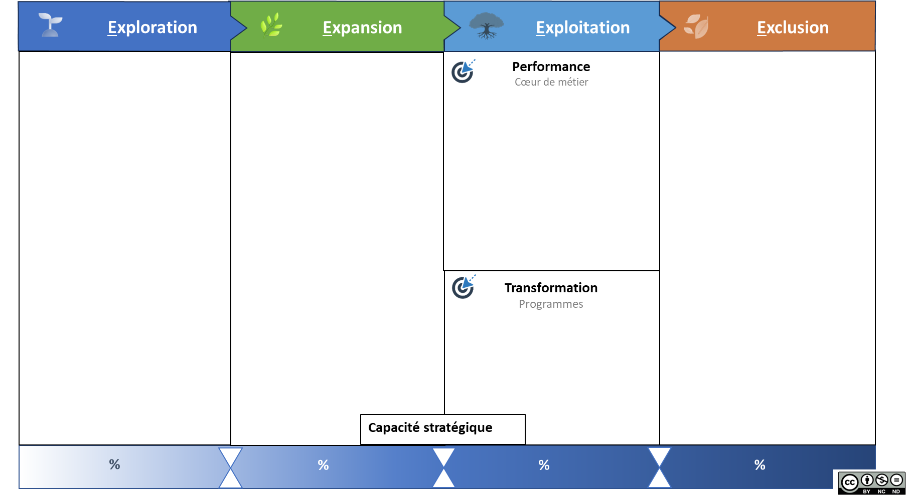
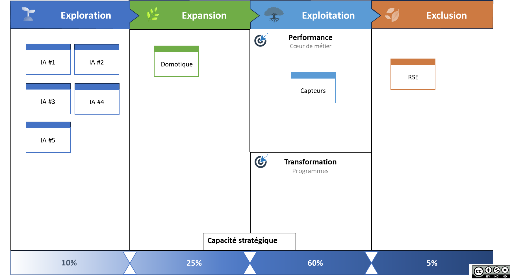

# Guide de l’outil PACTE

Propriétaire: Laurent Morisseau

📌 **Objectif : Donner une trajectoire claire aux investissements et transformations** - Modèle basé sur les Agile4E : **Exploration, Expansion, Exploitation, Exclusion**. - Permet d’équilibrer **innovation, croissance et performance**. - Aide à structurer **les arbitrages et décisions stratégiques**. *PACTE devient ainsi le **tableau de bord vivant** de votre portefeuille.*

🧑‍🎓 **Ce que vous allez apprendre** - Comment structurer vos décisions selon les **zones 4E** (Exploration, Expansion, Exploitation, Exclusion). - Pourquoi chaque changement de zone est un **acte stratégique**, qui engage budget, équipes et priorités. - Comment éviter les dérives fréquentes (tableaux inertes, surcharge en exploration, manque de désengagement). - Comment **connecter stratégie et exécution** grâce au lien entre PACTE et ACTE.

📚 **Petit lexique** **Kanban stratégique** (ou Kanban Portfolio) : Outil visuel de gestion du flux d’initiatives dans un portefeuille d’activités stratégiques. **Allocation capacitaire** : Répartition explicite des ressources par zone (budget, équipes, priorités).

Outil **PACTE** (Portfolio Agile Canevas pour la Trajectoire d’Entreprise)

## **PACTE : un tableau de bord stratégique en mouvement**

> **P**ortfolio **A**gile **C**anevas pour la **T**rajectoire d’**E**ntreprise : un outil visuel pour décider et piloter.
> 

PACTE permet de visualiser et gérer en continu vos actifs stratégiques en les positionnant dans l’une des quatre zones du modèle 4E. Chaque mouvement entre zones traduit une décision stratégique : investir, désinvestir, croître ou clôturer. Chaque zone appelle un modèle opératoire adapté.

PACTE est un **Kanban stratégique pour visualiser vos décisions,** structuré selon le modèle Agile4E :

- **Exploration** : détecter et tester des opportunités.
- **Expansion** : passer à l’échelle un modèle validé.
- **Exploitation** : intégrer au cœur de métier.
- **Exclusion** : retirer ou réallouer des ressources.

Chaque actif stratégique (produit, service, projet, capacité) est représenté par une carte dans le tableau.

### Votre portefeuille est plein… mais vos décisions stagnent ?

Le principe d’un Kanban : visualiser le flux et se concentrer sur l’essentiel. Or une entreprise déborde d’idées et de projets. Le problème n’est pas de créer, mais d’arbitrer et prioriser, car les ressources sont limitées. La logique de flux incite à limiter le nombre d’éléments en exploration et expansion pour éviter la dispersion et favoriser les investissements à fort impact.

> 💡 **Conseil** : se concentrer sur une seule expansion majeure à la fois. C’est la zone la plus exigeante en ressources et en accompagnement.
> 

## Allouer avec intention

Chaque zone peut être associée à une **capacité stratégique définie** : budget cible, pourcentage d’investissement, ressources allouées. Cette allocation permet d’aligner ambitions et réalités opérationnelles.

Chaque mouvement entre zones (explorer ➝ étendre ➝ exploiter ➝ exclure) est une décision stratégique qui déclenche :

- Des arbitrages budgétaires,
- Des reconfigurations d’équipes ou de moyens,
- Des validations ou révisions d’OKR.

❓ **Posez vous cette question** Le changement de zone a-t-il entraîné une modification d’au moins un des trois éléments précédents ? **Si ce n’est pas le cas, c’est que votre portefeuille n’est pas réellement piloté.** Un outil comme **PACTE** permet justement de **connecter l’intention stratégique aux transformations concrètes** sur le terrain.

➿ **Cas TechNova – PACTE comme boussole dynamique** Le COMEX de TechNova a longtemps piloté ses activités en silos. Chaque business unit présentait ses priorités… sans lien avec les autres. Avec la montée en puissance de l’IA, le déploiement domotique et l’essoufflement d’un programme RSE, la direction réalise qu’il ne suffit plus de suivre les projets : il faut arbitrer leur place dans la trajectoire globale. Elle adopte PACTE comme outil de pilotage visuel. Chaque actif stratégique – IA, capteurs, domotique, RSE – devient une carte positionnée dans l’une des quatre zones du modèle Agile4E. À chaque revue mensuelle : révision des priorités, réallocation des ressources, décisions concrètes.  > Le PACTE TechNova et sa répartition capacitaire : 60 % en exploitation, 25 % en expansion, 10 % en exploration, 5 % en exclusion. À adapter selon votre contexte. > *A chaque **revue mensuelle**, la direction répond à ces questions clés:* - *Quelles cartes stagnent dans une zone ?* - *Où injecter des ressources ou freiner ?* - *Quel indicateur clé (KPI/OKR) suit le progrès ?* - *Quel frein organisationnel lever en priorité ?*

## **Un modèle déclinable à tous les niveaux de décisions stratégiques**

Au départ conçu pour le niveau entreprise, ce modèle peut être décliné à tous les niveaux de l’entreprise :

- **PACTE corporate** ⇒ portefeuille d'activités stratégiques (agilité corporate, ambidextrie structurelle)
- **PACTE stratégique** ⇒  portefeuille d'initiatives des unités stratégiques, pour l’agilité stratégique
    
    Les éléments représentés sont des initiatives stratégiques de l’unité. Ce sont des initiatives nécessaires pour le succès des OKR stratégiques et l’atteinte des KPI.
    
    🧰 C’est le principe du **Lean Portfolio Management** de Safe.
    
    *Par exemple, une ESN cartographie son catalogue de formations — certaines en exploitation, d'autres en exploration ou en retrait.*
    

## Connecter stratégie et exécution avec PACTE & ACTE

Les actifs figurant dans ce tableau sont portés par les unités et modélisés dans l'outil ACTE. L’ensemble des ACTEs constitue un portefeuille visible, connecté, et gouvernable à tous les niveaux.

Le changement d’une colonne dans PACTE déclenche une revue du ACTE de l’activité correspondante.

## Prévenir les dérives, renforcer les usages

Les erreurs fréquentes à éviter :

- Ne pas piloter ce Kanban régulièrement.
- Déplacer les cartes sans ajuster les ressources, équipes, ou design organisationnel.
- Multiplier les initiatives sans capacité réelle.

> ⚠️ Le modèle est vivant. Ce n’est pas la complétude du tableau qui compte, mais sa capacité à déclencher des décisions concrètes.
> 

---

## Fiche outil : PACTE en pratique

> **Format** : tableau visuel, chaque colonne représente une zone stratégique, chaque carte représente un actif.
> 
> 
> **Pour chaque carte** : unité porteuse, statut, KPI/OKR, budget, responsable, échéance.
> 
> PACTE s’intègre dans les **boucles adaptatives** du Framework Agile4Enterprise :
> 
> - **Cadence Portfolio** (annuelle) : équilibre global et redirection stratégique.
> - **Cadence Stratégique** (trimestrielle) : ajustement des grandes priorités.

**Participants** : CODIR, managers stratégiques, responsables produit, PMO. Les coachs d’organisation et coachs d’entreprise jouent le rôle de facilitateur le temps de l’adoption de cet outil.

---

#