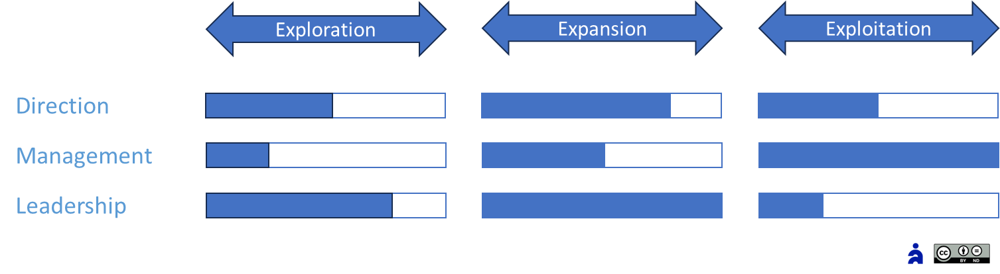

# L’agilité managériale

Propriétaire: Laurent Morisseau

- Sommaire

<aside>
✨

**Objectif**
Dans un monde volatile, le **manager agile** n’est plus simplement un pilote : il est l’architecte et le catalyseur d’équipes autonomes et responsabilisées. Il alterne en continu entre trois casquettes — **Direction**, **Leadership** et **Management** — pour faire vivre la stratégie en action.

</aside>

<aside>
🧑‍🎓

## Lexique rapide

- **Zone 4E** : Exploration / Expansion / Exploitation / Exclusion – quatre contextes stratégiques, quatre postures.
- **Triptyque managérial** : Direction, Leadership, Management – vos trois casquettes à porter en fonction du contexte.
- **OKR** : Objectifs & Résultats Clés – le carburant de l’alignement et du pilotage par l’impact.
</aside>

<aside>
🧑‍🎓

Quand TechNova est passée de l’exploration d’un nouveau service IA à son expansion, son directeur R&D a maintenu la même posture : innovation ouverte, approche tactique et opportuniste. Résultat : 6 mois de retard, équipes épuisées, et un objectif commercial en berne.

</aside>

# Pourquoi repenser le management ?

Dans un monde instable, la même posture étouffe l’innovation ou désorganise la performance. Le manager agile :

- **Adapte sa casquette** au degré d’incertitude et de complexité.
- **Bascule** l’équipe de « suivi du plan » vers « apprentissage continu ».
- **Installe** **un climat de confiance**, de feedback et d’expérimentation permanente.

<aside>
💡

**Manager agile**

Il aide les équipes à réagir face aux imprévus tout en préservant leur capacité à agir de manière autonome, et en sachant reconnaître le moment et les circonstances où une nouvelle décision est nécessaire de sa part.

</aside>

# Les 3 casquettes du manager agile

Les 3 rôles d’encadrement

Le manager agile se positionne selon trois rôles clés, adaptés à la nature des enjeux et des zones :

| Rôle | Finalité | Geste clé |
| --- | --- | --- |
| **Direction** | Fixer le cap, arbitrer | Communiquer l’intention (+ « pourquoi »). |
| **Leadership** | Mobiliser, incarner, fédérer | Poser la vision en story-telling. |
| **Management** | Organiser, gérer | Poser les obstacles, pas les solutions. |

> Un manager agile bascule en continu entre ces trois casquettes. selon le contexte.
> 

# Pratique zones 4E : fiches express

Chaque **zone stratégique** réclame une posture dominante :

- Tester rapidement des hypothèses en **zone d’Eploration**, avec un leadership entrepreneurial.
- Passer à l’échelle du marché en **zone d’Expansion**, avec un servant leadership.
- Optimiser l’efficience opérationnelle en **zone d’exploitation**, avec un management participatif et délégatif.
- Désengager les initiatives non porteuses en zone d’exclusion, avec un direction claire.

Concrètement, les priorités du management vont être de :

| Zone | Geste #1 | Geste #2 |
| --- | --- | --- |
| **Exploration** | **Challenger** : poser la bonne hypothèse et l’échec rapide | **Mentorer** : questionner (« Qu’avons-nous appris ?») |
| **Expansion** | **Sponsoriser** : débloquer les ressources en continu | **Servir** : coordonner inter-équipes sans micro-manager |
| **Exploitation** | **Protéger** : éliminer les interruptions et les priorités parasites | **Optimiser** : piloter par les KPI et OKR de performance |
| **Exclusion** | **Décider** : trancher vite sur le désengagement | **Redistribuer** : réallouer le slack aux initiatives à fort impact |

<aside>
➿

Claire vient d’être promue à la tête de la nouvelle ligne IA de TechNova, pour relancer l’activité. Elle décide d’ajuster **son rôle** et **ses gestes** à chaque situation.

- Avec sa casquette de direction, elle challenge chaque prototype IA : « Qu’avons-nous appris ? » et pivote si besoin.
    
    **Son KPI phare d’exploration** : Taux de validation d’hypothèses (MVP/test passés) : ≥ 50 %
    
- **E**lle accompagne la mise à l’échelle commerciale des nouveaux services en tant que leader ;
    
    **Son KPI phare d’expansion** : Time-to-Market des nouvelles fonctionnalités ≤ 4 semaines
    
- **E**n bon manager, elle optimise les process en flux tiré des services existants ;
    
    **Son KPI phare d’exploitation** : Taux de respect des SLA : ≥ 99 % et satisfaction utilisateur > 85%
    
- **E**n tant que gestionnaire, elle décide de l’arrêt de 2 gammes obsolètes.
    
    **Son KPI phare d’exclusion** : Nombre de services arrêtés / trimestre : ≥ 2
    
</aside>

---

## Leviers managériaux

- **Management situationnel** : changez de posture en fonction de la zone 4E.
- **Gestes concrets** : challenger, sponsoriser, protéger, décider.
- **Rituels courts et focus OKR** : cycles 4E, feedback hebdo, war room trimestrielle.
- **Mesure et apprentissage** : choisissez un KPI, suivez-le, ajustez-vous.

## Rituels opérationnels

1. **Revue 4E mensuelle (30 min)**
    - Cartographiez vos initiatives sur un Kanban PACTE.
    - Identifiez la zone où vous passez 70 % du temps.
2. **Flash feedback hebdo (15 min)**
    - Tour de table : « Quel apprentissage ? Quel obstacle ? »
    - Ajustez votre casquette (Direction / Leadership / Management).
3. **War Room trimestrielle (2 h)**
    - Pour chaque zone sur-représentée, choisissez votre rôle à venir.
    - Définissez 1 OKR managérial (ex. « Déléguer 3 décisions d’équipe »).
    - Intégrez-le à vos points hebdo.

Le calendrier de Claire pour installer cette dynamique avec succès

| Phase | Période | Objectif |
| --- | --- | --- |
| **1. Diagnostic & cadrage** | Jours 1–14 | Comprendre les freins et poser le cadre |
| **2. Design & rituels** | Jours 15–30 | Mettre en place les outils de pilotage |
| **3. Itération & apprentissage** | Jours 31–60 | Exécuter et valider les hypothèses |
| **4. Montée en échelle & optimisation** | Jours 61–90 | Industrialiser et fiabiliser le service |

Résultats :

- **MVP IA** validé, déployé chez 3 clients pilotes
- **Time-to-Market** de 35 jours pour les nouveaux prototypes
- **Satisfaction clients** : +10%

## Ce que produit un management figé

- **Potentiel bridé** : l’innovation s’étouffe sous contrôle excessif.
- **Démotivation** : équipes frustrées, turnover en hausse.
- **Décalage stratégique** : perte de sens et désalignement.
- **Inefficience** : processus figés, coûts et délais dérapent.

---

## Mais aussi, ce que cette approche ne voit pas toujours

- **Effet tunnel sur la culture** : on change la posture mais pas les habitudes informelles. Les rituels sont importants
- **Résistances cachées** : certaines équipes exigent plus de stabilité que d’autres, il faut l’accepter.
- **Biais quantitatif** : obsession des KPIs au détriment de la qualité humaine.
- **Charges cognitives** : multiplications des rituels sans simplification affaiblit l’agilité.

### Impact si mal fait

Un déploiement incomplet ou mal calibré conduit à une surcouche bureaucratique, des pratiques agiles de façade (« Fake Agile »), et in fine à une défiance générale vis-à-vis du « management agile ».

## Et concrètement, lundi matin ?

Démarrage en 3 étapes

1. **Préparez**
    - Choisissez 1 zone à prioriser et ses gestes clés.
    - Sélectionnez un KPI phare.
2. **Lancez**
    - Organisez votre première Revue 4E et Flash feedback.
    - Désignez un “intégrateur” (coach ou pair) pour avoir un effet miroir.
3. **Pilotez**
    - Suivez votre KPI et vos OKR managériaux.
    - Ajustez vos rituels et votre posture chaque mois.

---

# 🔑 Points clés à retenir

- **Management situationnel** : changez de casquette au fil des zones et de la maturité.
- **Gestes concrets** : challenger, sponsoriser, protéger, décider – pas de posture vague.
- **Autonomie vs alignement** : un cadre OKR/rituels sans micro-gestion.
- **Pilotage par l’impact** : évaluez les résultats réels, pas la conformité au plan.
- **Apprentissage continu** : feedback et expérimentation intégrés au quotidien.

> Le manager agile n’impose pas la direction ; il façonne le chemin.
> 

### 👉 Et maintenant ? Passons à l’[opérationnel](https://www.notion.so/L-agilit-op-rationnelle-13490eaf28ff80e5b767fd273784c80b?pvs=21) !

---

# Annexe

## Zone d’exploration : La voie de l’entrepreneuriat et du mentoring

*Les trois rôles d’encadrement dans la zone d’exploration*

La **zone d’exploration** est le terrain du prototypage et de l’innovation de rupture, où l’organisation teste de nouvelles hypothèses à petite échelle avant de les étendre.

- **Triptyque managérial adapté**
    - **Direction** : adopter une posture de  leadership stratégique pour sponsoriser les initiatives et défendre la vision,
    - **Leadership** : adopter une posture entrepreneuriale, adaptative et participative,
    - **Management** : distribuer la gouvernance dans les équipes, pour fluidifier les décisions.
- **Performance centrée sur l’apprentissage**
    - L’enjeu n’est pas la rentabilité immédiate, mais de démontrer la viabilité du modèle d'affaires à petite échelle. Pour cela, la **vitesse d’expérimentation** est clé : mesurer l’impact des MVP et itérer en continu.
    - Les **OKR tactiques** sont calibrés pour favoriser ce cycle rapide « Tester → Apprendre → Ajuster ».
    - L’amélioration continue vise l’[innovation de rupture](https://www.notion.so/Les-capacit-s-de-l-entreprise-agile-13690eaf28ff8182abccc48ebecb3bf6?pvs=21).
- **Financement progressif**
    - Inspiration capital-risque : allouer les moyens par étapes (séries A, B…), en fonction des premiers retours, et non sur la base d’un budget annuel figé.
    - Pas de feuille de route immuable : on pivote dès que les hypothèses ne tiennent pas.
- **Culture du risque et de l’échec**
    - L’échec est valorisé comme moteur d’apprentissage.
    - L’environnement est conçu pour encourager la prise d’initiative et absorber les impacts négatifs sans bloquer l’organisation.

> En bref : explorer, c’est courir de petites expériences à grand impact, avec un pilotage souple, un financement itératif et une tolérance élevée à l’échec.
> 

<aside>
📚

Zoom sur la [zone d’exploration](https://www.notion.so/Management-de-la-zone-d-exploration-H3-14990eaf28ff80b3a29bfef6dd166131?pvs=21)

</aside>

## Zone d’expansion : La voie du leadership

*Les trois rôles d’encadrement dans la zone d’expansion*

La **zone d’expansion** correspond à la montée en puissance d’un nouveau produit ou service sur un marché en croissance, où l’enjeu est de passer à l’échelle sans perdre en agilité.

- **Triptyque managérial ajusté**
    - **Direction** : leadership stratégique affirmé pour définir l’ambition de croissance et arbitrer les priorités. **Implication du CEO** : passage à l’échelle = projet d’entreprise, nécessitant son arbitrage et son soutien visible.
    - **Management** : subsidiarité—déléguer l’exécution tout en garantissant l’alignement global.
    - **Leadership** : servant et « host » leadership, facilitant la collaboration interfonctionnelle. Guider sans prescrire, faciliter la co-création entre métiers.
- **Performance mesurée par le Time to Market**
    - L’aptitude à livrer rapidement de nouvelles fonctionnalités est le principal indicateur,
    - Les **OKR stratégiques et tactiques produit** sont calibrés pour accompagner cette accélération. Ils fédèrent les énergies, fixent le cap de l’expansion et évitent la dispersion des efforts.
    - L’amélioration continue vise plus spécifiquement l[’innovation de continuité](https://www.notion.so/Les-capacit-s-de-l-entreprise-agile-13690eaf28ff8182abccc48ebecb3bf6?pvs=21).
- **Transformation organisationnelle**
    
    L’expansion engage non seulement le produit, mais fait évoluer la structure et la stratégie de l’ensemble de l’entreprise.
    
- **Changement proactif** de la zone d’expansion à la zone d’exploitation
    
    On pilote la croissance rapide tout en intégrant progressivement le modèle dans l’existant. Il faut  accompagner cette montée en charge pour prévenir la résistance et maintenir la continuité opérationnelle.
    

> En résumé : l’expansion exige un management plus structuré que l’exploration, mais suffisamment flexible pour conserver l’agilité, avec un sponsor stratégique, un leadership fort et des processus de délégation clairs.
> 

<aside>
📚

Zoom sur les [zones d’expansion](https://www.notion.so/Management-de-la-zone-d-expansion-H2-14990eaf28ff80a590a0e2c4e47738bd?pvs=21)

</aside>

## Zone d’exploitation : La voie managériale

*Les trois rôles d’encadrement dans la zone d’exploitation*

La **zone d’exploitation** vise l’excellence opérationnelle du cœur de métier. L’enjeu est de maintenir et optimiser la performance tout en soutenant la capacité d’innovation d’efficience.

- **Triptyque managérial adapté**
    - **Direction** : gestionnaire, encadre la performance,
    - **Management** : participatif ou délégatif, gère le système. Il passe d’un contrôle de la performance à un mode protection des équipes pour atteindre cette performance.
    - **Leadership** : Facilitateur, guide les équipes entre un contrôle des indicateurs et une autonomie pour stimuler la performance.
- **Performance orientée KPI**
    - Focus sur l’**efficience** : productivité, qualité, coûts, délais,
    - Les OKR stratégiques par ligne de business et les OKR tactiques au niveau des équipes dans la zone de performance.
    - Les OKR de transformation dans la zone de productivité, qui servent à piloter le changement.
    - Agilité au service de l’[innovation d’efficience](https://www.notion.so/Les-capacit-s-de-l-entreprise-agile-13690eaf28ff8182abccc48ebecb3bf6?pvs=21) : méthodes agiles pour fluidifier le delivery.
- **Points clés**
    1. **Excellence opérationnelle** : processus solides, standards élevés, culture d’optimisation permanente.
    2. **Structure claire et souple** : hiérarchie définie mais capacité à ajuster rapidement les modalités de travail.
    3. **Pilotage data-driven** : KPI comme boussole, complétés par des OKR pour aligner résultats et objectifs stratégiques.
    4. **Coordination interzones** : préparer la transition des initiatives issues de l’expansion pour une intégration fluide dans l’exploitation.

> En résumé : en exploitation, l’agilité se mesure à la capacité à faire tourner le « run » de façon optimale tout en instillant un flux permanent d’innovations d’efficience.
> 

<aside>
📚

Zoom sur la [zone d’exploitation](https://www.notion.so/Management-de-la-zone-d-exploitation-H1-14990eaf28ff8093bd6cf7238629e7c9?pvs=21)

</aside>

## Zone d’exclusion :  Le désengagement stratégique

<aside>
💡

**Le désengagement est une capacité clé de l’entreprise à développer pour** maintenir une agilité stratégique durable.

</aside>

<aside>
📚

Zoom sur la [zone d’exclusion](https://www.notion.so/Management-de-la-zone-d-exclusion-H0-18c90eaf28ff8045b5d9f57ff55814ca?pvs=21)

</aside>