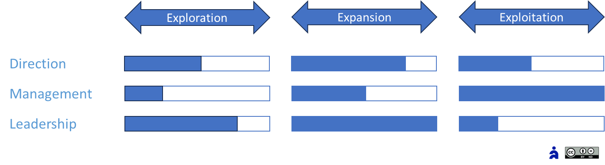

# L’agilité managériale

✨**Objectif**

Le manager agile n’est plus simplement un pilote : il alterne en continu entre trois casquettes — **Direction**, **Leadership** et **Management** — pour faire vivre la stratégie, avec des postures différentes selon la zone stratégique.

🧑‍🎓**Ce que vous allez apprendre ici**

- Pourquoi le management agile ne se limite-t-il pas à déléguer ou coacher ?
- Comment alterner entre **direction, leadership et management** pour activer le bon levier au bon moment ?
- Comment piloter votre propre évolution managériale avec des **OKR de transformation** ciblés ?

## Pourquoi repenser le management ?

🧑‍🎓

**Manager agile** :

Il aide les équipes à réagir face aux imprévus tout en préservant leur capacité à agir de manière autonome. Il sait reconnaître le moment et les circonstances qui exigent une décision de sa part.

Dans un contexte instable, appliquer une posture unique à des situations variées réduit l’innovation et affaiblit la performance. C’est pourquoi le manager agile :

- Adapte sa casquette au degré d’incertitude et de complexité,
- Bascule l’équipe de « suivi du plan » vers « apprentissage continu »,
- Installe un climat de confiance, de feed-back et d’expérimentation permanente.

## Les 3 casquettes du manager agile

Le manager agile se présente selon trois rôles clés d’encadrement :

| Rôle | Finalité | Geste clé |
| --- | --- | --- |
| **Direction** | Donner le cap, fixer le cadre et arbitrer | Communiquer l’intention et le pourquoi |
| **Leadership** | Mobiliser, incarner et fédérer | Porter la vision|
| **Management** | Organiser et gérer | Lever les obstacles, sans poser les solutions |

## Postures par zone Agile4E

Chaque **zone stratégique** réclame une posture dominante :

- **Zone d’exploration**
  - **Direction** : posture de leadership stratégique pour sponsoriser les initiatives et défendre la vision
  - **Leadership** : entrepreneuriale et participative
  - **Management** : distribuer la gouvernance dans les équipes, pour fluidifier les décisions.
- **Zone d’expansion**
  - **Direction** : posture de leadership stratégique pour définir l’ambition de croissance
  - **Management** : subsidiarité — déléguer l’exécution tout en garantissant l’alignement global
  - **Leadership** : servant et « host » leadership. Guider sans prescrire, faciliter la cocréation.
- **Zone d’exploitation**
  - **Direction** : gestionnaire, encadre la performance
  - **Management** : participatif ou délégatif, il régit le système, passant d’un contrôle des résultats à un mode protection des équipes pour les atteindre
  - **Leadership** : facilitateur entre contrôle des indicateurs et autonomie pour stimuler la performance.
- **Zone d’exclusion**
  - **Direction** : gestionnaire, le désengagement relève d’un choix stratégique
  - **Management** : présent s’il y a lieu de passer à l’échelle pour piloter un programme lourd
  - **Leadership** : donner du sens à un investissement pour faire moins, engager les équipes, convaincre les utilisateurs et les clients.

Un manager agile bascule en continu entre ces trois casquettes, selon la situation. Concrètement, les priorités consistent à :

| Zone | Priorité #1 | Priorité #2 |
| --- | --- | --- |
| **Exploration** | **Challenger** : poser la bonne hypothèse et l’expérimentation rapide | **Mentorer** : questionner « Qu’avons-nous appris ? » |
| **Expansion** | **Sponsoriser** : débloquer les ressources en continu | **Servir** : coordonner les équipes sans micromanager |
| **Exploitation** | **Protéger** : éliminer les interruptions et les priorités parasites | **Optimiser** : piloter par les KPI et OKR de performance |
| **Exclusion** | **Décider** : trancher vite sur le désengagement | **Redistribuer** : réallouer le Slack aux initiatives à fort impact |

➿**TechNova**

**Quand le management devient situationnel** :

> *« On avait appris à cadencer, à s’organiser… mais pas encore à changer de posture. » — responsable Capteurs*

Après six mois de progrès visibles (réduction du Time-To-Market, reconfiguration d’équipes), le département Capteurs atteint un nouveau plateau : la structure est prête, mais les blocages demeurent.

**Symptômes** :

- Un Product Owner refuse de stopper une initiative pourtant sans impact.
- Malgré un cadre OKR explicite, un manager valide encore chaque arbitrage.
- Une équipe continue à expérimenter… au lieu de délivrer.

**Le déclencheur** :

Les responsables Capteurs intègrent dans leurs rituels une **revue Agile4E**. Cela permet à chacun de :

- Identifier la zone dominante de ses équipes.
- Ajuster sa posture en conséquence.
- Choisir une action prioritaire par cycle (ex. : challenger, servir, convaincre).

**Ce que ça produit** :

- 3 pivots décisionnels majeurs en un mois — sans escalade hiérarchique.
- Des managers plus disponibles, moins dans l’opérationnel.
- Un sentiment d’alignement renforcé : « Le manager change avec nous, pas contre nous. »

### Ce que cette approche ne voit pas toujours

- **Effet tunnel sur la culture** : on change la posture, mais pas les habitudes informelles. Les rituels comptent.
- **Besoin de stabilité** : certaines équipes exigent plus de repères que d’autres. Le temps de la transformation conditionne la réussite.
- **Biais quantitatif** : obsession des indicateurs au détriment de l’humain.
- **Charges cognitives** : multiplication des cérémonies sans simplification.

Un déploiement incomplet ou mal calibré conduit à une surcouche bureaucratique, des pratiques agiles de façade, et à la fin à une défiance générale vis-à-vis du management.

## 👣 Et concrètement, lundi matin ?

Démarrez en 3 étapes :

1. **Préparez** : choisissez une zone à prioriser et ses gestes clés.
2. **Lancez** : organisez votre première revue **Agile4E**.
3. **Pilotez** : ajustez vos rituels et votre posture chaque mois.

## 🔑 Points clés à retenir

- **Management situationnel** : changer de casquette au fil des zones Agile4E,
- **Apprentissage continu** : feed-back et expérimentation intégrés au quotidien.

> Le manager agile n’impose pas la direction ; il façonne le chemin.

