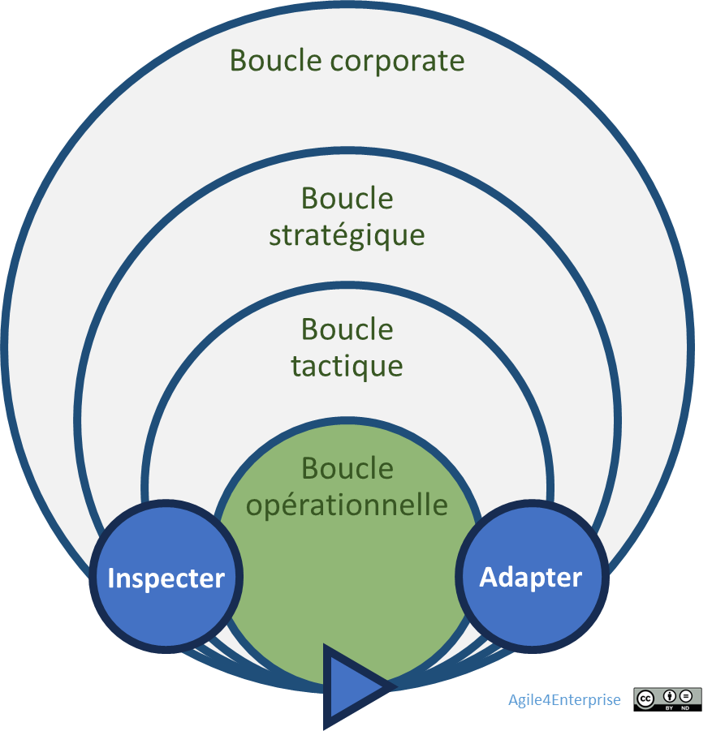

# L’agilité opérationnelle

Propriétaire: Laurent Morisseau

- Sommaire

<aside>
✨

**Objectif**

L’**agilité opérationnelle** vise à assurer une exécution efficace et adaptative au sein des équipes, en garantissant la mise en œuvre rapide des décisions stratégiques et tactiques, ainsi que leurs ajustements en continu. Elle fluidifie le travail des équipes à travers des **méthodes agiles adaptées au contexte** et s’inscrit dans un système de gouvernance dynamique centré sur l’impact.

</aside>

# L’Agilité Opérationnelle:  L’exécution au quotidien

L’agilité opérationnelle représente **le dernier maillon de la chaîne de l’agilité d’entreprise**. Elle concerne les **équipes opérationnelles** ainsi que les **managers de proximité**, en charge d’exécuter la stratégie et la tactique définies en amont — autrement dit, **l'articulation du “quoi” et du “comment”**. Et de leurs fournir des feedbacks pour permettre des ajustements.

Contrairement à la stratégie (qui trace la direction) et à la tactique (qui coordonne les initiatives), l’opérationnel se focalise sur **l’exécution concrète des actions**. Il s’agit ici de naviguer dans un **modèle hybride** mêlant tâches routinières et décisions locales, s'appuyant sur la **capacité d'apprentissage et de réorganisation permanente** des équipes.

La place de l’agilité Opérationnelle dans les niveaux de décisions

L’agilité opérationnelle repose sur :

- Une **autonomie opérationnelle des équipes**, ancrée dans une logique de responsabilité collective et de prise de décision collégiale, sans pour autant se couper de la stratégie globale,
- Une **cohérence verticale entre les niveaux stratégiques, tactiques et opérationnels**, chacun disposant de ses propres cadences et de mécanismes d’alignement,
- La **mise en place de boucles de feedback courtes et intégrées**, qui renforcent les capacités d’ajustement de l’organisation,
- Une **adaptabilité permanente** aux attentes des utilisateurs, aux opportunités émergentes, mais aussi aux arbitrages issus du pilotage stratégique et du portefeuille.

# Principes de l’agilité opérationnelle

Dans une entreprise agile, l’exécution ne peut être un simple déploiement : elle est **un processus d’apprentissage permanent**, où l’ajustement devient une compétence.

L’agilité opérationnelle :

- S’ancre dans un [management agile](https://www.notion.so/L-agilit-manag-riale-14590eaf28ff80f2b04bd2470bcaeb0c?pvs=21) **contextuel**, tenant compte des zones de management (exploration, expansion, exploitation, exclusion),
- Repose sur une **mobilité opérationnelle** pensée pour éviter la rigidité structurelle et soutenir l’adaptation permanente,
- S’appuie sur du [slack](https://www.notion.so/Les-capacit-s-de-l-entreprise-agile-13690eaf28ff8182abccc48ebecb3bf6?pvs=21) pour favoriser la flexibilité et éviter les goulets d’étranglement.
- S’appuie sur une **typologie d’équipes** et de méthodes adaptées aux différentes **phases du cycle de vie d’une fonctionnalité ou d’un produit**, comme le propose le [**modèle 4E**](https://www.notion.so/Le-mod-le-A4E-de-l-agilit-portfolio-13490eaf28ff803a884fc20066900149?pvs=21) :
    - **Exploration** : test rapide et apprentissage,
    - **Expansion** : passage à l’échelle,
    - **Exploitation** : excellence et optimisation,
    - **Exclusion** : gestion de l’obsolescence.
- Une **approche tactique du produit** par son portefeuille de fonctionnalités.

Les équipes peuvent évoluer dans **plusieurs zones simultanément**, ce qui constitue l’enjeu de **l’[ambidextrie organisationnelle](https://www.notion.so/Faire-cohabiter-plusieurs-horizons-strat-giques-13690eaf28ff816f931efc5a173335bc?pvs=21)** au [niveau local](https://www.notion.so/De-l-entreprise-ambidextre-l-quipe-ambidextre-14990eaf28ff80578356d0cc40c6c15a?pvs=21).

<aside>
💡

Le rôle des [Agile Masters](https://www.notion.so/Les-r-les-de-la-transformation-agile-17b90eaf28ff804ea65eeb4b0d94c877?pvs=21)

Les **Agile Masters** sont responsables de la diffusion et de la maîtrise des méthodes agiles dans leur équipe. Ils doivent veiller à ce que les équipes adoptent les approches les plus pertinentes en fonction de leur contexte, plutôt que de se limiter à une méthode unique. Ils doivent donc pouvoir accompagner les équipes sur autant de méthodes que le Lean startup, Scrum ou Kanban par exemple.

</aside>

L’entreprise agile doit également mettre à jour ses procédures opérationnelles en **alignement avec les principes de l'agilité d'entreprise**, en trouvant le bon équilibre entre **gouvernance, gestion des risques et exécution fluide**.

# La mise en œuvre de l’agilité opérationnelle

L’objectif ici n’est pas de redéfinir toutes les **méthodes agiles** mais de détailler les points spécifiques qui assurent une **cohérence entre les équipes et le portefeuille stratégique**.

Le [modèle 4E](https://www.notion.so/Le-mod-le-A4E-de-l-agilit-portfolio-13490eaf28ff803a884fc20066900149?pvs=21) donne les clés pour aligner **l’**[agilité organisationnelle](https://www.notion.so/L-agilit-organisationnelle-13490eaf28ff80918f84ee8e39eddc99?pvs=21) et [managériale](https://www.notion.so/L-agilit-manag-riale-18b90eaf28ff8023814bdcc2e0240ac4?pvs=21) pour chaque zone stratégique.

<aside>
💡

**Ce modèle 4E doit guider les équipes dans le choix des méthodes de gestion**, du type d’équipe et de la dynamique de travail à adopter en fonction du contexte.

</aside>

Modèle 4E au niveau de l’équipe

## **La zone d’Exploration**

**Objectif** : Expérimenter vite pour apprendre vite

**Méthodes privilégiées** : [Lean Startup](https://www.notion.so/Lean-StartUp-18390eaf28ff80bc8928d9d864ef7628?pvs=21), [Shape-up](https://www.notion.so/Shape-Up-17e90eaf28ff80758f0bd20ba1545584?pvs=21), [FaST Agile](https://www.notion.so/Fast-Agile-18990eaf28ff805c9d61cea1a9896532?pvs=21)

**Equipe** : ad hoc ou projet

<aside>
🧰

En savoir plus sur le [management de la zone d’exploration](https://www.notion.so/Le-design-organisationnel-de-la-zone-Exploration-13f90eaf28ff8012b2fcc13892e9048e?pvs=21)

</aside>

<aside>
🧰

En savoir plus sur la [zone d’Exploration](https://www.notion.so/De-l-entreprise-ambidextre-l-quipe-ambidextre-14990eaf28ff80578356d0cc40c6c15a?pvs=21)

</aside>

## **La zone d’Expansion**

**Objectif** : Itérer rapidement pour développer son produit rapidement

**Méthodes privilégiées** : Scrum, [FaST Agile](https://www.notion.so/Fast-Agile-18990eaf28ff805c9d61cea1a9896532?pvs=21), Extreme Programming

**Equipe pluri disciplinaire** de type produit ou feature, ou dynamique, avec une impact team.

<aside>
📚

En savoir plus sur le [management de la zone d’expansion](https://www.notion.so/Management-de-la-zone-d-expansion-H2-14990eaf28ff80a590a0e2c4e47738bd?pvs=21)

</aside>

<aside>
🧰

En savoir plus sur la [zone d’Expansion](https://www.notion.so/De-l-entreprise-ambidextre-l-quipe-ambidextre-14990eaf28ff80578356d0cc40c6c15a?pvs=21)

</aside>

## **La zone d’Exploitation**

**Objectif** : Fluidifier bout en bout pour répondre aux flux de demandes

La zone d’exploitation est constituée de la [zone de performance](https://www.notion.so/Management-de-la-zone-d-exploitation-H1-14990eaf28ff8093bd6cf7238629e7c9?pvs=21) et de la [zone de productivité](https://www.notion.so/Management-de-la-zone-d-exploitation-H1-14990eaf28ff8093bd6cf7238629e7c9?pvs=21).

**Méthodes privilégiées** orientées excellence technique et flux : Lean, Craftman Software, l'Extreme Programming, [Kanban](https://www.notion.so/Kanban-17590eaf28ff8002ac08fead95b04e5a?pvs=21)

L’équipe est **propriétaire de son processus,** et à donc toutes les compétences nécessaires pour exploiter son processus et le faire évoluer. ****Elle est auto organisée à la fois pour piloter le flux et faire évoluer son système kanban.

L’équipe est [stable](https://www.notion.so/quipe-stable-et-organisation-dynamique-un-second-paradoxe-de-l-agilit-14390eaf28ff80a39deffbe7db0f3b06?pvs=21) et peut être pluri disciplinaire en étant constituée de profils spécialisés, le long des activités de la [chaîne de valeur](https://www.notion.so/Concevoir-les-unit-s-tactiques-de-l-ext-rieur-vers-l-int-rieur-14390eaf28ff80108d31d366d1dc42af?pvs=21).

<aside>
📚

En savoir plus sur le [management de la zone d’exploitation](https://www.notion.so/Le-design-organisationnel-de-la-zone-d-Exploitation-13f90eaf28ff801888b5f5f63d62bfae?pvs=21)

</aside>

<aside>
🧰

En savoir plus sur l’[archétype Flux](https://www.notion.so/Agile4Flow-Arch-type-Flux-13490eaf28ff809bac54ed5deaa8a257?pvs=21)

</aside>

<aside>
🧰

En savoir plus sur la [zone d’Exploitation](https://www.notion.so/De-l-entreprise-ambidextre-l-quipe-ambidextre-14990eaf28ff80578356d0cc40c6c15a?pvs=21)

</aside>

## La zone d’Exclusion

**Objectif** : Gérer l’obsolescence et le désengagement efficacement

**Méthodes privilégiées** : Projet

<aside>
📚

En savoir plus sur le [management de la zone d’exclusion](https://www.notion.so/Management-de-la-zone-d-exclusion-H0-18c90eaf28ff8045b5d9f57ff55814ca?pvs=21)

</aside>

<aside>
🧰

En savoir plus sur la [zone d’Exclusion](https://www.notion.so/De-l-entreprise-ambidextre-l-quipe-ambidextre-14990eaf28ff80578356d0cc40c6c15a?pvs=21)

</aside>

---

# 🔑 Points clés à retenir

- **L’ambidextrie peut être appliquée jusqu’au niveau des équipes**
    
    → Une équipe peut simultanément explorer, développer, exploiter et désengager des fonctionnalités en fonction de leur cycle de vie.
    
- **Les zones du modèle 4E est un guide pour le choix des méthodes agiles à utiliser**
    
    → Plutôt que d’uniformiser les pratiques, les équipes choisissent les méthodes adaptées à chaque phase du cycle de vie d’un produit ou service.
    
    → L’équipe ne se contente pas de suivre un processus unique, mais ajuste continuellement son organisation et ses priorités en fonction de la tactique.
    
- **L’équipe ambidextre demande une forte autonomie et maturité**
    
    → La délégation des choix méthodologiques et tactiques est essentielle, soutenue par des outils comme les [OKR tactiques](https://www.notion.so/OKR-un-outil-de-l-agilit-strat-gique-et-tactique-14590eaf28ff80b3b0f7e344d0764762?pvs=21).
    
- **Le [management agile](https://www.notion.so/L-agilit-manag-riale-18b90eaf28ff8023814bdcc2e0240ac4?pvs=21) joue un rôle clé dans la gestion des équipes agiles**

<aside>
💡

**L’ambidextrie appliquée aux équipes est une réponse à la complexité croissante, mais nécessite des choix clairs, de la discipline et une gouvernance adaptée.**

</aside>