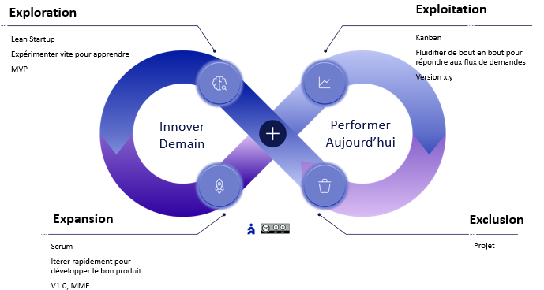

# L’agilité opérationnelle

✨**Objectif**

Donner à chaque équipe la capacité de naviguer en continu entre exploration, expansion, exploitation et exclusion, en adaptant sa méthode de travail à son contexte et accompagné d’un **Agile Master agnostique**.

🧑‍🎓**Ce que vous allez apprendre ici**

- Comment **adapter les méthodes de travail** à la zone Agile4E où se trouve l’équipe ?
- Pourquoi l’**agilité opérationnelle** repose-t-elle sur la **capacité d’ajustement** plus que sur une méthode standard ?
- Quel est le rôle de l’**Agile Master agnostique ?**

📚**Petit lexique**

- **Ambidextrie** : capacité d’une équipe à alterner ou combiner plusieurs modes d’organisation selon les contextes.
- **Agile Master agnostique** : facilitateur qui adapte les pratiques à la réalité de l’équipe, sans dogme méthodologique.

## L’exécution dans un système vivant

L’agilité opérationnelle alimente **le moteur d’apprentissage** de l’organisation. Elle s’incarne par :

1. **Des équipes autonomes et responsables** capables de livrer de la valeur utile.
2. **Des managers** garants de la cohérence entre les niveaux.
3. **Une logique adaptative**, où l’**ajustement dynamique** prime sur le respect figé d’un plan.

Contrairement à la stratégie (qui fixe le cap) et à la tactique (qui orchestre les initiatives), l’opérationnel porte la **concrétisation** : un modèle hybride entre tâches routinières et décisions locales, soutenu par des retours terrain.

### Les tensions clés à piloter

Chaque équipe doit arbitrer trois tensions majeures :

| Tension | Exemple | Arbitrage |
| --- | --- | --- |
| **Autonomie ⇄ Alignement** | Les activités Run et Build utilisent des Kanban distincts | Tableau et stand-up commun |
| **Vitesse ⇄ Fiabilité** | Hotfix « quick & dirty » vs correctif complet | Réserver 10–15 % de Slack |
| **Uniformisation ⇄ Hétérogénéité** | Scrum pour le Build vs Kanban pour le Run | Principes communs, combinés à une mise en œuvre adaptée aux spécificités. |

**Pour chaque tension :**

1. **Identifier** la valeur apportée et le risque associé,
2. **Formaliser** l’arbitrage (OKR, KPI),
3. **Mesurer** l’impact et recalibrer au sprint suivant.

### Deux caractéristiques clés

1. **Autonomie locale**

    - **Cadre clair** : OKR, Backlog, règles du jeu partagées.
    - **Méthode de travail** : chaque équipe la choisit en cohérence avec sa **zone Agile4E**.
    - **Slack opérationnel** : 10–15 % de la capacité pour imprévus et innovation.

2. **Exécution = apprentissage**

    - Chaque user-story est une **hypothèse** à valider.
    - **Boucles courtes** : Daily, sprint et revues.
    - **Retour rapide** vers la tactique pour ajuster les priorités.

## Modèle Agile4E opérationnel

On ne prescrit pas une méthode unique, on choisit celle adaptée au contexte :

| Agile4E | Objectif | Méthodes privilégiées |
| --- | --- | --- |
| **Exploration** | Expérimenter tôt pour apprendre vite | Lean Startup, Shape-up, FaST agile |
| **Expansion** | Itérer fréquemment pour développer son produit rapidement | Scrum, FaST agile, Extreme Programming |
| **Exploitation** | Fluidifier de bout en bout pour répondre aux flux de demandes | Kanban, DevOps, Lean |
| **Exclusion** | Gérer l’obsolescence et le désengagement efficacement | Projet |

> L’agilité se déploie de manière plurielle, ambidextre et locale. L’ajustement devient une compétence. Les équipes peuvent évoluer dans plusieurs zones simultanément.

### Le rôle d’Agile Master

Un **Agile Master** impulse l’agilité dans son équipe. Il veille à ce qu’elle adopte les approches les plus pertinentes en fonction de leur contexte. Il devient :

- **Agnostique** : Scrum, Kanban, Lean…
- **Facilitateur** : guide le choix, l’ajustement et l’apprentissage en temps réel.
- **Intégrateur** : garantit la cohérence entre la méthode de travail, la zone stratégique et les objectifs tactiques.

➿**TechNova**

> *« Ce n’était pas l’ampleur du problème, mais notre manière à y répondre qui a tout compliqué. » — Élodie, Agile Master BU Smart Home*

Orion, l’équipe pilote d’Élodie, travaille sur une nouvelle fonctionnalité intelligente. En parallèle, un pic d’erreurs clients surgit en production. Deux flux contradictoires s’entrechoquent : urgence support ou innovation en test ?

**Avant** :

- Deux tableaux opérationnels distincts, non synchronisés,
- Des arbitrages souvent trop tardifs,
- Des décisions reportées faute de cérémonies partagées.

**La bascule** :

Élodie créée un tableau opérationnel à double entrée avec :

- Une ligne dédiée aux tâches planifiables (Build, IA) — Scrum,
- Une ligne réservée aux urgences et incidents (Run, support) — Kanban,
- Des colonnes harmonisées pour assurer un langage commun.

Elle en profite pour remanier le stand-up :

- On commence par les signaux faibles et les urgences terrain, en fonction des KPI
- Puis on ajuste la répartition du reste des tâches, en fonction des OKR.

**Résultat** : une équipe ambidextre en action

- Elle a livré le Hotfix sans bloquer l’expérimentation IA.
- Un autre collaborateur a repris le correctif de fond.
- Deux équipes ont adopté le cadre mis en place.

### Ce que produit un modèle d’équipe rigide

- **Silos méthodologiques** : Résistance accrue aux changements. Un pôle Scrum et un autre Kanban dans la même équipe, avec un équipier DevOps au milieu.
- **Décalage réel/plan** : Backlogs obsolètes et frustration terrain, shadow Backlog.

### Mais aussi, limites et pièges

- **Rituels sans adhésions** : cérémoniels lourds, peu de réel feed-back.
- **Biais quantitatif** : les indicateurs numériques occultent la qualité.
- **Complexité cognitive** : méthodes trop nombreuses sans connaissance.
- **Inefficience** : réunion de tout le collectif systématique.

## 👣 Et concrètement, lundi matin ?

En tant qu’équipe :

1. Cartographiez votre zone **Agile4E** : où passez-vous 80 % de votre temps ?
2. Avez-vous choisi l’approche adaptée à votre zone dominante ?
3. Essayez une autre méthode sur une des activités d’une autre zone pendant un mois
4. Ajustez au besoin.
5. Faites le bilan et ajoutez cette nouvelle méthode à votre boîte à outils d’équipe.

## 🔑 Points clés à retenir

- **Équipe ambidextre** : ajustez la méthode, pas l’inverse.
- **Exécuter = Tester** : chaque action est une opportunité de feed-back.
- **Méthode contextuelle** : un cadre unique, des pratiques multiples.
- **Agile Master agnostique** : garant du « quoi » et du « pourquoi », jamais du « comment » imposé.

> L’agilité opérationnelle n’est pas un outil figé : c’est la capacité d’une équipe à choisir, ajuster et apprendre en continu.