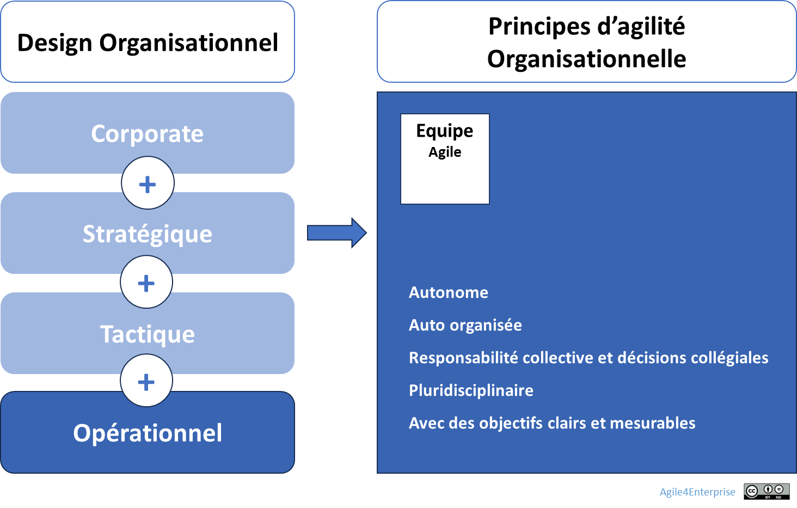

# L’agilité organisationnelle au niveau opérationnel

✨ **Objectif** **Créer un cadre dans lequel les équipes peuvent se réorganiser rapidement pour répondre aux enjeux tactiques** de manière efficace.

🧑‍🎓 **Lexique rapide** - **Dynamic reteaming** : recomposition agile des équipes selon les besoins. - **OKR tactiques** : Objectifs et Résultats Clés à l’échelle opérationnelle, alignés sur la stratégie. - Modèle 4E : Exploration, Expansion, Exploitation, Exclusion.

➿ *Chez TechNova, une opportunité commerciale majeure s’est ouverte pour un nouveau service.* *Trois jours après l’annonce, l’équipe prototype, initialement dédiée à un PoC moins prometteur, a été mobilisée pour renforcer l’équipe produit. Les développeurs, novices sur cette techno, ont collaboré sur les cas d’usage et les tests, permettant de livrer un premier MVP fonctionnel en 15 jours.*

# Une structure opérationnelle vivante

L’entreprise agile ne délègue pas l’agilité à ses équipes : elle **design intentionnellement l’organisation opérationnelle** pour qu’elle soutienne l’autonomie, la fluidité et l’impact.

Ce niveau d’agilité repose sur trois principes :

1. **Stabilité structurante** : des équipes suffisamment stables, ancrées dans la chaîne de valeur.
2. **Flexibilité adaptative** : possibilité de changer de forme, de méthode ou de mission selon les zones stratégiques.
3. **Couplage fort local** : coordination renforcée au sein de l’unité tactique pour rester aligné et réactif.

## Le modèle 4E appliqué à l’équipe

Les **équipes agiles** ne sont pas toutes les mêmes. Elles se structurent selon :

- Leur **zone d’action** dans le modèle 4E (Exploration, Expansion, Exploitation, Exclusion),
- Leur **rôle dans le cycle de vie du produit/service**,
- Leur **mode de coordination privilégié** (intégration, réseau, équipe, supervision…),
- Leur **degré de stabilité et autonomie**.

L’objectif est d’assurer que **les équipes disposent des bons mécanismes d’autonomie et de coordination** pour **exécuter efficacement leurs missions** dans un cadre organisationnel fluide et évolutif.

| Zone | Objectif | Type d’équipe | Méthode principale | Coordination privilégiée |
| --- | --- | --- | --- | --- |
| **Exploration** | Apprendre vite | Équipes ad hoc ou réseau | Lean Startup | Supervision directe + réseau |
| **Expansion** | Passer à l’échelle | Feature/Produit/Impact | Scrum + OKR | Backlog produit |
| **Exploitation** | Optimiser la performance | Équipe stable | Kanban | Rôles d’intégrateur, Classes de service |
| **Exclusion** | Désengager / Clôturer | Cellules de transition projet | Gestion de projet | Coordination projet |

➿ A TechNova, l’opportunité a mobilisé deux zones du cycle 4E : 1. **Zone Expansion : Équipe Produit** - **Objectif** : développer rapidement le service pour capter le prospect clé. - **Méthode** : Scrum. - **Coordination** : backlog produit unifié, Daily stand-up intensif. 2. **Zone Exploration : Équipe Prototype** - **Objectif** : apporter des compétences sur la techno émergente. - **Méthode** : Lean Startup appliqué aux tests et cas d’usage. - **Coordination** : design sprint de 3 jours

---

### Une organisation reconfigurable à chaque cycle

L’organisation opérationnelle bouge au rythme des boucles adaptatives :

- revues hebdo/bimensuelles pour arbitrer périmètres, priorités et ressources.
- **Dynamic reteaming** : appliquer un protocole de reconfiguration « light » : évaluer, décider, mettre en œuvre.
- **Slack et ressources ponctuelles** : maintenir une marge de manoeuvre disponible pour absorber les perturbations.
- **Boucle d’amélioration continue** : mesurer l’impact des réconfigurations et ajuster les mécanismes.

Cette mobilité se fait avec discernement : certaines équipes restent stables (zone d’exploitation), d’autres sont volontairement éphémères (zone d’exploration). Les décisions sont prises en lien avec la gouvernance adaptative, lors des **revues d’adaptation**.

Fast Agile peut être une source d’inspiration radicale sur ce dynamic reteaming.

> L’organisation oriente l’action sans figer ni disperser.
> 

➿ L’agilité opérationnelle en 4 phases : 1. **Revues adaptatives** (jour J+1) - Identification de l’opportunité et arbitrage ressources. 2. **Dynamic Reteaming** (J+2 à J+3) - Sélection du prototype team, définition des rôles, communication. 3. **Ateliers cas d’usage & tests** (J+4 à J+7) - Focus sur les user stories critiques et environnement de test. 4. **Livraison MVP** (J+15) - Validation avec 5 clients pilote et premiers retours intégrés. > Cette réorganisation tactique a permis de transformer une capacité inexploitée en levier d’innovation accélérée. >

## Et concrètement, lundi matin ?

1. Identifiez un OKR commun a plusieurs équipes différentes
2. Laissez les équipes s’auto-organiser pour être en succès à la fin du cycle tactique
3. Débriefer de l’expérimentation : les organisations temporaires ont-elles été efficaces ?

---

# **