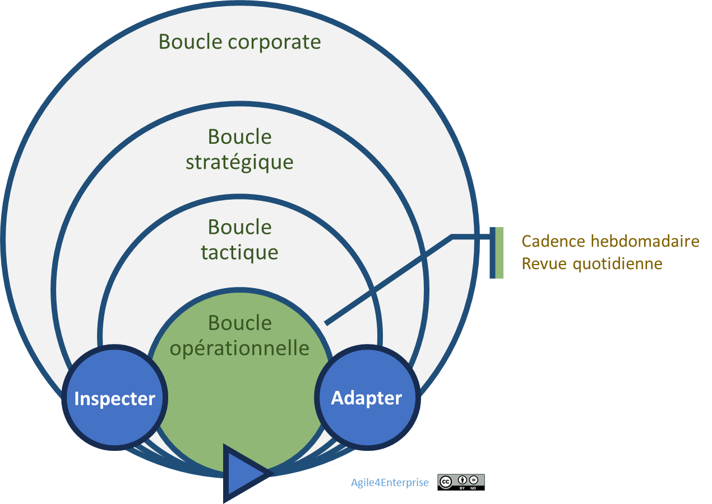

# La gouvernance adaptative opérationnelle

Propriétaire: Laurent Morisseau

- Sommaire

<aside>
✨

**Objectif**
La **gouvernance adaptative opérationnelle** désigne la manière dont l’organisation conçoit et fait évoluer les **rôles et processus décisionnels à l’échelle des équipes**, afin de favoriser une autonomie optimale et une exécution agile des initiatives.

</aside>

Cadence du changement opérationnel

<aside>
⚠️

Lorsque l’unité tactique n’a qu’une équipe, niveau tactique et opérationnel sont fusionnés.

</aside>

# Le modèle de gouvernance déléguée et itérative

Avec l’essor de l’agilité opérationnelle, le rôle du **management de proximité** se transforme profondément. Il ne s'agit plus de contrôler, mais **d’accompagner des équipes autonomes** à prendre des décisions localement, à adapter leurs modes de fonctionnement, et à orchestrer leurs initiatives en cohérence avec les **décisions tactiques**.

L’autonomie opérationnelle repose sur un [**découplage des rôles hiérarchiques et des rôles opérationnels**](https://www.notion.so/La-reconfigurabilit-organisationnelle-14390eaf28ff80a3bb7dcfa1a866df07?pvs=21), condition essentielle pour développer la réactivité sans sacrifier la lisibilité du système.

Cette gouvernance est donc **délégative** par nature, mais aussi **itérative**, car elle s’appuie sur des cycles de décision courts, nourris par les feedbacks et les résultats obtenus.

<aside>
💡

**Modèle de gouvernance agilité opérationnel**: Délégatif et [**itératif**](https://www.notion.so/Dans-l-int-r-t-de-tous-14d90eaf28ff804ba5fac52ce3b7ad55?pvs=21)

</aside>

# Cadences du changement : une gouvernance itérative

La gouvernance itérative se matérialise à travers des **cadences opérationnelles régulières**, qui structurent la dynamique d’apprentissage et d’ajustement :

## Cadence d’adaptation (hebdo ou bimensuelle)

**Fréquence : Hebdomadaire ou bimensuelle**

- Cette revue permet aux équipes d’**ajuster leur organisation**, leurs **priorités**, et leurs **ressources** en fonction des besoins et des évolutions du contexte.
- Elle est **synchronisée** avec les **sprints Scrum** ou les **cadences de revues opérationnelles** dans une [approche Kanban](https://www.notion.so/Kanban-17590eaf28ff8002ac08fead95b04e5a?pvs=21).
- La **mobilité opérationnelle** (réorganisation des équipes si nécessaire) est décidée lors de ces revues.

## Cadence d’ajustement (quotidienne)

Les équipes effectuent un **point court (Daily Stand-up)** pour :

- Suivre l’**avancement des travaux** et lever les **obstacles**.
- Ajuster les **priorités immédiates** en fonction des imprévus et nouvelles contraintes.
- Maintenir un **alignement fort avec les objectifs tactiques** et opérationnels.

<aside>
💡

Sur un cycle opérationnel :

- Les unités opérationnelles sont **stables**,
- Les objectifs opérationnels et initiatives sont stables.
</aside>

<aside>
🧰

En savoir plus sur les [4 cadences du changement](https://www.notion.so/Les-4-cadences-du-changement-et-de-l-apprentissage-13b90eaf28ff8091b4cce85974f50938?pvs=21)

</aside>

## Intégration dans l’agilité d’entreprise

Cette gouvernance ne fonctionne que si elle est **reliée aux autres niveaux** de l’organisation. Elle ne doit pas rester une initiative cloisonnée ou réduite à l’agilité d’équipe. Elle s’inscrit dans une **gouvernance imbriquée**, qui connecte :

- les **intentions stratégiques** (via les [cycles stratégiques](https://www.notion.so/La-gouvernance-adaptative-strat-gique-13b90eaf28ff800996ccf4dc1e54bcc6?pvs=21))
- les **leviers tactiques** (via les [cycles tactiques](https://www.notion.so/La-gouvernance-adaptative-tactique-13b90eaf28ff8066aa8bc5c28ac35645?pvs=21))
- l’**action concrète sur le terrain**

<aside>
👉

C’est par cette articulation fine que **l’agilité devient une capacité organisationnelle**, et non une simple méthode de gestion.

</aside>

---

# 🔑 Points clés à retenir

- **Une gouvernance incarnée au plus près des équipes**
    
    → Ce sont les équipes qui ajustent, décident et optimisent leur action, dans le cadre de leurs objectifs et priorités.
    
- **Un management délégatif, non directif**
    
    → Le manager devient **facilitateur**, pas micro-manager. Il soutient l’autonomie de l’équipe sans l’abandonner à elle-même.
    
- **Un pilotage tactique intégré**
    
    → Les équipes pilotent par les **OKR tactiques**, outils d'alignement mais aussi de cadrage évolutif.
    
- **Des boucles courtes d’apprentissage**
    
    → La gouvernance adaptative mise sur l'**ajustement rapide** plutôt que le contrôle rigide, dans une logique de **design organisationnel dynamique**.
    
- **Une condition d’agilité organisationnelle**
    
    → La capacité à faire évoluer l’organisation sans passer par des projets de transformation lourds devient un **levier de durabilité**, non une exception.
    

> L’enjeu est de refonder la gouvernance opérationnelle pour permettre à l’agilité de s’exprimer pleinement dans l’action.
> 

---