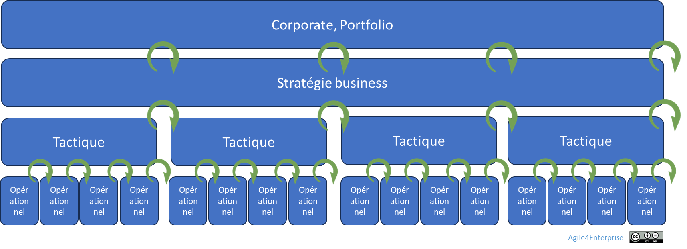

# La gouvernance adaptative opérationnelle

✨ **Objectif** Mettre en place un cadre **vivant** où chaque équipe opère **librement** tout en restant **alignée** sur les cycles tactiques et stratégiques, grâce à des **cadences intégrées**, des **boucles de feedback**.

Cadence du changement opérationnel

# Une gouvernance vivante au service de l’opérationnel

L’agilité ne se limite pas à un framework : elle se structure par un **système adaptatif** où :

1. **Délégation encadrée**
    
    Les équipes prennent leurs décisions locales dans un **cadre clair** (OKR tactiques, SLA, règles de backlog).
    
2. **Découplage hiérarchie ↔ exécution**
    
    Les managers facilitent, ils n’instruisent pas : ils interviennent pour lever les obstacles, pas pour piloter les tâches.
    
3. **Cadences intégrées**
    
    Des rythmes stables — **quotidien**, **hebdo/bimensuel**, **trimestriel** — qui garantissent un ajustement permanent.
    

⚠️ Lorsque l’unité tactique n’a qu’une équipe, les deux niveaux - tactique et opérationnel - sont fusionnés.

## Les cadences opérationnelles

> Cadence = rythme de vie de l’équipe
> 
> 
> C’est le battement qui rend la gouvernance **réactive** et **apprenante**.
> 

| Cadence | Fréquence | Finalité |
| --- | --- | --- |
| **Daily Stand-up** | Quotidien | Synchronisation rapide, résolution d’obstacles |
| **Revue de sprint** | Hebdomadaire ou bimensuelle | Révision du backlog, priorités, allocation de slack |
| **Revue tactique** | Trimestrielle | Alignement sur les OKR tactiques, ajustement des objectifs |
| **Rétro actionnable** | Mensuelle ou bimensuelle | Capitalisation des apprentissages et ajustement du cadre |

➿ ## l’équipe **Orion** en cadence 1. **Daily Stand-up** - Chacun fait un point « Aujourd’hui / Hier / Bloqué ». - L’équipe identifie le besoin de support sur un incident paiement. 2. **Revue d’adaptation hebdo** - On réalloue 10 % de la capacité au hotfix. - Mise à jour du backlog et des OKR tactiques. 3. **Revue tactique trimestrielle** - Analyse des indicateurs : latence, satisfaction client. - Redéfinition des OKR : la fiabilité devient l’objectif du prochain cycle. 4. **Rétro mensuelle actionnable** - Format « I Saw / I Did / I Want » : adoption d’un nouveau template de revue d’incident.

## Mécanismes clés de la gouvernance déléguée

- **Le backlog est un élément de coordination**
    
    Centralisé, segmenté par enjeu et toujours à jour.
    
- **Feedback multi-niveaux**
    
    Points terrain ↔ tactique ↔ stratégique intégrés dans chaque cadence.
    
- **Slack intégré**
    
    5–10 % de capacité réservée pour imprévus et expérimentations.
    
- **Gestion du changement**
    
    Sur un cycle opérationnel :
    
    - Les unités opérationnelles sont **stables**,
    - Les objectifs opérationnels et initiatives sont stables.

## Simplifier pour accélérer

- **Standardiser les rituels clés**, éliminer le superflu.
- **Synchroniser les cadences** avec tactique et stratégie.
- **Piloter par l’impact** (OKR, indicateurs) plutôt que par l’activité.

---

## Ce que produit un système rigide

- **Tensions non réglées** : backlogs figés, équipes déconnectées.
- **Décalage tactique/terrain** : lenteur de réaction face aux urgences.
- **Épuisement** : réunions à n’en plus finir, peu de résultats concrets.

---

## Et concrètement, lundi matin ?

- **Identifiez** lors de votre prochaine rétrospective l’obstacle qui freine vos OKR tactiques.
- **Fixez-vous** un OKR de transformation d’équipe pour le prochain trimestre.
- **Insérez** dès votre prochain planning une action dédiée à cet OKR.
- **Pilotez-la** chaque matin lors du Daily Stand-up.
- **Répétez** jusqu’à ce que ce blocage soit résolu.

---

#