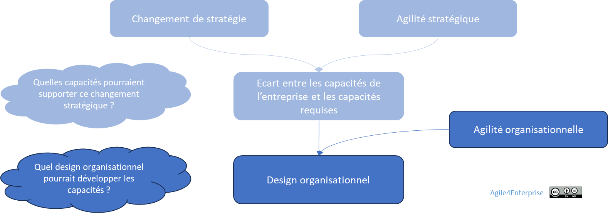

# L’agilité organisationnelle

✨ **Objectif** Définir l’agilité organisationnelle comme la capacité d’une entreprise à réaligner en continu sa structure sur sa stratégie. Il ne s’agit pas de changer pour changer, mais d’adapter l’organisation à la fréquence des mouvements stratégiques, même en l’absence de crise — et d’éviter que la stratégie ne reste qu’une déclaration d’intention.

# **Pourquoi l'agilité organisationnelle ?**

> *"Une structure figée empêche la stratégie de bouger. Une stratégie sans structure reste une intention."*
> 

## Aligner modèle d’affaires et modèle opératoire

> « Tant que l’organisation ne bouge pas, la stratégie est une fiction à haute valeur PowerPoint. »
> 

Une stratégie ne peut réussir sans une organisation capable de la porter. Dans un monde où les changements s'accélèrent, une structure rigide devient un frein — et parfois même un piège.

Résultat : un désalignement croissant entre le **business model** et le **modèle opératoire**. Le business évolue plus vite que l'organisation qui le supporte. L'inertie organisationnelle crée un écart critique.

Ce décalage s'explique par la persistance de modèles hérités, une gouvernance inadaptée, ou une exécution stratégique déconnectée du terrain.

L'agilité organisationnelle est une réponse. Ce n'est pas une fin en soi, mais un **mécanisme vivant d'alignement stratégie-structure**. C'est lui qui permet à l'entreprise de rester pertinente, cohérente, et performante.

**Ce que produit l’absence d’agilité organisationnelle :**

- La stratégie change, mais rien ne change dans l’organisation, hormis quelques projets « phares » isolés.
- Les priorités du COMEX ne se traduisent pas dans les métiers.
- Les réorganisations sont tardives, brutales, inefficaces — et souvent vécues comme des traumatismes.

➿ **TechNova en tension** En 2023, TechNova lance une nouvelle stratégie orientée services pour ces capteurs. Mais un an plus tard, la structure reste centrée produits, les incitations économiques ne changent pas, et les RH continuent d’embaucher pour l’ancien modèle. Les objectifs glissent, les équipes s’épuisent, la stratégie décroche.

## L'agilité organisationnelle en une phrase

> C’est la capacité à reconfigurer l’organisation à mesure que la stratégie évolue — sans brutalité, sans inertie, sans dispersion.
> 

L’agilité organisationnelle est donc à la structure ce que l’agilité stratégique est à la stratégie. Elle garantit l'**alignement vivant** entre les intentions et les capacités.

> En contre-exemple, Xerox dans les années 2000 entreprend une mutation profonde pour passer d’un modèle de production et de vente à un modèle de services… mais sans refondre suffisamment vite sa structure. Dix ans plus tard, le retard est irrattrapable.
> 

## Trois enjeux systémiques

1. **Aligner modèle d'affaires et modèle opératoire** : la stratégie évolue plus vite que l'organisation. Sans alignement, l'énergie se dissipe.
2. **Sortir du mode "réorganisation"** : l'agilité ne repose pas sur une refonte tous les 3 ans, mais sur une évolution incrémentale.
3. **Rendre l'organisation stratégiquement lisible** : chaque partie doit pouvoir répondre à : "Que fais-tu pour la stratégie ?"

## **Les paradoxes à réconcilier**

L’agilité organisationnelle ne supprime pas les tensions. Elle doit les **mettre en mouvement**.

| Tension | Lecture agile | Risque si non traité |
| --- | --- | --- |
| Autonomie locale vs cohérence globale | Autonomie couplée à un cap stratégique | Fragmentation, silos |
| Stabilité des équipes vs flexibilité structurelle | Équipes stables, mais reconfigurations possibles | Figement ou chaos |
| Optimisation locale vs globale | Arbitrage pour la stratégie, pas pour l'efficacité locale | Déphasage structurel |

Le **défi de l’agilité organisationnelle** est de naviguer entre ces tensions et de les transformer en **leviers de performance durable :**

⇒ Si la structure de l’entreprise est en réorganisation permanente, elle risque de ne pas accumuler les compétences et les savoir-faire nécessaires à la création d’un **avantage concurrentiel durable**.

⇒ À l’inverse, une structure trop figée limite la capacité d’adaptation et expose l’entreprise à l’obsolescence.

⇒ Il faut concilier des équipes, des chaînes de valeur et des produits stables tout en recherchant une organisation flexible et dynamique.

## **Une trajectoire de transformation continue**

Le choix d’une stratégie soulève une question essentielle : l’organisation est-elle en mesure de l’exécuter ?

*L’écart entre ses capacités actuelles et celles requises pour atteindre ses ambitions détermine la nécessité d’une transformation organisationnelle*.

Pour l’entreprise agile, ces capacités sont la **réactivité**, **flexibilité**, **adaptabilité**, et **proactivité.**

Mais ce n’est pas un projet ponctuel. C’est un **processus adaptatif** à piloter dans la durée. Il repose sur :

- **Une approche itérative** : on évolue sans tout casser.
- **Un pilotage par impact** : on juge chaque évolution à ses effets réels.
- **Une gouvernance distribuée** : on prend les décisions au plus près du réel.

Sinon, l’organisation ne pourra pas évoluer par elle-même, c'est-à-dire à travers ses propres acteurs, pour s’adapter aux changements qui surviendront après la transformation.

---

# Le design organisationnel au service de l’agilité organisationnelle

## Le design organisationnel comme levier

> Une stratégie se gagne sur le terrain, mais se perd souvent dans l’organisation.
> 

---

L’agilité ne repose pas sur des postures mais sur des arbitrages structurels. C’**est un enjeu de design organisationnel** en recherchant un **modèle favorisant l’adaptabilité** tout en maintenant une cohérence stratégique et opérationnelle.

La structure ne fait pas l’agilité organisationnelle mais crée les conditions de son succès. Elle constitue **un levier facilitateur**. Un bon design :

- Évite les dépendances bloquantes,
- Favorise les apprentissages croisés,
- Permet à chaque niveau de se reconfigurer en restant aligné.

## Les 4 niveaux d'agilité organisationnelle

> Une organisation se conçoit comme un système à quatre niveaux : Portfolio, Stratégique, Tactique, Opérationnel.
> 

**Chaque niveau de l’organisation possède une autonomie décisionnelle adaptée** tout en assurant **une coordination optimale** entre les différentes unités :

- **Portfolio** : Identifier les unités stratégiques, organiser les fonctions partagées.
- **Stratégique** : Structurer les unités autour de leur stratégie propre (client, marché, région).
- **Tactique** : Organiser les chaînes de valeur.
- **Opérationnel** : Structurer les équipes pour le delivery, l’autonomie, et le feedback terrain.

**Piège fréquent** : croire que l’on peut garder les mêmes couches intermédiaires alors que la stratégie change.

## Les grands principes de design organisationnel

- **Prioriser l’alignement stratégique sur l’optimisation locale** : Toute l’organisation n’a pas à être performante en même temps, mais elle doit l’être là où cela compte.
- **Construire une organisation centrée client** :
    1. De l’extérieur vers l’intérieur.
    2. Maximiser la surface en contact avec le changement.
    3. Des unités plus petites, autonomes, stratégiquement alignées.
- **Équilibrer autonomie et alignement stratégique** :
    1. Couplage faible entre unités stratégiques.
    2. Couplage fort au sein d’une unité stratégique.
    3. Services partagés non bloquants, sans **dépendance essentielle**.

💡 En savoir plus sur les grands principes en annexe.

## Equilibre autonomie - alignement

> L’agilité organisationnelle n’est pas l’absence de structure. C’est l’orchestration dynamique des tensions.
> 

Deux polarités à piloter :

- **Centralisation ≠ Uniformité** : Centraliser ce qui renforce la stratégie. Décentraliser ce qui renforce la vitesse.
- **Différenciation ≠ Fragmentation** : Spécialiser sans casser les flux. Intégrer sans rigidifier.

## Et concrètement, lundi matin …

On teste votre agilité organisationnelle :

- La structure a-t-elle évolué **depuis le dernier mouvement stratégique** ?
- Combien de temps vous faut-il pour réorganiser une unité autour d'une nouvelle priorité ?
- Avez-vous des zones floues : initiatives stratégiques portées par personne, ou sans structure ?
- Qui bloque une réorganisation utile ? Par quels mécanismes ?
- Le design organisationnel est vue comme une conséquence RH, plus que comme un levier stratégique ?

> Si répondre à ces questions gène, c'est que votre agilité organisationnelle est un levier inexploité. Et une organisation qui ne se transforme pas elle-même ne survivra pas aux transformations stratégiques.
> 

---

#