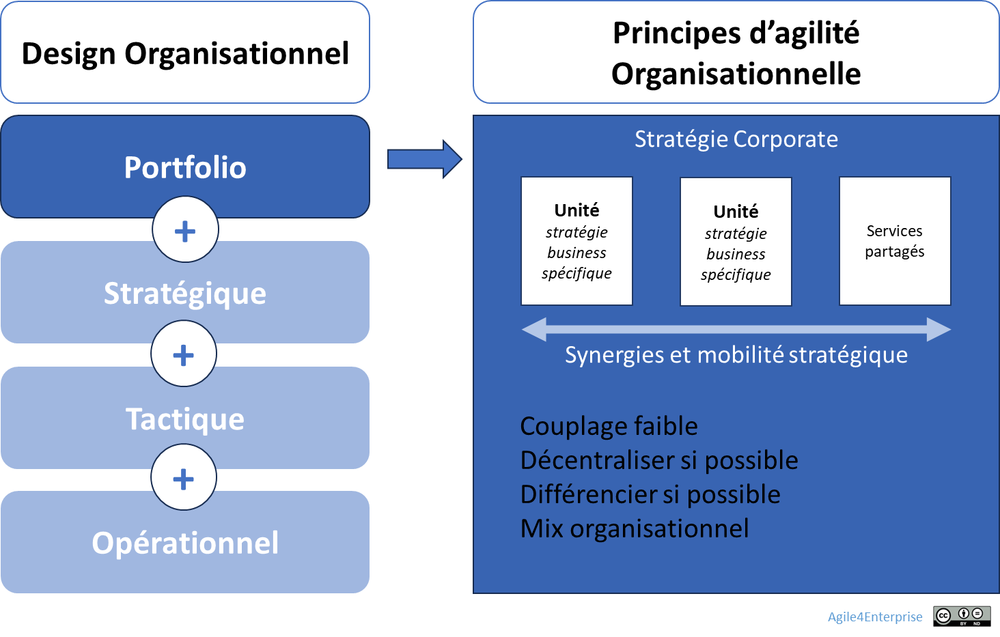

# L’agilité organisationnelle au niveau portfolio

Propriétaire: Laurent Morisseau

- Sommaire

<aside>
✨

**Objectif**

L’objectif de cette section est de définir les **principes de design organisationnel au niveau du portefeuille d’activités**, permettant à l’entreprise de rester agile tout en assurant une **cohérence stratégique et une synergie efficace**.

Il s’agit d’identifier les unités stratégiques autonomes, de structurer les services partagés et d’assurer une réallocation fluide des ressources en fonction des besoins stratégiques.

</aside>

<aside>
🧰

Les principes généraux de l’[agilité organisationnelle](https://www.notion.so/L-agilit-organisationnelle-13490eaf28ff80918f84ee8e39eddc99?pvs=21)

</aside>

# La raison d’être de l’agilité organisationnelle au niveau portfolio

Agilité organisationnelle au niveau portfolio

## **Le design stratégique du portfolio**

> Le design stratégique au niveau portfolio est la **réponse du [design organisationnel](https://www.notion.so/Le-design-organisationnel-13e90eaf28ff8050add6fa0a5cf907c5?pvs=21) aux enjeux de la [stratégie corporate](https://www.notion.so/Explorer-et-comprendre-la-strat-gie-13690eaf28ff81d18468ca20936fdecc?pvs=21)**. Il vise à concevoir une macro structure qui facilite l’atteinte d’un avantage concurrentiel d’entreprise (ou groupe).
> 

Il s’agit concrètement d’identifier les unités stratégiques de l’entreprise, celles où les décisions stratégiques décentralisées doivent avoir lieu. Cela permet de définir et d’atteindre des objectifs communs pour chaque unité.

## L’agilité organisationnelle du portfolio

<aside>
🥇

[**Agilité organisationnelle au niveau Portfolio**](https://www.notion.so/L-agilit-organisationnelle-au-niveau-portfolio-17a90eaf28ff80fc9691d0fb59bc4ac6?pvs=21)

**Objectif** : Structurer le **portefeuille d’activités** et identifier les unités stratégiques, c'est-à-dire les entités ayant leur propre stratégie business, tout en optimisant les fonctions partagées.

L’objectif est de doter l’entreprise d’une **macrostructure adaptable**, capable de soutenir des [**réorientations stratégiques**](https://www.notion.so/La-fabrique-de-la-strat-gie-13690eaf28ff81429de6ef6e608ea01a?pvs=21) corporate tout en garantissant **cohérence et synergies** entre les différentes unités organisationnelles.

</aside>

<aside>
⚠️

**Spécificité des entreprises spécialisées**

L’articulation entre [agilité stratégique](https://www.notion.so/L-agilit-strat-gique-13490eaf28ff80e2b4d8f6ab581de0f3?pvs=21) et [agilité portfolio](https://www.notion.so/L-agilit-Portfolio-18f90eaf28ff8009b702d2aa0eae18cf?pvs=21) varie en fonction du modèle d’affaires de l’entreprise :

- **Entreprises diversifiées** (multi-activités) : séparation claire entre la stratégie corporate et la stratégie business, nécessitant une gestion agile du portfolio.
- **Entreprises spécialisées** (mono-métier) : forte imbrication entre l’agilité stratégique et l’agilité portfolio, car les décisions de portefeuille influencent directement la stratégie globale.
</aside>

# **Les principes de l’agilité organisationnelle au niveau portfolio**

## **Objectifs fondamentaux**

L’agilité organisationnelle au niveau portfolio vise à :

- Aligner le portefeuille sur les ambitions de la [**stratégie corporate**](https://www.notion.so/Explorer-et-comprendre-la-strat-gie-13690eaf28ff81d18468ca20936fdecc?pvs=21).
- Gérer **des stratégies [différenciées et imbriquées](https://www.notion.so/Strat-gies-diff-renci-es-et-strat-gies-imbriqu-es-13d90eaf28ff80a39765fed2f02db43a?pvs=21)** pour maximiser l’impact global tout en préservant l’autonomie des unités stratégiques.
- Favoriser la [**décentralisation**](https://www.notion.so/Les-principes-de-design-strat-gique-13e90eaf28ff80628778e05ec7ed18cc?pvs=21) des décisions dans les unités stratégiques tout en maintenant des **services partagés efficaces**.
- Assurer une [**mobilité stratégique**](https://www.notion.so/La-mobilit-strat-gique-une-solution-pour-une-organisation-dynamique-14390eaf28ff801fa7fbef124c330c15?pvs=21) des ressources et des équipes, selon les horizons d’investissement et les besoins émergents.

## **Enjeux et périmètre**

- **Cadre de référence** : S’appuyer sur la [**stratégie corporate**](https://www.notion.so/Explorer-et-comprendre-la-strat-gie-13690eaf28ff81d18468ca20936fdecc?pvs=21) et le [**modèle A4E**](https://www.notion.so/Le-mod-le-A4E-de-l-agilit-portfolio-13490eaf28ff803a884fc20066900149?pvs=21), structuré autour des **horizons d’investissement**.
- **Transformation organisationnelle** : Approche principalement centralisée et descendante pour les changements stratégiques majeurs, couplée à une dynamique d’adaptation locale.
- **Capacité agile clé** : Développer une [**adaptabilité**](https://www.notion.so/Les-4-capacit-s-organisationnelles-cl-s-13790eaf28ff8077bff1ecf61771656f?pvs=21) **systémique** pour permettre une évolution continue du portefeuille sans rupture brutale.
- **Portée** : [Structure formelle](https://www.notion.so/La-reconfigurabilit-organisationnelle-14390eaf28ff80a3bb7dcfa1a866df07?pvs=21) de l’organisation.

# **Principes de structuration du portfolio**

### **1. Une architecture organisationnelle légère et flexible**

- La structure principale doit être **minimale et modulaire**, conçue pour **soutenir la transformation** sans rigidifier l’organisation.
    - Adaptée au [niveau d’intervention de la fonction corporate](https://www.notion.so/Les-principes-de-design-strat-gique-13e90eaf28ff80628778e05ec7ed18cc?pvs=21),
- **Priorité à la décentralisation**, avec une centralisation ciblée sur les [fonctions / services partagés](https://www.notion.so/Les-principes-de-design-strat-gique-13e90eaf28ff80628778e05ec7ed18cc?pvs=21) à forte valeur ajoutée ou nécessitant une mutualisation.
    
    L’optimisation globale et l’adaptation locale dépendent de l’autonomie laissée aux unités stratégiques (décentralisation) et le poids des services ou fonctions partagées.
    
    Cela se décide sur la base de la stratégie corporate.
    

### **2. Définition des unités stratégiques**

- Une unité stratégique correspond à une entité ayant un **business model différencié** et une **autonomie décisionnelle**.
- [Combiner autorité et responsabilité](https://www.notion.so/Les-principes-de-design-strat-gique-13e90eaf28ff80628778e05ec7ed18cc?pvs=21) au sein des unités stratégiques
    - Un business model différencié ou spécialisé suppose une gestion financière propre, avec un **compte de résultat dédié** et une **stratégie business spécifique**.
    - La **responsabilité** porte sur l’atteinte des objectifs et des résultats attendus, tandis que l’**autorité** concerne le pouvoir de décision, l’attribution des ressources et la gouvernance des activités.
- La segmentation stratégique doit refléter **les sources critiques d’avantages concurrentiels** et s’adapter à l’évolution du marché :
    
    L’unité stratégique doit définir les contours des organisations là où l’expérience doit être accumulée en mettant l’accent sur les sources critiques d’avantages concurrentiels. Elle est donc définie par rapport aux choix stratégiques et doit suivre son évolution.
    
- Moins de [150 - 200 collaborateurs](https://www.notion.so/Les-principes-de-design-strat-gique-13e90eaf28ff80628778e05ec7ed18cc?pvs=21) par unité stratégique
- Un [**couplage faible**](https://www.notion.so/Les-principes-de-design-strat-gique-13e90eaf28ff80628778e05ec7ed18cc?pvs=21) entre les unités stratégiques est recherché pour limiter les dépendances et favoriser l’adaptabilité.
- [Mix organisationnel](https://www.notion.so/Le-mix-organisationnel-et-la-logique-dominante-15e90eaf28ff800cbef0fc08b66fb1f3?pvs=21)
    
    Chaque unité stratégique a son propre modèle organisationnel adapté, ce qui veut dire au niveau Portfolio, de savoir gérer cette hétérogénéité organisationnelle.
    

### **3. Gestion des dépendances et synergies**

- Pas de dépendances essentielles entre les unités stratégiques.
    
    
    <aside>
    🧑‍🎓
    
    Une **dépendance essentielle** est une dépendance incertaine, critique, et avec beaucoup d’impacts. Les autres peuvent se gérer en tant que services partagés, avec des boucles de feedbacks adaptées.
    
    </aside>
    
- Une **mobilité des équipes et des ressources** est encouragée entre les unités stratégiques pour fluidifier la transition des initiatives d’un horizon stratégique à un autre.
    
    Lorsqu’un travail est transféré d’une unité stratégique à une autre, ce n’est pas uniquement l’activité qui change d’unité, mais également l’équipe qui l’accompagne. Ce passage implique non seulement une transition organisationnelle, mais aussi une adaptation du mode opératoire. Contrairement aux modèles traditionnels où le travail évoluait entre des départements distincts – par exemple, de la R&D vers l’exploitation – ici, c’est l’équipe elle-même qui suit le travail, en ajustant ses pratiques et son fonctionnement au nouveau contexte stratégique.
    

### **4. Cadre de gouvernance et ajustement dynamique**

- La gestion du portfolio doit suivre une **cadence stratégique** qui synchronise la **prise de décision**, l’**allocation des ressources**, et la **reconfiguration organisationnelle**.
- Les décisions de réallocation des investissements sont prises sur la base d’un **pilotage par l’impact**, favorisant un ajustement rapide aux évolutions du marché.

<aside>
📚

En savoir plus sur l’agilité organisationnelle dans notre [wiki](https://www.notion.so/L-agilit-organisationnelle-13e90eaf28ff8014ac68ea06b71fabd3?pvs=21), ou dans notre [livre](https://www.notion.so/Section-IV-Le-design-strat-gique-au-service-de-l-agilit-organisationnelle-13790eaf28ff80bbbba7e3484b4e8865?pvs=21).

</aside>

---

# 🔑 Points clés à retenir

## **Une entreprise agile par design**

> L’agilité organisationnelle au niveau portfolio n’est pas une simple déclinaison de l’agilité opérationnelle, mais un **levier stratégique** permettant d’assurer une **exécution fluide et cohérente** des choix stratégiques. La capacité de **reconfiguration continue** du portefeuille est essentielle pour assurer la compétitivité et la résilience de l’entreprise face aux transformations du marché.
> 
1. **Le portefeuille stratégique comme levier d’agilité**
    - Identifier les **unités stratégiques autonomes**, ayant chacune leur propre modèle d’affaires et modèle organisationnel.
    - Organiser les **services et fonctions partagées** pour optimiser les synergies sans rigidifier l’ensemble.
2. **Les principes du design organisationnel au niveau Portfolio**
    - Une **unité stratégique = un business model différencié**, avec une autonomie décisionnelle et des responsabilités claires.
    - **Décentraliser et différencier par défaut**, centraliser et intégrer uniquement pour favoriser des synergies.
    - **Limiter les dépendances essentielles** entre unités stratégiques pour assurer flexibilité et réactivité.
3. **Les enjeux de l’agilité organisationnelle au niveau Portfolio**
    - Assurer une **adaptabilité constante** pour accompagner les réorientations stratégiques.
    - Gérer un **mix organisationnel** en conciliant différenciation et cohérence globale.
    - Maintenir une **mobilité stratégique fluide**, permettant aux équipes et aux ressources de s’ajuster aux priorités.
4. **Un design organisationnel dynamique et évolutif**
    - Une structure légère, adaptée aux besoins stratégiques de l’entreprise.
    - Un pilotage en **4 niveaux (Portfolio, Stratégique, Tactique, Opérationnel)** pour garantir cohérence et flexibilité à toutes les échelles.
    - Une gestion du portefeuille d’activités intégrée aux **processus de transformation et d’alignement stratégique**.