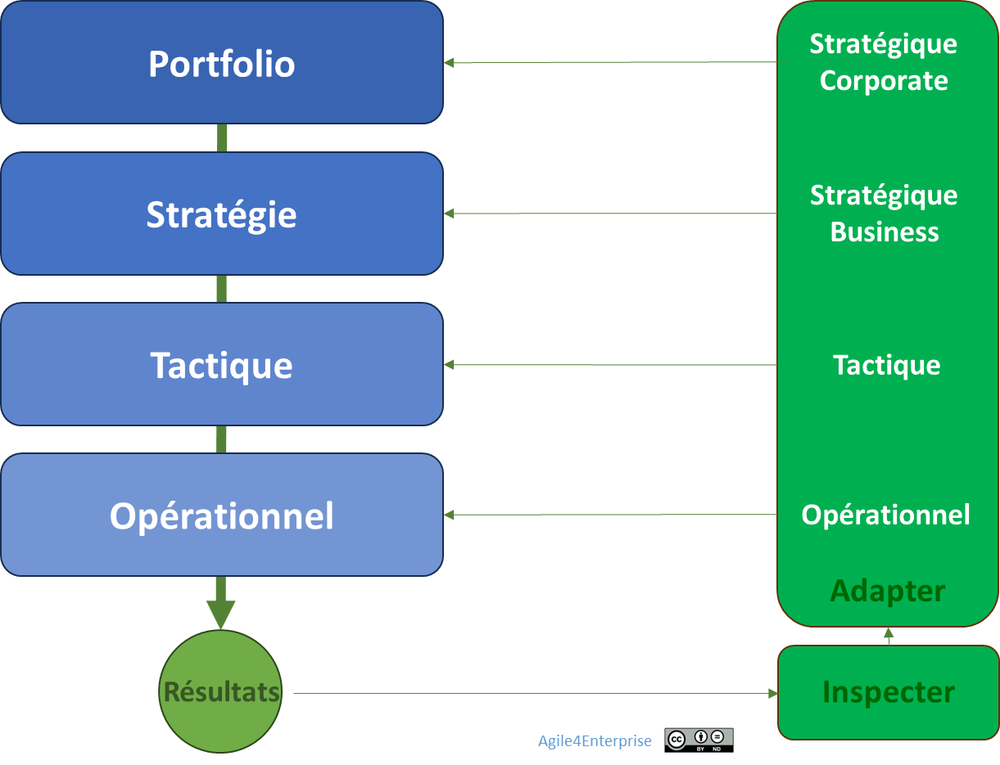

# La gouvernance adaptative Portfolio

Propriétaire: Laurent Morisseau

- Sommaire

<aside>
✨

**Objectif**

Transformer la gouvernance du portefeuille stratégique en un **système vivant**, capable de respirer, d’écouter, de réagir et de réallouer — plutôt que de figer, projeter, prédire et verrouiller.

Il ne s’agit plus d’exécuter une trajectoire figée, mais de piloter une série d’ajustements à haute fréquence, connectés aux signaux faibles du marché et aux initiatives du terrain.

Le cœur du dispositif : **un COMEX qui apprend, arbitre, redistribue et libère l’énergie là où elle compte le plus.**

</aside>

# Le modèle de gouvernance d’entreprise

<aside>
💡

**La gouvernance adaptative portfolio**

Elle vise à ajuster en continu les décisions [stratégiques](https://www.notion.so/Explorer-et-comprendre-la-strat-gie-13690eaf28ff81d18468ca20936fdecc?pvs=21) de l’entreprise.

</aside>

## La métaphore : gouverner comme un jardinier

La [gouvernance d’entreprise](https://www.notion.so/Dans-l-int-r-t-de-tous-14d90eaf28ff804ba5fac52ce3b7ad55?pvs=21) classique est celle du planificateur : il trace, chiffre, assigne. La gouvernance adaptative est celle du jardinier : il observe, taille, arrose, redistribue, choisit ce qui doit pousser ou être composté. Elle repose sur **des saisons stratégiques** — et non sur une prévision linéaire. Elle accepte que certaines branches doivent être taillées pour que d’autres fleurissent.

Dans une entreprise agile, gouverner ne veut pas dire **contrôler** : cela veut dire **orchestrer, synchroniser, régénérer.**

<aside>
➿

**Fil rouge : TechNova à l’épreuve du réel**

*L’année dernière, **TechNova** a investi massivement dans la domotique, tout en poursuivant ses lignes de capteurs industriels. Pourtant, malgré les alertes terrain, le budget de R&D n’augmente pas. Résultat ? Les prototypes IA stagnent. La croissance potentielle est ralentie… faute de gouvernance.*

> *“Nous avions une revue stratégique. Mais on la menait comme une rétrospective administrative. On ne touchait à rien.” — CTO TechNova*
> 

*Cette année, TechNova décide d’appliquer **une gouvernance adaptative Portfolio** : révision trimestrielle du portefeuille, revues codir alignées avec les décisions budgétaires. Résultat : mobilité retrouvée, décisions plus rapides, et un projet RSE arrêté en un mois (au lieu de 14).*

</aside>

## Principes de gouvernance

> Une gouvernance utile est celle qui fait bouger les lignes, pas celle qui reconduit les habitudes.
> 

### Ce que la gouvernance classique produit malgré elle

- Des cycles longs, linéaires, sourds aux signaux faibles.
- Des COMEX qui décident sans redistribuer.
- Des arbitrages qui perpétuent l’existant par inertie — et non par conviction.

### Ce que la gouvernance adaptative propose à la place

- Une boucle d’apprentissage collective.
- Des cadences stratégiques connectées aux flux réels.
- Un slack organisé pour accueillir l’inattendu.
- Une lecture partagée de la valeur.

<aside>
💡

**La gouvernance adaptative portfolio repose sur deux principes** : participatif et itératif.

</aside>

- [**Participatif**](https://www.notion.so/Dans-l-int-r-t-de-tous-14d90eaf28ff804ba5fac52ce3b7ad55?pvs=21)
    
    Elle associe les parties prenantes aux décisions stratégiques via ateliers, revues, comités. Cela permet une lecture partagée de la stratégie et une vision commune.
    
    Le choix entre une approche descendante ou ascendante dépend du style de leadership de la direction générale. Dans le cas d’une entreprise agile, l’approche est mixte, et doit plus dépendre du contexte rencontrés que du dirigeant. **Une délégation partielle des décisions stratégiques nécessite** un cadre de gouvernance clair pour garantir cohérence et autonomie.
    
    Dans une approche purement ascendante, le plan stratégique résulte de l’agrégation des plans des unités stratégiques; ce qui conduit inévitablement à négliger les opportunités transversales : soit communes à plusieurs unités, soit ne concernant aucune unité (relais de croissance).
    
- [**Itératif**](https://www.notion.so/Dans-l-int-r-t-de-tous-14d90eaf28ff804ba5fac52ce3b7ad55?pvs=21)
    
    Elle fonctionne par cycles d’apprentissage réguliers (revues stratégiques, tactiques, opérationnelles), plutôt que des plans figés.
    

L’objectif est de définir des cibles de transformation pertinentes et partagées, pour éviter les efforts contradictoires ou déconnectés.

### Le contrat social de l’entreprise agile

L’entreprise agile repose sur un **contrat social** plus que sur un modèle démocratique. Ce contrat s’appuie sur :

- Une répartition claire des rôles entre direction, équipes, gouvernance,
- Un équilibre entre initiatives locales et cohérence globale,
- Une flexibilité organisationnelle intégrée, évitant les transformations brutales mais favorisant l’adaptation continue.

<aside>
⚠️

Une entreprise agile agit dans l’intérêt de tous, mais sans reposer spécifiquement sur une démocratie d’entreprise.

Le contrat social unissant les employés à l'entreprise agile repose sur la sécurité et la confiance réciproque.

</aside>

<aside>
🧰

En savoir plus sur les [Principes fondamentaux d'Agile4Enterprise](https://www.notion.so/Agile4Enterprise-respecter-aligner-faire-respirer-l-organisation-1e390eaf28ff805f8b31e59f0521c37b?pvs=21)

</aside>

<aside>
📚

En savoir plus sur la [gouvernance](https://www.notion.so/Dans-l-int-r-t-de-tous-14d90eaf28ff804ba5fac52ce3b7ad55?pvs=21)

</aside>

# **Gouverner par les cadences du changement**

Dans Agile4Enterprise, le portefeuille d’activités n’est pas figé par un cycle budgétaire. Il est structuré comme une **boucle adaptative** qui :

- S’ajuste au rythme du marché,
- Réalloue en continu les ressources selon l’impact,
- Synchronise les arbitrages stratégiques avec les priorités réelles.

## Caractéristiques

- Horizon de décision : 5 à 10 ans
- Synchronisation : revue annuelle + ajustements trimestriels
- Flux : réinjection continue des apprentissages terrain
- Capacités à développer : **arbitrage en continu** des investissements,

> La stratégie corporate devient un **flux vivant d’investissements, d’apprentissages et de réallocations**, non un plan quinquennal.
> 

## **Les 4 cadences d’orchestration**

La stratégie corporate a plusieurs horizons temporels :

- Une **stratégie plus long terme** portant sur les investissements structurels, l’innovation, et l’expansion géographique ou sectorielle,
- Une **stratégie plus court terme** portant sur des initiatives stratégiques pour s’adapter aux réactions du marché. C’est le [développement stratégique](https://www.notion.so/L-art-de-l-ex-cution-de-la-strat-gie-et-de-la-tactique-14590eaf28ff8094aff8d88d6b871ea8?pvs=21).

L’agilité d’entreprise ne remet pas en question la nécessité d’un pilotage structuré, mais elle transforme la manière dont celui-ci est effectué. C’est pourquoi, dans la mesure du possible, il faut intégrer les cadences du changement aux instances existantes.

Le **COMEX (Comité Exécutif)** est généralement impliqué dans les décisions stratégiques et les ajustements tactiques majeurs, mais les **revues opérationnelles** sont souvent gérées à des niveaux plus décentralisés, par les **CODIR (Comités de Direction)**.

Ces instances doivent être repensées non comme des points de contrôle, mais comme des forums d’apprentissage collectif, où les décisions sont prises en fonction des feedbacks terrain et de la performance réelle des stratégies en place.

### Les cadences de TechNova

| Rythme | Cadence | Finalité | Instance TechNova |
| --- | --- | --- | --- |
| **Revue stratégique** | Annuelle | Réorienter les grandes lignes (retrait du projet RSE, focus domotique) | COMEX élargi |
| **Revue tactique** | Trimestrielle | Réaffecter le budget IA vers domotique en réponse aux premiers retours clients | CODIR + Responsable Stratégie |
| **Revue opérationnelle** | Mensuelle | Ajuster les livrables avec l’équipe capteurs (maintenance automatisée) | Pôle technique + métier |
| **Slack stratégique** | Continu | Saisir une nouvelle opportunité santé (IA + capteurs respiratoires) | Budget exploratoire activé par CTO |

**TechNova** montre que réagir vite ne suffit pas : il faut reconfigurer vite.

## Les revues de pilotage repensées

Piloter, ce n’est pas réviser les chiffres : c’est redistribuer la capacité d’agir :

### Revue stratégique (annuelle)

- Synchronise stratégie et portefeuille
- Visualiser l’évolution des actifs dans les [zones stratégiques](https://www.notion.so/Agile4E-La-cartographie-strat-gique-vivante-13490eaf28ff803a884fc20066900149?pvs=21),
- Réoriente les grandes allocations
- Active la [mobilité stratégique](https://www.notion.so/La-mobilit-strat-gique-1f590eaf28ff80aeb08ad7b55a2b69d5?pvs=21)

> Trop souvent réduite à un budget annuel, elle devient ici un espace de réalignement vivant.
> 

### Revue tactique (trimestrielle)

- Cadence les ajustements à partir des résultats OKR
- Permet un suivi rapproché de l’exécution

### Revue opérationnelle (mensuelle)

- Donne aux équipes un pouvoir d’adaptation court terme
- Aligne les décisions locales avec la stratégie

<aside>
💡

**Synchronisation et alignement**

La clé se trouve dans la synchronisation et l’alignement entre les différentes revues.

***Ce qui dysfonctionne quand cela manque* :** 

Les sujets sont pilotés de manière indépendante, sans synergie ou mobilité stratégique entre activités, créant des silos entre BU.

</aside>

<aside>
📚

En savoir plus sur les [revues stratégiques](https://www.notion.so/La-coordination-verticale-14390eaf28ff807b9cafd0f0af71e154?pvs=21)

</aside>

# **Les leviers concrets pour activer la gouvernance**

## **Arbitrer par l’impact**

À chaque cycle :

- Réévaluer les activités selon leur valeur stratégique,
- Diriger les investissements vers les initiatives à haut potentiel,
- Transformer ou désengager les actifs non alignés.

Chaque OKR stratégique est confronté à la capacité réelle.

## Utiliser le Slack stratégique

Un portefeuille agile **intègre volontairement du Slack** :

- Budget d’investissement libre (20% non affecté).
- Capacité humaine modulable (polyvalence, formations croisées).
- Fenêtres de décisions opportunistes (hors cycle trimestriel si nécessaire).

> Sans Slack, pas de mobilité. Sans mobilité, pas d'agilité stratégique réelle.
> 

## Aligner les processus clés

### Budgets

- Modèle d’investissement incrémental, fini le budget figé annuel
- Passage à un modèle glissant, ajusté à chaque trimestre, basé sur les OKR tactiques

### Ressources

- Les équipes sont allouées selon les objectifs
- Capacité à déplacer les ressources rapidement

### Talents

- Pilotage des compétences en lien avec les besoins stratégiques
- Leadership distribué, décisions décentralisées

## Les rôles clés revisités

| Rôle | Mission |
| --- | --- |
| **Sponsoring stratégique** | Définir les grandes orientations |
| **Pilotage du portefeuille** | Orchestrer les arbitrages, cadencer les cycles |
| **Slack steward** | Protéger la marge de manœuvre pour l’innovation |
| **Gouvernance adaptative** | Synchroniser les boucles et les niveaux |

## Et concrètement, lundi matin …

- Quelles initiatives pouvez-vous fermer, réallouer ou ralentir ?
- Où avez-vous **promis de l’agilité sans donner de slack** ?
- Quel projet mobilise encore des talents sans générer d’impact mesuré ?
- Qui, dans votre COMEX, a **le mandat pour dire “stop”** ?
- Avez-vous **redirigé au moins 10 % de vos ressources** en fonction des signaux de terrain ?

> Si aucune initiative n’a été fermée, ralentie ou réallouée dans les 90 derniers jours, il ne s’agit pas encore d’une gouvernance adaptative.
> 

---

# 🔑 Points clés à retenir

> L’agilité stratégique commence quand le COMEX apprend à lâcher, réallouer et activer des espaces vides pour faire place au vivant.
> 
- La gouvernance Portfolio devient une **boucle adaptative**, pas une planification annuelle.
- Le portefeuille est un **flux stratégique vivant**, piloté par l’impact.
- La **mobilité stratégique** est une compétence organisationnelle essentielle.
- Le **slack stratégique** est un facteur d’agilité réel, pas une indulgence.
- La cartographie 4E permet de suivre, arbitrer et activer les décisions clés en temps réel.

Réinventer la gouvernance Portfolio, c’est rendre la stratégie vivante dans l’exécution.

### 👉 Et maintenant ? Comment [s’organiser](https://www.notion.so/L-agilit-organisationnelle-13490eaf28ff80918f84ee8e39eddc99?pvs=21) pour faire vivre ces boucles ?