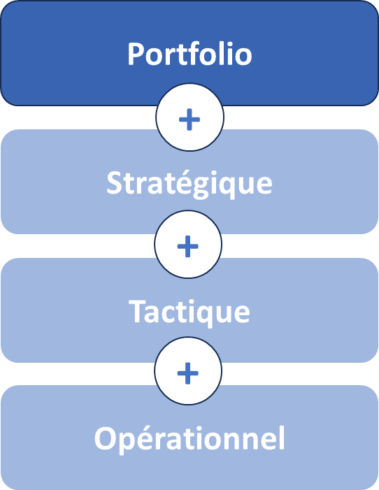

# L’agilité Portfolio : vue d’ensemble

Propriétaire: Laurent Morisseau
Étiquettes: Agilité Portfolio, Principes

- Sommaire

✨ **Objectif** Piloter votre portefeuille stratégique : détecter en continu les opportunités, redistribuer talents et budgets en temps réel, et maximiser la création de valeur. **Les enjeux** Bâtir des synergies entre activités et garantir une mobilité stratégique fluide, pour rester à l’avant-poste face à la concurrence.

# Un panorama stratégique

➿ ***Fil rouge : TechNova, une entreprise fictive*** *Fin 2024, cette scale-up de l’IoT détecte une demande montante pour la domotique. Plutôt que d’attendre son cycle budgétaire annuel, elle réalloue immédiatement 20 % de ses équipes R&D vers un prototype de capteurs intelligents. En moins de trois mois, le MVP est testé sur le marché.*

Imaginez que votre portefeuille puisse faire de même : il ne s’agit plus d’un inventaire figé, mais d’un **système dynamique** qui s’ajuste au fil des signaux du marché. Dans un environnement où l’incertitude et la complexité sont devenues la norme, la **capacité d’adaptation du portefeuille** est un facteur clé de résilience et de compétitivité. C’est l’essence de l’**Agilité Portfolio** !

## Définitions clés

🔎 Portefeuille stratégique Il regroupe l’ensemble des activités et investissements d’une entreprise. L’objectif ? **Maximiser la valeur globale** de votre entreprise en répartissant ressources et priorités entre des initiatives aux horizons et risques variés.

💡 **Agilité Portfolio** C’est cette capacité à transformer votre portefeuille d’activités – produits, marchés, projets, innovations – en un système vivant, capable de s’ajuster à l’évolution du marché.

La place de l’agilité Portfolio dans les boucles d’adaptabilité

**Nom alternatif** : Portefeuille d’activités stratégiques, portefeuille d’investissement.

*L**e** portefeuille stratégique de **TechNova** rassemble :*

- *des projets IoT résidentiel,*
- *des offres cloud pour l’industrie,*
- *un programme R&D en IA embarquée,*
- *des partenariats RSE sur les smart grids.*

Les enjeux :

- **Réévaluer en continu** vos initiatives (ex. : détecter un nouveau segment de clientèle).
    
    *TechNova surveille cinq prototypes en temps réel*
    
- **Réallouer immédiatement** talents, budgets et technologies vers les priorités émergentes.
    
    *Plutôt que d’attendre son budget annuel, elle réalloue 20 % de ses équipes R&D dès janvier vers son prototype domotique.* 
    
- **Itérer** : financer par étapes et ajuster selon les premiers résultats (build-measure-learn).
    
    *Le MVP est testé en mars, arbitrage en mai*
    

Le but est de le faire avant la concurrence ou de manière plus efficace pour en faire un facteur clé de compétitivité.

## Pourquoi adopter l’Agilité Portfolio ?

1. **Volatilité** : marchés et technologies changent plus vite que vos cycles budgétaires.
    
    ***TechNova** a dû réagir à une offre concurrente début 2024*
    
2. **Complexité** : interdépendances entre business units, partenaires et écosystèmes.
    
     ***TechNova** doit combiner IoT, cloud et IA, et cela entre différentes unités d’affaires.*
    
3. **Performance durable** : un cercle vertueux d’innovation, d’apprentissage et de réinvestissement.
    
    *Chaque prototype réussi alimente la roadmap 2025*
    

Sans adaptation permanente, vous risquez d’investir dans un projet obsolète et de manquer la vague suivante.

### Les 4 piliers à haut niveau

Une gestion agile du portefeuille stratégique s’appuie sur 4 piliers :

1. **Gouvernance adaptative**
    - Revues annuelles pour ajuster la vision long terme.
    - Points trimestriels pour réorienter budgets et équipes.
    
    Cette gouvernance doit permettre des décisions rapides sans être entravées par des processus bureaucratiques lourds.
    
2. **Pilotage dynamique**
    - Boucle continue de décision « build-measure-learn ».
    - Des décisions en fonction des évènements, et non selon des cycles budgétaires.
3. **Cartographie stratégique 4E**
    
    Un modèle simple – **Exploration**, **Expansion**, **Exploitation**, **Exclusion** – pour visualiser et prioriser vos zones stratégiques.
    
4. **Mobilité stratégique**
    - Processus formalisé pour mobiliser talents et budgets en quelques semaines.
    - Équipes modulaires, faciles à recomposer selon les priorités.

---

## Les tensions clés à piloter

L’Agilité Portfolio n’est pas une évidence : elle bouscule plusieurs équilibres fondamentaux :

- **Stabilité vs flexibilité**
    
    *TechNova a dû sacrifier un peu de prévisibilité pour gagner en réactivité.*
    
- **Court terme vs moyen/long terme**
    
    *Elle équilibre livraisons rapides de prototype et vision 2030 sur l’IA embarquée.*
    
- **Autonomie locale vs cohérence globale**
    
    Les business units dispose de son budget, mais cette diversité peut dérouter la stratégie corporate si elle n’est pas cadrée.
    
    Une trop forte autonomie peut également diminuer les synergies réelles recherchée au travers du portefeuille. Une trop forte synergie augmente les interdépendances limitant l’agilité.
    
- **Décisions descendantes vs émergentes**
    
    Qui tranche : le comité exécutif ou les managers de terrain ? Comment concilier direction claire et prises d’initiatives locales ?
    

Chacune de ces polarités doit être arbitrée, pas masquée. Cela ne se décide pas dans un comité mais s’ajuste avec des boucles adaptatives (*TechNova organise un “flash review” dès qu’un KPI dépasse un seuil critique).*

🔎 En savoir plus sur les typologies de portefeuilles

## Et concrètement, lundi matin ?

Évaluez votre besoin en Agilité Portfolio !

### Confiance dans le système

- Pouvez-vous déployer une décision corporate en < 1 mois dans toutes vos unités ?

### Mobilité stratégique

- Pouvez-vous redéployer 10–20 % de vos équipes en ≤ 6 semaines ?

### Budget dynamique

- Révisez-vous vos allocations au moins chaque trimestre selon la performance ? Ou vos budgets restent-ils bloqués sur l’enveloppe initiale ?

### Fréquence des décisions

- Tenez-vous ≥ 4 revues/an ou ad hoc dès qu’une opportunité majeure surgit ?

### Délégation aux unités business

- Vos business units disposent-elles d’une autonomie budgétaire et décisionnelle clairement définie ?

---

**Interprétez vos réponses**

- ≤ 2 « oui » → portefeuille trop statique, besoin urgent d’Agilité Portfolio
- ≥ 4 « oui » → fondations solides, cap sur l’optimisation des cadences et tensions

---

## Processus clés impactés

Listez vos processus à synchroniser pour vivre l’Agilité Portfolio :

- **Gestion du portefeuille** (revues trimestrielles, dashboards vivants)
- **Gestion du budget** (fenêtre glissante 3 mois, investissements incrémentaux)
- **Instances décisionnelles** (COMEX agile, flash reviews)
- **Pilotage des risques** (suivi continu sur indicateurs externes)

---

#