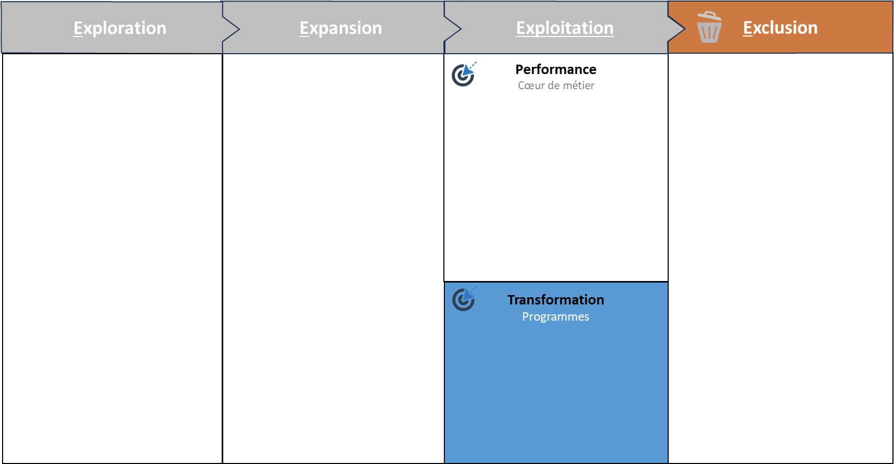

# La mobilité stratégique

Propriétaire: Laurent Morisseau
Étiquettes: Agilité Portfolio, Principes

- Sommaire

<aside>
✨

**Objectif**

Mettre en place une capacité de réallocation rapide des talents et budgets vers les priorités stratégiques — sans attendre le prochain cycle budgétaire. Créer une mobilité alignée sur la valeur, synchronisée à la gouvernance Portfolio, sans sacrifier la stabilité.

</aside>

# Pourquoi la mobilité stratégique ?

> *"La stratégie évolue en continu. Vos ressources aussi ?"*
> 

La mobilité stratégique est le chaînon manquant entre une ambition affirmée et sa réalisation. Sans elle, les projets prioritaires stagnent, les ressources s’enracinent là où l’enjeu n’est plus, et les opportunités s’évanouissent. Une opportunité ne peut attendre l’exercice budgétaire suivant. 

<aside>
➿

**Cas TechNova — quand tout change, sauf les ressources**

> *"On avait tout aligné, sauf la capacité à réallouer.”*
> 

*En 2024, TechNova décide de réorienter son portefeuille produit vers les services domotiques. Mais les budgets restent assignés aux équipes capteurs. Les talents clés sont bloqués dans des plans RH obsolètes. Un an plus tard, l’unité domotique est en retard, l’opportunité s’est envolée. Le design semblait aligné, mais les ressources ne suivaient pas.*

</aside>

# **Diagnostic — Vos 3 questions clés**

1. **Alignement Ressources ↔ Stratégie**
    
    <aside>
    ❓
    
    Vos ressources (humaines, financières, technologiques) suivent-elles automatiquement vos décisions stratégiques, ou restent-elles bloquées dans l’enveloppe annuelle ?
    
    </aside>
    
2. **Pilotage par événements**
    
    <aside>
    ❓
    
    Votre réallocation s’active-t-elle à chaque signal marché (nouveau concurrent, rupture technologique), ou seulement lors des arbitrages budgétaires planifiés ?
    
    </aside>
    
3. **Agilité des talents**
    
    <aside>
    ❓
    
    Au-delà des fiches de poste, disposez-vous d’un dispositif pour reconfigurer rapidement les compétences en fonction des priorités ?
    
    </aside>
    

> Si vous répondez « non » à deux de ces trois questions : la mobilité est votre point faible systémique.
> 

# Les caractéristiques clés de la mobilité stratégique

<aside>
💡

Les caractéristiques de la [**mobilité stratégique**](https://www.notion.so/La-mobilit-strat-gique-une-solution-pour-une-organisation-dynamique-14390eaf28ff801fa7fbef124c330c15?pvs=21) :

- Réallocation rapide en réponse aux zones stratégiques du modèle 4E
- Pilotage par la valeur (et non par plan ou priorité RH)
- Compétences flexibles
- Synchronisation avec la [cadence Portfolio](https://www.notion.so/La-gouvernance-adaptative-Portfolio-15f90eaf28ff80f493d9ed25cf094433?pvs=21)
</aside>

## Les 3 principes d’une mobilité stratégique pilotée

1. **Valeur d’abord**
    
    Toute réallocation doit viser un impact mesurable : revenu, time-to-market, marge, alignement stratégique.
    
2. **Cadence maîtrisée**
    
    Synchronisez mobilité et [gouvernance](https://www.notion.so/La-gouvernance-adaptative-Portfolio-15f90eaf28ff80f493d9ed25cf094433?pvs=21) à travers :
    
    - Revue Portfolio trimestrielle
    - Flash Review mensuel (revue éclair déclenchée par un écart KPI ou une tension)
    - Slack Review continue (opportunités hors cycle)
    
    <aside>
    💡
    
    Dans [PACTE](https://www.notion.so/Guide-de-l-outil-PACTE-17a90eaf28ff8007ae71e576ac507f7e?pvs=21), la capacité de chaque zone (Exploration, Expansion…) guide la mobilité.
    
    </aside>
    
3. **Continuité protégée**
    
    Ajuster les ressources sans casser la dynamique des activités en cours. On ne « vide » pas une équipe pour remplir une autre.
    
    > La mobilité est stratégique si elle augmente la valeur sans fracturer l'organisation.
    > 

# Les 4 leviers concrets

## 1. **Cartographie dynamique des ressources**

Un référentiel vivant des compétences, capacités et charges, non pas une base RH statique, mais un radar stratégique.

## 2. **Mécanisme d’activation clair**

- Qui peut déclencher une réaffectation ?
- Sur quels critères ?
- Avec quel niveau d’autonomie ?

<aside>
➿

Chez TechNova, une Flash Review est déclenchée dès qu’un projet dépasse 80 % de sa capacité planifiée ou qu’un KPI clé décroche.

</aside>

## 3. **Micro-upskilling et modularité des équipes**

- Former rapidement pour repositionner
- Favoriser des unités avec des compétences hybrides, capables d’évoluer d’une zone stratégique à une autre

## 4. **Slack stratégique intégré**

Sans slack, pas de mobilité. Sans mobilité, pas d’agilité stratégique réelle.

## Du transfert de compétences à la mobilité stratégique

La gestion des talents évolue dans une entreprise agile :

| Aspect | Entreprise traditionnelle | Entreprise agile |
| --- | --- | --- |
| Gestion des ressources | Transfert de compétence | Réallocations pilotées par l’impact |
| Vitesse d’adaptation | Mois à années | Semaines |
| Vision du talent | Spécialisation progressive | Modularité & hybridation |
| Réponse au changement | Prévisible, lente, faible réactivité face aux disruptions | Itérative, déclenchée par signaux |
| Avantages | consolidation des expertises, parcours de développement clair | réactivité maximale, expérimentation rapide |

> La mobilité stratégique ne remplace pas le plan de carrière. Elle ajoute une dynamique d’adaptation continue.
> 

## Tension clé : Stabilité vs Mobilité

- **Stabilité opérationnelle**
    
    Des équipes stables optimisent la performance et réduisent les coûts d’ancrage.
    
- **Mobilité stratégique**
    
    Des réallocations fréquentes assurent la réactivité et la capture d’opportunités.
    

<aside>
⚠️

Le vrai enjeu ? Trouver une organisation qui stabilise sans rigidifier, et qui bouge sans désarticuler.

</aside>

# Désengagement : le pendant de la mobilité

> On investit partout. Mais on n’arrête nulle part.
> 

La **mobilité stratégique** inclut non seulement le **redéploiement des ressources**, mais aussi **l’optimisation et le désengagement** des actifs devenus non pertinents. Réallouer, ce n’est pas seulement renforcer. C’est aussi **désengager sans brutalité**.

Deux zones à traiter, deux logiques à activer :

### 1. **Optimisation de l’exploitation (**[Zone de transformation](https://www.notion.so/Management-de-la-zone-d-exploitation-H1-14990eaf28ff8093bd6cf7238629e7c9?pvs=21)**)**

Avant de désengager :

- Rendre un actif plus rentable ou transférable
- Excellence opérationnelle, innovation d’efficience

### 2. **Désengagement structuré ([Zone d’exclusion](https://www.notion.so/Agile4E-La-cartographie-strat-gique-vivante-13490eaf28ff803a884fc20066900149?pvs=21))**

- Identifier les actifs à faible valeur future ou zombies (maintien par inertie)
- Planifier : arrêt progressif, revente, transfert

Ce processus peut inclure :

- **Revente ou cession**.
- **Externalisation ou mutualisation**.
- **Arrêt progressif et redirection des ressources vers des initiatives plus stratégiques**.

> Le désengagement est un acte stratégique — pas un abandon par défaut.
> 

<aside>
📚

En savoir plus sur le [désengagement](https://www.notion.so/Management-de-la-zone-d-exploitation-H1-14990eaf28ff8093bd6cf7238629e7c9?pvs=21)

</aside>

---

# 📌 Et concrètement, lundi matin…

- Cartographiez les 3 unités avec le plus fort décalage impact/ressources
- Proposez une flash review pour une opportunité émergente
- Identifiez 2 compétences à reconfigurer via micro-upskilling
- Évaluez votre slack : avez-vous de quoi bouger vite si besoin ?
- Intégrez la mobilité stratégique dans la prochaine revue Portfolio.

---

# 🔑 Points clés à retenir

- La mobilité stratégique est un **levier de transformation** : c’est elle qui permet à l’ambition de devenir action.
- Elle se pilote, se cadence, se prépare.
- Elle est la **face opérationnelle d’une stratégie vivante**.

> Une entreprise agile ne bouge pas pour bouger. Elle sait quand, comment et pourquoi redistribuer son énergie.
>