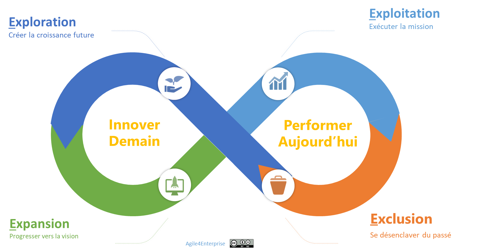

# Le modèle A4E de l’agilité portfolio

Propriétaire: Laurent Morisseau

- Sommaire

<aside>
✨

**Objectif** 

Cette section introduit le **modèle A4E**, un cadre d’alignement stratégique basé sur le cycle de vie des actifs stratégiques du portefeuille. Il vise à expliciter les **4 zones stratégiques** - **Exploration, Expansion, Exploitation et Exclusion** - et leur impact sur la gestion du portefeuille stratégique. Ce modèle sert de fondation pour structurer la prise de décision à tous les niveaux de l’agilité d’entreprise.

</aside>

# **Les zones stratégiques : Le modèle 4E**

Modèle A4E

## **Une approche stratégique pour une entreprise agile et adaptative**

Le **modèle 4E** est une approche dynamique permettant d'articuler les différentes zones stratégiques d’une organisation en fonction de leur maturité et de leur horizon temporel. C’est un modèle d’alignement stratégique basé sur le cycle de vie des actifs (produits / services) stratégiques du portefeuille. Ce cycle de vie est défini en 4 zones stratégiques - **E**xploration, **E**xpansion, **E**xploitation, et **E**xclusion. Examinons ces zones stratégiques.

## **La zone d’Exploration : Créer la croissance future**

### **Un espace dédié à l'innovation stratégique**

L’exploration est essentielle pour anticiper les transformations du marché et développer de nouveaux modèles d’affaires. Cette zone, fortement marquée par l’incertitude, nécessite une culture d’**apprentissage organisationnel** et une capacité à expérimenter rapidement pour valider la viabilité des nouvelles opportunités.

Dans cet horizon de temps, on explore et on teste des idées pour anticiper la croissance à long terme, en validant la viabilité des modèles d’affaires.

### **Objectif principal**

- Identifier et tester des opportunités de rupture ou de [transformation radicale](https://www.notion.so/La-fabrique-du-changement-14a90eaf28ff8085bd03d715bfdae69e?pvs=21) pour assurer la pérennité de l’entreprise à long terme.

### **Caractéristiques clés**

- Fort degré d’incertitude nécessitant une approche itérative et expérimentale.
- Recherche d’innovation disruptive et émergence de nouveaux business models.
- Organisation en mode start-up interne ou en mode projet, favorisant des équipes autonomes et pluridisciplinaires.

### **Enjeux**

- Développer des **capacités stratégiques d’apprentissage** pour identifier et capturer des opportunités émergentes.
- Investir dans l'innovation avec une vision à long terme sans tomber dans le **court-termisme financier**.
- Mobiliser les ressources actuelles tout en les réorganisant pour des opportunités futures, évitant une inertie organisationnelle qui freinerait l'innovation.

Une entreprise peut se passer de cette zone si la stratégie est d’être un suiveur rapide.

### **Agilité**

- Provoquer le changement en expérimentant pour apprendre au plus tôt.
- La stratégie est principalement émergente : Favoriser une culture d’**adaptabilité stratégique**, où l’échec est vu comme un levier d’apprentissage.
- Intégrer des cycles d’apprentissage rapide et des **boucles de feedback stratégiques**.

### **Horizon de temps**

- **5 à 10 ans**, avec un retour sur investissement incertain, nécessitant une vision et un alignement forts.

<aside>
🔎

En savoir plus sur la [zone d’exploration](https://www.notion.so/Faire-cohabiter-plusieurs-horizons-strat-giques-13690eaf28ff816f931efc5a173335bc?pvs=21)

</aside>

## **La zone d’Expansion : Passer à l’échelle pour progresser vers la vision**

### **Transformer les innovations en relais de croissance**

Une fois les innovations validées dans la zone d’exploration, l’enjeu est d’organiser leur passage à l’échelle tout en conservant la capacité d’adaptation et d’innovation continue. L’objectif est le développement et la croissance pour atteindre leur plein potentiel à moyen terme.

### **Objectif principal**

- Accélérer le développement des nouvelles opportunités stratégiques, sources des revenus et profits futurs, pour en maximiser l’impact.

### **Caractéristiques clés**

- **Phase de mise à l’échelle du marché et de nos ambitions**, nécessitant des structures plus robustes sans brider l’innovation.
- Modèles d’affaires validés, mais encore en phase de développement et d’optimisation.
- **Combinaison de stratégie émergente et délibérée**, nécessitant un arbitrage constant entre flexibilité (demandes spécifiques) et standardisation (vision produit).

### **Enjeux**

- Maintenir l’agilité dans une phase d’industrialisation (optimisation) et d’expansion (transformation).
- Consommation élevée de ressources et dépendance au financement par la zone d’exploitation.
- Requiert un leadership transformationnel fort de la direction pour gérer l’équilibre entre court et moyen terme.
- Gérer les tensions entre les **unités tactiques** cherchant à croître et les structures établies orientées sur la rentabilité.

### **Agilité**

- Rester agile en passant à l’échelle. L’agilité cherche à maintenir le produit ou le service le plus longtemps possible dans cette zone, pour le développer en même temps que la base clients/utilisateurs, grâce à l’[innovation de continuité](https://www.notion.so/Les-capacit-s-de-l-entreprise-agile-13690eaf28ff8182abccc48ebecb3bf6?pvs=21).

### **Horizon de temps**

- **2 à 5 ans**, avec des résultats mesurables et une pression croissante sur la rentabilité.

<aside>
🔎

En savoir plus sur la [zone d’expansion](https://www.notion.so/Faire-cohabiter-plusieurs-horizons-strat-giques-13690eaf28ff816f931efc5a173335bc?pvs=21).

</aside>

## **La zone d’Exploitation : Exécuter la mission avec efficience pour maximiser la performance actuelle**

### **Sécuriser et optimiser les actifs existants**

L’exploitation est la phase où l’entreprise tire parti de ses investissements passés, en maximisant la rentabilité et la performance. Elle le fait en se focalisant à la fois sur la rentabilité immédiate et sur la viabilité à plus long termes de ces actifs. Une entreprise cherche à maintenir ses actifs le plus longtemps possible dans cette zone, notamment grâce aux [programmes de transformation](https://www.notion.so/Management-de-la-zone-d-exploitation-H1-14990eaf28ff8093bd6cf7238629e7c9?pvs=21) et à l’[innovation d’efficience](https://www.notion.so/Les-capacit-s-de-l-entreprise-agile-13690eaf28ff8182abccc48ebecb3bf6?pvs=21).

### **Objectif principal**

- Maximiser la performance à court terme et sécuriser les positions acquises.
- Assurer la pérennité des modèles économiques matures.

### **Caractéristiques clés**

- Modèles d’affaires éprouvés, générateurs principaux de revenus et bénéfices.
- Stratégie **délibérée et optimisée** visant à maintenir l’avantage concurrentiel.
- Accent mis sur l’efficacité opérationnelle et la rentabilité immédiate.

### **Enjeux**

- Maintenir une **stabilité stratégique** tout en évitant l’inertie et la rigidité organisationnelle.
    - Changements stratégiques limités à des réajustements et optimisations tactiques.
- Optimiser les processus pour assurer une **efficience maximale**.
- Identifier les signaux faibles annonçant un **déclin** pour préparer la transition vers la zone d’exclusion.
- Gérer une concurrence intense.
- Préparer les ressources pour les investissements futurs.

### **Agilité**

- Maintenir l'agilité à grande échelle tout en recherchant la stabilité.
- Conserver une **capacité d’[innovations d’efficience](https://www.notion.so/Les-capacit-s-de-l-entreprise-agile-13690eaf28ff8182abccc48ebecb3bf6?pvs=21),** notamment par des **programmes de transformation** et **d’amélioration continue**.

### **Horizon de temps**

- **Prochaine année fiscale**, avec une optimisation constante pour maximiser la valeur.

<aside>
🔎

En savoir plus sur la [zone d’exploitation](https://www.notion.so/Faire-cohabiter-plusieurs-horizons-strat-giques-13690eaf28ff816f931efc5a173335bc?pvs=21).

</aside>

## **La zone d’Exclusion :  : Se désenclaver du passé**

### **Libérer des ressources pour se recentrer sur l’avenir**

Lorsqu’un produit ou un service devient obsolète ou non rentable, il est essentiel d’organiser un **désengagement stratégique** pour libérer des ressources et éviter la stagnation. Le but est de se désengager dès qu’un produit ou service perd de son potentiel. Avec l’agilité, ce seuil de déclenchement est plus rapide que traditionnellement, dans une approche de destruction créatrice de valeur : Elle permet de libérer rapidement des ressources et des compétences pouvant être réallouées sur des priorités stratégiques. Cela contribue notamment à la [**mobilité stratégique**](https://www.notion.so/La-mobilit-strat-gique-une-solution-pour-une-organisation-dynamique-14390eaf28ff801fa7fbef124c330c15?pvs=21), élément clé de l’agilité stratégique. 

### **Objectif principal**

- Définir une stratégie de **désengagement maîtrisé** pour éviter l’enlisement dans des actifs non performants.

### **Caractéristiques clés**

- Produits et services en perte de vitesse nécessitant une **gestion proactive de l’obsolescence**.
- Décisions difficiles impliquant une **mobilité stratégique**, et parfois des restructurations organisationnelles.
- Capacité à **réallouer rapidement les ressources** vers des initiatives plus prometteuses.

### **Enjeux**

- Surmonter les **résistances internes** liées à la fin d’un cycle stratégique.
- Piloter le désengagement en assurant une **transition fluide** pour les collaborateurs et les clients.
- Transformer cette phase en **opportunité d’innovation**, en identifiant les actifs pouvant être réutilisés ou repositionnés.

### **Agilité**

- Développer une **agilité organisationnelle**, permettant une réallocation rapide des talents et des investissements.
- Éviter l’accumulation de **dette organisationnelle**, qui freine les transformations futures.

<aside>
⚠️

Les premiers freins aux changements sont les actifs de l’entreprise.

</aside>

<aside>
💡

**Le désengagement est une capacité clé de l’entreprise à développer pour l’agilité stratégique, pour qu’elle reste agile dans le temps.**

</aside>

<aside>
🔎

En savoir plus sur la [zone d’exclusion](https://www.notion.so/Management-de-la-zone-d-exploitation-H1-14990eaf28ff8093bd6cf7238629e7c9?pvs=21).

</aside>

## **Une approche dynamique et agile du modèle 4E**

Le modèle 4E n’est pas une structure figée, mais un **système adaptatif**, où les décisions stratégiques sont prises en fonction des signaux du marché et des capacités organisationnelles. Il repose sur un **équilibre subtil entre exploration et exploitation**, garantissant une croissance continue tout en préservant la stabilité nécessaire à la pérennité des actifs existants. En intégrant cette approche dynamique, l’entreprise **s’affranchit de l’inertie stratégique**, et optimise sa capacité à **naviguer dans l’incertitude et à anticiper les ruptures de marché**.

De plus, c’est un modèle dynamique renforçant l’idée d’une entreprise en mouvement et non figée dans un statu quo. 

### **Les zones stratégiques et l’agilité adaptée**

L’agilité n’est pas un concept uniforme appliqué indistinctement à toute l’organisation. Elle doit être **contextualisée** et **adaptée aux réalités de chaque zone stratégique** pour maximiser son impact et assurer une exécution efficace.

<aside>
✨

L’agilité recherchée est différente selon les zones stratégiques :

- Zone d’exploration : Stimuler le changement et l'expérimentation rapide pour maximiser l’apprentissage.
- Zone d’expansion : Rester agile en passant à l’échelle du marché.
- Zone d’exploitation : Maintenir l'agilité à grande échelle, équilibrant stabilité et innovation incrémentale.
- Zone d’exclusion : Assurer une capacité de désengagement fluide pour réallouer rapidement les ressources vers de nouvelles opportunités.
</aside>

Ce **cycle de vie stratégique** permet à l’entreprise de **prioriser ses investissements et ses efforts** en fonction de la maturité et du potentiel de chaque initiative. Il favorise une gestion dynamique du **portefeuille stratégique**, où l’allocation des ressources s’adapte continuellement aux **impératifs de transformation et d’optimisation**.

Ainsi, **le modèle 4E structure la gestion des différents horizons de transformation et d’exécution**, assurant un **équilibre stratégique entre innovation, développement et optimisation continue**.

### **Un modèle d’agilité déclinable à tous les niveaux**

L’approche 4E **sert de cadre décisionnel structurant** qui peut être décliné à tous les niveaux de l’entreprise, en alignant les choix stratégiques avec les différentes dimensions de l’agilité d’entreprise.

Concrètement, l’idée est d’apporter une réponse agile spécifique par zone stratégique. Et Il va nous servir de point de départ pour aligner toutes les décisions des organisations car ce modèle se décline à tous les niveaux de prises de décisions et donc pour chaque dimension de l’agilité d’entreprise :

- [Agilité portfolio](https://www.notion.so/L-agilit-Portfolio-18f90eaf28ff8009b702d2aa0eae18cf?pvs=21),
- [Agilité stratégique](https://www.notion.so/L-agilit-strat-gique-13490eaf28ff80e2b4d8f6ab581de0f3?pvs=21),
- [Agilité tactique](https://www.notion.so/L-agilit-tactique-13490eaf28ff806cb428d9b27abb1f82?pvs=21),
- [Agilité opérationnelle](https://www.notion.so/L-agilit-op-rationnelle-13490eaf28ff80e5b767fd273784c80b?pvs=21).

<aside>
💡

Avec l’**agilité portfolio**, l’entreprise va devoir gérer des agilités différentes, mais adaptées à chaque zone stratégique. C’est à dire proposer un modèle opératoire agile adapté pour chaque zone.

</aside>

## Pour aller plus loin

<aside>
🔎

Ce modèle s’appuie sur :

- Le modèle de l’[organisation ambidextre](https://www.notion.so/Faire-cohabiter-plusieurs-horizons-strat-giques-13690eaf28ff816f931efc5a173335bc?pvs=21) : Explorer / Exploiter
- Le modèle des [3 horizons d’investissement](https://www.notion.so/Faire-cohabiter-plusieurs-horizons-strat-giques-13690eaf28ff816f931efc5a173335bc?pvs=21) : H3, H2, H1, qui décrit les horizons de temps pour lesquels l’entreprise va pouvoir bénéficier du retour sur ses investissements passés.
- La matrice BCG d’analyse stratégique : Dilemme, star, vache à lait, poids mort
- Le [cycle de vie produit](https://www.notion.so/Le-design-organisationnel-de-la-zone-d-Expansion-13f90eaf28ff8097b421cd0166ec489b?pvs=21) et la [courbe de diffusion de l’innovation](https://www.notion.so/Explorer-et-comprendre-la-strat-gie-13690eaf28ff81d18468ca20936fdecc?pvs=21) de Geoffrey Moore
- Les [zones de management](https://www.notion.so/Les-zones-de-management-14590eaf28ff80fc9395fe20b7c9f556?pvs=21) de Geoffrey Moore : Incubation / Transformation / Exploitation / Fin de vie
- Le visuel s’inspire de l’[ecocycle planning des Liberating Structures](https://www.notion.so/Faire-cohabiter-plusieurs-horizons-strat-giques-13690eaf28ff816f931efc5a173335bc?pvs=21)
</aside>

| Modèle 4E | Exploration | Expansion | Exploitation | Exclusion |
| --- | --- | --- | --- | --- |
| Modèle des 3H | H3 | H2 | H1 | (H0) |
| Cycle de vie entreprise (tech) | Startup | Scale up | Gestion |  |
| Matrice BCG | Dilemme | Star | Vache à lait | Poids mort |
| Cycle de vie produit | Lancement/exploration/Discovery | Croissance/Développement/Build | Maturité/Exploitation/Maintenance/Run | Déclin |
| Zones de management | Incubation | Transformation | Zone de performance / Zone de productivité | Fin de vie |
| Courbe de diffusion de l’innovation | Novateurs et primo adoptants | Majorité précoce | Majorité tardive | Retardataires |

Grace à ces équivalences, nous allons pouvoir décliner ce modèle 4E au niveau produit et équipe. Le problème des outils traditionnels de gestion de portefeuille (3H, BCG, …) est qu’ils offrent une vision statique et qu’ils ne montrent pas les synergies existantes entre chaque activité.

# L’Agilité Portfolio en action

## **Implémentation du modèle 4E : Un cadre agile et évolutif**

L’implémentation du modèle **4E** repose sur une structuration agile du **portefeuille stratégique** permettant une gestion fluide et dynamique des initiatives. Il s’agit de **cartographier, piloter et ajuster les investissements stratégiques** selon leur maturité et leur impact, tout en garantissant une **capacité d’adaptation permanente**.

L’implémentation du modèle 4E consiste à 

1. Concevoir votre portefeuille stratégique selon ces 4 zones stratégiques
    1. Cela a des impacts sur le [design organisationnel de l’entreprise](https://www.notion.so/L-agilit-organisationnelle-13490eaf28ff80918f84ee8e39eddc99?pvs=21), pour éviter les silos et assurer une synergie entre les différentes zones.
    2. Visualiser les actifs et initiatives stratégiques de l’entreprise selon ces 4 zones. C’est le but de l’outil PACTE suivant.
2. Définir un modèle opératoire agile pour chaque zone stratégique
    1. Le modèle opératoire doit être cohérent pour chaque niveau de décision : stratégique, tactique et opérationnel. C’est ce que nous appelons des [archétypes agiles](https://www.notion.so/Les-4-arch-types-agiles-14290eaf28ff8004874de93022c243f8?pvs=21). Chaque archétype incarne une agilité spécifique, répondant à une stratégie spécifique.
        
        *Par exemple, un [archétype orientée flux](https://www.notion.so/Agile4Flow-Arch-type-Flux-13490eaf28ff809bac54ed5deaa8a257?pvs=21) pour une stratégie orientée service dans la zone d’exploitation.*
        
    2. La conception du modèle opératoire se fait de manière agile
        
        Si la démarche est mixte (descendante et ascendante), une partie de ce modèle opératoire est défini par le management et une partie est définit avec les équipes.
        
    3. Avec une gouvernance pour le faire évoluer
        
        Le modèle opératoire va évoluer avec la stratégie.
        

Afin de vous aider dans ce travail d’implémentation, nous proposons une topologie des [archétypes agiles](https://www.notion.so/Les-4-arch-types-agiles-14290eaf28ff8004874de93022c243f8?pvs=21) en fonction de ces zones :

Les archétypes agiles et le modèle 4E

## Outil de gestion du portefeuille stratégique : L’outil PACTE

Visuel de l’outil PACTE

[**PACTE**](https://www.notion.so/Guide-de-l-outil-ACTE-13490eaf28ff802e8fcde2047f78143b?pvs=21) (Portfolio Agile Canevas pour la Trajectoire d’Entreprise) est **l’outil central de gestion du portefeuille agile**, facilitant une **lecture globale des actifs et des initiatives** en fonction des zones stratégiques du modèle 4E.

### **Pourquoi utiliser PACTE ?**

- **Cartographie visuelle du portefeuille stratégique** selon les zones 4E.
- **Pilotage global et dynamique du flux de valeur**, intégrant les dimensions budgétaires et organisationnelles.

<aside>
🧰

En savoir plus sur l’[outil PACTE](https://www.notion.so/Guide-de-l-outil-PACTE-17a90eaf28ff8007ae71e576ac507f7e?pvs=21)

</aside>

## La mobilité stratégique

Dans une entreprise agile, **la capacité à redéployer rapidement ressources, compétences et actifs est un facteur déterminant de succès**. **La mobilité stratégique** est donc une **compétence organisationnelle** à développer, en complément d’une gestion optimisée du portefeuille.

<aside>
💡

Les caractéristiques de la mobilité stratégique :

- **Réallouer** rapidement personnes, compétences, ressources et actifs vers les initiatives les plus stratégiques,
- Disposer de **compétences suffisamment flexibles** pour être redéployées sur des sujets plus prioritaires,
- **Former et reformer** des équipes en fonction des besoins émergents,
- Assurer une **logique et une cohérence** dans ces redéploiements, réalisés **au bon moment avec la [cadence Portfolio](https://www.notion.so/La-gouvernance-adaptative-Portfolio-15f90eaf28ff80f493d9ed25cf094433?pvs=21)**.
</aside>

<aside>
📚

En savoir plus sur la [mobilité stratégique](https://www.notion.so/La-mobilit-strat-gique-une-solution-pour-une-organisation-dynamique-14390eaf28ff801fa7fbef124c330c15?pvs=21)

</aside>

## Le désengagement : Une capacité organisationnelle à structurer

La **mobilité stratégique** inclut non seulement le **redéploiement des ressources**, mais aussi **l’optimisation et le désengagement** des actifs devenus non pertinents.

1. **Optimisation de l’exploitation : La [zone de productivité](https://www.notion.so/Management-de-la-zone-d-exploitation-H1-14990eaf28ff8093bd6cf7238629e7c9?pvs=21)**
    - Plutôt que d’abandonner directement un actif, il est parfois possible d’améliorer **l’efficience de son exploitation**.
    - ***Exemple** : Rendre un produit plus performant ou optimiser une unité avant de décider d’un désengagement.*
2. **Désengagement structuré : La [zone d’exclusion](https://www.notion.so/Le-mod-le-A4E-de-l-agilit-portfolio-13490eaf28ff803a884fc20066900149?pvs=21)**
    - Lorsqu’un actif n’apporte plus de valeur stratégique, il est essentiel de **mettre en place un processus de désengagement structuré**. Ce processus est plus important dans une entreprise agile que dans une entreprise traditionnelle.
    - Ce processus peut inclure :
        - **Revente ou cession**.
        - **Externalisation ou mutualisation**.
        - **Arrêt progressif et redirection des ressources vers des initiatives plus stratégiques**.

<aside>
📚

En savoir plus sur le [désengagement](https://www.notion.so/Management-de-la-zone-d-exploitation-H1-14990eaf28ff8093bd6cf7238629e7c9?pvs=21)

</aside>

---

# 🔑Points clés à retenir

L’**agilité portfolio** est un **élément fondamental de l’agilité d’entreprise**, assurant un **pilotage dynamique des initiatives stratégiques**. Grâce à une approche intégrée, elle permet de :

- **Structurer les investissements** en fonction de leur maturité et de leur potentiel stratégique.
- **Gérer simultanément différentes formes d’agilité**, adaptées à chaque zone stratégique.
- **Optimiser l’utilisation des ressources et la flexibilité organisationnelle**.
- **Anticiper et piloter les transformations**, tout en sécurisant les actifs existants.

Grâce à cette approche, **les entreprises peuvent naviguer plus efficacement dans un environnement incertain et en constante évolution**, en **renforçant leur capacité d’adaptation et leur performance globale**.

- **Le modèle A4E** repose sur **4 zones stratégiques** qui correspondent aux différentes phases du cycle de vie des actifs stratégiques :
    - **Exploration** : Identification et test de nouvelles opportunités stratégiques.
    - **Expansion** : Passage à l’échelle et croissance des modèles validés.
    - **Exploitation** : Maximisation de la performance et de la rentabilité.
    - **Exclusion** : Désengagement des actifs obsolètes pour réallouer les ressources.
- **L’agilité stratégique varie selon les zones** :
    - En **exploration**, l’accent est mis sur l’expérimentation rapide.
    - En **expansion**, la priorité est l’adaptabilité pour l’industrialisation.
    - En **exploitation**, l’optimisation des processus et la gestion de la performance sont clés.
    - En **exclusion**, il s’agit de se désengager efficacement pour favoriser la mobilité stratégique.
- Ce modèle est un levier essentiel pour aligner les décisions stratégiques, tactiques et opérationnelles à travers **l’Agilité Portfolio, Stratégique, Tactique et Opérationnelle**.