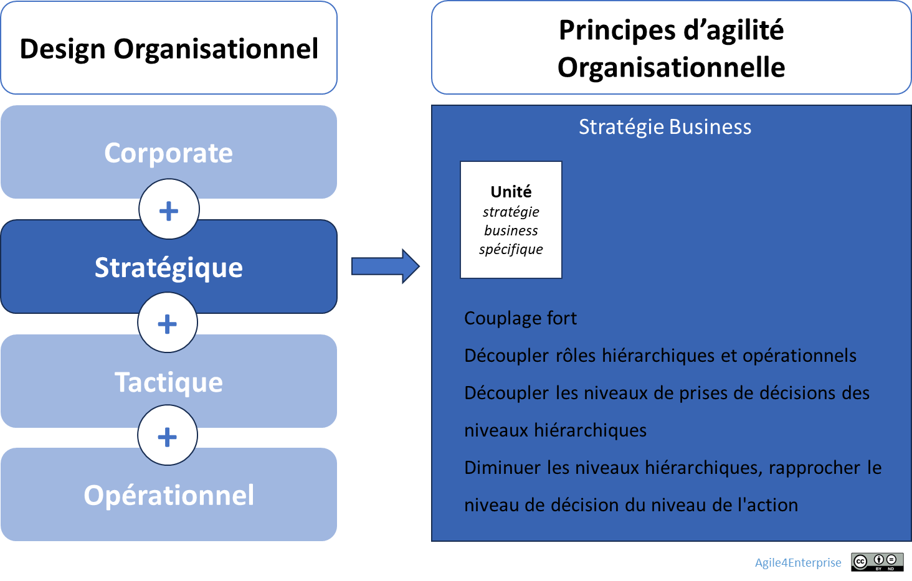
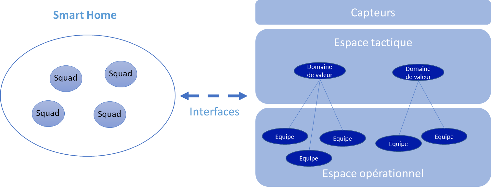

# L’agilité organisationnelle au niveau stratégique

✨**Objectif**

Comment rendre structurellement évolutive votre unité stratégique ?

- Transformer les unités en systèmes capables d’adapter en continu leur modèle opératoire.
- Articuler 8 principes d’architecture organisationnelle.

🧑‍🎓**Ce que vous allez apprendre ici**

- Comment rendre vos structures plus mobiles, autonomes et interopérables ?
- Quels sont les principes de design qui permettent à une organisation de rester alignée tout en changeant ?

📚**Petit lexique**

- **Unité stratégique** = mini entreprise autonome ayant son propre compte de résultat, sa stratégie, son modèle d’affaires.
- **Couplage fort/faible** = degré d’interdépendance entre unités.
- **Équipe** = petite équipe multidisciplinaire dédiée.
- **Archétype organisationnel** = structure dominante d’une unité selon son besoin stratégique (flux, produit, projet, réseau).

## Les 8 principes du design organisationnel stratégique

➿**TechNova**

**L’IA en pleine exploration**

En janvier, le département **Smart Home** voit un de ses prototypes d’analyse prédictive échouer :

- Les data scientists travaillent en silo,
- La revue n’a lieu que deux fois par an,
- La BU Capteurs bloque toute tentative d’intégration.

> En trois mois, la stratégie était devenue obsolète. En un semestre, l’organisation l’avait enterrée.

Les tensions sont réelles :

| Tension | Ce qui existe |
| --- | --- |
| Rigidité ⇄ Flexibilité | Cycle budgétaire annuel |
| Autonomie ⇄ Alignement | Référentiel commun imposé |
| Couplage faible ⇄ Couplage fort | Logique de silo historique |
| Supervision ⇄ Ajustement mutuel | Gouvernance purement hiérarchique |

Le responsable IA décide alors de refondre l’unité.

TechNova peut appliquer ces huit principes :

### 1. Autonomie stratégique

Une unité fonctionne comme une mini-entreprise quasi autonome, plutôt qu’en service « spécialisé », avec :

- Un compte de résultat propre,
- Un modèle d’affaires spécifique,
- Des décisions locales,
- Un alignement sur le groupe.

Elle rassemble des activités partageant un même positionnement et nécessitant une cohérence forte. C’est le lieu où l’expérience sera accumulée, l’expertise pourra se développer, et les capacités de l’organisation affinées.

> L’agilité corporate garantit le cadre, le niveau stratégique rend chaque unité autonome ET intégrée.

### 2. Couplage

- Faible entre unités.
- Fort en leur sein : les équipes doivent suivre rapidement les ajustements stratégiques.
- Gestion explicite des dépendances essentielles.

### 3. Conception de l’extérieur vers l’intérieur

- Structure alignée sur des **domaines métier** ou **chaînes de valeur**.
- Surface maximisée en contact entre les équipes et les sources du changement.

### 4. Mix organisationnel et archétypes

- Chaque unité choisit sa structure dominante (cf. les archétypes organisationnels) :
  - **Flux** (efficacité opérationnelle),
  - **Produit** (extensibilité marché),
  - **Projet** (innovation guidée),
  - **Réseau** (innovation distribuée).
- Ce choix évolue selon la zone stratégique (**Agile4E**).
- Les transitions entre phases sont outillées.

### 5. Organisation duale = système formel + réseau informel

On ne répond pas au changement par une structure rigide. Mais par une articulation explicite entre :

- **Système formel** → organigramme, supervision directe, optimisation globale, stratégie délibérée.
- **Réseau informel** → ajustement mutuel, adaptation locale, approche émergente.

Le réseau informel permet d’expérimenter aujourd’hui une organisation qui influencera la structure formelle de demain.

### 6. Hiérarchie minimale

**Objectif** : Raccourcir les circuits de décision.

- Responsabilisation directe au plus proche de l’action. Élimination des fonctions de contrôle superflues, en instaurant une culture de confiance
- Le management arbitre les zones de tension et les exceptions
- On ne conçoit pas selon un organigramme type, mais par les décisions : la complexité croissante aplatit l’organisation afin d’ouvrir un accès direct à la direction.

### 7. Mobilité tactique et reconfigurabilité

**Objectif** : réallocation continue des talents selon les besoins stratégiques :

- Les équipes se déplacent entre les unités tactiques,
- Les managers changent de périmètre régulièrement,
- Les rôles évoluent.

> La structure fournit un repère permettant de se réorganiser vite.

### 8. Décentralisation et feed-back

**Objectif** : Développer la capacité à faire remonter des signaux faibles vers le niveau corporate.

- Prises de décisions proches du terrain,
- Boucles de feed-back courtes.

➿**TechNova**

**Les 8 principes… en friction** :

> *« On n’a pas changé l’organigramme, mais la façon dont chaque unité incarne sa stratégie. » — responsable de la transformation TechNova*

Le tableau ci-dessous illustre comment TechNova a mis en œuvre ces 8 principes, et ce que ça a produit ou perturbé.

| Principe | Les arbitrages TechNova IA |
| --- | --- |
| **Autonomie** | Budget « Innovation IA » alloué trimestriellement par le COMEX, sans arbitrage des projets. |
| **Couplage** | Le développement d’API standardisées a été réalisé avec le département des capteurs et les équipes d’IA-Produit.|
| **Extérieur vers l’intérieur** | Atelier bimensuel avec clients pilotes pour valider chaque nouveau prototype |
| **Archétypes** | Passage du mode « réseau » (POC rapide) à « produit » (industrialisation) |
| **Organisation duale** | Comité IA pour le système formel et guildes Data pour le réseau informel|
| **Hiérarchie minimale** | Équipe IA reportant directement au responsable Smart Home, sans niveaux intermédiaires |
| **Mobilité** | Data engineers détachés temporairement vers la BU Plateforme pour codévelopper les API IA |
| **Boucles de feed-back** | OKR trimestriels et retours clients bimensuels |

## Ce que cette approche peut déclencher

Même bien orchestrée, une agilité organisationnelle peut produire des effets secondaires indésirables. La mobilité permanente et la redéfinition constante des rôles peuvent mener à un épuisement organisationnel, où les repères se brouillent et les talents se désengagent. La multiplication des boucles, instances et rôles non formalisés engendre une complexité invisible, qui rend le système illisible et bloque parfois la décision. Lorsque la réussite des unités dépend trop du style de leurs dirigeants, une dépendance au management apparaît, rendant l’agilité inégale et fragile. Enfin, la responsabilisation excessive des équipes, qui doivent s’ajuster, prendre des décisions et faire preuve de souplesse en continu, augmente la charge mentale.

> Un système agile qui ne se régule pas avec ses propres acteurs finit par produire ses fragilités.

## Ce que cette approche ne voit pas toujours

L’agilité pensée comme un système vivant peut sous-estimer certains invariants humains :

- L’ancrage culturel reste un facteur déterminant : certaines pratiques, comme le pilotage annuel ou une hiérarchie visible rassurent et, si elles sont ignorées, peuvent provoquer un rejet ou un sabotage implicite,
- Reconfigurer une unité signifie redistribuer du pouvoir : un acte qui nourrit inévitablement enjeux politiques, conflits latents, jeux d’influence et freins passifs.
- Prendre en compte que les équipes n’avancent pas au même rythme, sinon un fossé s’installe entre pionniers et suiveurs.

> L’agilité structurelle ne doit pas oublier qu’elle s’implante dans un territoire humain — fait d’histoires, de statuts et de fragilités.

## 👣 Et concrètement, lundi matin ?

Organisez une séance de travail avec le CODIR pour tester votre design actuel :

1. **Challenger le statu quo**

    - Remettez en question chaque partie de l’organisation : quels services existent par inertie ?

2. **Placer le client dans la boucle**

    - Qui détient aujourd’hui la voix du client ? Comment la partager ?
    - Comment raccourcir la distance entre feed-back et décision ?

3. **Traduire la stratégie en flux de valeur**

    - L’organigramme reflète-t-il une ligne hiérarchique ou un flux de création de valeur ?
    - Comment remodeler les équipes pour qu’elle remonte naturellement vers le CODIR ?

Activez un principe dès demain :

- Transformez un point de tension en OKR de transformation,
- Cadrez un rituel mensuel de suivi de la progression,
- Demandez à une personne externe (coach, DRH, pair) de challenger le processus.

> Ne cherchez pas à tout redessiner. Testez un principe. En tension.

## 🔑 Points clés à retenir

> L’agilité stratégique, c’est concevoir une organisation capable de se transformer en continu.

- Une unité stratégique n’est pas une boîte figée.
- Chaque principe activé produit un coût (friction, désalignement temporaire, apprentissage).
- Ce n’est pas leur addition, mais leur orchestration qui produit l’agilité réelle.

