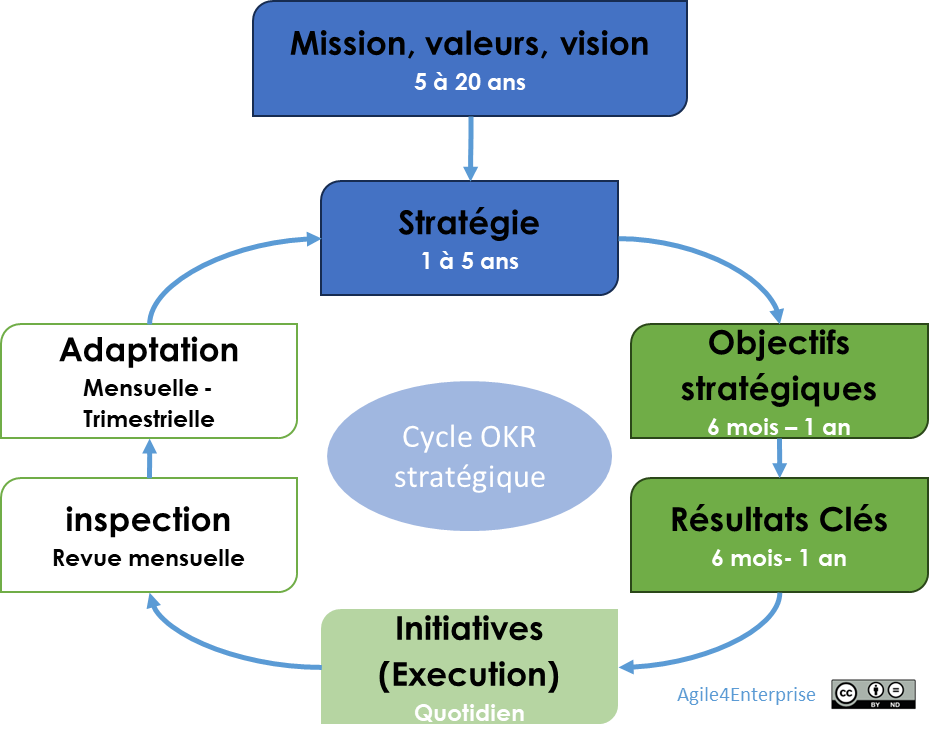

# L’agilité stratégique en action

✨ **Objectif** Déployer une agilité stratégique à travers un **cadre de pilotage intégré**, **synchronisé** et **cadencé**, pour aligner en continu la stratégie, l’exécution et l’apprentissage collectif. Ce chapitre met en lumière les outils concrets activant ce pilotage adaptatif.

➿ **Pourquoi c’est vital ?** > “On avait les bonnes intentions. Mais on tournait en rond. Tout le monde pilotait... mais rien ne bougeait.” — Dirigeant TechNova > En 2023, la stratégie IA de TechNova échoue à produire de l’impact, malgré une ambition claire. En cause : pas d’outils de pilotage intégrés, des arbitrages déconnectés, et une gouvernance incapable de synchroniser intention et exécution. **Ce chapitre présente ce qui aurait tout changé.**

# **Outiller un pilotage stratégique vivant**

L’agilité stratégique selon Agile4Enterprise n’est pas une méthode figée, mais un **système** articulé autour de trois couches d’outils :

- **Modèles de lecture** pour diagnostiquer et structurer la réflexion,
- **Outils de transformation** pour engager et piloter le changement,
- **Outils d’exécution** pour faire vivre la stratégie dans les décisions du quotidien.

Ces outils sont conçus pour fonctionner en **boucle adaptative**, calée sur les **cadences de gouvernance stratégique**.

## Modèles d’analyse stratégique

### Modèle 4E

- 4 zones : Exploration, Expansion, Exploitation, Exclusion.
- Permet de cartographier la stratégie comme un portefeuille dynamique.
- Sert à piloter la synchronisation entre les unités et les modèles d’affaires.

### Modèle 3R

- Trois types de réponse stratégique : Réajuster, Réorienter, Réinventer.
- Permet de choisir le bon levier d’intervention sur chaque unité stratégique.

> En pratique : le 4E permet de voir, le 3R permet de décider.
> 

## Outils de transformation stratégique

### IMPACTE

- Diagnostic de maturité stratégique adaptative.
- Identifie les capacités et blocages systémiques d’une unité stratégique.
- Sert à construire un plan de transformation par paliers.

### ACTE

- Canevas central d’alignement : Vision – Modèle opératoire – Objectifs (OKR).

➿ Chez TechNova, ACTE est devenu un des éléments visuels de la war-room IA.

### Archétypes organisationnels

- 4 formes d’agilité incarnées dans l’organisation : Projet%2013490eaf28ff8030a8aeecf9206d94ea.md), Produit, Réseau, Flux.
- Aident à choisir les **formes organisationnelles** qui incarnent le mieux la stratégie.
- Chaque unité peut naviguer entre archétypes selon sa dynamique.

### Le coach agile d’organisation, l’architecte de l’agilité stratégique

- Anime les revues ACTE et les diagnostics IMPACTE.
- Connecte les signaux terrain aux arbitrages stratégiques.
- Font vivre la boucle stratégique au sein de l’unité.

**Impact :** la transformation cesse d’être top-down. Elle devient dialogique, partagée, incrémentale.

► Sans ce rôle, les outils deviennent théoriques. Avec lui, ils deviennent système vivant.

## Outils d’exécution stratégique

### PACTE

- Pilotage du portefeuille stratégique.
- Cadre de revue des arbitrages, des cycles budgétaires, des ressources.
- Permet une exécution alignée et un pilotage par l’impact.

## Le cycle OKR stratégique

Le cycle OKR stratégique

- Cadence annuelle avec revues mensuelles.
- Cadre d’alignement entre l’intention stratégique et l’adaptation continue.
- Articulés avec les revues PACTE, les décisions budgétaires et les cycles tactiques.

C’est un outil clé de l’agilité stratégique pour assurer un alignement dynamique et un suivi efficace des objectifs stratégiques.

📚 En savoir plus sur les OKR dans notre wiki

## Ce que produit malgré soi une agilité stratégique mal outillée

- Un 4E non revisité devient une grille de reporting.
- Un ACTE figé devient un PowerPoint d’intention sans impact.
- Des OKR stratégiques non animés deviennent des promesses sans lien avec l’exécution.
- Une gouvernance sans transformation devient une roue qui tourne à vide.

## Ce que cette approche ne voit pas toujours

- **Le poids des croyances stratégiques implicites** (culture, territoire, pouvoir).
- **Le besoin de rituels de stabilisation** pour certaines fonctions.
- **Le risque d’épuisement stratégique** : trop de boucles sans respiration.

> L’agilité stratégique demande autant d’art que de méthode.
> 

---

## Et concrètement, lundi matin ?

- Cartographiez votre portefeuille avec le modèle 4E.
- Positionnez vos décisions dans la grille 3R.
- Liez vos arbitrages ACTE avec vos OKR.
- Scannez votre maturité stratégique avec IMPACTE.
- Synchronisez vos cycles budgétaires et de gouvernance.

---

#