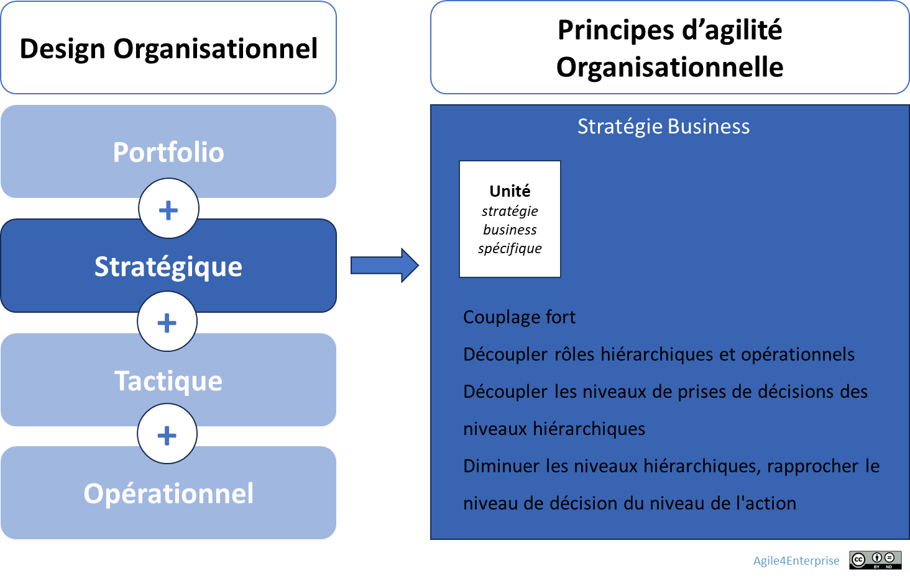

# L’agilité organisationnelle au niveau stratégique

✨ **Objectif** Comment rendre structurellement évolutive votre unité stratégique ? - Transformer les unités en **système** capables d’adapter en continu leur modèle d’affaires et leurs modes opératoires. - Articuler **8 principes d’architecture organisationnelle**.

🧑‍🎓 **Ce que vous allez apprendre** - Comment rendre vos structures plus **mobiles**, **autonomes** et **interopérables**. - Quels sont les **8 principes de design stratégique** qui permettent à une organisation de rester alignée tout en changeant.

📚 **Petit lexique** - **Unité stratégique** = mini-entreprise autonome compte de résultat, stratégie, modèle d’affaires). - **Couplage fort/faible** = degré d’interdépendance entre unités. - **Squad** = petite équipe multidisciplinaire dédiée. - **Archétype organisationnel** = structure dominante d’une unité selon son besoin stratégique (flux, produit, projet, réseau). - **OKR** = Objectives & Key Results.

# Une structure stratégique vivante

Agilité organisationnelle au niveau stratégique

## **Les 8 principes du design organisationnel stratégique**

➿ **TechNova IA en pleine exploration** En janvier, la BU IA de TechNova voit un des ses prototypes d’analyse prédictive échouer : - Les data scientists travaillent en silo. - La revue stratégique n’a lieu que deux fois par an. - La BU Capteurs bloque toute tentative d’intégration. > En trois mois, la stratégie était devenue obsolète. En six mois, l’organisation l’avait enterrée. > Les tensions sont réelles : | Tension | Ce qui existe | | --- | --- | | Rigidité vs Flexibilité | Cycle budgétaire annuel | | Autonomie vs Cohérence | Référentiel commun imposé | | Couplage faible vs Fort | Logique de silo historique | | Supervision vs Ajustement mutuel | Gouvernance purement hiérarchique | Le responsable IA décide alors de **refondre l’unité**.

Pour piloter ces tensions et parce que chaque unité stratégique n’est pas qu’un silo à redécouper, Technova peut appliquer ces huit principes :

### 1. **Autonomie stratégique**

Une unité stratégique est une mini-entreprise quasi autonome, pas un service "spécialisé", avec :

- Un compte de résultat propre,
- Un modèle d’affaires spécifique,
- Des décisions stratégiques locales,
- Un alignement sur un cap corporate partagé.

Elle regroupe des activités partageant un **même positionnement stratégique** et nécessitant une **cohérence organisationnelle forte**. C’est le lieu où l'expérience sera accumulée, l’expertise pourra se développer, et les capacités de l'entreprise affinées et développées.

> L’agilité corporate garantit le cadre. L’agilité stratégique rend chaque unité autonome ET intégrée.
> 

### 2. **Couplage fort tactique, couplage faible stratégique**

- Faible interdépendance stratégique entre unités.
- Coopération étroite à l’intérieur (ex. squads multi-métier, synchronisation court terme).
- Interfaces claires, gestion explicite des dépendances.

> La diversité stratégique repose sur une interopérabilité bien conçue.
> 

### 3. **Conception de l’extérieur vers l’intérieur**

- Organisation conçue à partir du **flux de valeur externe** (clients, marché, usage).
- Structure alignée sur des **domaines métier (ou valeur)** (dans une logique produit) ou **chaînes de valeur** (dans une logique flux).
- Maximiser la **surface en contact avec la source du changement**.

> Une organisation se conçoit depuis la demande, pas depuis l’organigramme.
> 

### 4. **Mix organisationnel et archétypes évolutifs**

- Chaque unité stratégique choisit sa structure dominante (cf. les archétypes organisationnels) :
    - **Flux** (efficacité opérationnelle),
    - **Produit** (scalabilité marché),
    - **Projet** (innovation guidée),
    - **Réseau** (innovation distribuée).
- Le choix n’est pas figé : il évolue selon la zone stratégique (modèle 4E).
- Les transitions entre archétypes sont outillées, pas subies.

🧰 Découvrir comment ce design stratégique se décline selon les 4 archétypes agiles : projet%2013490eaf28ff8030a8aeecf9206d94ea.md), produit, flux, et réseau

### 5. **Organisation duale = système formel+ réseau informel**

> On ne répond pas au changement par une structure rigide.
> 
- Articulation explicite entre :
    - **Système formel → Supervision directe, optimisation globale, stratégie délibérée, adaptabilité.**
    - **Réseau informel → Ajustement mutuel, adaptation locale, stratégie émergente, réactivité et flexibilité.**
- L’un cadre, l’autre adapte.

Le réseau informel permet d'expérimenter une organisation qui influencera la structure formelle de demain. Mais miser uniquement sur ce réseau informel pour initier le changement est une **limite des Frameworks d’agilité à l’échelle**, cela limite l’agilité stratégique.

### 6. H**iérarchie minimale et accélération décisionnelle**

**Objectif :** Raccourcir les circuits de décision pour accroître la réactivité organisationnelle.

- Responsabilisation directe au plus proche de l’action. **Elimination des fonctions de contrôle superflues**, en instaurant une culture de **confiance et de responsabilisation.**
- Le management est nécessaire pour arbitrer sur les zones de tension.

> On structure selon la complexité des décisions, pas selon un organigramme type
> 

### 7. **Mobilité tactique et reconfigurabilité**

**Objectif :** réallocation continue des talents selon les besoins stratégiques :

- Les équipes se **déplacent entre les unités tactiques**.
- Les managers changent de périmètre régulièrement.
- Les rôles sont évolutifs.

> La structure fournit un repère permettant de se réorganiser vite.
> 

### 8. **Décentralisation et feedback**

**Objectif :** Décisions locales, boucles courtes d’apprentissage et feed-back vers le portfolio.

- Prises de décision proches du terrain.
- Boucles de feedback courtes (OKR, revues, dashboards).
- Capacité à faire remonter signaux faibles vers le niveau corporate.

➿ **Technova : Les 8 principes… en friction** > “On n’a pas changé l’organigramme. On a changé la façon dont chaque unité habite sa stratégie.” — Responsable transformation TechNova >  Le tableau ci-dessous illustre comment TechNova a activé ces 8 principes — et ce que ça a produit ou perturbé. | Principe | Les arbitrages TechNova IA | Risque si ignoré | | --- | --- | --- | | **Autonomie stratégique** | Budget « Innovation IA » alloué trimestriellement par le COMEX, sans arbitrage des projets. | Arbitrages interminables, paralysie décisionnelle | | **Couplage ajusté** | APIs standardisées avec la BU Capteurs + squads IA-Produit intégrées | Blocage des projets IA par dépendances non maîtrisées | | Extérieur vers l’intérieur | Workshops bimensuels avec clients Pilotes pour valider chaque nouveau prototype | Développement non aligné aux vrais besoins du marché | | **Archétypes évolutifs** | Passage du mode « réseau » (POC rapide) au mode « produit » (industrialisation) | Rigidité, incapacité à évoluer vers l’échelle | | **Organisation duale** | Comité IA (stratégie formelle) + guildes Data Science (ajustement informel hebdomadaire) | Décalage entre décision et réalité terrain | | **Hiérarchie minimale** | Squads IA reportant directement au responsable IA, sans niveaux intermédiaires | Goulots d’arbitrage, lenteur accrue | | **Mobilité tactique** | Data engineers détachés temporairement vers la BU Plateforme pour co-développer les API IA | Équipes figées, sous-utilisation des talents | | **Boucles de feedback courtes** | OKR hebdomadaires sur dashboard partagé et retours clients intégrés en temps réel | Stratégie déconnectée des signaux du marché |

💡 **Ce n’est pas seulement la stratégie qui change, mais l’organisation qui s’adapte en conséquence**. L’agilité stratégique est un système vivant, pas une couche méthodologique.

### Ce que cette approche **peut déclencher**

Même bien orchestrée, une agilité organisationnelle vivante peut générer des effets secondaires non désirés :

| Effet produit | Description | Risque latent |
| --- | --- | --- |
| **Épuisement organisationnel** | Mobilité permanente, redéfinition constante des rôles, pression adaptative élevée. | Perte de repères, désengagement des talents. |
| **Complexité invisible** | Multitude de boucles, d’instances, de rôles évolutifs non formalisés. | Illisibilité du système, blocage de la prise de décision. |
| **Dépendance au leadership local** | Réussite des unités trop liée à un manager visionnaire. | Agilité inégalement répartie, fragilité du modèle. |
| **Hyper-responsabilisation** | Les équipes doivent ajuster, décider, pivoter sans relâche. | Charge mentale excessive, dilution des responsabilités. |

> Un système agile qui ne s’autorégule pas avec les acteurs de ce dernier produit ses propres fragilités.
> 

### Ce que cette approche **ne voit pas toujours**

L’agilité organisationnelle, pensée comme design vivant, peut sous-estimer certains invariants humains ou politiques :

| Angle mort | Pourquoi il compte | Risque si ignoré |
| --- | --- | --- |
| **L’ancrage culturel** | Certaines pratiques (pilotage annuel, hiérarchie visible) sont rassurantes. | Rejet culturel, sabotage implicite. |
| **Le besoin de stabilité rituelle** | Les fonctions support et corporate ont besoin de repères fixes. | Crise de synchronisation avec le reste de l’organisation. |
| **Les enjeux politiques** | Reconfigurer une unité, c’est redistribuer du pouvoir. | Conflits larvés, guerre d’influence, freins passifs. |
| **L’inégalité des rythmes d’appropriation** | Toutes les équipes n’apprennent pas à la même vitesse. | Clivage interne, fracture entre pionniers et suiveurs. |

> L’agilité structurelle ne doit pas oublier qu’elle s’implante dans un territoire humain — fait d’histoires, de statuts et de fragilités.
> 

## 👣 Et concrètement, lundi matin ?

**Organisez une séance de travail avec le CoDir pour tester votre design.**

1. **Challenger le statu quo**

- Quelle partie de l’organisation n’a jamais été repensée ?
- Quels services existent par inertie ?

2. **Mappez les points de friction**

- Où sont les dépendances non dites ?
- Où se perd la valeur entre client et décision ?

3. **Placer le client dans la boucle**

- Comment raccourcir la distance entre feedback client et décision ?
- Qui détient aujourd’hui le signal client ? Comment le partager ?

4. **Traduire la stratégie en flux de valeur**

- Notre organigramme reflète-t-il une ligne hiérarchique ou un flux de création de valeur ?
- Comment réorganiser les équipes pour que la valeur **remonte naturellement** vers le CoDir ?

**Activez 1 principe dès demain**

- Choisissez **1 point de tension** à adresser sous forme d’OKR de transformation.
- Cadrez un **rituel hebdomadaire de suivi de la progression**.
- Demandez à une personne externe (coach, DRH, pair) de **challenger le processus en continu**.

> Ne cherchez pas à tout redessiner. Testez un principe. En tension.
> 

---

#