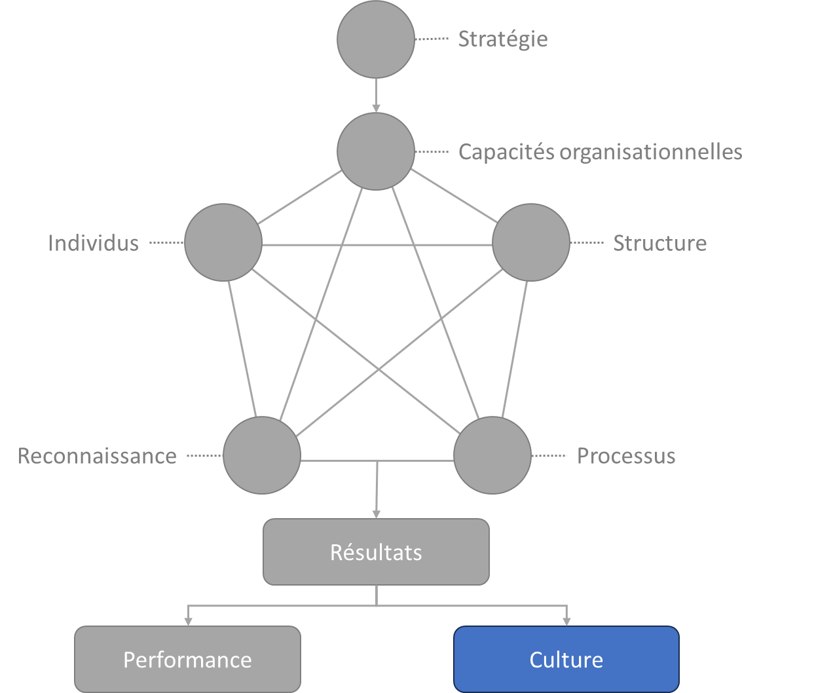

# L’agilité RH et culture agile

Propriétaire: Laurent Morisseau

- Sommaire

<aside>
✨

**Objectif**

L’**agilité RH** vise à adapter les pratiques de gestion des talents aux réalités changeantes des entreprises. Elle s’aligne avec les principes généraux de l’agilité d’entreprise pour assurer une meilleure **réactivité, flexibilité, adaptabilité et proactivité** des collaborateurs.

L’objectif est d’intégrer la gestion des ressources humaines dans une approche agile globale, permettant à l’entreprise de s’adapter rapidement aux transformations stratégiques et opérationnelles.

Enfin, nous allons décliner la [culture par archétype agile](https://www.notion.so/Les-mod-les-organisationnels-une-approche-culturelle-15e90eaf28ff8007833ff2ce6c1bcea7?pvs=21).

</aside>

# Les principes de l’agilité RH

<aside>
💡

**L’Agilité RH** ne se résume pas à une simple adaptation des processus de gestion des talents : elle constitue un levier stratégique pour aligner le capital humain avec l’évolution dynamique des organisations. S’inscrivant dans une approche d’**agilité d’entreprise**, elle favorise une culture organisationnelle réactive et apprenante.

</aside>

Loin d’être un ensemble de pratiques isolées, l’agilité RH repose sur une **cohérence systémique**, intégrant les dimensions stratégiques, tactiques et opérationnelles pour soutenir la transformation continue de l’entreprise.

## **Objectifs de l’Agilité RH**

1. **Favoriser la réactivité et l’adaptabilité des collaborateurs** face aux mutations du marché, en facilitant la mobilité stratégique et l’apprentissage organisationnel.
2. **Développer un environnement apprenant** en encourageant l’émergence d’une culture de l’apprentissage continu, où les formations et les trajectoires professionnelles évoluent en fonction des besoins réels des équipes et des objectifs stratégiques.
3. **Repenser les structures organisationnelles** pour renforcer l'autonomie et la prise de décision au plus près du terrain, tout en favorisant la transversalité des compétences.
4. **Optimiser la gestion des talents et la rétention** en adaptant les processus de recrutement, d’évolution de carrière et de reconnaissance aux attentes des nouvelles générations et aux exigences d’un environnement incertain.

## **Rôles clés de l’Agilité RH**

### **Le responsable RH agile comme catalyseur de transformation**

Le rôle des RH ne se limite plus à l’administration du personnel, mais devient un **facilitateur stratégique** de l’agilité organisationnelle :

- Il coconstruit des environnements de travail propices à l’expérimentation et à l’innovation.
- Il impulse des dynamiques collaboratives favorisant l’engagement et la responsabilisation des équipes.
- Il accompagne les managers agiles dans la diffusion et la pérennisation des pratiques agiles au sein des équipes.

### **Le management agile comme relais opérationnel**

L’agilité RH repose également sur un **partenariat étroit avec les managers** qui, en tant que relais de l’agilité, contribuent à fluidifier les interactions entre les équipes et à renforcer l’alignement stratégique.

## **Définition de l’identité organisationnelle : un levier stratégique**

L’**identité organisationnelle** joue un rôle clé dans la gestion du changement et la cohésion interne. Elle ne se limite pas à la mission et aux valeurs de l’entreprise : elle doit être incarnée dans des pratiques managériales et RH alignées avec la vision stratégique.

L’agilité RH contribue ainsi à **renforcer l’alignement entre la raison d’être de l’entreprise et son design organisationnel**, en favorisant des modèles de gestion **agiles.**

## **Intégration avec le Framework Agile4Entreprise**

L’agilité RH ne peut être considérée indépendamment du reste de l’organisation. Elle s’inscrit dans un cadre systémique qui articule **agilité stratégique, tactique et opérationnelle** :

- [**Agilité stratégique**](https://www.notion.so/L-agilit-strat-gique-13490eaf28ff80e2b4d8f6ab581de0f3?pvs=21) : Les RH participent à la transformation des modèles organisationnels et à la gestion des compétences critiques pour soutenir l’adaptabilité de l’entreprise.
- [**Agilité tactique**](https://www.notion.so/L-agilit-tactique-13490eaf28ff806cb428d9b27abb1f82?pvs=21) : Elles accompagnent la mise en place d’une gouvernance distribuée, où les décisions clés en matière de talents et de développement sont prises au plus près des enjeux terrain, notamment avec des OKR tactiques.
- [**Agilité opérationnelle**](https://www.notion.so/L-agilit-op-rationnelle-13490eaf28ff80e5b767fd273784c80b?pvs=21) : Elles soutiennent la fluidification des interactions entre équipes et la mise en place de pratiques favorisant l’intelligence collective et la performance adaptative.

## **L’agilité RH comme levier de transformation durable**

Loin d’être une simple évolution des pratiques RH, l’agilité RH est un **vecteur de transformation organisationnelle profonde**. En intégrant les principes de l’agilité d’entreprise, elle devient un **moteur d’alignement stratégique**, favorisant la capacité collective de l’organisation à naviguer dans l’incertitude et à capter de nouvelles opportunités.

<aside>
📚

Pour une vision plus exhaustive de l’[Agilité RH](https://www.notion.so/L-agilit-RH-pour-une-culture-agile-14990eaf28ff802a9188c36520f71bf9?pvs=21)

</aside>

---

# La culture

## La culture de la transformation durable

Développer une capacité de transformation durable implique bien plus que l’ancrage dans des processus ou des méthodologies. Il s’agit avant tout d’un phénomène **culturel**, inscrit dans les comportements, les interactions et les rituels organisationnels. Ces éléments constituent la partie visible de la culture d’une entreprise, en écho au modèle CSSC d’Edgar Schein.

Cependant, ce modèle offre une **photographie statique** de la culture organisationnelle, alors que la transformation implique un mouvement continu. La culture n’est pas un état figé, mais un **processus vivant**, émergent des interactions sociales. Elle évolue en permanence sous l’effet des dynamiques internes et des ajustements nécessaires pour répondre aux incertitudes et aux défis de l’environnement.

Transformer une culture, c’est accepter d’évoluer dans un cadre **non déterministe**, où la complexité et l’incertitude sont inhérentes. **Nous modifions la culture pour mieux affronter l’incertitude, tout en générant de nouvelles formes d’incertitude et de complexité** en retour. Ce paradoxe souligne l’importance d’une approche adaptative de la transformation, qui ne cherche pas à imposer un état final, mais à cultiver des mécanismes d’évolution continue.

## **Les aptitudes culturelles clés de la transformation**

Le think tank KTr[1](https://www.notion.so/L-agilit-RH-et-culture-agile-13490eaf28ff80d5955dd24b80af5cff?pvs=21) a identifié les **compétences culturelles fondamentales** qui permettent aux organisations de réussir leur transformation. Ces aptitudes ne sont pas indépendantes, mais s’inscrivent dans une **dynamique de transition**, où chaque étape du processus de transformation influence et nourrit la suivante.

Une organisation qui maîtrise sa transformation ne se limite donc pas à ajuster ses pratiques ; elle développe une culture **récursive et évolutive**, où l’adaptabilité devient une compétence collective essentielle.

1. **Comprendre et diagnostiquer**
    - Analyser la culture et l’état d’esprit en place, au-delà des valeurs déclarées.
    - Identifier croyances, pratiques et influences culturelles.
    - Se remettre en question et s’inspirer de l’interne et de l’externe.
2. **Prendre conscience et activer le changement**
    - Sensibiliser à la nécessité du changement et à ses enjeux.
    - Créer un sentiment d’urgence et une dynamique collective.
    - Favoriser l’appropriation du changement à tous les niveaux.
3. **Coconstruire la transformation**
    - Déconstruire l’existant pour reconstruire un état souhaité.
    - Modifier les rituels, symboles et systèmes organisationnels.
    - Encourager le dialogue et l’expérimentation.
4. **Donner du sens et fixer une direction**
    - Définir une vision claire et cohérente avec l’identité de l’organisation.
    - Articuler les bénéfices attendus et les ancrer dans les pratiques.
    - Relier passé, présent et futur pour fédérer les équipes.
5. **Engager et mobiliser les équipes**
    - Stimuler l’initiative et responsabiliser les acteurs du changement.
    - Capitaliser sur les talents internes et renforcer la motivation.
    - Appuyer sur des relais de transformation pour diffuser l’énergie.
6. **Impliquer et aligner le management**
    - Expliciter les risques du statu quo et renforcer la résilience face à l’incertitude.
    - Favoriser l’alignement et l’incarnation du changement par les dirigeants.
    - Mobiliser la ligne managériale pour porter la transformation.

Ce cadre permet d’ancrer durablement la capacité de transformation de l’organisation.

## La culture Agile

La culture, un résultat de la stratégie et du modèle opératoire, adapté du modèle STAR de Galbraith

### **Une approche systémique de l’Agilité d’Entreprise**

<aside>
🧑‍🎓

**Rappel du modèle STAR d’alignement stratégique**

Le point d’entrée de ce modèle est la stratégie. Les leviers d’actions sont les cinq dimensions (capacité organisationnelle, structure, processus, reconnaissance et individus). Les résultats en sortie sont deux comportements ou (propriétés) émergentes du système entreprise : la performance et la culture. L’un comme l’autre ne se décrète pas mais se constate et est le résultat de toutes nos actions.

</aside>

L’alignement entre **stratégie, culture et organisation** est essentiel pour bâtir une entreprise véritablement agile. S’appuyant sur le **modèle STAR d’alignement stratégique**, cet alignement ne repose pas uniquement sur des processus ou des structures formelles, mais aussi sur des **comportements émergents** qui façonnent la culture de l’entreprise.

Dans ce cadre, **l’Agilité RH** joue un rôle clé en traduisant la culture agile à travers des **archétypes organisationnels**, en phase avec les différentes **logiques culturelles** qui structurent une entreprise.

<aside>
🧑‍🎓

**Archétype organisationnel** 

Un **archétype organisationnel** est un modèle conceptuel qui représente une configuration récurrente de structures, de processus et de comportements dans les organisations.

Ces archétypes permettent de comprendre comment les entreprises fonctionnent, prennent des décisions et interagissent avec leur environnement.

</aside>

Dans le cadre du Framework Agile4Enterprise, nous avons identifiés [4 archétypes](https://www.notion.so/Les-4-arch-types-agiles-14290eaf28ff8004874de93022c243f8?pvs=21) incarnant l’agilité : [Projet](https://www.notion.so/Agile4Project-Arch-type-Projet-agile-13490eaf28ff8030a8aeecf9206d94ea?pvs=21), [Produit](https://www.notion.so/Agile4Product-Arch-type-Produit-13490eaf28ff80b29733f767568ab6a5?pvs=21), [Flux](https://www.notion.so/Agile4Flow-Arch-type-Flux-13490eaf28ff809bac54ed5deaa8a257?pvs=21) et [Réseau](https://www.notion.so/Agile4Network-Arch-type-R-seau-13490eaf28ff805c8fcfeed28b68a77b?pvs=21).

### **Alignement des archétypes agiles avec les logiques culturelles**

A*daptée du modèle de Quinn et Rohrbraugh*

L’agilité ne peut être dissociée de la culture d’entreprise. Pour comprendre comment une organisation peut adopter une approche agile durablement, il est essentiel d’aligner son modèle opératoire avec son **identité organisationnelle** et son **mode de fonctionnement interne**. C’est le rôle de l’**agilité RH**. Et dans ce cadre, le véritable apport de notre Framework est de décliner la culture agile par archétype agile.

Le **modèle des valeurs en compétition** de **Quinn et Rohrbaugh** permet d’identifier quatre grandes logiques culturelles dans les entreprises, en fonction de deux axes :

- **Axe vertical :** Flexibilité ↔ Contrôle (structure organisationnelle).
- **Axe horizontal :** Focus interne ↔ Focus externe (priorités stratégiques).

En croisant ce modèle avec les **quatre archétypes agiles** - [Flux](https://www.notion.so/Agile4Flow-Arch-type-Flux-13490eaf28ff809bac54ed5deaa8a257?pvs=21), [Projet](https://www.notion.so/Agile4Project-Arch-type-Projet-agile-13490eaf28ff8030a8aeecf9206d94ea?pvs=21), [Réseau](https://www.notion.so/Agile4Network-Arch-type-R-seau-13490eaf28ff805c8fcfeed28b68a77b?pvs=21), [Produit](https://www.notion.so/Agile4Product-Arch-type-Produit-13490eaf28ff80b29733f767568ab6a5?pvs=21) -, il devient possible d’aligner l’agilité d’entreprise avec les dynamiques culturelles existantes, et de mieux comprendre **les leviers d’adaptation** pour rendre une organisation plus agile.

---

### **Logique de Contrôle & Archétype Flux**

<aside>
💡

**Optimisation des processus, efficience opérationnelle, stabilité**

</aside>

La [logique de **contrôle**](https://www.notion.so/Les-mod-les-organisationnels-une-approche-culturelle-15e90eaf28ff8007833ff2ce6c1bcea7?pvs=21) valorise la structure, l’efficacité et la standardisation. Les organisations qui s’y inscrivent s’appuient sur des **processus disciplinés** pour garantir la continuité et la prévisibilité.

L’[**archétype Flux**](https://www.notion.so/Agile4Flow-Arch-type-Flux-13490eaf28ff809bac54ed5deaa8a257?pvs=21) trouve naturellement sa place dans cette logique. Issu du **Lean et du Kanban**, il vise à **optimiser la chaîne de valeur** en réduisant les gaspillages et en maximisant l’**efficacité opérationnelle,** en assurant une **exécution stable et fiable**.

***Cas d’application :***

- *Entreprises industrielles optimisant leur **chaîne d’approvisionnement**.*
- *Centres de services adoptant des **systèmes de gestion en flux tiré**.*
- *Organisations où la **qualité et la fiabilité des opérations** sont des priorités.*

> L’agilité dans une logique de contrôle passe par l’optimisation des flux de valeur, une adaptabilité de la capacité à la demande, et la responsabilisation des équipes sur la performance opérationnelle.
> 

---

### **Logique de Marché & Archétype Produit**

<aside>
💡

**Compétition, résultats, performance, différenciation**

</aside>

Les entreprises adoptant une [logique de **marché**](https://www.notion.so/Les-mod-les-organisationnels-une-approche-culturelle-15e90eaf28ff8007833ff2ce6c1bcea7?pvs=21) sont centrées sur la **croissance, l’innovation et la performance commerciale**. Leur enjeu majeur est de maximiser leur **impact sur le marché** en développant des **produits compétitifs** et différenciants.

L’[**archétype Produit**](https://www.notion.so/Agile4Product-Arch-type-Produit-13490eaf28ff80b29733f767568ab6a5?pvs=21) correspond parfaitement à cette approche. Il repose sur une **stratégie orientée résultats**, où la gestion de l’innovation, du time-to-market et de l’expérience client sont des éléments clés. L’entreprise optimise son organisation pour **industrialiser et scaler ses produits** tout en restant compétitive.

***Cas d’application :***

- *Entreprises technologiques développant des **produits innovants à forte croissance**.*
- *Startups cherchant un **product-market fit rapide et efficace**.*
- *Organisations focalisées sur la **scalabilité et la croissance**.*

> L’agilité dans une logique de marché repose sur une exécution rapide, l’expérimentation et une capacité d’adaptation aux tendances du marché.
> 

---

### **Logique de Clan & Archétype Projet**

<aside>
💡

**Collaboration, engagement, normes et valeurs partagées**

</aside>

Les organisations adoptant une [**logique de clan**](https://www.notion.so/Les-mod-les-organisationnels-une-approche-culturelle-15e90eaf28ff8007833ff2ce6c1bcea7?pvs=21) favorisent l’esprit d’équipe, la cohésion, la culture du collectif et le leadership participatif. L’organisation fonctionne comme une **communauté soudée**, où la coopération et l’implication des collaborateurs sont des moteurs de la performance. Les décisions sont prises en concertation avec les équipes.

L’[**archétype Projet**](https://www.notion.so/Agile4Project-Arch-type-Projet-agile-13490eaf28ff8030a8aeecf9206d94ea?pvs=21) s’inscrit dans cette approche en mettant en avant des **équipes autonomes**, travaillant sur des initiatives **orientées apprentissage et expérimentation**. Ce modèle privilégie la dynamique de **co-construction et d’innovation en groupe**, où l’objectif est moins la standardisation que la création de valeur émergente.

***Exemples d’application :***

- *Startups et entreprises en phase de **recherche et développement**.*
- *Organisations privilégiant une **culture participative et horizontale**.*
- *Collectifs de travail où **l’intelligence collective** est un levier clé.*

> L’agilité dans une logique de clan repose sur l’autonomie et l’engagement des équipes dans des projets porteurs de sens.
> 

---

### **Logique de Réseau & Archétype Réseau**

<aside>
💡

**Innovation, adhocratie, coopération, ouverture**

</aside>

La [**logique de réseau**](https://www.notion.so/Les-mod-les-organisationnels-une-approche-culturelle-15e90eaf28ff8007833ff2ce6c1bcea7?pvs=21) privilégie l’adaptabilité, l’innovation rapide et les organisations fluides. Les entreprises qui s’y rattachent misent sur la réactivité et la capacité à saisir les opportunités en s’appuyant sur des **écosystèmes ouverts et collaboratifs**.

L’[**archétype Réseau**](https://www.notion.so/Agile4Network-Arch-type-R-seau-13490eaf28ff805c8fcfeed28b68a77b?pvs=21) s’intègre parfaitement dans ce modèle. Il repose sur une **structure décentralisée**, où les équipes sont interconnectées mais autonomes. L’objectif est de développer une **organisation adaptable et évolutive**, capable de capter les opportunités en temps réel.

***Cas d’application :***

- *Incubateurs et accélérateurs de startups.*
- *Organisations favorisant l’**innovation rapide** et les **expérimentations à grande échelle**.*
- *Entreprises en **mode startup interne**, développant des **mini-structures autonomes***
- *Entreprises misant sur un **modèle entrepreneurial ouvert**.*

> L’agilité dans une logique de réseau s’appuie sur une structure adaptable et des équipes autonomes favorisant l’expérimentation et l’innovation.
> 

---

## **Vers une agilité culturelle alignée avec l’entreprise**

L’intégration des **archétypes agiles** dans les **logiques culturelles** permet une **approche ciblée de la transformation agile**. Chaque organisation doit ajuster son modèle opératoire en fonction de **son ADN culturel** et de **son contexte stratégique**.

Plutôt que d’imposer un modèle unique d’agilité, il s’agit de composer avec les dynamiques culturelles existantes et de les orienter progressivement vers une agilité organisationnelle cohérente avec les enjeux stratégiques de l’entreprise.

<aside>
💡

**Une entreprise véritablement agile n’est pas celle qui applique des méthodes agiles, mais celle qui adapte son mode de fonctionnement en alignant stratégie, culture et organisation de manière systémique**.

</aside>

<aside>
📚

En savoir plus sur l’[approche culturelle des modèles organisationnels](https://www.notion.so/Les-mod-les-organisationnels-une-approche-culturelle-15e90eaf28ff8007833ff2ce6c1bcea7?pvs=21)

</aside>

---

## **Un mix organisationnel : Clé de la performance et de l’agilité contextualisée**

### **Une approche contextualisée de l’agilité**

<aside>
💡

Le choix d’une stratégie pour une unité d’affaires impacte directement son modèle opératoire et, par extension, sa culture organisationnelle. Une entreprise ayant un **portefeuille d’activités diversifiées** doit composer avec différentes **logiques culturelles et organisationnelles**. Cela implique des approches RH différenciées, adaptées à chaque contexte.

</aside>

Dans ce cadre, **l’uniformisation des pratiques agiles peut devenir une contrainte**, alors que la véritable **agilité organisationnelle repose sur la diversité et l’adaptation des modèles**.

### **L’alignement des modèles organisationnels aux zones stratégiques**

Chaque [**zone stratégique**](https://www.notion.so/Le-mod-le-A4E-de-l-agilit-portfolio-13490eaf28ff803a884fc20066900149?pvs=21) d’une entreprise (exploration, expansion, exploitation, exclusion) génère **des besoins spécifiques** qui influencent son mode de fonctionnement et la structure organisationnelle qui lui convient.

***Cas d’application :***

- *Une organisation en phase **exploratoire** fonctionne mieux avec un **modèle [Réseau**](https://www.notion.so/Agile4Network-Arch-type-R-seau-13490eaf28ff805c8fcfeed28b68a77b?pvs=21) (adhocratie, flexibilité) ou [**Projet**](https://www.notion.so/Agile4Project-Arch-type-Projet-agile-13490eaf28ff8030a8aeecf9206d94ea?pvs=21) (collaboration, expérimentation).*
- *Une organisation en phase d’accélération, une Scale-up, adoptera plutôt un **modèle [Produit**](https://www.notion.so/Agile4Product-Arch-type-Produit-13490eaf28ff80b29733f767568ab6a5?pvs=21) (marché, compétitivité).*
- *Une organisation **opérationnelle et optimisée** s’appuiera sur un **modèle [Flux**](https://www.notion.so/Agile4Flow-Arch-type-Flux-13490eaf28ff809bac54ed5deaa8a257?pvs=21) (hiérarchie, standardisation).*

Ainsi, **chaque organisation développe une culture agile propre**, en fonction de ses enjeux et de son **positionnement stratégique**. Si l’agilité repose sur des principes communs, elle se décline différemment selon les modèles opératoires (incarnés par les archétypes), générant ainsi des cultures agiles variées.

### **Dépasser l’uniformisation des Frameworks agiles**

Or, les F**rameworks agiles à l’échelle** cherchent souvent à imposer une **même structure** à toute l’entreprise, ce qui soulève plusieurs limites :

**Les besoins diffèrent selon les secteurs et les métiers** :

- Une **business unit produit** n’a pas la même dynamique qu’un **centre de R&D**.
- Une **startup interne** fonctionne différemment d’un **département logistique**.
- Une **organisation industrielle** a d’autres contraintes qu’une **entreprise de service**.

**L’adaptation est essentielle** :

Une organisation doit être **capable d’intégrer plusieurs modèles simultanément** plutôt que de chercher à tout standardiser. La **cohérence** ne signifie pas **homogénéité** : chaque unité stratégique doit adapter son modèle opératoire à sa réalité tout en restant alignée sur une **vision globale et une culture commune**.

## **Une agilité organisationnelle plurielle et dynamique**

Aucune organisation n’est **purement un archétype Produit, Projet, Réseau ou Flux**. Chaque entité est un **mélange de plusieurs logiques**, avec une dominante qui reflète ses priorités stratégiques :

***Par exemple, u**ne entreprise technologique en pleine expansion fonctionnera **essentiellement selon une logique Produit**, mais intégrera des **éléments Réseau** pour favoriser l’innovation et des **pratiques Flux** pour stabiliser ses opérations existantes.*

L’agilité ne peut être imposée de manière uniforme à toutes les organisations. Elle doit être **contextualisée** et alignée avec la **culture organisationnelle** pour maximiser son impact. Le choix d’un archétype n’est pas neutre sur cette culture.

L’agilité organisationnelle ne peut pas être **un cadre rigide appliqué uniformément**. Elle doit être **contextualisée** en fonction :

- **Du cycle de vie des produits et services**.
- **Des zones stratégiques de l’entreprise**.
- **De la culture dominante de chaque unité stratégique**.

<aside>
📚

En savoir plus sur le [Mix Organisationnel](https://www.notion.so/Le-mix-organisationnel-et-la-logique-dominante-15e90eaf28ff800cbef0fc08b66fb1f3?pvs=21)

</aside>

---

# 🔑 Points clés à retenir

> L’agilité RH ne doit pas être une application rigide de processus agiles, mais une capacité à adapter la gestion des talents aux réalités changeantes de l’entreprise. Elle doit être alignée avec la culture et la stratégie globale pour être pleinement efficace.
> 

### Recommandations pour une Transformation Agile Réussie

✅ **Ne pas imposer un modèle unique** : L’agilité doit s’adapter aux spécificités de chaque unité.
✅ **Penser en logique de mix organisationnel** : Une entreprise combine plusieurs archétypes selon ses besoins.
✅ **Aligner stratégie, culture et organisation** : L’agilité n’est pas un objectif en soi, mais un levier de transformation stratégique.

| **Logique Culturelle (Quinn & Rohrbaugh)** | **Archétype Agile** | **Caractéristiques générales** | **Caractéristiques RH associées** |
| --- | --- | --- | --- |
| [**Contrôle](https://www.notion.so/Les-mod-les-organisationnels-une-approche-culturelle-15e90eaf28ff8007833ff2ce6c1bcea7?pvs=21) (Hiérarchie, Processus)** | [Flux](https://www.notion.so/Agile4Flow-Arch-type-Flux-13490eaf28ff809bac54ed5deaa8a257?pvs=21) | Standardisation, Lean, Excellence Opérationnelle | Standardisation des compétences, excellence opérationnelle, Lean RH |
| [**Marché](https://www.notion.so/Les-mod-les-organisationnels-une-approche-culturelle-15e90eaf28ff8007833ff2ce6c1bcea7?pvs=21) (Résultats, Compétition)** | [Produit](https://www.notion.so/Agile4Product-Arch-type-Produit-13490eaf28ff80b29733f767568ab6a5?pvs=21) | Performance, Time-to-Market, Scalabilité | Gestion des talents axée sur la performance, rapidité d’exécution, scalabilité des équipes |
| [**Clan](https://www.notion.so/Les-mod-les-organisationnels-une-approche-culturelle-15e90eaf28ff8007833ff2ce6c1bcea7?pvs=21) (Collaboration, Valeurs)** | [Projet](https://www.notion.so/Agile4Project-Arch-type-Projet-agile-13490eaf28ff8030a8aeecf9206d94ea?pvs=21) | Co-construction, Autonomie, Expérimentation | Développement de communautés de pratiques, intelligence collective, gestion participative |
| [**Réseau](https://www.notion.so/Les-mod-les-organisationnels-une-approche-culturelle-15e90eaf28ff8007833ff2ce6c1bcea7?pvs=21) (Innovation, Agilité)** | [Réseau](https://www.notion.so/Agile4Network-Arch-type-R-seau-13490eaf28ff805c8fcfeed28b68a77b?pvs=21) | Flexibilité, Structure décentralisée, Innovation rapide | Culture de l’expérimentation, structures décentralisées, flexibilité des carrières |

En intégrant **une approche agile**, la fonction RH devient un moteur stratégique essentiel à la transformation des entreprises, favorisant **l’engagement des collaborateurs**, **la réactivité, flexibilité, adaptabilité, et proactivité.**

---

1. [https://www.capacite-transfo.org](https://www.linkedin.com/redir/redirect?url=http%3A%2F%2Fwww%2Ecapacite-transfo%2Eorg&urlhash=draK&trk=about_website)