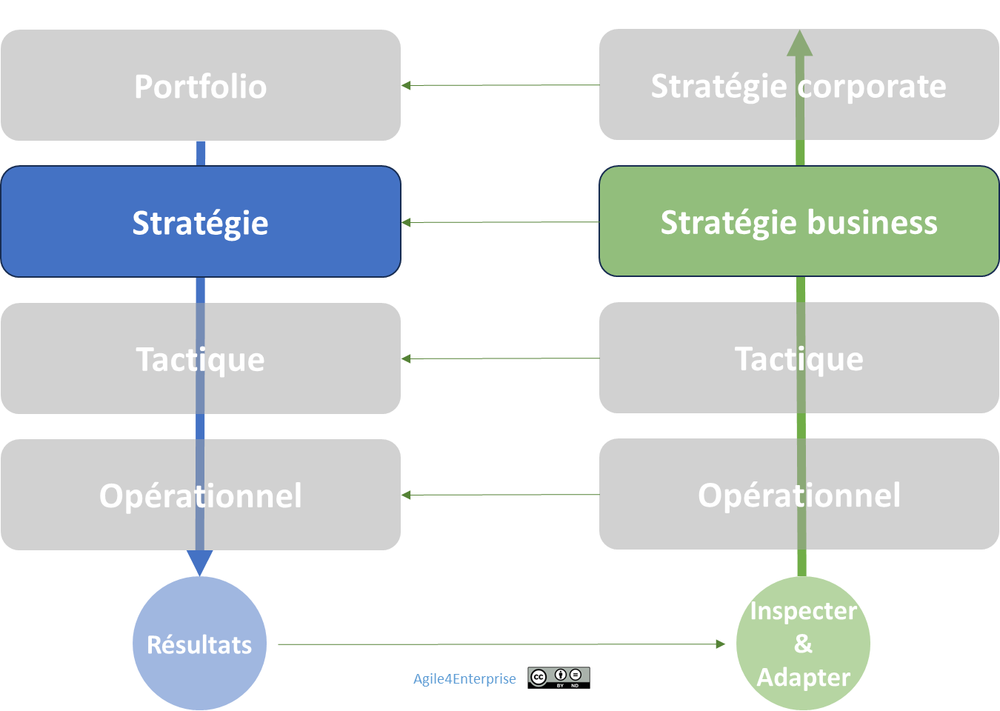
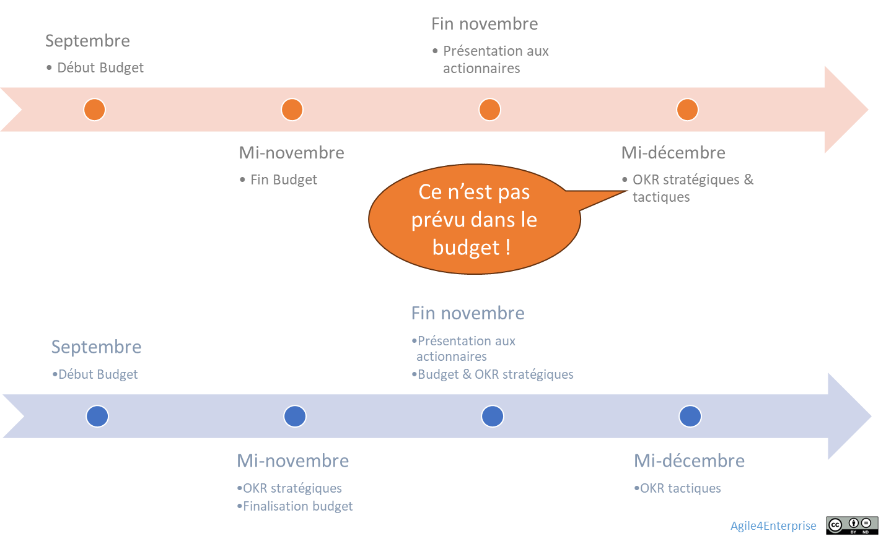

# La gouvernance adaptative stratégique

✨ **Objectif** Piloter l’**agilité stratégique** des unités business par une **gouvernance vivante**, alliant autonomie locale et alignement global, grâce à **des cycles d’apprentissage continu**, un **pilotage par l’impact**, et une **synchronisation dynamique** avec le portefeuille stratégique de l’entreprise. Ce chapitre prolonge ceux sur **l’agilité stratégique** et **l’agilité RH**. Il en est le chaînon structurel : la gouvernance adaptative en est le métronome. Sans elle, la stratégie reste théorique, la RH devient bureaucratique et l’exécution se désynchronise.

# Une gouvernance vivante au service de l’agilité stratégique

> “On avait des décisions. Il nous manquait la cadence.” — Dirigeant, secteur service
> 

Cadence du changement stratégique

💡 **La gouvernance adaptative stratégique** Elle porte sur l’agilité stratégique des unités business. Elle structure la manière dont elles ajustent leur stratégie localement, tout en s’inscrivant dans une dynamique globale.

Sans cadence, une stratégie même brillante s’épuise dans l’incohérence. La gouvernance adaptative stratégique ne consiste pas à faire “plus de réunions”. Elle transforme **la manière même dont une organisation décide, ajuste et respire**.

Elle repose sur une conviction simple :

> **Ce n’est pas l'intention stratégique qui compte. C’est sa capacité à évoluer.**
> 

## Les principes structurants

| Principe | Ce que cela implique |
| --- | --- |
| **Autonomie régulée** | Chaque unité stratégique ajuste sa stratégie dans un cadre d’alignement global. |
| **Itération continue** | Les décisions sont prises en cycles courts, en fonction de l’impact, pas du calendrier. |
| **Synchronisation multi-niveaux** | Cadences reliées à celles du portefeuille, de la tactique et de la RH. |

> Une gouvernance agile ne pilote pas l’exécution. Elle **cadence l’ajustement**.
> 

💡 Voir aussi : Les grands principes de l’agilité organisationnelle

## Gouvernance participative et itérative

- Cycles courts de revue,
- Décisions stratégiques évolutives,
- Apprentissage organisationnel continu.

Contrairement à la gouvernance Portfolio, elle agit **au plus près du terrain**.

💡 **Modèle de gouvernance agilité stratégique** : **Participatif** et **itératif**

## Ce que cette gouvernance dérange réellement

- Les **directions centrales** ne sont plus les seules à arbitrer.
- Les **roadmaps pluriannuelles** ne dictent plus le mouvement.
- Les **budgets figés** deviennent des hypothèses discutables.
- Le **middle management** perd son confort de validation par escalade.

⚠️ Une gouvernance vivante ne se contente pas d’accélérer les décisions. Elle redistribue le pouvoir de les prendre.

## **Gouverner par les cadences du changement**

La gouvernance adaptative stratégique s’articule autour de trois boucles imbriquées :

| Cadence | Fréquence | Finalité | Exemple d’instance |
| --- | --- | --- | --- |
| **Stratégique** | Trimestrielle / Annuelle | Ajuster les objectifs stratégiques et activer la mobilité stratégique. | CODIR stratégique |
| **Tactique** | Trimestrielle | Ajuster les objectifs tactiques, réaligner les initiatives stratégiques | Comités métiers |
| **Opérationnelle** | Mensuelle / ad hoc | Réajustement des actions | Revues d’impact |
| **Slack stratégique** | Continu | Capture d’opportunités hors-cycle | Flash review |

> Sans cadence stratégique claire, l’entreprise respire au rythme de ses urgences, pas de ses intentions.
> 

La gouvernance adaptative est un **système de rythme**, pas un nouveau reporting.

### Trois niveaux de revue cadencée

**Revue stratégique business (annuelle ou trimestrielle)**

- Finalité : réviser les **objectifs stratégiques** et enclencher, si besoin, une **mobilité stratégique** (modification du périmètre, des priorités, ou des zones 4E).
- Décision de **stabilité ou évolution** du positionnement des unités.
- Synchronisée avec les revues Portfolio.

**Revue tactique business (trimestrielle ou mensuelle)**

- Finalité : ajuster les **initiatives en cours** en fonction des résultats, KPIs, tensions ou signaux émergents.
- Basée sur les **OKR tactiques**.
- Fait remonter les besoins de réorientation ou réajustement stratégique.

**Revue opérationnelle (mensuelle ou à la demande)**

- Finalité : pilotage à court terme, arbitrages de contexte, réponse aux contraintes.
- Soutien de la réactivité.

### Risques en cas d’absence de ces cadences

- **Décalage entre direction et terrain**
- **Incohérence d’exécution** : les actions ne s’alimentent plus des décisions
- **Asphyxie organisationnelle** : les arbitrages bloqués empêchent la stratégie de se réactualiser

### Mobilité stratégique : décisions clés

- Une unité stratégique est **structurellement stable sur un cycle**, mais peut évoluer d’un cycle à l’autre en fonction :
    - des résultats,
    - des opportunités,
    - des zones stratégiques dans lesquelles elle est placée.
- Ces décisions de **mobilité ou de maintien** sont prises **explicitement** dans les revues stratégiques.
- La **coordination avec les cycles tactiques** garantit que ces choix sont **exécutables**, pas juste théoriques.

---

## Le pilotage

### Par l’impact, pas par le plan

Passer de la **roadmap d’initiatives** au **pilotage par l’impact** :

- S’engager sur des **objectifs et résultats à atteindre**, et non sur des projets spécifiques
- Réallouer les moyens selon les résultats,
- Arbitrer en fonction de la valeur, pas du plan,
- **Un cadre clair défini par les valeurs de l’entreprise et les contraintes budgétaires**, sans rigidité excessive quant aux actions à entreprendre.

C’est le **cadre d’impact** qui stabilise l’intention, pas la liste des projets.  Ce qui change avec une approche agile, outre la fréquence des décisions qui augmente, c’est la nature des décisions. L’un des principaux apports de l’agilité est de mieux distinguer les décisions stratégiques nécessitant une stabilité et celles qui doivent être prises plus fréquemment pour favoriser l’adaptation.

🔥 **Ce que cette gouvernance rend impossible à simuler** - Une stratégie figée. - Une RH administrative. - Une exécution automatique.

### Par le risque

L’agilité n’élimine pas le risque. Elle le **rend pilotable**.

- Proactivité et cycles décisionnels courts = détection précoce
- Slack stratégique = réponse rapide
- Scénarios multiples = préparation active
- Capacité de pivot rapide en cas d’événement critique.

> La gouvernance n’est pas une tour de contrôle. C’est un radar dynamique, au service de la survie et de l’impact. Elle doit rendre le changement possible même au plus haut niveau décisionnel.
> 

## Une gouvernance différenciée selon les 4 zones stratégiques

| Zone | Gouvernance adaptée |
| --- | --- |
| **Exploration** | Cycles courts, forte autonomie, souplesse totale |
| **Expansion** | Structuration agile, alignement progressif |
| **Exploitation** | Gouvernance stable, optimisation continue |
| **Exclusion** | Pilotage de la sortie et réallocation des ressources. |

## Synchroniser décisions et boucles d’apprentissage

La gouvernance synchronise :

- **Les cycles de décisions stratégiques**,
- **Les cycles budgétaires**,
- **Les cycles RH.**

en assurant une **capacité permanente de réalignement stratégique**.

Le processus d'apprentissage collectif devient un **levier stratégique** : Feedback du terrain → Ajustement tactique → Révision stratégique.

> L’alignement devient un effet du système, pas un vœu pieux.
> 

### Le cas TechNova — la désynchronisation des cycles

En 2023, TechNova décide de repositionner 30 % de son portefeuille stratégique sur l’IA. Les unités business formulent leurs OKR en décembre. Problème : **le processus budgétaire est clos depuis novembre**.

**Résultat** : les OKR stratégiques IA étaient en décalage avec les décisions budgétaires. Les revues stratégiques sont trop tardives, la réallocation échoue, le recrutement est compliqué.

❌ **Dysfonction système** : stratégie en mouvement ≠ budgets figés

L’année suivante, TechNova synchronise les cycles :

1. **Remontée des signaux terrain** (OKR tactiques, feedback marché),
2. **Revue stratégique corporate** : ajustement global,
3. **Boucle budgétaire reprogrammée** pour s’aligner sur la stratégie,
4. **Déploiement des OKR stratégiques en Conseil** avec validation des arbitrages.

> Résultat : alignement des intentions, des moyens et des actions.
> 

---

## Ce que produit une gouvernance absente ou rigide

> On ne gouverne pas un système vivant avec les outils d’un monde figé.
> 

| Symptôme | Ce qui se passe | Ce que ça produit |
| --- | --- | --- |
| Gouvernance annuelle unique | Revue unique en décembre | Stratégie figée, exécution obsolète |
| Décisions non déléguées | Tout remonte au COMEX | Ralentissement systémique |
| Absence de slack | Aucune marge de manœuvre | Aucune capture d’opportunité |
| Pilotage par les projets | Focus livrables, pas résultats | Déconnection stratégique |

## Mais aussi, ce que cette gouvernance ne voit pas toujours

- La **résistance des anciens modèles politiques**.
- Le **besoin de stabilité rituelle** de certaines fonctions support.
- Le **temps long de l’appropriation managériale** (la gouvernance n’agit pas seule).

---

## Et concrètement, lundi matin ?

- Cartographiez les rythmes de gouvernance existants dans vos unités : y a-t-il 3 cadences ?
- Supprimez une réunion de revue inutile. **Remplacez-la par une cadence à impact.**
- Cessez de piloter par plan annuel : lancez un pilote OKR dans votre unité.
- Identifiez une zone 4E où la gouvernance actuelle n’est pas adaptée.
- Osez une décision hors plan... puis alignez le reste ensuite.

---

#