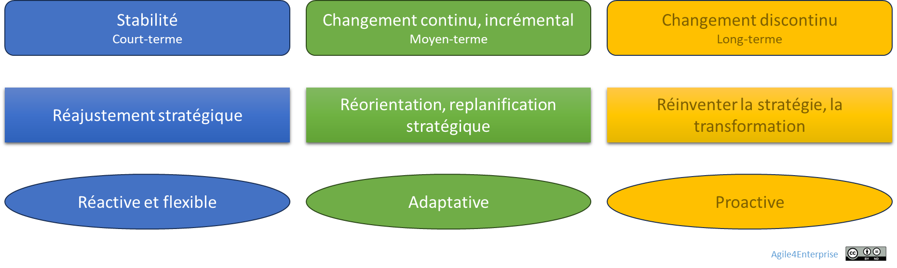

# L’agilité stratégique : vue d’ensemble

✨ **Objectif** Faire émerger une stratégie vivante, adaptative et collective, capable d'évoluer en synchronisation avec son environnement — sans perdre sa cohérence, ni son cap.

➿ *"On avait une stratégie claire. Mais elle ne bougeait pas." — CEO TechNova* *En 2023, TechNova anticipe une rupture IA et lance une stratégie ambitieuse. Douze mois plus tard, les ajustements se comptent sur les doigts d'une main. Les revues stratégiques sont figées. Les unités opèrent sans lien avec la stratégie. Et les équipes terrain s'interrogent : à quoi bon une stratégie qu'on ne voit jamais ?* ***Diagnostic** : Une stratégie délibérée sans boucle adaptative.*

## Ce que l’agilité stratégique dérange vraiment

L’agilité stratégique n’est pas neutre. Elle remet en cause :

- Le **pouvoir décisionnel centralisé**,
- Le **calendrier budgétaire annuel**,
- L’**illusion du contrôle prédictif**,
- Le **confort du statu quo**.

Elle exige de rendre le pilotage stratégique aussi vivant que l’environnement.

# Piloter la stratégie comme une boucle adaptative vivante

## **Qu'est-ce que l'agilité stratégique ?**

💡 **Agilité Stratégique** C'est la capacité à maintenir un cap clair tout en adaptant la trajectoire en temps réel, plus efficacement que ses concurrents. La stratégie cesse d’être un plan, et devient **un flux de décisions, d’apprentissages et d’ajustements**. La **maîtrise du changement stratégique** devient ainsi un levier essentiel pour assurer sa compétitivité et sa résilience.

> Une entreprise agile est d'abord une entreprise dont le processus **de décision stratégique** est lui-même agile.
> 

La place de l’agilité Stratégique dans les niveaux de décisions

L’agilité stratégique est à la stratégie stratégie business, ce qu’est **l’agilité portfolio** à la stratégie corporate. C'est une capacité à développer, pas une méthode à appliquer, celle de changer ou répondre aux changements de manière appropriée et efficace au niveau de chaque unité stratégique.

## Scénario TechNova — histoire d’un raté stratégique

| Moment | Situation | Ce qui se passe | Conséquence |
| --- | --- | --- | --- |
| T0 | Nouvelle stratégie IA annoncée | Cap clair, ambition forte | Alignement initial |
| T+3 mois | La business unit historique **Capteurs** s’inquiète | Freins implicites, silence du COMEX | Première inertie |
| T+6 mois | Projet IA peine à recruter | RH saturée, guerre de ressources | Dérive de calendrier, perte de dynamique |
| T+9 mois | Client stratégique se tourne vers un concurrent | Aucune alerte stratégique détectée | Perte d’avantage |
| T+12 mois | Revue annuelle figée | Décalage complet entre stratégie annoncée et réalité | Désillusion stratégique |

La stratégie IA avait du potentiel. Mais sans slack, pas de réinvention. Sans gouvernance dynamique, pas de réorientation. Et sans responsabilité locale, aucun réajustement terrain.

# Trois erreurs classiques de la stratégie à désactiver

De l’intention stratégique à la stratégie réalisée, d’après Mintzberg et Waters

| Symptôme | Croyance associée | Conséquence |
| --- | --- | --- |
| ❌ La stratégie reste figée malgré les changements | "On a déjà un plan" | Aveuglement face à l'environnement |
| ❌ Les unités stratégiques sont déconnectées | "On pilote à la tour de contrôle" | Inertie, absence d'expérimentation |
| ❌ La stratégie change, mais pas les ressources | "On verra au prochain budget" | Mobilité impossible, désynchronisation |

> L'agilité stratégique **débloque ces automatisme d'obsolescence planifiée de la stratégie**.
> 

## Les tensions clés à piloter

L’Agilité Stratégique n’est pas une évidence : elle bouscule également plusieurs équilibres fondamentaux :

| Tension | Lecture stratégique | Risque si ignorée |
| --- | --- | --- |
| Cap vs Adaptation | Structurer sans figer | Paralysie ou incohérence |
| Centralisation vs Émergence | Cadre + local | Lenteur ou fragmentation |
| Vision vs Ajustement | Horizon + pilotage par l’impact | Perte de sens ou de valeur |
| Stabilité vs Réinvention | Ancrage sur compétences clés | Rigidité ou perte d’élan |

## Ce que vous perdrez à ne rien faire

- Une stratégie figée deviendra vite invisible.
- Vos concurrents n’attendront pas votre prochaine revue budgétaire.
- Vos talents stratégiques iront là où ils peuvent créer, pas seulement exécuter.

## **Un curseur d’agilité pour naviguer dans ces tensions**

Si l’objectif d’une stratégie est de construire un **avantage concurrentiel durable**, ,aujourd’hui, la **rapidité du changement** remet en cause cette notion. Un avantage concurrentiel peut durer dix ans ou dix mois. Désormais, **le degré d'agilité stratégique requis** dépend directement de l'évolution du contexte. L’avantage concurrentiel est :

- **Durable quand c’est possible**,
- **Éphémère quand c’est nécessaire**.

💡 **La capacité à adapter en continu son avantage concurrentiel est donc devenue une priorité stratégique**.

# Le modèle vivant de l’agilité stratégique

> L’agilité stratégique pilote l’évolution permanente entre ce que l’on vise et ce que l’on apprend.
> 

Le modèle d’agilité stratégique

L’agilité stratégique repose sur 4 dynamiques synchronisées :

1. **Stratégie délibérée** : Cap clair, cohérent, aligné avec la vision.
2. **Stratégie adaptative** : Ajustements continus en fonction de l’évolution.
3. **Stratégie émergente** : Intégration des signaux faibles et des expérimentations terrain, opportunités saisies.
4. **Gouvernance participative** : stratégie co-produite, pas seulement descendante.

La **stratégie réalisée** **est le produit de ces quatre dynamiques.**

💡 L'agilité stratégique est le **mécanisme d’alignement dynamique** entre l’intention stratégique et son exécution adaptative, dans une logique de petits pas et d’essais / erreurs, et une approche mixte descendant / ascendant.

---

# Modèle 3R — Les 3 boucles du changement stratégique

*Les trois niveaux de réponses stratégiques au changement*

À chaque **réponse face au changement** sa boucle. L'agilité stratégique, c'est savoir sur laquelle naviguer — et quand.

| Boucle | Objectif | Capacité dominante |
| --- | --- | --- |
| **Réajuster** | Optimiser la stratégie existante et  l’exécution en continu | Réactivité, flexibilité |
| **Réorienter** | Redéfinir les priorités, changer d’axe. Adapter la stratégie aux évolutions majeures | Adaptabilité |
| **Réinventer** | Pivoter ou transformer le modèle d’affaires | Proactivité |

Elle permet de **repenser la stratégie en continu** :

- Ne pas seulement changer de stratégie,
- Mais **changer la façon dont la stratégie elle-même évolue**.

💡 La transformation stratégique devient **un processus continu d’apprentissage**, non une série de ruptures.

## ⚠️ Mal activé, chaque R peut devenir un piège

| Boucle | Bien utilisée | Mal utilisée |
| --- | --- | --- |
| **Réajuster** | Réactivité fine, amélioration continue | Agilité cosmétique, agitation sans transformation |
| **Réorienter** | Redéfinir l’axe, réaligner l’organisation | Perte de cap, saupoudrage de priorités |
| **Réinventer** | Transformation stratégique réelle | Chaos, perte d’identité, rupture non maîtrisée |

---

# Les 5 caractéristiques clés d’une agilité stratégique vivante

⚠️ **L’approche agile de la stratégie** L’agilité stratégique est itérative mais non incrémentale : Une stratégie ne se construit pas de manière incrémentale, c’est plutôt son exécution qui peut l’être. En revanche, elle se définit puis s’adapte. C’est le développement stratégique.

### **1. Agilité cognitive avant agilité organisationnelle**

- Remettre en question ses propres croyances.
- Détecter et apprendre plus vite que ses concurrents.

### **2. Un système vivant, pas un plan figé**

- Ne pas confondre le temps de la prise de décision et celle de son exécution.
- Prise de décision continue, évolutive.
- Préserver l'optionalité et rechercher l'impact.

### **3. Une approche mixte : délibérée + émergente**

- **Un cadre stratégique descendant** pour assurer la cohérence globale.
- **Une décentralisation des décisions stratégiques**.
- **Une stratégie émergente ascendante** pour une adaptation locale.

### **4. Gérer simultanément stabilité et innovation stratégique**

- Rechercher **un avantage concurrentiel durable** tout en cultivant la capacité à **en créer de nouveaux**.
- Les compétences clés constituent une ancre stratégique permettant d’opérer des changements maîtrisés.

### **5. Apprentissage organisationnel continu**

- Chaque stratégie est un test.
- Ce que l'on apprend devient levier.

📚 En savoir plus sur l’agilité stratégique dans notre wiki, ou dans notre livre.

---

## Ce que l’agilité stratégique ne voit pas toujours

- Le **pouvoir symbolique des grandes visions figées** peut rassurer, même quand elles sont obsolètes.
- La **stabilité perçue comme valeur** par les investisseurs, les clients ou les collaborateurs.
- La **dimension politique** des choix stratégiques : ce qu’on ne dit pas, ce qu’on ne peut pas abandonner sans résistance.

---

# Et concrètement, lundi matin ?

**✍️ Évaluez votre besoin d’agilité stratégique avec ces 6 questions :**

- Pouvez-vous ajuster une stratégie en cours d'année ?
- Avez-vous des marges budgétaires activables hors cycle ?
- L’investissement est-il incrémental, conditionné aux résultats ?
- Les unités peuvent-elles décider ajuster seules leur stratégie ?
- Vos revues stratégiques sont-elles guidées par des événements ou par des calendriers figés ?
- Savez-vous arrêter une initiative non stratégique, et à quelle fréquence cela arrive-t-il réellement ?

> Si trois de ces questions vous gênent, l'agilité stratégique est un levier, pas une option.
> 

---

#