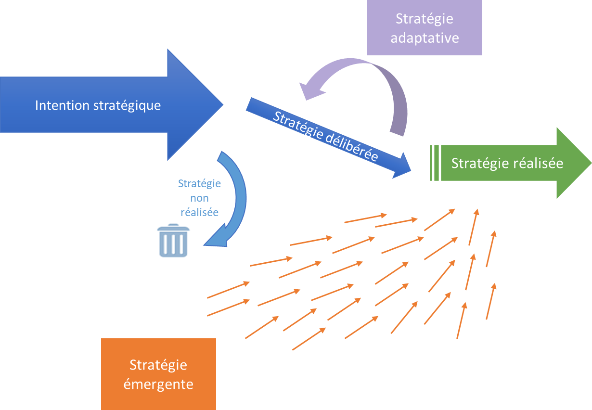
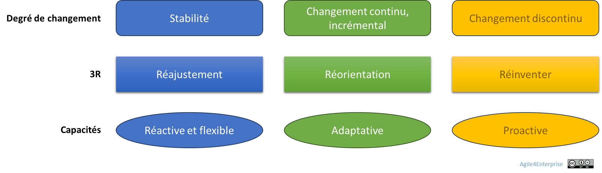
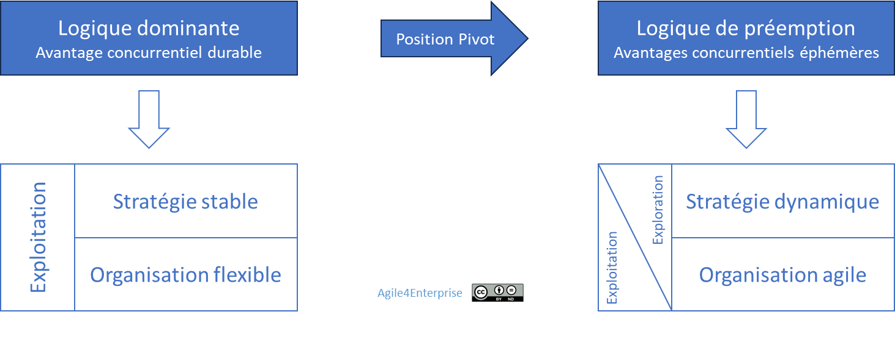

# L’agilité stratégique : vue d’ensemble

✨**Objectif**

Faire émerger une stratégie vivante, capable d’évoluer en synchronisation avec son environnement — sans perdre sa cohérence ni son cap.

🧑‍🎓**Ce que vous allez apprendre ici**

- En quoi l’agilité stratégique diffère-t-elle d’une planification stratégique
- Les trois types de boucles stratégiques à activer selon le contexte (3R)
- Les cinq caractéristiques d’une stratégie dynamique
- Les erreurs classiques à désamorcer pour rendre la stratégie réellement vivante

📚**Petit lexique**

- **Stratégie délibérée** : intention claire, articulée par la direction
- **Stratégie adaptative** : ajustement continu à l’environnement
- **Stratégie émergente** : décisions issues des pratiques et signaux du terrain

## Piloter la stratégie

🧑‍🎓

**Agilité stratégique** :

Maintenir un cap clair tout en adaptant la trajectoire en continu, plus profitablement que sa concurrence. Une entreprise devient agile si son processus **de décision stratégique** le devient lui-même.

La stratégie se transforme : d’un plan figé, elle devient un flux de décisions, d’apprentissages et d’ajustements. C’est une capacité à développer, non une méthode à appliquer : celle de transformer, ou de répondre aux évolutions, de façon efficace au niveau de chaque unité. Maîtriser le changement stratégique renforce la compétitivité.

➿**TechNova**

**Histoire d’un raté stratégique** :

>*« On avait une stratégie claire. Mais elle ne bougeait pas. » — CEO TechNova*

En 2017, TechNova annonce son ambition : devenir un acteur majeur de la **domotique intelligente**, en combinant capteurs, objets connectés et intelligence embarquée. Le marché bouillonne, les signaux s’intensifient, la vision s’affirme. Mais douze mois plus tard, le bilan s’impose :

- Les produits existants évoluent peu.
- Les équipes R&D peinent à se coordonner.
- Les distributeurs n’ont reçu aucun message clair.
- Les clients attendus se tournent vers des solutions concurrentes, plus simples et plus intégrées.

Sur le terrain, un flou s’installe :

> « La domotique ? On en a parlé en séminaire. Mais rien n’a changé dans nos priorités. »

| | Ce qui se passe | Symptôme | Conséquence |
| --- | --- | --- | --- |
| T0 | Annonce stratégique « Domotique intelligente » | Alignement fort, soutien du COMEX | Espoir de repositionnement |
| T+3 mois | Le département Capteurs continue sa roadmap comme avant | Manque d’instructions concrètes | Déconnexion entre stratégie et exécution |
| T+6 mois | La R&D multiplie les prototypes sans coordination | Pas de plateforme partagée, objectifs flous | Gaspillage d’efforts, complexité technique |
| T+9 mois | Une start-up concurrente signe avec deux grands distributeurs | Aucune alerte détectée | Perte d’opportunité |
| T+12 mois | Revue stratégique annuelle, aucun ajustement | Aucun projet domotique au stade industriel | Abandon implicite de la stratégie |

La stratégie domotique s’avérait pertinente, mais demeurait abstraite la première année. La direction aurait dû prévoir un espace d’exploration, créer un lien entre les équipes et cette vision d’avenir.

## Le modèle vivant de l’agilité stratégique

L’agilité stratégique repose sur 3 dynamiques synchronisées :

1. **Délibérée** : Choix intentionnel, cap clair, cohérent et aligné avec la vision.
2. **Adaptative** : Ajustements continus en fonction de l’évolution et des retours terrain.
3. **Émergente** : Intégration des signaux faibles, des expérimentations et des opportunités saisies.

Ces trois dynamiques façonnent la **stratégie réalisée**. Le résultat diffère toujours de l’ambition initiale. On peut subir cette différence comme un problème ou la piloter comme une opportunité ! La gérer repose sur un mécanisme d’alignement vivant entre l’intention et le réel, dans une logique de petits pas et d’essais/erreurs, et une approche mixte descendante/ascendante.

## Modèle 3R — Les 3 boucles du changement stratégique

La stratégie évolue à des degrés divers. À chaque réponse au changement correspond une boucle spécifique. L’agilité, c’est savoir quelle boucle activer et quand le faire.

| Boucle | Objectif | Capacité dominante |
| --- | --- | --- |
| **Réajuster** | Optimiser la stratégie existante et l’exécution en continu | Réactivité, flexibilité |
| **Réorienter** | Redéfinir les priorités, changer d’axe. Adapter la stratégie aux évolutions majeures. | Adaptabilité |
| **Réinventer** | Pivoter ou transformer le modèle d’affaires | Proactivité |

**Les 3R des capteurs** :

1. **Réajuster** — élargir l’usage des capteurs existants

    TechNova intègre un nouveau segment client industriel : les petites usines locales, moins sophistiquées, mais plus nombreuses.

    Elle adapte ses produits pour ce segment, par un conditionnement plus simple, un prix approprié, et une documentation allégée. Aucun changement de modèle d’affaires n’est requis, juste une optimisation.

    **Objectif** : étendre l’impact sans toucher à l’offre principale.

2. **Réorienter** — capteur + IA

    Le prototype IA embarqué montre un fort potentiel, mais reste isolé. Mais plutôt que de continuer à traiter l’IA comme une R&D expérimentale, la direction l’inclut à la feuille de route Capteur.

    Cela implique une nouvelle allocation de budget, une fusion partielle des équipes R&D et Produit, et des OKR révisés. Elle refond son offre pour mettre ces récentes fonctionnalités en avant.

    **Objectif** : ancrer l’IA dans la stratégie, au-delà du pari technologique.

3. **Réinventer** — L’IA s’intègre à la Smart Home

    Pour donner suite au succès industriel, TechNova décide de transposer ses capteurs IA au grand public : elle lance une offre **Smart Home**, avec des capteurs domestiques autonomes, une application mobile, et un modèle d’abonnement.

    Ce pivot modifie entièrement le modèle économique : différents canaux, une nouvelle marque, des services B2C, un service à la clientèle en ligne et une expérience utilisateur repensée.

    **Objectif** : réinventer la proposition pour entrer dans un marché grand public en pleine croissance.

🔥

La transformation stratégique devient **un processus continu d’apprentissage**, non une série de ruptures.

## Les 6 caractéristiques clés

1. **Itérative, mais non incrémentale**

    C’est l’exécution qui doit l’être. La stratégie, elle, se définit puis s’adapte en continu : c’est le principe du développement stratégique.

2. **Agilité cognitive avant organisationnelle**

    - Remettre en question ses propres croyances,
    - Détecter et apprendre plus vite que la concurrence.

3. **Système ouvert et vivant**

    - Prise de décision continue,
    - Préserver les options et rechercher l’impact.

4. **Approche mixte : délibérée et émergente**

    - Un cadre général descendant pour assurer la cohérence globale,
    - Une décentralisation des décisions business,
    - Une stratégie émergente ascendante pour une adaptation locale.

5. **Gérer simultanément stabilité et innovation**

    - Rechercher un avantage concurrentiel durable tout en cultivant la capacité à en créer de nouveaux,
    - Les compétences clés constituent une ancre pour opérer des changements maîtrisés.

6. **Apprentissage organisationnel continu**

    - Stratégie = hypothèse,
    - Initiative = expérimentation.

## Trois erreurs classiques de la stratégie à désactiver

| Symptôme | Croyance associée | Conséquence |
| --- | --- | --- |
| La stratégie reste figée malgré les changements | « On suit le plan » | Aveuglement face à l’environnement |
| Les unités stratégiques sont déconnectées | « On pilote à la tour de contrôle » | Inertie, absence d’expérimentation |
| La stratégie change, mais pas les ressources | « On verra au prochain budget » | Mobilité impossible, désynchronisation |

> L’agilité débloque ces automatismes d’obsolescence planifiée de la stratégie.

## Les tensions clés à piloter

L’agilité stratégique ne se décrète pas, elle bouscule plusieurs équilibres fondamentaux :

| **Tension**| **Logique sous-jacente**|
| --------------------------------------------------- | ------------------------------------------------------------- |
| **Planification stratégique ⇄ adaptation contextuelle**| Maintenir une direction cohérente tout en ajustant les moyens |
| **Cadre structurant ⇄ émergence contextuelle**| Articuler cadre partagé et initiative décentralisée |
| **Vision longue ⇄ feed-back court**| Relier horizon stratégique et preuves d’impact à court terme|
| **Évolution continue ⇄ rupture stratégique**| Capitaliser sur les compétences clés tout en osant muter|

### Un curseur d’agilité pour naviguer dans ces tensions

Si une stratégie vise à créer un avantage concurrentiel durable, ce principe est remis en cause aujourd’hui. Un avantage peut demeurer dix ans… ou dix mois. Il devient :

- **Durable quand c’est possible**, notamment dans un environnement SUSO
- **Éphémère quand c’est nécessaire**, typiquement dans un environnement VUCA.

Prévoir s’il sera durable reste difficile. En revanche, la direction doit pouvoir accélérer, ralentir ou stopper les investissements selon les résultats obtenus.

### Ce que l’agilité stratégique dérange vraiment

L’agilité remet en cause :

- Le pouvoir décisionnel centralisé,
- Le calendrier budgétaire annuel,
- L’illusion du contrôle prédictif,
- Le confort du statu quo.

Elle exige de rendre le pilotage stratégique aussi vivant que l’environnement, ni plus ni moins.

### Ce que l’agilité stratégique ne voit pas toujours

- Le pouvoir symbolique des grandes visions figées peut rassurer, même lorsqu’elles sont devenues obsolètes
- La stabilité perçue comme valeur par les investisseurs, les clients ou les collaborateurs
- La dimension politique des choix : ce qu’on ne dit pas, ce qu’on ne peut pas abandonner sans résistance.

## 👣 Et concrètement, lundi matin ?

Évaluez votre besoin d’agilité stratégique avec ces 6 questions :

- Pouvez-vous ajuster un arbitrage en cours d’année ?
- Disposez-vous de marges budgétaires mobilisables hors cycle ?
- Le financement est-il incrémental, conditionné aux résultats ?
- Les unités peuvent-elles décider de moduler seules leur stratégie ?
- Déclenchez-vous vos revues par des événements ou par des calendriers figés ?
- Savez-vous arrêter une initiative non prioritaire, et à quelle fréquence cela arrive-t-il réellement ?

> Si trois de ces questions vous gênent, l’agilité stratégique s’impose comme un levier, pas une option.

## 🔑 Points clés à retenir

- L’agilité stratégique donne vie à la stratégie.
- Elle repose sur trois dynamiques synchronisées.
- Le modèle **3R** — Réajuster, Réorienter et Réinventer — articule trois niveaux d’adaptation stratégique.

> L’agilité stratégique, ce n’est pas changer de cap sans cesse : c’est savoir quand le garder, quand le remettre en cause, et quand le réinventer.

