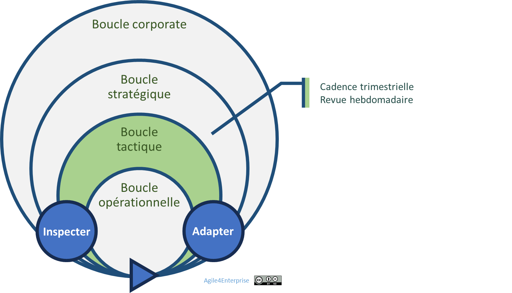

# La gouvernance adaptative tactique

✨**Objectif**

La gouvernance tactique coordonne des boucles régulières de revue, d’ajustement et d’apprentissage, afin que chaque unité puisse orienter ses actions, ses ressources et ses priorités en fonction de la stratégie et de l’évolution du terrain.

🧑‍🎓**Ce que vous allez apprendre ici**

- Quel rôle joue le management intermédiaire dans l’orchestration de ces boucles adaptatives ?
- Quelles sont les cadences pour rythmer l’action collective ?
- Comment structurer des revues tactiques, alignées avec la stratégie, mais ancrées dans le terrain ?

## Une gouvernance adaptative au service de l’agilité tactique

### Une gouvernance participative et itérative

Ce qui doit être gouverné :

- **Cycle OKR** comme cadre d’alignement. Ils traduisent les OKR stratégiques en 3 OKR tactiques maximum par unité.
- **Revues** comme espaces de régulation partagée.
- **Slack** comme marge de manœuvre.
- **Mobilité** des équipes.
- **Autonomie décisionnelle locale** comme garantie de prise d’initiatives.

L’ensemble avec un modèle de gouvernance **participatif** et **itératif**.

### Les tensions clés à piloter

Cette gouvernance se joue à l’intersection de trois curseurs :

| Tension | Pour viser l’équilibre… |
| --- | --- |
| **Alignement ⇄ Autonomie** | Offrir un cadre d’OKR clairs pour déléguer la prise de décision |
| **Stabilité ⇄ Changement** | Fixer un cycle trimestriel d’ajustement |
| **Cadre structurant ⇄ Émergence contextuelle** | Limiter à 3 OKR tactiques par cycle, dont un descendant et deux ascendants |

### Le rôle pivot du management tactique

Le management ajuste le curseur entre ces extrêmes selon la maturité des équipes et la volatilité du contexte. Il devient :

- Un orchestrateur de **mobilité tactique**,
- Un régulateur de **cadences d’adaptation :** Il déclenche les ajustements au bon moment,
- Un garant de **l’autonomie encadrée des équipes**.

### Trois cadences pour faire vivre la tactique

**Revue tactique** :

- **Fréquence** : Au moins trimestrielle (cible mensuelle)
- **But** :
  - Réviser les **OKR**,
  - Réallouer en fonction des résultats intermédiaires (OKR, KPI, feed-back),
  - Enclencher, au besoin, une **mobilité**.
- Synchroniser avec les revues stratégiques business.

**Synchronisation avec les revues opérationnelles** :

- **Fréquence** : Typiquement hebdomadaire, au moins bimensuelle.
- **But** :
  - Ajuster les initiatives en se basant sur la progression des **OKR**,
  - Fait remonter les besoins tactiques 3R.

**Slack** :

- **Fréquence** : Continue.
- **But** : Capture d’opportunités hors cycle.

> Ainsi, les cycles tactiques sont liés à la fois aux boucles stratégiques et opérationnelles. Chaque rituel alimente les autres.

### Comment gérer le changement ?

- **Unité et objectifs stables**

    Une unité conserve sa structure ainsi que ses objectifs tout au long d’un cycle. Elle peut toutefois évoluer d’un cycle à l’autre, selon les résultats obtenus.     Piloter le changement suppose donc de garder un cadre stable pendant le cycle afin d’assurer la cohérence, tout en acceptant des ajustements entre chaque phase. Les revues constituent alors des moments clés pour réorganiser les équipes et redéfinir les priorités.

- **Initiatives évolutives**

    Les initiatives, en revanche, peuvent s’adapter en cours de cycle sans renégocier l’ensemble du plan, dès lors que la progression vers les objectifs reste insuffisante ou qu’une meilleure option se présente pour les atteindre.

➿**TechNova**

**La genèse d’une gouvernance vivante** :

> « Ce n’est pas la charge qui nous a freinés. C’est l’absence de moment collectif pour décider. » — manager Capteurs

Le département **Capteurs**, historiquement organisé autour de feuilles de route annuelles, voit son Backlog se figer. En trois mois :

- Deux actions prioritaires sont demeurées bloquées en attente de validations croisées,
- Les retours clients s’accumulent… mais ne remontent à personne,
- Les équipes commencent à douter du sens de leurs sprints.

Le problème ne venait pas de la planification, mais plutôt de la capacité d’activer les arbitrages au bon moment. Plutôt que d’ajouter des rituels, le management décide d’orchestrer deux cadences :

| Cadence | Rythme | Rôle |
| --- | --- | --- |
| **Bimensuelle** | Sprint | Ajustement des actions en cours |
| **Trimestrielle** | Bilan tactique | Révision des OKR |

Et pour accompagner ces cadences :

- Un **tableau partagé** (OKR, KPI, feed-back) mis à jour chaque semaine,
- Une **mobilité pilotée** tous les trimestres.

**Résultats**, en six mois :

- 3 équipes sur 7 ont réorienté leur objectif.
- L’organisation a arrêté les initiatives sans liens avec les OKR.
- La **satisfaction client** a progressé de 10 %.

## 👣 Et concrètement, lundi matin ?

Pour démarrer concrètement, posez un cadre simple avec quatre premières actions :

1. Sélectionner une **unité pilote** transverse.
2. Bloquer **10 % de Slack** dans le planning capacitaire.
3. Mettre en place un **tableau partagé** (OKR, KPI).
4. Planifier la première **revue** dans 2 semaines.

## 🔑 Points clés à retenir

| Cadence | Fréquence | Finalité |
| --- | --- | --- |
| Revue tactique | Trimestrielle | Révision des priorités, reconfiguration des unités, ajustement des OKR |
| Synchronisation avec les revues opérationnelles | Hebdomadaire | Correction des écarts d’alignement, de connaissance, d’effet |
| Slack tactique | Continue | Capture d’opportunités hors cycle. |

- Gouvernance = rythme maîtrisé, pas réunionite.
- Management intermédiaire = chef d’orchestre des boucles adaptatives.
- Rituels courts pour aligner et réagir.
- Pilotage par l’impact et renoncements ciblés libèrent la capacité d’innovation.

