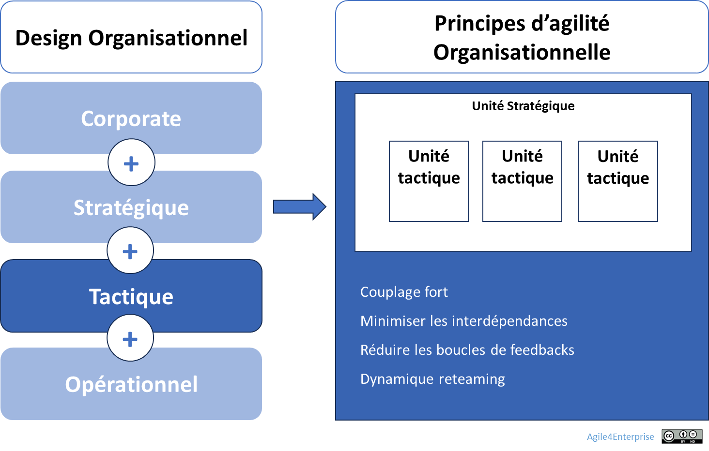

# L’agilité organisationnelle au niveau tactique

✨**Objectif**

Transformer les **unités tactiques** en cellules autonomes et adaptables, capables de livrer et de coopérer au cœur des chaînes de valeur. Ici, l’**agilité par le design** inscrit la réactivité organisationnelle dans la structure même, sans lancer de gros programmes de transformation.

🧑‍🎓**Ce que vous allez apprendre ici**

- Comment structurer vos unités pour qu’elles puissent livrer de manière autonome, tout en restant connectées entre elles.
- Comment adapter les mécanismes de **coordination horizontale** selon les quatre archétypes (projet, produit, flux, réseau).

📚**Petit lexique**

- **Unité tactique** = groupe d’équipes organisé autour d’un objectif commun, d’un flux de valeur ou d’un domaine métier. Elle combine autonomie locale et alignement stratégique.
- **Backlog** = liste priorisée d’initiatives ou d’éléments de travail, propre à chaque unité ou partagée.
- **Reteaming** = recomposition partielle des équipes à intervalle régulier, en fonction des besoins d’impact.
- **Chaîne de valeur** = enchaînement d’activités qui transforme une demande client en valeur livrée.

## Les principes d’agilité organisationnelle

📚**Petit lexique**

**Unité tactique** :

C’est une structure d’exécution autonome, dédiée à la création de valeur directe pour les utilisateurs et clients. Elle rassemble les équipes et processus essentiels pour livrer cette valeur de façon indépendante, tout en restant alignée sur la stratégie de l’unité dont elle dépend.

⚠️

**Dans les petites organisations**, les niveaux tactiques et opérationnels se confondent dans l’équipe.

### Les tensions clés à piloter

Trois tensions fondamentales exigent une posture d’équilibriste :

| Tension | Équilibre visé |
| --- | --- |
| **Différenciation ⇄ Coordination** | Favoriser la coordination horizontale sans niveler les spécificités |
| **Autonomie locale ⇄ Alignement stratégique** | OKR tactiques alignés aux OKR stratégiques |
| **Stabilité des équipes ⇄ Mobilité tactique** | Reteaming structuré à chaque cycle |

### Quatre principes pour un design tactique

Un design tactique efficace repose sur quatre principes clés :

- **Autonomie locale**, se traduisant concrètement par des OKR spécifiques.
- **Interdépendances minimales**, afin de limiter les freins systémiques. Cela suppose un découpage par chaîne de valeur ou par domaine métier, des responsabilités clairement établies et des interfaces explicites.
- **Boucles de feed-back** intégrées, pour favoriser un apprentissage rapide et aligné.
- **Niveaux hiérarchiques réduits** pour libérer la capacité d’action collective. Il implique de distinguer nettement les rôles managériaux des rôles opérationnels.

➿**TechNova**

**TechNova Capteurs — Quand la gouvernance redessine l’organisation** :

> *« On s’est rendu compte qu’on avait tout changé, sauf notre façon d’être organisés. » — manager*

**Problèmes** :

- Le Backlog partagé devient illisible : chaque équipe y projette ses priorités, sans liens clairs avec les OKR tactiques.
- Les arbitrages se font trop tard, souvent à chaud.

**Objectif** : livrer ce qui compte, quand ça importe

Après avoir mis en place une gouvernance cadencée, le département Capteurs franchit un cap structurel :

1. **Découpage par chaîne de valeur** : Cinq unités horizontales se redessinent autour des usages réels — installation, collecte, analyse, alertes, intégration client.
2. **Backlogs autonomes** : Chaque unité gère désormais son propre Backlog, orienté impact utilisateur.
3. **OKR tactiques** : Les objectifs se construisent collectivement.
4. **Reteaming planifié** : Plutôt que de figer les équipes, certaines compétences clés (données, expérience utilisateur, qualité) changent tous les trimestres pour renforcer les unités en tension.

L’action concrète du management :

- Facilite la reconception des chaînes à chaque cycle.
- Évalue la friction structurelle : chaque dépendance bloquante remontée deux fois déclenche une proposition de découpage ou d’intégration.

**Les résultats** :

- Les équipes traitent 90 % des arbitrages tactiques sans escalade.
- Le nombre de dépendances bloquantes signalées a chuté de 40 %.

## Les mécanismes de coordination tactique

Les unités tactiques nécessitent une forte **coordination horizontale**. Les mécanismes selon les archétypes organisationnels :

| Archétype | Principe de découpage | Principe de coordination |
| --- | --- | --- |
| **Projet** | Objectif commun | Coordination par l’intégration, avec un Backlog unique temporaire |
| **Produit** | **Domaines métier** | Coordination par l’intégration, avec un Backlog unique |
| **Flux** | **Chaînes de valeur** | Coordination par les processus, avec un réseau de Backlogs |
| **Réseau** | Mission commune | Coordination par les processus, avec un réseau de Backlogs |

> La coordination devient un mécanisme dynamique plutôt qu’un organe de contrôle.

## 👣 Et concrètement, lundi matin ?

Lancez un atelier de conception avec vos managers :

1. **Challengez votre design actuel** : quelle unité n’a jamais redessiné son périmètre ?
2. **Cartographiez les dépendances** : quelles dépendances implicites freinent la livraison ?
3. **Diminuez les boucles de feed-back** : comment intégrer immédiatement les retours utilisateurs ?

Activez un principe dès demain :

- Traduisez-le en OKR de transformation.
- Mettez en place un rituel hebdomadaire de 15′ min pour suivre cet OKR.

> Ne réinventez pas toute l’organisation : testez un seul principe, mesurez l’impact, puis étendez-le au cycle suivant.

## 🔑 Points clés à retenir

- **Design horizontal** : unités structurées pour livrer et coopérer, pas siloter.
- **Autonomie et feed-back** : décisions locales, cycles courts, apprentissage constant.
- **Hiérarchie allégée** : manager = coach, moins de filtres, plus de fluidité.
- **Reconfigurabilité** : structurer pour évoluer par petits pas, au rythme des besoins et des apprentissages.

