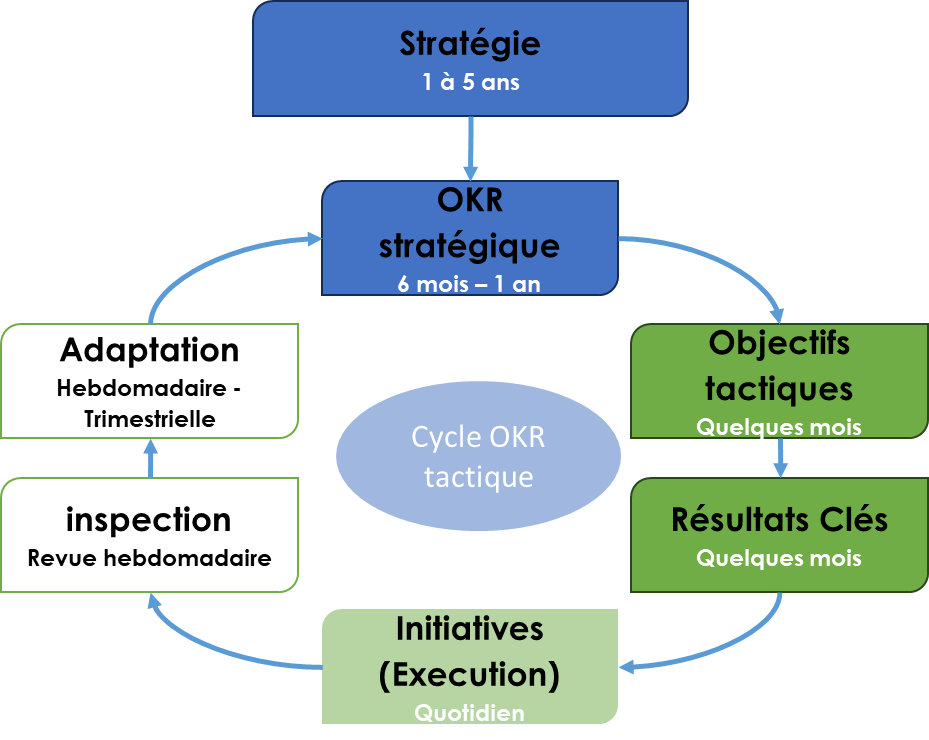

# L’agilité tactique en action

✨ **Objectif** Cette section présente les **outils activables** pour incarner l’agilité tactique dans l’entreprise. Elle vise à rendre l’exécution stratégique **fluide, réactive et alignée**, en s’appuyant sur des cycles vivants, des objectifs actionnables (OKR) et une articulation explicite entre stratégie, tactique et opérationnel. > Une stratégie agile sans agilité tactique, c’est un cap sans gouvernail. >

# Outiller un système tactique vivant

L’agilité tactique repose sur des **boucles adaptatives structurées**, dont les outils assurent la fluidité, la coordination et l’adaptabilité de l’exécution. Ces outils se répartissent en trois familles : analyse, transformation, exécution.

## **Modèles d’analyse tactique**

### Modèle 4E **tactique**

- Cartographie des zones tactiques (Exploration, Expansion, Exploitation, Exclusion)
- Appliqué à un portefeuille de fonctionnalités ou d’initiatives produit/service
- Permet de piloter la diversité des rythmes, postures et contraintes au sein d’une unité

## **Outils de transformation tactique**

### Modèle IMPACTE **tactique**

- Évalue la capacité d’une unité à s’adapter
- Structure un programme de transformation progressive
- Utilisé pour un diagnostic d’agilité tactique

### ACTE **tactique**

- Lien explicite entre stratégie, modèle opératoire, OKR stratégiques, OKR tactiques et exécution
- Met en évidence deux dimensions clés des OKR tactiques :
    - **Performance** : objectifs business / delivery
    - **Culture** : transformation, posture, apprentissage

## **Outils d’exécution tactique**

### PACTE **tactique**

- Lecture dynamique des initiatives tactiques à travers les zones 4E
- Utilisable en war room ou instance de régulation collective
- Permet d’ajuster les priorités en temps réel

### Cycles **tactiques & cadences de changement**

- Reposent sur une fréquence stable (typiquement trimestrielle)
- Synchronisés avec les niveaux stratégique (revue d’alignement) et opérationnel (revue d’impact)

➿ PACTE chez Technova Quand Technova Capteur a introduit **PACTE** dans sa war room : 1. Les équipes lisaient en direct la carte 4E de leurs gammes de capteurs. 2. Chaque trimestre, la cellule tactique allouait 10 % de ressources vers les projets à Exploratio­n/Expansion. 3. Résultat au bout d’un an : 25 % de renouvellement des capteurs au catalogue.

---

### Le coach agile tactique, l’orchestrateur de la valeur à l’échelle

- Anime les revues ACTE et les rituels OKR.
- Connecter stratégie et impact concret, dans un environnement adaptatif.
- Font vivre la boucle tactique au sein de l’unité.
- **Agnostique** des frameworks : Scrum@Scale, Kanban@Scale, LeSS, SaFE …

## **Le cycle OKR tactique : cœur battant de l’agilité d’exécution**

Le cycle OKR tactique

1. **Planifier** (début de trimestre) : décliner les OKR stratégiques en 3 OKR tactiques.
2. **Exécuter & mesurer** (hebdo/bimensuel) : points courts sur le progrès, adaptation des actions.
3. **Ajuster** (fin de trimestre) : accélérer, pivoter ou stopper chaque initiative selon l’impact réel.
4. **Slack tactique** : 10–15 % de capacité réservée pour absorber les imprévus et expérimenter.

> « L’engagement porte sur l’objectif, pas la roadmap. C’est ce qui rend l’équipe agile, pas son backlog.» — Manager Technova
> 

📚 En savoir plus sur les OKR dans notre wiki

---

## Ce que ça produit malgré soi

- Risque d’**épuisement des équipes** si les OKR tactiques sont mal calibrés ou trop fréquents
- Risque d’**architecture mouvante illisible** si chaque itération remet en cause l’ensemble des choix
- Risque de **surcharge de dispositifs** : les outils sont censés fluidifier, pas complexifier

## Ce que cette approche ne voit pas toujours

- Le **besoin de stabilité rituelle** pour certaines fonctions (finance, RH, conformité)
- L’**ancrage culturel** nécessaire pour intégrer des rituels comme le slack ou les feedbacks courts
- La **dimension politique des arbitrages** entre tactique et stratégique

---

## 📌 Et concrètement, lundi matin ?

- Choisissez un périmètre produit/service
- Cartographiez ses fonctionnalités selon les zones 4E
- Lancez un cycle OKR tactique d’expérimentation
- Activez un slack tactique explicite (temps, budget ou rôle pivot)
- Organisez une **war room** ou revue tactique PACTE

---

##