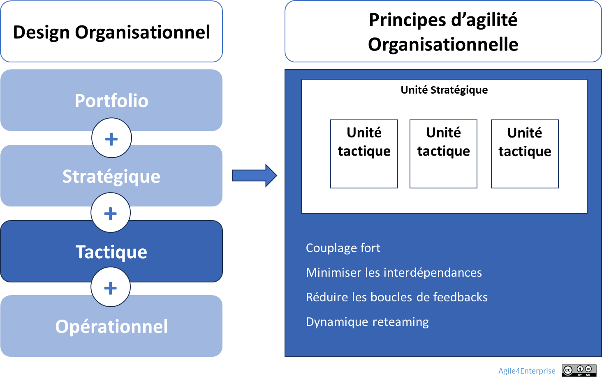

# L’agilité organisationnelle au niveau tactique

✨ **Objectif** Faire des **unités tactiques** des cellules autonomes et adaptables, capables de livrer et coopérer au cœur des chaînes de valeur. Ici, l’**agilité par le design** inscrit la réactivité organisationnelle dans la structure même, sans lancer de gros programmes de transformation.

🧑‍🎓 **Ce que vous allez apprendre** - Comment structurer vos unités pour qu’elles puissent **livrer de manière autonome**, tout en restant **connectées entre elles**. - Comment adapter les mécanismes de **coordination horizontale** selon les quatre archétypes (projet, produit, flux, réseau).

📚 **Petit lexique** **Unité tactique** = groupe d’équipes organisé autour d’un objectif commun, d’un flux de valeur ou d’un domaine métier. Elle combine autonomie locale et alignement stratégique. **Backlog** = liste priorisée d’initiatives ou d’éléments de travail, propre à chaque unité ou partagée. **Reteaming** = recomposition partielle des équipes à intervalle régulier, en fonction des besoins d’impact. **Chaîne de valeur** = enchaînement d’activités qui transforme une demande client en valeur livrée.

# Les principes d’agilité organisationnelle

## Qu’est-ce qu’une unité tactique ?

C’est une structure d’exécution quasi autonome, conçue pour maximiser l’impact sur l’utilisateur et la réactivité face aux signaux terrain.

Elle est centrée sur la création directe de valeur pour les utilisateurs et clients. Elle regroupe équipes et processus clés capables de livrer cette valeur de manière autonome, tout en restant alignée avec la stratégie globale de l’unité stratégique à laquelle elle appartient.

⚠️ **Pour les petites organisations**, les niveaux tactique et opérationnel fusionnent souvent : l'unité tactique correspond directement à une équipe unique sans structure intermédiaire.

## Pourquoi repenser le design organisationnel tactique ?

L’agilité tactique ne repose pas uniquement sur des pratiques d’équipe. Elle s’incarne dans un **design organisationnel horizontal**, orienté vers :

- **La fluidité des livraisons**,
- **La mobilité des ressources**,
- **La réduction des dépendances**,
- **L’ancrage local de la décision**.

## Les tensions clés à piloter

Dans la gouvernance tactique, quatre tensions fondamentales exigent une posture d’équilibriste :

| Tension | Risque d’excès | Risque d’insuffisance | Équilibre visé |
| --- | --- | --- | --- |
| **Différenciation ↔ Coordination** | Unités isolées, silos paralysants | Uniformité rigide, perte d’innovation locale | Favoriser la coordination horizontale sans niveler les spécificités |
| **Autonomie tactique ↔ Alignement stratégique** | Initiatives déconnectées de la stratégie globale | Dysfonctionnement par excès de contrôle central | OKR tactiques alignés aux OKR stratégiques |
| **Efficacité opérationnelle ↔ Développement stratégique** | Confort du « run » au détriment de l’innovation | Ressources dispersées sans consolidation | Arbitrer chaque cycle : % capacité run vs % capacité build |
| **Stabilité des équipes ↔ Mobilité tactique** | Équipes immuables, montée de l’inertie | Réorganisation permanente, perte de cohésion et d’apprentissage | Reteaming structuré à chaque cycle tactique pour allier ancrage et renouveau |

## Quatre principes pour un design tactique

| Principe | Pourquoi ? | Mise en œuvre rapide |
| --- | --- | --- |
| **Autonomie locale** | Décisions prises au plus près de la valeur | OKR propres, Backlog propre selon archétype |
| **Interdépendances minimales** | Réduire les freins systémiques | Découpage par chaîne de valeur ou domaine métier selon archétype- Responsabilités claires- Interfaces explicites |
| **Boucles de feedback intégrées** | Apprentissage rapide et aligné | Revues tactiques (mensuelles), feedback terrain structuré |
| **Allègement hiérarchique** | Libérer la capacité d’action collective | Moins de niveaux intermédiaires- séparation des rôles managériaux des rôles opérationnels |

➿ **Technova Capteurs — Quand la gouvernance redessine l’organisation** > « On s’est rendu compte qu’on avait tout changé sauf notre façon d’être organisés. » > > > — Manager tactique, TechNova > **Problèmes** - Le **backlog partagé** devient illisible : chaque équipe y projette ses priorités, sans lien clair avec les OKR tactiques. - Les arbitrages de priorisation se font trop tard, souvent à chaud. **Objectif : livrer ce qui compte, quand ça compte** Après avoir mis en place une gouvernance cadencée (revues trimestrielles, slack tactique, mobilité planifiée), **l’unité Capteurs franchit un cap structurel :** 1. **Découpage par chaîne de valeur** : 5 **unités tactiques horizontales** sont redessinées autour des usages réels (installation capteur, collecte, analyse, alertes, intégration client). 2. **Backlogs autonomes** : Chaque unité gère désormais son **backlog propre**, orienté impact utilisateur. 3. **OKR tactiques locaux** : Les objectifs sont définis collectivement à chaque cycle trimestriel, et **ancrés dans les tensions vécues sur le terrain**. 4. **Reteaming planifié** : Plutôt que de figer les équipes, certaines compétences clés (data, UX, qualité) **pivotent tous les trimestres** pour renforcer les unités en tension. **Ce que fait concrètement le management** - **Facilite les redesigns d’unité** tous les 2 cycles via des ateliers avec PO et contributeurs clés. - **Évalue la friction structurelle** : chaque dépendance bloquante remontée 2 fois déclenche une proposition de découpage ou d’intégration. - **Pilote la progression collective** avec un **coach tactique** en support des réorganisations. **Les résultats** - 90 % des décisions d’arbitrage tactique sont désormais prises **en unité, sans escalade**. - Le nombre de dépendances bloquantes signalées a chuté de 40 %. - Les équipes déclarent un **meilleur alignement entre ce qu’elles livrent et ce qui compte vraiment**. > La boucle de gouvernance a préparé le terrain. Le redesign tactique l’a transformé. L’organisation n’a pas changé de méthode : elle a changé de forme. >

### Mécanismes de coordination tactique

Les unités tactiques nécessitent une forte **coordination horizontale** :

- **Backlogs partagés** comme mémoire d’action,
- **Rituels de synchronisation** comme rythmes collectifs,
- **Réseaux d’ajustement mutuel** comme mécanismes d’alignement non hiérarchiques,
- **Structures modulaires** pouvant se recomposer à chaque cycle.

Les mécanismes de coordination selon les archétypes organisationnels :

| Logique | Principe de découpage | Principe de coordination |
| --- | --- | --- |
| **Projet** | Équipe pluridisciplinaire autonome orientée initiative | Coordination par l’intégration, avec un Backlog unique |
| **Produit** | **Domaines métier (ou valeur)** | Coordination par l’intégration, avec un Backlog unique |
| **Flux** | **Chaînes de valeur** | Coordination par les processus, avec un réseau de Backlogs |
| **Réseau** | Cellules connectées adaptatives autour d’un sujet émergent | Coordination par les processus, avec un réseau de Backlogs |

> La coordination devient un mécanisme dynamique plutôt qu’un organe de contrôle.
> 

## 👣 Et concrètement, lundi matin ?

Lancez un atelier de design tactique avec vos managers tactiques.

**1. Challenger votre design actuel**

- Quelle unité tactique n’a jamais redessiné son périmètre  ?
- Quels backlogs ou processus persistent par inertie, sans créer de valeur ?

**2. Cartographier les dépendances**

- Quelles dépendances implicites freinent la livraison ?
- À quels points la valeur se perd-elle entre le feedback client et la décision tactique ?

**3. Raccourcir les boucles de feedback**

- Comment intégrer immédiatement les retours utilisateurs ?

**4. Aligner structure et flux de valeur**

- Comment regrouper, découper ou croiser les équipes pour que la valeur **remonte naturellement** vers la décision tactique ?

**5. Activer un principe tactique dès demain**

- Choisissez 1 principe (ex. autonomie locale), traduisez-le en OKR de transformation.
- Mettez en place un rituel hebdo de 15’ min pour suivre cet OKR.
- Désignez un **intégrateur transverse** (coach agile, processus owner) pour challenger et ajuster en continu.

> **Ne réinventez pas toute l’organisation :** testez un seul principe, mesurez l’impact, puis étendez-le au cycle suivant.
> 

---

# **