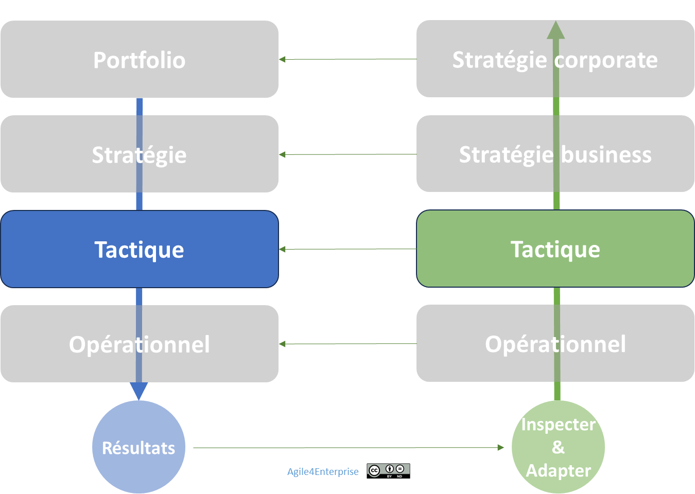

# La gouvernance adaptative tactique

✨ **Objectif** Montrer comment la gouvernance tactique devient un **métronome adaptatif**, orchestrant revues d’impact, d’ajustement et d’apprentissage pour que chaque unité tactique réoriente ses initiatives, ses ressources et ses priorités au rythme de la stratégie et du terrain.

➿ **Technova : La genèse d’une gouvernance vivante** Lorsque le PO de Technova Capteurs réalise qu’en trois mois son Backlog est périmé, c’est moins la vitesse qui fait la différence que la **cadence** : savoir quand arrêter, pivoter ou accélérer. **Six mois plus tard** La gouvernance tactique transforme cette urgence en un **rythme maîtrisé**, porté par le management intermédiaire. **Résultats :** réduction du time-to-market de 30 %, réaffectation de 15 % des ressources sur des projets à haut impact, satisfaction client en hausse de 10 %.

Cadence du changement tactique

# Une gouvernance vivante au service de l’agilité tactique

---

## Pourquoi une gouvernance vivante ?

La gouvernance tactique relie l’intention stratégique et l’exécution terrain par des **rituels cadencés**, portés par le management intermédiaire :

- **Orchestration des mobilités tactiques** (redistribution d’équipes),
- **Déclenchement des réajustements** au bon moment,
- **Encadrement de l’autonomie** sans dispersion.

> « Nous n’avons pas manqué de décisions, mais de rythme pour agir. » — Manager Technova
> 

## Gouvernance participative et itérative

Ce qui doit être gouverné :

- **OKR tactiques** comme langage d’alignement.
- **Revues tactiques** comme espaces de régulation partagée.
- **Slack tactique** comme capacité de manœuvre.
- **Mobilité des équipes** comme levier adaptatif.
- **Autonomie décisionnelle locale**, encadrée par le cap stratégique.

Avec une m**odèle de gouvernance basé sur :**  **Participatif** et **itératif**

## Les tensions à équilibrer

Cette gouvernance se joue à l’intersection de trois curseurs :

| Tension | Excès | Insuffisance | Pour viser l’équilibre… |
| --- | --- | --- | --- |
| **Autonomie encadrée** | Micro-management | Disparité d’efforts | offrir un cadre d’OKR clairs ; déléguer la prise de décision. |
| **Stabilité ↔ Flexibilité** | Plans rigides, démotivation | Réajustements désordonnés | fixer un cycle trimestriel d’ajustement. |
| **Planification ↔ Expérimentation** | Obsession du plan | Expérimentation sans direction | limiter à 3 OKR tactiques par cycle. |

## Le rôle pivot du management intermédiaire

.Le management intermédiaire devient :

- Orchestrateur de **mobilité tactique**,
- Régulateur de **cadences d’adaptation :** Il **déclenche** les réajustements au bon moment,
- Garant de **l’autonomie encadrée des équipes**.

> « Nous n’avions pas besoin de plus de réunions, mais d’une cadence qui nous pousse à agir. » — Manager chez Technova
> 

---

## Cadences tactiques : la respiration d’une organisation adaptable

## Trois cadences pour faire vivre la tactique

| Cadence | Fréquence | Finalité |
| --- | --- | --- |
| Cadence d’adaptation | Trimestrielle | Révision des priorités, reconfiguration des unités, ajustement des OKR |
| Cadence d’ajustement | Mensuelle / bi-mensuelle | Correction des écarts d’alignement, de connaissance, d’effet |
| Cadence opérationnelle | Hebdomadaire / bi-mensuelle | Exécution concrète, détection de signaux faibles |
- **Cadence principale : Trimestrielle**
    - Offre assez de recul pour vérifier la pertinence des OKR tactiques.
    - Préserve la stabilité des unités tout en laissant place à l’expérimentation.
- **Boucles intermédiaires**
    - Mensuelle/Bi-mensuelle pour corriger en continu.
    - Hebdo/Bi-hebdo pour détecter signaux faibles et basculer rapidement.

---

### Comment ça fonctionne ?

- **Définition & pilotage d’OKR tactiques**
    
    Traduisent la stratégie en 3–5 objectifs prioritaires par unité.
    
- **Ajustement des ressources**
    
    Réallocation en fonction des résultats intermédiaires (retours, KPIs, feedback).
    
- **Revues tactiques**
    
    Décision d’accélérer/pivoter/stopper des objectifs sur le prochain cycle.
    

---

### Comment gérer le changement ?

- **Unité & objectifs stables** sur un trimestre
- **Initiatives évolutives** : lancement, test, adaptation sans renégocier tout le plan
- **Revues tactiques** : moment où l’on recompose les équipes selon les priorités
- **Dysfonctionnement** : sans mobilité, les équipes tirent dans des directions opposées et la stratégie se perd dans les frictions.

---

### Synchronisation multi-niveaux

| Niveau | Cadence | Rôle |
| --- | --- | --- |
| **Stratégique** | Annuel / Trimestriel | Choisir les grands axes, allouer les budgets |
| **Tactique** | Trimestriel / Mensuel | Exécuter et ajuster les priorités |
| **Opérationnel** | Hebdomadaire | Réaliser le terrain, réagir localement |

**Boucle adaptative** : chaque rituel alimente le suivant.

> Cadences imbriquées garantissent un pilotage adaptatif de bout en bout.
> 

## Premiers pas : votre checklist de démarrage

1. Sélectionner une **unité pilote** transverse.
2. Bloquer **10 % de slack tactique** dans la capacity planning.
3. Mettre en place un **board partagé** (OKR, KPIs, critères d’arrêt).
4. Planifier la première **revue tactique** dans 4 semaines.

---

#