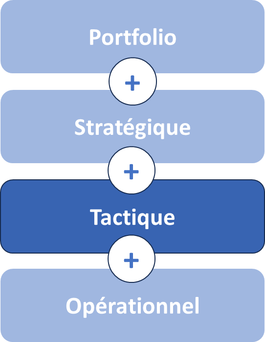

# L’agilité tactique : vue d’ensemble

Propriétaire: Laurent Morisseau

- Sommaire

<aside>
✨

**Objectif**

Poser les bases de l’agilité tactique : une boucle adaptative intermédiaire garantissant l’alignement vivant entre stratégie business et exécution opérationnelle.

</aside>

<aside>
➿

## Technova

Quand Technova Capteurs, lance sa feuille de route annuelle, elle ne s’attend pas à ce que trois mois suffisent à rendre son backlog obsolète. Clients exigeants, concurrents agiles, contraintes réglementaires… Le responsable produit (PO) se rend compte qu’il doit redéfinir ses priorités en deux semaines plutôt que de poursuivre un plan déjà dépassé. C’est ce basculement, entre planification et réalité, qui définit l’**agilité tactique** : une boucle vivante d’apprentissage et d’ajustement.

</aside>

# Piloter la tactique comme une boucle adaptative vivante

## **Qu'est-ce que l'agilité tactique ?**

<aside>
💡

L’**agilité tactique** joue un rôle clé dans l'exécution dynamique de la [stratégie adaptative](https://www.notion.so/L-agilit-strat-gique-vue-d-ensemble-13490eaf28ff80e2b4d8f6ab581de0f3?pvs=21) et de la tactique.

C’est un processus adaptatif continu qui orchestre retours fréquents, pilotage par l’impact et mobilisation flexible des ressources pour aligner stratégie et opérationnel.

</aside>

L’**agilité tactique** porte sur la capacité à changer ou répondre aux changements de manière appropriée et efficace au niveau de chaque unité tactique.

Une organisation n’est réellement agile que si son processus de décision tactique l’est aussi.

La place de l’agilité Tactique dans les niveaux de décisions

## Trois erreurs classiques de l’exécution stratégique à désactiver

| Erreur | Implication | Risque |
| --- | --- | --- |
| Écart de connaissance | Données hétérogènes ou manquantes | Décisions tardives ou prises à l’aveugle |
| Écart d’alignement | Décisions vs réalité terrain | priorités et Initiatives contradictoires, gaspillage, mauvais timing |
| Écart d’effet | Résultats vs attentes | Perte de confiance et démobilisation |

C’est pourquoi l’agilité tactique repose sur une boucle adaptative tactique **synchronisée** avec :

- Les décisions stratégiques,
- Les retours opérationnels,
- Les arbitrages d’impact.

## Les tensions clés à piloter

L’Agilité tactique n’est pas une évidence : elle bouscule également plusieurs équilibres fondamentaux :

| Tension | Risque d’excès | Risque d’insuffisance |
| --- | --- | --- |
| **Alignement vs Autonomie** | Micro-management, lenteurs | Dispersion, incohérences |
| **Stabilité vs Flexibilité** | Plans rigides, inadéquats | Agitation sans ancrage |
| **Planification vs Apprentissage** | Obstination sur le plan initial | Pas de cap, expérimentation sans fin |

> Le rôle du management tactique est de glisser le curseur entre ces extrêmes selon la maturité de l’équipe et la volatilité du contexte.
> 

## Le modèle vivant de l’agilité tactique

L’agilité tactique fait passer l’entreprise d’une **exécution stratégique linéaire** à un **développement stratégique continu**, dans lequel la stratégie se nourrit en permanence des retours du terrain et des signaux du marché. Plutôt que de suivre un plan figé, elle déploie un cycle « planifier – exécuter & mesurer – ajuster » permettant à chaque niveau de décision (stratégique, tactique, opérationnel) de rester aligné tout en expérimentant localement.

**Points clés :**

- **Reconfigurer en continu**
    
    Ajuster la stratégie face aux signaux faibles et aux évolutions du marché, plutôt que d’attendre la prochaine révision annuelle.
    
- **Modifier la tactique par l’apprentissage**
    
    Piloter chaque sprint (1–2 semaines) avec boucles de feedback systématiques (clients, data, terrain) et éliminer ou pivoter les initiatives selon leur impact.
    
- **Ajuster l’organisation**
    
    Allouer ou réallouer ressources et responsabilités en fonction des priorités émergentes pour maintenir cohérence et réactivité.
    
- **Maintenir la cohérence globale**
    
    Synchroniser les OKR stratégiques, tactiques et opérationnels via des cadences imbriquées et un tableau de bord partagé.
    
- **Défi systémique**
    
    Réussir à adapter la stratégie en temps réel tout en poursuivant l’activité courante repose sur :
    
    1. Des décisions distribuées à tous les niveaux.
    2. Un design organisationnel flexible pour fluidifier l’information.
    3. Une gouvernance adaptative pour arbitrer innovation et exécution.
    4. Une culture du feedback et de l’expérimentation.

**Risques à surveiller : le piège de l’ajustement tactique permanent !**

- **Exploitation excessive** : focalisation sur l’opérationnel au détriment de l’évolution stratégique.
- **Stratégie statique** : incapacité à s’ajuster hors cycle formel.
- **Désalignement local** : initiatives locales déconnectées des priorités globales.
- **Surréaction** : trop d’ajustements sans vision long terme, d’où la nécessité d’un cadre clair et d’une confiance forte dans les équipes.

## Les quatre leviers de l’agilité tactique

Technova identifie une unité pilote transverse. Pour rester aligné tout en restant réactif, l’équipe s’appuie sur quatre leviers interdépendants :

| Levier | Rôle | Décisions Technova |
| --- | --- | --- |
| **Pilotage par l’impact** | Mesurer la valeur réelle avant tout | Définition et pilotage d’OKR tactiques |
| **Boucles de feedback (***retours clients & données terrain)* | Ajuster chaque itération | Sprint de 2 semaines + atelier retour clients. *Tester → Apprendre → Ajuster → Réitérer.* |
| **Cadences (***rythme annuel, trimestriel, hebdo)* | Synchroniser tous les niveaux | Point hebdo, revue trimestrielle, comité annuel. Mise en place d’un KPI / OKR board partagé et actualisé chaque semaine. |
| **Autonomie encadrée** (slack tactique*)* | Pivoter sans renégocier tout le plan | 10 % de capacité réservée pour prototype, critères d’arrêt clairs. |

---

<aside>
➿

## Technova gagne en agilité

> « Après chaque cycle tactique, on ne demande pas seulement : ‘Avons‑nous terminé ?’ mais ‘Quel impact avons‑nous créé ?’ » – PO, Technova
> 

Après deux cycles, Technova réduit de 30 % son time‑to‑market, et réaffecte 15 % de ses ressources sur des projets à plus fort impact. L’agilité tactique transforme l’exécution en un moteur d’innovation continue.

</aside>

# Et concrètement, lundi matin ?

**✍️ Évaluez votre besoin d’agilité tactique avec ces 5 questions :**

- Les décisions stratégiques sont-elles concrètes et actionnables rapidement ?
- Est-ce que les actions terrain contribuent réellement aux décisions stratégiques ?
- Est-ce que la stratégie est ajustée à l’aune des résultats tactiques ?
- Les équipes peuvent-elles adapter leurs actions en fonction des retours terrain et des opportunités ?
- Sommes-nous prêts à arrêter une initiative non performante dès aujourd’hui ?

> **Alerte** : trois « non » ou plus indiquent que votre boucle adaptative est grippée.
> 

---

---

# 🔑 Points clés à retenir

1. **Boucles courtes** : chaque sprint est un apprentissage.
2. **Pilotage par l’impact** : valeur avant complétion.
3. **Autonomie encadrée** : liberté dans des limites claires.
4. **Renoncements ciblés** : moins, mais mieux.
5. **Développement stratégique** : plan et feedback nourrissent mutuellement la stratégie.

> L’agilité tactique est le cœur battant de votre alignement en mouvement.
> 

### 👉 Et maintenant ? Prêt·e à faire battre le [cœur de votre tactique](https://www.notion.so/La-gouvernance-adaptative-tactique-13b90eaf28ff8066aa8bc5c28ac35645?pvs=21) ?

##