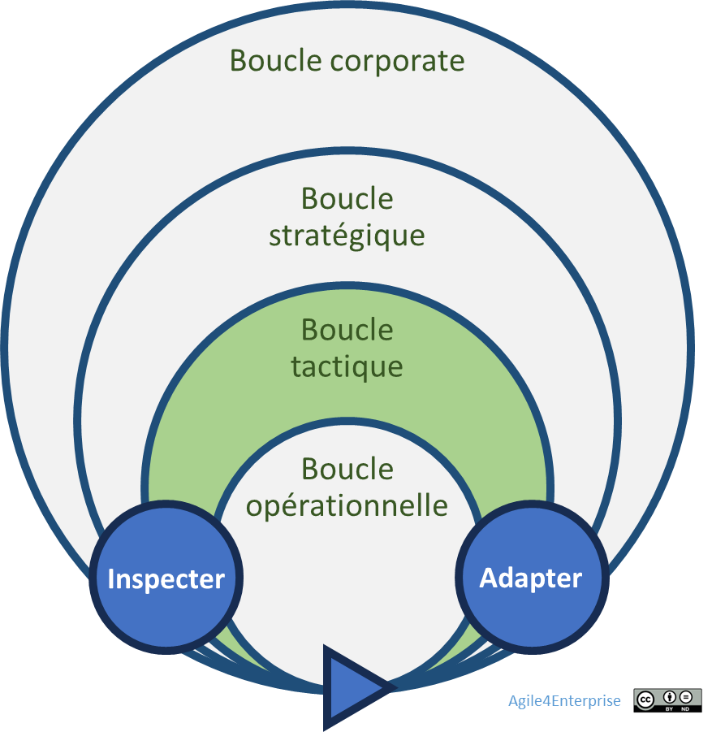

# L’agilité tactique : vue d’ensemble

✨**Objectif**

Passons maintenant à la tactique : une boucle adaptative intermédiaire garantissant l’alignement dynamique entre stratégie business et exécution opérationnelle.

🧑‍🎓**Ce que vous allez apprendre ici**

- Comment passer d’une logique de planification linéaire à une logique d’expérimentation guidée par l’impact ?
- Quels sont les leviers concrets (OKR tactiques, Slack, cadences, feed-back clients) pour faire de la tactique un moteur d’innovation continue ?
- Pourquoi trop d’ajustements tactiques sans boussole stratégique peuvent-ils épuiser le système ?

📚**Petit lexique**

- **Unité tactique** = groupe d’équipes autonomes sur une même chaîne de valeur.
- **Slack tactique** = marge de manœuvre (10–15 %) réservée pour pivoter sans renégocier tout le plan.
- **Mobilité tactique** = capacité à redistribuer équipes et ressources selon les besoins d’une unité.

## Qu’est-ce que l’agilité tactique ?

🧑‍🎓

**Agilité tactique** :

Elle traduit la capacité de chaque unité à évoluer, ou à répondre aux changements, de manière appropriée et efficace. C’est un mécanisme adaptatif continu qui combine retours fréquents, pilotage par l’impact et mobilisation flexible des ressources, afin de maintenir un alignement constant entre stratégie et opérationnel. Une entreprise devient agile si son processus **de décision tactique** le devient lui-même.

## Trois erreurs classiques à désactiver

Lorsque l’on exécute la stratégie, l’écart entre intention et réalité a trois origines :

| Erreur | Implication | Risque |
| --- | --- | --- |
| Écart de connaissance | Données hétérogènes ou manquantes | Différer les décisions afin d’obtenir toutes les informations, plutôt que de passer à l’action pour apprendre rapidement. |
| Écart d’alignement | Décisions vs réalité terrain | Imposer une feuille de route des projets plutôt qu’un objectif à atteindre. |
| Écart d’effet | Résultats vs attentes | Piloter par les livrables pour coller au plan, plutôt que par les résultats |

## Les principes

Pour éviter ces écueils, l’agilité repose sur les principes ci-dessous :

- **Cycle d’apprentissage** « planifier — exécuter et mesurer — adapter ».

- **Ajuster l’organisation**, ressources et responsabilités, en fonction des priorités émergentes.

- **Maintenir l’alignement**, OKR stratégiques, tactiques et initiatives, par des cadences imbriquées.

### Le piège de l’ajustement tactique permanent

- **Exploitation excessive** : focalisation sur l’opérationnel.
- **Stratégie statique** : rupture du lien avec la tactique, d’où une incapacité à s’ajuster.
- **Désalignement** : initiatives locales déconnectées des priorités globales.
- **Surréaction** : trop d’ajustements sans vision long terme.

➿**TechNova**

> *« Après chaque cycle tactique, on ne demande pas seulement : “Avons‑nous terminé ?”, mais “Quel impact avons‑nous créé ?” » — Product Owner*

L’équipe pilote **Orion**, en interface directe avec la R&D IA et le service client Capteurs, incarne une cellule rendue autonome pour tester une approche par cycles courts. Pour rester alignée tout en réagissant vite, elle s’appuie sur quatre leviers interdépendants :

| Levier | Décisions |
| --- | --- |
| **Pilotage par l’impact** | Définition et pilotage d’OKR tactiques alignés sur les enjeux IA/Capteurs |
| **Boucles de feed-back** | Sprint de deux semaines, suivi d’un atelier de retour des utilisateurs et de données de terrain. |
| **Cadences** | Revue trimestrielle. OKR partagé mis à jour toutes les deux semaines|
| **Autonomie encadrée** | 10 % de capacité réservée pour prototypes (Slack tactique), avec critères d’arrêt clairs |

Une revue bimensuelle élargie (Product Owner support, opérations) permet de prioriser les ajustements pour la boucle suivante — sans attendre le trimestre.

En trois cycles, l’équipe Orion :

- Réduit de 20 % son time‑to‑market,
- Réaffecte 10 % de ses ressources vers des projets à fort impact,
- Fait émerger un MVP IA intégré.

## 👣 Et concrètement, lundi matin ?

Évaluez votre besoin d’agilité à travers 5 questions :

- Les décisions stratégiques se traduisent-elles en actions immédiates ?
- Les actions terrain alimentent-elles réellement ces décisions ?
- La stratégie s’ajuste-t-elle aux résultats tactiques ?
- Les équipes adaptent-elles leur plan selon les retours et opportunités ?
- Pouvez-vous stopper dès aujourd’hui une initiative non performante ?

> **Attention** : trois « non » ou plus indiquent une tactique grippée.

