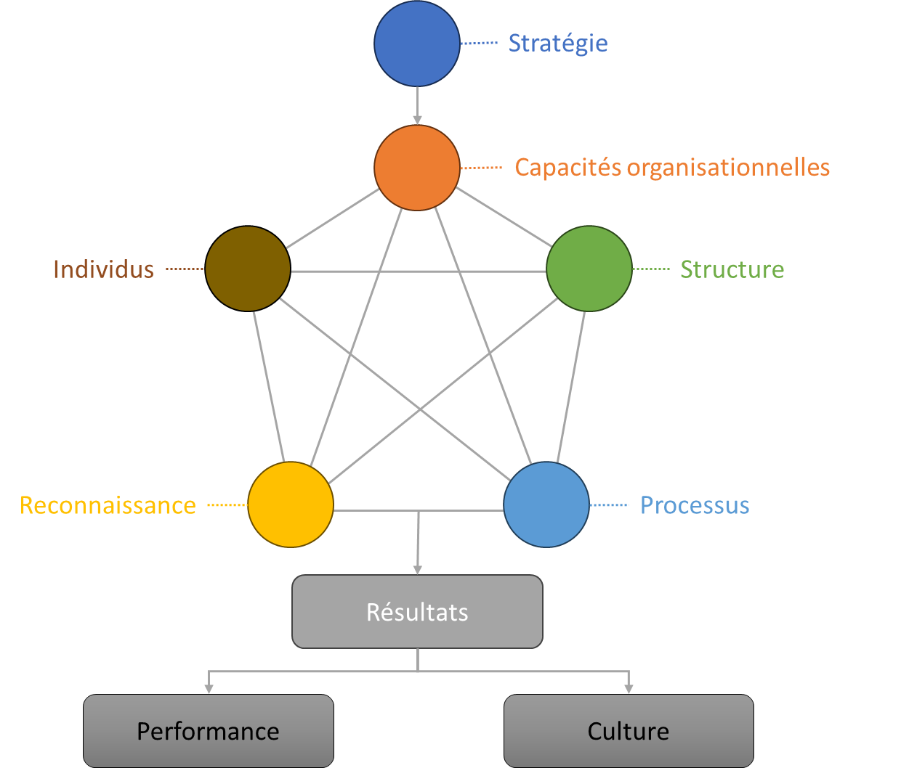

# Agile4X : Les forces organisationnelles

Propriétaire: Laurent Morisseau

- Sommaire

<aside>
✨

**Objectif**

Cette section présente le **modèle des 4 archétypes agiles** , une grille de lecture stratégique pour concevoir une organisation **alignée, cohérente et activable**.

C’est un outil de **design systémique**, non prescriptif, guidant les choix structurels en fonction des logiques stratégiques dominantes.

</aside>

<aside>
➿

**TechNova** Fin 2024.

La scale-up réalloue **20 %** de ses effectifs R&D pour un prototype de capteurs IoT. En trois mois, son MVP est en test marché.

A votre avis, comment s’est-elle organisée pour y parvenir ?

</aside>

<aside>
🧑‍🎓

**Lexique rapide**

- **Design systémique**
    
    Approche holistique qui considère l’organisation comme un système interconnecté.
    
- **SCRIP**
    
    Acronyme issu du modèle de Galbraith, décrivant cinq dimensions indissociables : **Structure, capacités, Reconnaissance, Individus**, **Processus**
    
- **Archétype**
    
    Modèle idéal incarnant une stratégie dominante.
    
</aside>

# Pourquoi un modèle d’archétypes ?

Les organisations souffrent souvent de **dissonances structurelles** : innovation dans un cadre de standardisation, projets dans un flux continu, produit pensé hors contexte d’exploration.

Ces contradictions freinent l’exécution stratégique. Cette grille de lecture permet de **réduire ces paradoxes** en alignant votre modèle opératoire sur la stratégie choisie.

<aside>
➿

TechNova a dû adopter un fonctionnement Projet pour accélérer l’innovation de ses capteurs, séparé de son organisation en Flux caractéristique de sa zone d’exploitation.

</aside>

# Principe des archétypes agiles

L’agilité n’est pas une méthode. Elle naît de la **lutte** entre dynamiques incompatibles : rapidité vs stabilité, exploration vs exploitation. Les [4 dimensions de l’agilité](https://www.notion.so/Agile4E-La-cartographie-strat-gique-vivante-13490eaf28ff803a884fc20066900149?pvs=21) posent les principes généraux, mais le **modèle opératoire** – c’est-à-dire l’organisation réelle – dépend du **type de stratégie** poursuivie.  C’est pourquoi, chaque archétype incarne une configuration des **forces organisationnelles en tension**.

Attention, ce sont des **modèles idéaux**, rarement rencontrés à l’état pur. Ce sont des **référentiels de cohérence**, des stéréotypes, utiles pour **clarifier une cible** ou orienter un design organisationnel. Chaque archétype correspond à une forme **autonome**, à adapter au contexte. Alors attention à la simplification, à prendre cela comme un modèle prescriptif.

<aside>
➿

TechNova a découvert que piloter en mode Projet sans ajuster ses rituels (Processus) le menait vers l’excès de complexité.

</aside>

## Agile4X : Les 4 archétypes en un clin d’œil

Pour l’entreprise agile, nous avons identifié quatre archétypes :

| Archétype | Stratégie dominante | Zone 4E privilégiée |
| --- | --- | --- |
| [**Projet**](https://www.notion.so/Agile4Project-Arch-type-Projet-agile-13490eaf28ff8030a8aeecf9206d94ea?pvs=21) | Innovation ciblée et transformation rapide | Exploration / Transformation / Exclusion |
| [**Flux**](https://www.notion.so/Agile4Flow-Arch-type-Flux-13490eaf28ff809bac54ed5deaa8a257?pvs=21) | Excellence opérationnelle et efficience | Exploitation |
| [**Produit**](https://www.notion.so/Agile4Product-Arch-type-Produit-13490eaf28ff80b29733f767568ab6a5?pvs=21) | Croissance, time-to-market, orientation client | Expansion |
| [**Réseau**](https://www.notion.so/Agile4Network-Arch-type-R-seau-13490eaf28ff805c8fcfeed28b68a77b?pvs=21) | Adaptabilité et autonomie distribuée | Exploration / Exploitation |

Ces formes ne s’excluent pas : l’entreprise agile est **plurielle**, et peut combiner plusieurs archétypes selon ses zones stratégiques.

### L’anti archétype **Zombie**

Certaines entreprises veulent **tout à la fois :** stabilité et exploration, rapidité et maîtrise, routines et ruptures. Elles **miment la transformation** sans logique claire, jusqu’à en perdre le sens.

Pour elles, nous avons créé l’anti archétype [Zombie](https://www.notion.so/Agile4Zombie-L-anti-arch-type-1db90eaf28ff802ebcecd01e11f22848?pvs=21) : lorsque l’organisation refuse de choisir, elle s’épuise à tout faire sans logique claire. La stratégie c’est faire des choix et les assumer !

## Le modèle SCRIP : vos leviers d’action

Afin de définir ces archétypes, nous allons utiliser le modèle SCRIP. **SCRIP,** issu du modèle de Galbraith, est un acronyme pour cinq dimensions clés :

- **Structure** : rôles, niveaux hiérarchiques, mécanismes de coordination.
- **Capacités** : compétences clés, technologies, slack pour expérimenter.
- **Reconnaissance** : incitations monétaires et symboliques.
- **Individus** : culture, postures collaboratives, développement continu.
- **Processus** : rituels, boucles adaptatives tactiques et opérationnelles.

> 💡 Imaginez que chaque partie de l’entreprise soit comme un organe : 
Structure = squelette, Capacités = muscles, Processus = système nerveux, Reconnaissance = dopamine, Individus = cellules. SCRIP aide à garder l’organisme en bonne santé en maintenant en cohérence toutes ces dimensions.
> 

<aside>
➿

TechNova a revu sa structure en créant une équipe-projet dédiée et instauré des flash reviews (Processus) toutes les deux semaines.

</aside>

## Et concrètement, lundi matin …

**Identifiez dans votre organisation** les désalignements entre les cinq dimensions SCRIP avant d’envisager l’un des archétypes.

1. Listez 3 désalignements. Par exemple : promouvoir l’auto organisation des équipes en continuant à privilégier une évaluation individuelle de la performance, recruter des collaborateurs hyperspécialisés pour des équipes pluri disciplinaires…
2. Préparez ces observations pour le diagnostic « Dans quelle archétype se trouve mon organisation ? » à venir.

En attendant, partagez ce diagnostic avec votre équipe dès lundi.

---

# 🔑 Points clés à retenir

**Les archétypes agile en 5 points clés**

1. L’agilité s’exprime dans la **tension** entre stratégies parfois contradictoires.
2. Quatre archétypes modèles : **Projet**, **Flux**, **Produit**, **Réseau**.
3. Chaque archétype sert une stratégie dominante et s’inscrit dans une zone 4E.
4. Le modèle **SCRIP** (Structure, Capacités, Reconnaissance, Individus, Processus) décline ces archétypes en leviers concrets.
5. Une entreprise agile est **plurielle** : elle combine plusieurs archétypes selon ses enjeux.

<aside>
➿

« Nous avons accéléré notre MVP en trois mois, mais la vraie bataille commence maintenant », confie Marie Dupont, CTO de TechNova. « Le plus dur ? Passer de 10 à 100 clients sans perdre en qualité ».

</aside>

**TechNova** a réussi son prototype… mais comment va-t-elle encaissée la montée en charge ? Découvrez-le dans les prochains chapitres  qui détailleront chaque archétype.

### 👉 Et maintenant ? Zoom sur l’[archétype Agile4Flow](https://www.notion.so/Agile4Flow-Arch-type-Flux-13490eaf28ff809bac54ed5deaa8a257?pvs=21) !

---

## Annexe : Comment définir un archétype organisationnel ?

## Qu'est-ce qu'un archétype organisationnel ?

Un **archétype organisationnel** est un modèle représentant une configuration récurrente de structures, de processus et de comportements dans les organisations. Il aide à comprendre comment les entreprises fonctionnent, prennent des décisions et interagissent avec leur environnement.

### L’évolution des archétypes classiques

Un archétype est une **réponse organisationnelle cohérente à une logique stratégique dominante**. Les quatre archétypes agiles peuvent être vus comme une évolution des modèles classiques de spécialisation dans les organisations :

- **Fonctionnelle** : A évolué en matrice, puis en flux avec une coordination horizontale.
- **Business** : A évolué en organisation produit.
- **Géographique** : A évolué en organisation réseau.
- **Projet** : A évolué en organisation projet agile.

### Exemples d'archétypes organisationnels

Les archétypes ne sont pas nouveaux. Par exemple :

- **Bureaucratie** : Structure hiérarchique avec des règles strictes.
- [**Adhocratie](https://www.notion.so/Design-organisationnel-de-la-zone-Exploration-13f90eaf28ff8012b2fcc13892e9048e?pvs=21)** : Organisation flexible, favorisant l’innovation et la collaboration, et à l’origine de l’agilité.

## Trois leviers d’alignement organisationnel

Une organisation repose sur trois choix fondamentaux :

- **Spécialisation** : fonctionnelle, produit, projet, géographique…
- **Coordination** : verticale, horizontale, réseau…
- **Formalisation** : du plus bureaucratique au plus organique.

Ces leviers doivent être cohérents avec la stratégie dominante pour soutenir l’agilité organisationnelle. La spécialisation est efficace dans des environnements stables, tandis que la coordination permet d’assurer l’intégration.

### Le modèle SCRIP : pour décrire chaque archétype

Inspiré du modèle de Galbraith

Inspiré du modèle de Galbraith, chaque archétype est analysé selon les dimension SCRIP :

- **Structure**
    
    La structure fait référence à la manière dont les rôles, les responsabilités et les relations hiérarchiques sont organisés au sein de l'organisation. Cela inclut :
    
    - Les organigrammes et niveaux hiérarchiques.
    - La répartition des unités stratégique et tactique.
    - Les mécanismes de coordination et de reporting.
    
    Une structure bien conçue permet de clarifier les flux d'autorité et les mécanismes de collaboration.
    
- **Capacités organisationnelles**
    
    Les capacités (parfois appelées capabilités ou compétences collectives) désignent les outils, les technologies et les ressources nécessaires pour soutenir la stratégie. Cela comprend :
    
    - Les compétences organisationnelles clés (innovation, gestion de la chaîne logistique, etc.).
    - Les technologies et infrastructures nécessaires.
    - La capacité d'adaptation et d'apprentissage organisationnel.
    
    Les capacités permettent à l’organisation de répondre efficacement aux défis stratégiques. Dans le cadre de l’agilité ce sont les [4 capacités organisationnelles](https://www.notion.so/Agile4C-Les-4-capacit-s-organisationnelles-cl-s-13790eaf28ff8077bff1ecf61771656f?pvs=21) en réponse au changement : réactif, flexible, adaptable, proactif
    
- **Reconnaissance**
    
    Cela concerne les systèmes de récompenses et d’incitations utilisés pour motiver et orienter les comportements des employés. Cela inclut :
    
    - Les salaires, primes et avantages.
    - Les mécanismes de reconnaissance non monétaires (récompenses symboliques, opportunités de développement).
    - Les évaluations de performance et les retours réguliers.
    Un système de reconnaissance bien conçu encourage les employés à adopter les comportements et les résultats alignés avec la stratégie.
- **Individus**
    
    Cette dimension englobe les personnes au sein de l'organisation et leur rôle dans la mise en œuvre de la stratégie. Elle inclut :
    
    - Le recrutement, la gestion des talents et le développement des compétences.
    - Les valeurs, la culture organisationnelle et les comportements attendus.
    - Les interactions et collaborations entre individus.
    
    Les individus représentent le moteur de l’organisation, et leur alignement avec les objectifs stratégiques est essentiel.
    
- **Processus**
    
    Les processus concernent les flux de travail et les systèmes qui guident la prise de décision et l'exécution des tâches. Ils englobent :
    
    - Les processus opérationnels ou métier (production, logistique, facturation, etc.).
    - Les processus de gestion (planification stratégique, gestion des risques).
    - Les mécanismes de communication et de partage d'informations.
    
    Les processus permettent de garantir l'efficacité et la cohérence des opérations au sein de l'organisation.
    

Ce modèle est intégré à l’outil [ACTE](https://www.notion.so/Guide-de-l-outil-ACTE-13490eaf28ff802e8fcde2047f78143b?pvs=21), permettant de piloter l’évolution des archétypes dans une transformation.

**En entrée**, le modèle se base sur la stratégie, issue du business model, pour créer une organisation cohérente.

### Les résultats

Les résultats sont mesurés à deux niveaux :

- **Performance** : Résultats financiers et opérationnels.
- **Culture** : Adhésion aux valeurs et pratiques.

Ces résultats illustrent l'alignement entre stratégie, tactique et opérationnel, où performance et culture sont la combinaison des cinq leviers interdépendants.

---