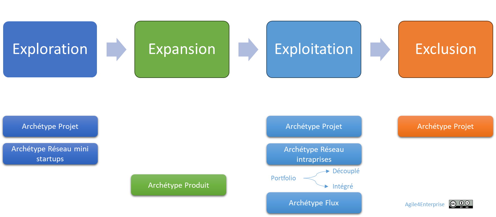

# Portefeuille Agile 4E-4X

✨ **Objectif** Montrer comment articuler les archétypes Agile4X au sein du portefeuille stratégique  Agile4E, pour transformer vos investissements en leviers d’innovation et de performance.

➿ TechNova La direction souhaite cartographier ses initiatives dans le modèle 4E, et s’assurer du bon alignement stratégique de ses unités d’affaires : - **Un proof of concept IA** à tester. - **Le passage à l’échelle d’un produit domotique**. - **La maintenance de vos services critiques**. - **La fermeture d’une offre en perte**. **Question** : Quel modèle opératoire adopter pour chacune de ces initiatives ?

🧑‍🎓 Lexique rapide **Agile4E** : Exploration, Expansion, Exploitation, Exclusion. **Archétypes** : Réseau, Projet, Produit, Flux, adaptés à chaque zone. **PACTE** : Portfolio Agile Canevas pour la Trajectoire d’Entreprise

# Un ancrage dans le modèle 4E

Les archétypes agiles et le modèle 4E

Vous avez cartographier vos activités stratégiques dans le modèle Agile4E avec l’outil PACTE. Pour un alignement stratégique, il vous maintenant définir un modèle opératoire agile adapté pour chaque zone stratégique. 

Chaque zone du modèle appelle un ou deux archétypes privilégiés :

- **Exploration** ➔ Archétype **Réseau** ou **Projet**
- **Expansion** ➔ Archétype **Produit**
- **Exploitation** ➔ Archétype **Flux** ou **Réseau**
- **Transformation** ➔ Archétype **Projet**

Cela permet de concevoir une **organisation réellement ambidextre**, capable de faire coexister différents modèles opératoires.

## Zone d’Exploration

- **Stratégie** : innovation.
- **Contexte** : prototypes, R&D, incubateurs internes.
- **Archétype Réseau** : cellules autonomes expérimentent durablement.
- **Archétype Projet** : équipes temporaires testent des prototypes.

## Zone d’Expansion

- **Stratégie** : produit, optimisée pour la création de valeur.
- **Contexte** : développement, croissance, passage à l’échelle.
- **Archétype Produit** : backlog structuré, priorisation par valeur.

## Zone d’Exploitation

- **Stratégie** : engagement de service.
- **Contexte** : services établis, maintenance, support.

Dans cette zone, il s’agit d’exploiter au mieux et durablement les services et produits existants. Plusieurs axes sont possibles en partant du type de portefeuille stratégique basé sur son niveau d’intégration :

- Portefeuille intégré
    
    Stratégie Service associée à un l’archétype Flux
    
- Portefeuille couplé
    
    Stratégie Client / marché, modèle front-back “agile”
    
- Portefeuille découplé et conglomérat
    
    Archétype réseau de mini entreprises (intraprises)
    

Et enfin, la zone de productivité avec ses programmes de transformation avec l’archétype Projet%2013490eaf28ff8030a8aeecf9206d94ea.md).

## Zone d’Exclusion

- **Contexte** : offres en déclin, projets obsolètes.
- **Archétype Projet** : planifier et exécuter la fermeture ou la cession.

---

Dans cette typologie, les zones sont des domaines privilégiés pour les modèles organisationnels, cela ne veut pas dire qu’on ne les retrouve pas dans d’autres contextes. 

➿ **Portefeuille TechNova** | Initiative | Zone | Archétype | KPI principal | Responsable | | --- | --- | --- | --- | --- | | Prototype IA | Exploration | Réseau | % d’hypothèses validées | Dir. R&D | | Domotique | Expansion | Produit | Ventes mensuelles | CPO | | Maintenance Capteurs | Exploitation | Flux | SLA 95 % | COO | | Retrait SRE | Exclusion | Projet | Coût de sortie | CSO (stratégie) | **Prochaine revue** : T1 2025

# Une organisation agile vit des transitions entre archétypes

Les archétypes agissent comme des instantanés figés des tensions organisationnelles. Mais la vie d’une organisation, c’est le **mouvement entre ces tensions**, pas leur neutralisation.

Une transformation agile suppose **de passer d’un archétype à un autre** au fil de la stratégie. Cela génère des tensions — que l’outil PACTE permet d’accompagner.

Chaque transition suppose :

- Une cohabitation de tensions contradictoires. La transition ne se fait pas sans friction !
- Des arbitrages culturels,
- Des renoncements à des pratiques anciennes,
- Une nouvelle cohérence à construire.

⚠️ Une organisation peut et va évoluer. Mais **elle ne peut pas tout être en même temps**.

## Tout changement d’archétype implique une rupture

Passer du mode projet au mode produit ce n’est pas simplement livrer des fonctionnalités d’un produit ou faire du Scrum. Chaque transition exige un renoncement à des rôles, des métriques, des habitudes. Il s’accompagne de **pertes, de résistances, de renoncements**.

*Exemples :*

- *Passer du Projet au Produit : abandonner la logique de livrable, accepter l’itération, reconstruire le sens de la valeur.*
- *Passer du Flux au Réseau : renoncer à la performance prévisible, faire confiance aux interactions auto-organisées.*

💡 Changer d’archétype, c’est changer de logique sous-jacente, et donc à la fin de performance et de culture différentes !

## La cohérence est plus exigeante que le changement

Changer est fréquent. Changer avec cohérence est rare.

Ce n’est pas la transformation qui échoue, c’est l’incapacité à aligner la structure, la stratégie et les pratiques sur un archétype clair.

C’est pourquoi :

1. La conception du modèle opératoire se fait de manière agile
    
    Si la démarche est mixte (descendante et ascendante), une partie de ce modèle opératoire est défini par le management et une partie est définit avec les équipes.
    
2. Avec une gouvernance pour le faire évoluer
    
    Le modèle opératoire va évoluer avec la stratégie et les retours terrains des utilisateurs du modèle opératoire en construction.
    

---

## Et concrètement, lundi matin …

Animez un atelier 4E–4X

1. **Cartographier** chaque initiative selon Exploration / Expansion / Exploitation / Exclusion.
2. **Associer** l’archétype Agile4X recommandé.
3. **Définir** vos indicateurs clés (ex. % d’hypothèses validées, SLA, NPS, coût de sortie).
4. **Planifier** la première revue trimestrielle PACTE.

---

#