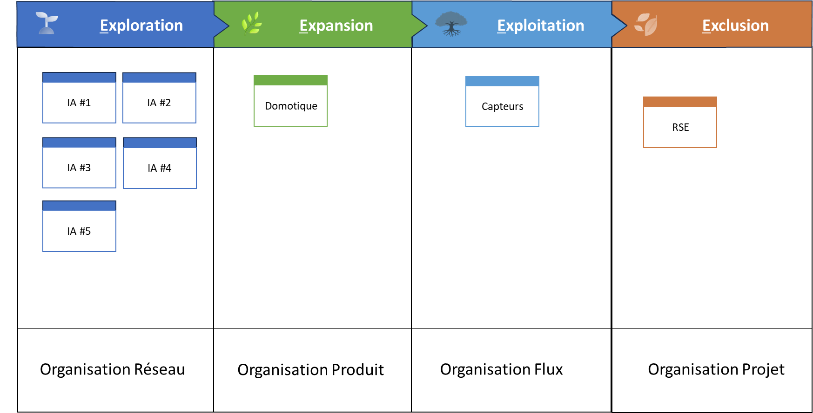

# Portefeuille Agile 4E-4X

✨**Objectif**

Dans ce chapitre, nous utiliserons le modèle Agile4E pour cartographier les archétypes, et associer stratégie et modèle organisationnel.

🧑‍🎓**Ce que vous allez apprendre ici**

- Associer chaque zone stratégique à un ou plusieurs archétypes privilégiés.
- Piloter une organisation ambidextre, avec des modèles opératoires différenciés selon les unités.

📚**Petit lexique**

- **Transition d’archétype** : Passage d’un modèle opératoire à un autre, nécessitant des arbitrages structurels, culturels et stratégiques.

## Un ancrage dans le modèle Agile4E

Après avoir cartographié vos activités stratégiques avec l’outil **PACTE**, l’étape suivante consiste à définir un modèle opératoire propre à chaque zone. Chacune d’elles se rattache à un ou deux archétypes privilégiés :

- **Exploration** ➔ **Réseau** ou **Projet**
- **Expansion** ➔ **Produit**
- **Exploitation** ➔ **Flux** ou **Réseau**
- **Zone Transformation** ➔ **Projet**
- **Exclusion** ➔ **Projet**

On peut ainsi concevoir une entreprise réellement **ambidextre**, où cohabitent plusieurs modèles opératoires. Le défi majeur consiste à harmoniser l’ensemble tout en assumant son hétérogénéité. Aucune solution universelle n’existe : chaque entreprise doit inventer sa propre manière d’articuler **stabilité et changement**.

### Zone d’exploration

- **Stratégie** : Innovation.
- **Contexte** : R&D, incubateurs, pôle de compétences.
- **Archétype Réseau** : Innovation distribuée et ouverte, portée par des cellules autonomes qui expérimentent en continu, à la manière d’un réseau de mini start-ups.
- **Archétype Projet** : Innovation orientée vers un objectif précis, conduite par des équipes temporaires.

### Zone d’expansion

- **Stratégie** : Produit. Elle est optimisée pour la création de valeur et l’innovation de continuité.
- **Contexte** : Développement et croissance.
- **Archétype Produit** : les équipes se structurent autour du produit à développer, dans une organisation conçue pour passer à l’échelle

### Zone d’exploitation

- **Stratégie** : Engagement de service. Elle est optimisée pour l’innovation d’efficience.
- **Contexte** : Services établis, maintenance, support.

Dans cette zone, l’enjeu consiste à valoriser durablement les actifs existants. Le choix d’approche dépend du type de portefeuille stratégique et de son niveau d’intégration :

- **Portefeuille intégré** : Stratégie de Service associée à l’archétype Flux.

- **Portefeuille couplé** : Stratégie client/marché, modèle front-back « agile » (hybride d’archétypes projet et produit/flux).

- **Portefeuille découplé** ou **conglomérat** : Archétype réseau de mini entreprises (intraprises).

Enfin, la **zone de productivité** repose sur ses programmes de transformation en mode Projet%2013490eaf28ff8030a8aeecf9206d94ea.md).

### Zone d’exclusion

- **Contexte** : Offres en déclin, actifs obsolètes.
- **Archétype Projet** : Planifier et conduire la fermeture ou la cession.

Dans cette typologie, les zones représentent des domaines privilégiés pour les modèles organisationnels, mais elles peuvent aussi apparaître dans d’autres contextes.

➿**TechNova**

La direction souhaite cartographier ses initiatives, et s’assurer du bon alignement de ses unités :

- Des prototypes IA à tester.
- Le passage à l’échelle d’un produit domotique.
- La maintenance des services critiques.
- La fermeture d’une offre SRE.

**Question** : Pour chaque initiative, quel modèle opératoire adopter ?

| Initiative | Zone | Archétype | Responsable |
| --- | --- | --- | --- |
| Prototype IA | Exploration | Réseau | Dir. R&D |
| Domotique | Expansion | Produit | CPO |
| Capteurs | Exploitation | Flux | COO |
| SRE | Exclusion | Projet | CSO (stratégie) |

## Une organisation agile vit des transitions entre archétypes

Les archétypes offrent une photo instantanée, tandis que des cycles de vie des initiatives stratégiques nous invitent à passer d’un archétype à l’autre. Chaque transition implique :

- Une cohabitation de tensions contradictoires,
- Des arbitrages culturels,
- Des renoncements à des pratiques anciennes,
- Une nouvelle cohérence à construire.

### Tout changement d’archétype implique une rupture

Passer du projet au produit ne consiste pas simplement à livrer des fonctionnalités ou à appliquer Scrum. La transition modifie la structure, les processus et jusqu’au système de reconnaissance. Chaque bascule entraîne pertes, résistances et renoncements : cela signifie abandonner la logique de livrable et redéfinir la valeur. Les autres transitions suivent la même logique, comme du Flux vers le Réseau, qui impose de renoncer à la performance prévisible et de miser sur les interactions auto-organisées. Changer d’archétype, c’est changer de logique profonde, ce qui implique de transformer à la fois les performances et la culture.

### Le changement, en cohérence

On change souvent, mais plus rarement avec cohérence. Ce n’est pas la transformation qui échoue, c’est la difficulté à tout aligner. C’est pourquoi :

1. Le modèle opératoire se conçoit de manière agile, en mode « inspecter et adapter » :

    Dans une démarche mixte (descendante et ascendante), le management construit une partie du modèle et les équipes l’autre.

2. Avec une gouvernance pour le faire évoluer grâce aux feed-back et aux apprentissages des collaborateurs.

## 👣 Et concrètement, lundi matin ?

Animez un atelier 4E–4X, pour :

1. **Cartographier** chaque initiative stratégique dans un PACTE,
2. **Associer** chacune avec un archétype,
3. **Définir** vos indicateurs clés adaptés,
4. **Planifier** la première revue trimestrielle PACTE.

## 🔑 Points clés à retenir

- **Agile 4E + 4X** vous offrent une double grille de lecture (zone ↔ archétype).
- **Choisir l’archétype** adapté à chaque zone renforce la cohérence et l’alignement.
- **Transition** : chaque changement d’archétype exige renoncements et arbitrages culturels.
- **PACTE** aide à visualiser ces zones, et ces transitions.

