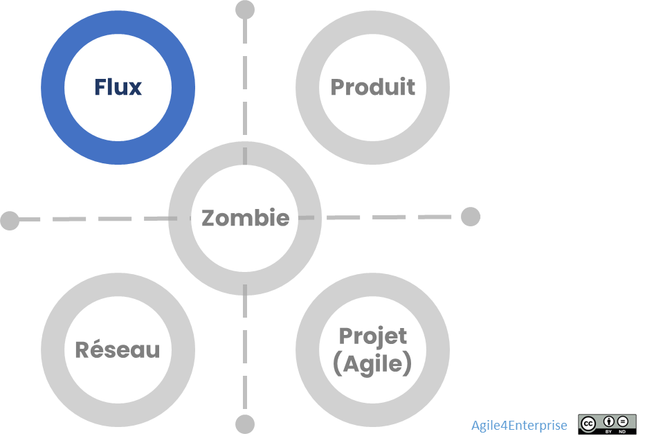

# Agile4Flow : Archétype Flux

Propriétaire: Laurent Morisseau

- Sommaire

<aside>
✨

**Objectif**

L’archétype **Flux** vise à optimiser les **chaînes de valeur continues**, en assurant **la fluidité des processus**, la **stabilité opérationnelle**, et **la prédictibilité des engagements**. Il s’adresse aux organisations qui cherchent à exceller dans l’**exécution de leur mission**, tout en maintenant une **capacité adaptative**, pour un **avantage concurrentiel soutenable** dans des environnements peu incertains mais fortement exigeants.

Agile4Flow s’inscrit dans le modèle des [**quatre archétypes agiles**](https://www.notion.so/Les-4-arch-types-agiles-14290eaf28ff8004874de93022c243f8?pvs=21). Il se distingue par son **orientation processus**, son **ancrage dans la zone d’exploitation**, et sa **valeur produite par la continuité de service**. Il est au service d’une **excellence opérationnelle durable** ou d’une **différenciation par le service**, en lien étroit avec la stratégie d’entreprise.

</aside>

Modèle des 4 archétypes agiles

# Positionnement stratégique

**Objectif stratégique :** Offrir **le meilleur service au meilleur coût**, grâce à une **gestion fluide**, **réactive** et **prédictive** des activités. Elle s'inscrit dans deux stratégies dominantes :

**Stratégie d'excellence opérationnelle**

Réduction des coûts par l’optimisation des processus. C’est le domaine du Lean avec des pratiques agiles au service de l’excellence opérationnelle.

**Stratégie de différenciation par le service**

C’est le domaine de l’agilité avec des pratiques du Lean orientées flux. L’approche en flux est un moyen pour atteindre l’engagement de service.

**Logique dominante :** Lean-Agile, orientée **flux de valeur**, plutôt que des ressources ou de la valeur. Plus précisément, avec une approche **basée sur une optimisation du flux tiré avec une approche [Kanban](https://www.notion.so/Kanban-17590eaf28ff8002ac08fead95b04e5a?pvs=21).** Dans le premier cas pour réduire les coûts, dans le second pour offrir le meilleur service au meilleur coût.

## **Les caractéristiques clés**

**Zone de valeur :** Phase de **maturité** de l’actif et clientèle **majorité tardive** dans le cycle d’adoption.

La phase privilégiée dans le cycle de vie de l’actif est la phase de [Maturité](https://www.notion.so/Design-organisationnel-de-la-zone-Expansion-13f90eaf28ff8097b421cd0166ec489b?pvs=21).

Le segment client privilégié est la [Majorité tardive](https://www.notion.so/Explorer-et-comprendre-la-strat-gie-13690eaf28ff81d18468ca20936fdecc?pvs=21), dans le cycle d’adoption.

<aside>
🧰

Zone d’Exploitation du modèle 4E

La zone de management privilégiée est la [zone d’exploitation](https://www.notion.so/Le-mod-le-A4E-de-l-agilit-portfolio-13490eaf28ff803a884fc20066900149?pvs=21).

La dimension Agile privilégiée est l’[**Agilité opérationnelle**](https://www.notion.so/L-agilit-op-rationnelle-13490eaf28ff80e5b767fd273784c80b?pvs=21), pour l’excellence et continuité du service.

</aside>

- **Positionnement stratégique :** Aligné avec des stratégies Lean-Agile visant **l'efficience des flux et leur prédictibilité** plutôt que la gestion par projet ou produit.
- **Secteurs d’application :** IT, support, maintenance, supply chain, production industrielle, services aux entreprises.
- **Méthodes privilégiées :** Kanban, DevOps, Lean Service Management.

## Design organisationnel : le modèle SCRIP appliqué au flux

Le design de l’archétype Flux repose sur une **organisation en réseau de services** articulée autour de **chaînes de valeur orientées utilisateur**. Le design [SCRIP](https://www.notion.so/Les-4-arch-types-agiles-14290eaf28ff8004874de93022c243f8?pvs=21) (Structure, Capacités, Reconnaissance, Individu, Processus) permet une lecture complète des dimensions du modèle.

### Structure

Extension à travers un réseau

<aside>
📚

En savoir plus sur le [design organisationnel pour l’exploitation](https://www.notion.so/Design-organisationnel-de-la-zone-Exploitation-13f90eaf28ff801888b5f5f63d62bfae?pvs=21)

</aside>

<aside>
💡

**Unité stratégique**

C’est le **Groupe Service**, structurant l’organisation autour d’un **réseau de [chaînes de valeur](https://www.notion.so/Concevoir-les-unit-s-tactiques-de-l-ext-rieur-vers-l-int-rieur-14390eaf28ff80108d31d366d1dc42af?pvs=21)**  fortement couplées.

</aside>

<aside>
💡

**Unité tactique**

C’est la [**chaîne de valeur](https://www.notion.so/Concevoir-les-unit-s-tactiques-de-l-ext-rieur-vers-l-int-rieur-14390eaf28ff80108d31d366d1dc42af?pvs=21), p**lutôt stable, centrée sur des parcours utilisateur ou des processus métiers.

</aside>

<aside>
💡

Unité opérationnelle

Équipes stables, pluridisciplinaires, responsables de leur flux.

</aside>

La structure favorisant un engagement de service en optimisant les flux est constitué d’un réseau de services, constituant un groupe Service, couplés et indépendamment viables, avec des frontières claires et une responsabilité alignée sur la chaîne de valeur métier.

Plus concrètement, c’est un réseau systèmes Kanban, reposant sur des B**acklogs d’équipe interconnectés**, et des **classes de service** pour articuler l’engagement.

- [Couplage fort](https://www.notion.so/Les-principes-de-design-strat-gique-13e90eaf28ff80628778e05ec7ed18cc?pvs=21) entre systèmes Kanban (les unités tactiques)
    - Réalisé autour du niveaux de service, au travers des [classes de services](https://www.notion.so/A4E-et-ESP-14390eaf28ff80869706ce0d8ef2e12f?pvs=21).
        
        Les classes de services sont le marqueur du couplage de l’unité stratégique ayant une stratégie orientée service.
        
        > *Exemple : Une entreprise de support informatique en flux optimise la gestion des demandes clients via des classes de service (urgences critiques, maintenance planifiée, incidents mineurs).*
        > 
    - Ce réseau de systèmes Kanban constitue le [réseau informelle de l’organisation duale](https://www.notion.so/La-reconfigurabilit-organisationnelle-14390eaf28ff80a3bb7dcfa1a866df07?pvs=21), facilitant ainsi la [reconfigurabilité](https://www.notion.so/La-reconfigurabilit-organisationnelle-14390eaf28ff80a3bb7dcfa1a866df07?pvs=21) et permettant une [agilité organisationnelle](https://www.notion.so/L-agilit-organisationnelle-au-niveau-strat-gique-17790eaf28ff80569d37d43fbed7a8ca?pvs=21).
    - Les unités tactiques, ou chaînes de valeur, se créent et s’arrêtent par rapport à la stratégie de l’unité stratégique.
- [Chaîne de valeur](https://www.notion.so/Concevoir-les-unit-s-tactiques-de-l-ext-rieur-vers-l-int-rieur-14390eaf28ff80108d31d366d1dc42af?pvs=21)
    
    Elle est orientée utilisateur, tel qu’un parcours utilisateur, un processus métier, ou un processus interne, comme la facturation. Cet utilisateur peut être celui d’un produit ou le membre d’une organisation (comme pour l'onboarding). Dans une organisation en flux, il est essentiel de suivre le travail d’un bout à l’autre, de la demande ou l’idée jusqu’à son utilisation. Les équipes sont regroupées en fonction des différentes étapes d’une chaîne de valeur.
    
    > *Exemple : Une organisation peut avoir des équipes dédiées à la conception, à la réalisation, au test et au déploiement de fonctionnalités d’un produit digital ou de correction d’anomalies.*
    > 
    
    Chaque équipe est responsable d'une partie spécifique du flux de travail. Idéalement, toutes ces compétences sont réunies au sein d’une même équipe, mais ce n’est pas une condition *sine qua non*. Les activités mises bout à bout permettent de créer de la valeur en continu.
    
- [Dépendance faible](https://www.notion.so/Minimiser-les-interd-pendances-14390eaf28ff804f9da7d83917dd8232?pvs=21) entre unités opérationnelles, les équipes, le long d’une chaîne de valeur
    - **L’interdépendance est [séquentielle](https://www.notion.so/Minimiser-les-interd-pendances-14390eaf28ff804f9da7d83917dd8232?pvs=21), les** tâches sont spécialisées et séquentielles, avec des dépendances principalement linéaires entre les équipes. Cela est également le cas avec les services partagés qui travaillent également en flux.
    - Cette dépendance est gérée simplement entre
        - Deux étapes d’une chaîne de valeur : Par la limite sur la file d’attente entre les deux étapes.
        - Deux systèmes kanban : Par la limite posée sur la file d’entrée.
            
            Le **Backlog** (file d’entrée de chaque système kanban) est un [outil de coordination pour une organisation en flux](https://www.notion.so/Le-backlog-un-outil-d-int-gration-ou-de-coordination-14490eaf28ff805e9950ccf8c65367cb?pvs=21). C’est un [Backlog de type chaîne de valeur ou équipe](https://www.notion.so/Le-backlog-un-outil-d-int-gration-ou-de-coordination-14490eaf28ff805e9950ccf8c65367cb?pvs=21).
            
            Les Backlogs sont distincts pour chaque système kanban, formant un réseau de Backlogs connectés, plutôt qu'un unique Backlog centralisé ou un ensemble de Backlogs cascadés. Ce sont des Backlogs d’équipe, pouvant avoir de multiples sources en entrée. Ils sont alors considérés comme des files d’attente. C’est un outil de coordination, de gestion de risque et d'adaptation de la capacité à la demande.
            

<aside>
💡

Le backlog devient un outil de coordination, d’adaptation capacitaire et de gestion des dépendances dans une logique d’organisation distribuée.

</aside>

- **Le groupe multi-services, le passage à l’échelle au sein d’une unité stratégique**
    
    Pour passer à l'échelle, l’organisation en flux propose d'agréger les équipes dans des groupes multi-services plus larges, ayant les mêmes processus, afin d’avoir un flux suffisamment consistant, de pouvoir regrouper les micro équipes en un pool de ressources et de proposer des services partagés.
    
    <aside>
    💡
    
    **Passage à l’échelle**
    
     Groupes multi-services de 20 à 40 personnes, 4 à 6 équipes, 6 à 8 services.
    
    </aside>
    
- **Equipe**
    
    L’équipe est stable sur sa chaîne de valeur. Elle est **propriétaire de son processus,** et donc a toutes les compétences nécessaires pour l’exploiter et surtout le faire évoluer. Elle est auto organisée pour piloter son flux et faire évoluer son système kanban.
    
    L’équipe peut se spécialiser pour répondre aux enjeux distincts d’efficience et d’engagement de service. Alors, pour éviter un effet long terme de silos dû à cette spécialisation, cela peut nous amener à concevoir des équipes spécialisées avec des contraintes (temporaires, ou bornées dans le temps) ou des critères (stop ou pivoter).
    
    <aside>
    🧰
    
    En savoir plus sur les caractéristiques au niveau [équipe](https://www.notion.so/L-agilit-op-rationnelle-13490eaf28ff80e5b767fd273784c80b?pvs=21)
    
    </aside>
    

### Capacités organisationnelles agiles

<aside>
⚠️

**L’enjeu (paradoxale)** : Maintenir l'agilité à grande échelle, tout en recherchant la stabilité pour l’efficience.

</aside>

<aside>
💡

**Réactivité**

Ajustement des flux en temps réel selon la demande.

Planification juste à temps grâce à l’approche en flux tiré.

</aside>

<aside>
💡

**Flexibilité**

Capacité à gérer simultanément plusieurs classes de service

</aside>

<aside>
💡

**Adaptabilité**

Ajustement dynamique de la capacité à la demande (e.g. buffers, allocation adaptative)

</aside>

L’agilité est ici la capacité à ajuster la production à la demande, gérer les fluctuations, et ajuster la capacité à la demande, une **capacité adaptative**, de gérer un flux de changements et surtout d’avoir une **planification juste à temps**, permettant de repousser les décisions au dernier moment responsable et une approche par options.

> ***Exemple :** Un service de gestion des paiements en ligne ajuste sa capacité de traitement en fonction des pics de demandes (fin de mois, périodes promotionnelles).*
> 

Les **classes de service** ne sont pas seulement un outil de coordination, c’est également un outil de l’agilité organisationnelle permettant de reconfigurer l'organisation pour servir différents marchés avec différentes classes de service.

> ***Exemple :** Un produit Saas souhaitant adresser un nouveau segment premium avec une nouvelle offre proposant des temps de réponse  de support de moins de deux heures.*
> 

<aside>
💡

**Amélioration continue**

Elle porte sur l’[**innovation d’efficience**](https://www.notion.so/Les-capacit-s-de-l-entreprise-agile-13690eaf28ff8182abccc48ebecb3bf6?pvs=21), centrée sur le flux avant les ressources.

</aside>

### Reconnaissance

Le système de reconnaissance doit porter sur la capacité des équipes à pouvoir s’engager sur un niveau de service et de le tenir.
L'évaluation de la performance et l’engagement de service reposent sur des **métriques centrées sur le flux** :

- Temps de livraison des services (Lead Time)
- Débit de traitement (Throughput)
- Prédictibilité des délais (Due Date Performance)

L’objectif principal est de **réduire les temps de cycle** et d'améliorer la réactivité face aux demandes tout en stabilisant la charge de travail.

### Individu & management

[**Style managériale**](https://www.notion.so/L-agilit-manag-riale-18b90eaf28ff8023814bdcc2e0240ac4?pvs=21) : Leadership facilitateur et management délégatif.

**Compétences** : La spécialisation peut être un atout dans une équipe flux, si la stratégie est plus orientée opération que service.

**Critères de performance individuelle : Liée à la gestion du travail en flux tiré**

- **Précision et qualité** : Respect des standards, réduction des erreurs et des reprises.
- **Régularité et respect des engagements :** Respect des délais et prévisibilité des livraisons.
- **Capacité à gérer les files d’attente et les priorités** : Ajustement du travail en fonction des limites de WIP (Work In Progress).
- **Contribuer à la fluidité du processus global** : Aide proactive à la résolution des blocages et amélioration continue du flux.
- **Capacité à s’auto-réguler** : Ajustement de son propre rythme de travail pour éviter la surcharge ou l’inefficience.

**Mobilité dans une organisation Flux**

- **Mobilité faible à modérée**, car la spécialisation et la stabilité des rôles sont souvent prioritaires pour garantir l’optimisation des processus.
- **Changement de poste ou d’équipe plutôt rare**, sauf en cas de nécessité pour équilibrer la charge de travail.
- **Mobilité interne plutôt fonctionnelle (au sein d’un même domaine de compétence)** que transversale (entre domaines très différents).

<aside>
🧰

En savoir plus sur les caractéristiques au niveau [management](https://www.notion.so/L-agilit-op-rationnelle-13490eaf28ff80e5b767fd273784c80b?pvs=21) 

</aside>

### Processus

<aside>
💡

**Pilotage par le flux**

Le principe est de mettre en place une approche en flux tiré, reposant notamment sur le Kanban et le juste-à-temps, à tous les niveaux : du portefeuille d’[initiatives stratégiques](https://www.notion.so/Les-4-niveaux-de-prises-de-d-cisions-19290eaf28ff80049db0c684a64e4fb0?pvs=21) aux tâches, en mettant en œuvre un réseau de systèmes Kanban.

</aside>

[**Coordination verticale**](https://www.notion.so/La-coordination-verticale-14390eaf28ff807b9cafd0f0af71e154?pvs=21)

La coordination verticale repose sur 

- Les processus (les cadences de revues),
- Des standards (définition d’entrée et de sortie, limites, …), et
- Des procédures.

[**Coordination horizontale**](https://www.notion.so/La-coordination-horizontale-14390eaf28ff803ca06ccdf8026760d7?pvs=21)

La coordination horizontale se fait par 

- Ajustement mutuel entre équipes en flux (par ex. Backlog interconnecté),
- Des règles explicites (définition d’entrée et de sortie, limites, …), et
- Le mécanisme [de l’équipe](https://www.notion.so/La-coordination-horizontale-14390eaf28ff803ca06ccdf8026760d7?pvs=21),
- Certains Frameworks d’agilité à l’échelle utilisent également le mécanisme de l’[intégrateur](https://www.notion.so/La-coordination-horizontale-14390eaf28ff803ca06ccdf8026760d7?pvs=21) pour la coordination avec des rôles spécifiques.

[**Gestion des dépendances**](https://www.notion.so/Minimiser-les-interd-pendances-14390eaf28ff804f9da7d83917dd8232?pvs=21)

La gestion des dépendances se résout par synchronisation des flux avec des règles explicites et des buffers contrôlés (WIP entre deux systèmes Kanban).

[**Cadence de changement**](https://www.notion.so/Les-4-cadences-du-changement-et-de-l-apprentissage-13b90eaf28ff8091b4cce85974f50938?pvs=21)

<aside>
🔎

Retrouver l’implémentation de ces [niveaux de changement dans le Framework ESP](https://www.notion.so/A4E-et-ESP-14390eaf28ff80869706ce0d8ef2e12f?pvs=21) : Les 7 boucles de rétroactions 

</aside>

<aside>
⚙

Méthodes privilégiées : [Kanban](https://www.notion.so/Kanban-17590eaf28ff8002ac08fead95b04e5a?pvs=21), DevOps, Lean.

</aside>

> ***Exemple :** Une entreprise SaaS utilise un **système Kanban multi-niveaux** pour gérer les demandes clients, les incidents critiques et l'amélioration continue de ses produits.*
> 

## Résultats : Performance & Culture

### Performance

La performance dans ce contexte est mesurée par l'engagement de service, souvent formalisé par des accords de niveau de service (Service Level Agreement ou SLA) avec les clients. Là où l’[organisation produit](https://www.notion.so/Agile4Product-Arch-type-Produit-13490eaf28ff80b29733f767568ab6a5?pvs=21) est responsable de son compte de résultat, idéalement le groupe service l’est aussi, mais avant tout elle est responsable de ses engagements de services. 

Ce modèle repose sur des principes de gestion de risques tels que le [coût du délai](https://www.notion.so/Kanban-17590eaf28ff8002ac08fead95b04e5a?pvs=21), permettant de prioriser les tâches en fonction de leur impact potentiel sur le business. L'objectif principal n'est pas simplement de créer de la valeur, mais de minimiser l'impact négatif de ne pas respecter ces engagements. Cela permet de s'assurer que les efforts sont concentrés là où ils auront le plus grand impact sur le respect des engagements de service.

Pour proposer ce type de performance, le système doit être le plus prédictible possible et repose sur des techniques de prévisions, par exemple de type simulation de Monte Carlo. Cette promesse est possible principalement dans la zone d’exploitation, et beaucoup plus difficile à tenir dans la zone d’expansion. 

### Modèle culturel dominant

Chaque modèle organisationnel influe sur la culture de l’organisation, car cela influe directement sur la répartition du pouvoir et des interactions entre les individus. L’organisation Flux n’y échappe pas. Elle se positionne comme un modèle basé sur les processus internes, une logique de contrôle et une culture hiérarchique (rôles et des responsabilités clairement définis). Il valorise la structure formelle, le contrôle et la stabilité pour la prédictibilité des résultats. La coordination repose sur les procédures, les règles et une chaîne de commandement claire pour assurer l'efficacité et la prévisibilité. La gestion de l’information et de la communication est essentielle pour atteindre ces objectifs.

Les changements trouvent leur source en interne, déclenchés par la hiérarchie pour corriger des dysfonctionnements, retrouver un état stable, assurer la continuité et optimiser le système.

**Culture flux et agilité**

Contrôle et hiérarchie ne font pas bon ménage avec l’agilité. Cependant, le modèle en flux associé aux valeurs et principes agiles changent la donne : 

- **Hiérarchie vs rôles opérationnels**
    
    L’auto organisation et l’auto-contrôle des équipes remplacent la hiérarchie, responsable de leur propre système kanban. Les rôles opérationnels prennent le dessus sur les rôles managériaux, 
    
- **Structure formelle vs réseau informel**
    
    Le [réseau informel](https://www.notion.so/La-reconfigurabilit-organisationnelle-14390eaf28ff80a3bb7dcfa1a866df07?pvs=21) devient plus important que la structure formelle. La structure que forme le réseaux de systèmes Kanban ne représente pas l’organigramme de l’organisation, mais le flux de création de valeur. Dans un contexte stable ([**SUSO**](https://www.notion.so/S-adapter-au-monde-incertain-et-complexe-en-constante-volution-14a90eaf28ff80d8aef5e1eb635744e2?pvs=21)), les deux peuvent ne faire qu’un.
    
- **Contrôle des individus vs contrôle des processus**
    
    Le contrôle n’est pas celui des individus et de leur performance individuelle, mais des chaînes de valeur et de leur performance globale (performance des processus plutôt que des personnes). C’est pour cela qu’il est important que les équipes soient propriétaires de leurs processus.
    

<aside>
📚

En savoir plus sur le [modèle des processus internes, logique de contrôle & culture de la hiérarchie](https://www.notion.so/Les-mod-les-organisationnels-une-approche-culturelle-15e90eaf28ff8007833ff2ce6c1bcea7?pvs=21)

</aside>

### Culture Flux & Service

Cette approche favorise l'émergence d'une **culture flux**. Cette culture englobe l'ensemble des valeurs, comportements et pratiques partagés au sein de l'entreprise, qui permettent aux personnes de s'auto organiser autour du travail et de gérer son flux. Elle promeut une mentalité centrée sur le système dans son ensemble afin de permettre de voir les services et de pouvoir s’engager sur une niveau de service.

La culture flux encourage :

- L’**amélioration continue** pour réduire les gaspillages, les temps d'attente et les inefficacités,
- La **transparence** pour suivre le travail en cours, de visualiser les goulots d'étranglement et de faciliter la communication au sein de l'équipe,
- Le **flux tiré** pour mieux gérer les priorités et les ressources. Passer du flux poussé au flux tiré revient à “arrêter de commencer et commencer à finir”.
- Le **développement des personnes**
    
    Il ne s’agit pas seulement de maximiser la valeur délivrée par le flux, mais également de développer les personnes pour augmenter le potentiel du système. La **collaboration et l'auto organisation** pour optimiser le flux de travail, avec une coordination minimale nécessaire de la part de la gestion,
    
- La **réduction du cycle de temps** pour une réactivité accrue aux besoins du marché.

<aside>
⚙

En savoir plus sur les [9 valeurs du Kanban](https://www.notion.so/Kanban-17590eaf28ff8002ac08fead95b04e5a?pvs=21)

</aside>

---

# Bénéfices d’un archétype Flux

Cette approche permet :

- Travailler sur **plusieurs projets en parallèle avec un pool de ressources,**
- Travailler avec **plusieurs équipes spécialisées, et d’intégrer au mieux les services et fonctions partagés travaillant également en flux.**
- Pouvoir **gérer un flux de changements :**
    - Travailler avec des interruptions fréquentes, support ou urgence à gérer,
    - Être agile même lorsque les itérations sont peu adaptées : maintenance applicative, flux de travail. Ce ne sont pas les itérations qui font l’agilité.
- **Créer de la valeur en continu** pour les utilisateurs, en passant au déploiement continu et à la livraison continue, avec des approches de type DevOps.
- Permettre la **collaboration et l'auto organisation inter équipes**, basées sur de petites équipes autonomes et stables. Les pratiques telles que le [**Kanban**](https://www.notion.so/Kanban-17590eaf28ff8002ac08fead95b04e5a?pvs=21) facilitent la coordination transversale avec un minimum de support managérial,
- **Accélérer les temps de cycle** pour être
    - Adaptable : Accélérer les retours et les apprentissages déclenchant les changements.
    - Réactif : Prendre en compte plus rapidement et facilement les changements de priorités, avec une approche de **planification juste à temps et à la demande**.
- Assurer une **performance pérenne** grâce à une approche soutenable pour les équipes, puisque le but est de durer.

> *Exemple : Une entreprise de télécoms transforme ses équipes de support en flux pour gérer plus efficacement les incidents critiques et les mises à jour de services.*
> 

L’archétype Flux est un levier puissant pour les organisations cherchant à **optimiser leurs services** tout en maintenant une capacité d’adaptation élevée. Sa mise en œuvre repose sur une combinaison de **systèmes Kanban, classes de services et gouvernance dynamique**, assurant une organisation fluide et performante.

## Transformation vers un archétype Flux

Une organisation peut évoluer vers une approche en flux en structurant ses équipes autour des **chaînes de valeur** et en mettant en place un **pilotage par le flux**. Les [principes de transformation](https://www.notion.so/Kanban-17590eaf28ff8002ac08fead95b04e5a?pvs=21) sont de : 

1. **Commencer là où on en est,**
2. **Respecter le processus actuel, les rôles et les responsabilités,**
3. **S’engager à changer de manière incrémentale et évolutive,**
4. **Encourager les actes de leadership à tous les niveaux.**

Cependant, gérer et optimiser un réseau de systèmes kanban demande de la maturité. Au-delà de son apparente simplicité, cette approche exige de la discipline et une maturité organisationnelle. Cette maturité est normalement présente dans la zone d’exploitation, car cela nécessite une intégration appropriée des sous-processus pour rationaliser la réalisation des résultats attendus.

Kanban propose un modèle de maturité très intéressant pour passer à une organisation flux : **Kanban Maturity Model (KMM)**

<aside>
⚙️

En savoir plus sur le [Kanban Maturity Model](https://www.notion.so/Kanban-17590eaf28ff8002ac08fead95b04e5a?pvs=21)

</aside>

# Implémentations de cet archétype

<aside>
🔎

Implémentation du Framework [Enterprise Service Planning](https://www.notion.so/A4E-et-ESP-14390eaf28ff80869706ce0d8ef2e12f?pvs=21) (ESP)

</aside>

<aside>
🔎

Implémentation du Framework [SaFE](https://www.notion.so/A4E-et-SAFe-Scaled-Agile-Framework-13490eaf28ff802da4d9d0513fd502b7?pvs=21)

</aside>

<aside>
📚

Implémentation du Framework [Flight levels](https://www.notion.so/La-coordination-verticale-14390eaf28ff807b9cafd0f0af71e154?pvs=21) de Klaus Leopold

</aside>

<aside>
🔎

Implémentation du [**Framework Flow**](https://flowframework.org/) de Mik Kersten

</aside>

<aside>
🔎

Kanban@Scale

</aside>

---

# [Radar de l’Archétype Flux](https://www.notion.so/Radar-de-l-entreprise-agile-13490eaf28ff80288f7dcd0fee927567?pvs=21)

## **Axes du radar pour l’archétype Flux**

L’organisation en flux met un accent particulier sur la **prédictibilité, la gestion du travail en continu et l’optimisation des processus**. Cela se reflète dans sa signature radar :

1. **Réactif (court terme)**
    
    Capacité à gérer les variations de demande, les incidents et les imprévus sans perturber la continuité du flux.
    
2. **Flexible (moyen terme)**
    
    Ajustement de la capacité et des ressources en fonction des priorités et des cycles de charge, sans transformation structurelle majeure.
    
3. **Adaptatif (long terme)**
    
    Capacité de l’organisation à évoluer en fonction des tendances du marché et des améliorations continues de ses processus.
    
4. **Proactif (anticipation)**
    
    Intégration de pratiques d’amélioration continue et de **gestion du risque** pour stabiliser le flux et optimiser la performance sur le long terme.
    

---

## **Niveaux de maturité pour l’archétype Flux**

| Niveau | Réactif | Flexible | Adaptatif | Proactif |
| --- | --- | --- | --- | --- |
| **1. Initial** | Gestion des urgences non structurée, actions ponctuelles. | Incapacité à absorber les variations de charge. | Faible intégration de l'amélioration continue. | Aucun effort d'anticipation des tendances. |
| **2. Émergent** | Développement d’une première gestion des urgences avec priorisation basique. | Ajustement manuel des ressources et premières flexibilités dans les engagements. | Expérimentation de revues de flux et amélioration ponctuelle. | Introduction d’indicateurs pour détecter les variations anticipées. |
| **3. Structuré** | Intégration des classes de service et des SLAs pour une gestion des urgences plus efficace. | Pilotage du Backlog via Kanban et ajustement régulier des priorités. | Boucles de feedback régulières intégrées dans l'amélioration des flux. | Intégration d’outils prédictifs (ex: Monte Carlo, simulation de flux). |
| **4. Avancé** | Détection et réaction automatique aux variations du flux avec buffers dynamiques. | Gestion adaptative des priorités avec une allocation dynamique des capacités. | Transformation des chaînes de valeur basée sur des analyses continues. | Mise en place d’expérimentations proactives pour optimiser le service. |
| **5. Amélioration continue** | Systèmes Kanban interconnectés, gestion en temps réel des fluctuations. | Alignement fluide entre prévisions de charge et capacités disponibles. | Organisation systémique de l’amélioration continue intégrée aux pratiques métiers. | Capacité à anticiper et intégrer les évolutions du marché avec fluidité. |

---

## **Déclinaison du radar selon les dimensions agiles**

L’archétype Flux s’applique principalement dans un contexte où **la stabilité et l’optimisation des flux** sont prioritaires. Il peut être évalué sous [4 dimensions](https://www.notion.so/L-agilit-en-4D-les-4-dimensions-cl-s-de-l-agilit-d-entreprise-15f90eaf28ff80bf80d2eef1834aec41?pvs=21) :

1. [**Agilité Opérationnelle**](https://www.notion.so/L-agilit-op-rationnelle-13490eaf28ff80e5b767fd273784c80b?pvs=21) (Niveau Équipe) → Évaluation de la gestion du travail en flux (lead time, work-in-progress).
2. [**Agilité Tactique**](https://www.notion.so/L-agilit-tactique-13490eaf28ff806cb428d9b27abb1f82?pvs=21) (Niveau Chaîne de Valeur) → Capacité d’adaptation de la chaîne de valeur aux variations de charge.
3. [**Agilité Stratégique**](https://www.notion.so/L-agilit-strat-gique-13490eaf28ff80e2b4d8f6ab581de0f3?pvs=21) (Niveau Business Unit) → Capacité d’évolution et d’adaptation des processus aux changements de l’environnement.
4. [**Agilité Portfolio**](https://www.notion.so/L-agilit-Portfolio-18f90eaf28ff8009b702d2aa0eae18cf?pvs=21) (Niveau Corporate) → Intégration des flux dans une stratégie d’entreprise agile.

> *Exemple : Une organisation en mode flux ayant un niveau 5 sur l’axe Réactif mais un niveau 2 en Proactif pourrait être efficace dans la gestion de ses engagements à court terme, mais manquerait d’anticipation stratégique sur ses évolutions.*
> 

---

# 🔑 Points clés à retenir

*Alignement stratégique de l’archétype Flux*

### **Structure**

✔ **Chaînes de valeur** pour organiser les services et processus métiers

✔ **Systèmes Kanban connectés** pour piloter le travail

✔ **Engagement de service clair** pour une coordination efficace

---

### **Capacités organisationnelles agiles**

✔**Réactivité** → Ajustement des flux en fonction de la demande en temps réel.

✔**Flexibilité** → Gestion de multiples classes de services avec des niveaux de priorité variés.

✔**Adaptabilité** → Allocation dynamique des ressources selon la charge de travail.

---

### **Reconnaissance et performance**

✔**Lead Time** (temps de livraison des services)

✔**Throughput** (débit de traitement)

✔**Due Date Performance** (prédictibilité des délais)

---

### **Processus et gouvernance**

✔**Coordination horizontale** : ajustement mutuel entre équipes en flux (par ex. backlog interconnecté).

✔**Coordination verticale** : cadence de revues pour assurer l’alignement stratégique et l’amélioration continue.

✔**Gestion des dépendances** : synchronisation des flux avec des règles explicites et des buffers contrôlés.

---

### **Culture et transformation**

✔ Une **mentalité centrée sur le système** plutôt que sur les individus

✔ Une **approche en flux tiré**, réduisant le gaspillage et favorisant la priorisation efficace

✔ Une **réduction des cycles de planification**, permettant d’adapter les décisions en fonction des données réelles.

---

### **Bénéfices d’une organisation en flux**

✔ **Optimisation des ressources** : réduction des temps d’attente et amélioration de la prévisibilité.

✔ **Flexibilité opérationnelle** : capacité à répondre rapidement aux variations de charge.

✔ **Amélioration continue** : adaptation dynamique via des revues régulières et des boucles de feedback.

✔ **Pilotage efficace** : priorisation claire basée sur la valeur client et l’impact business.

---