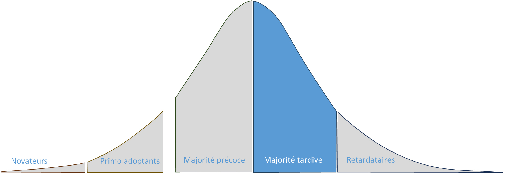
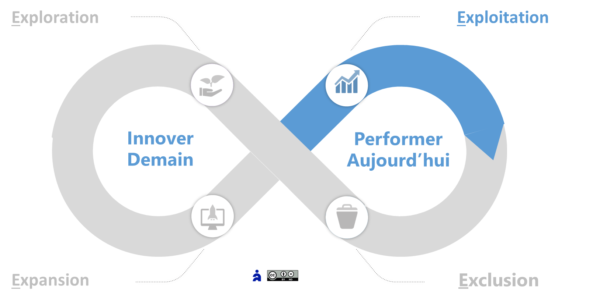
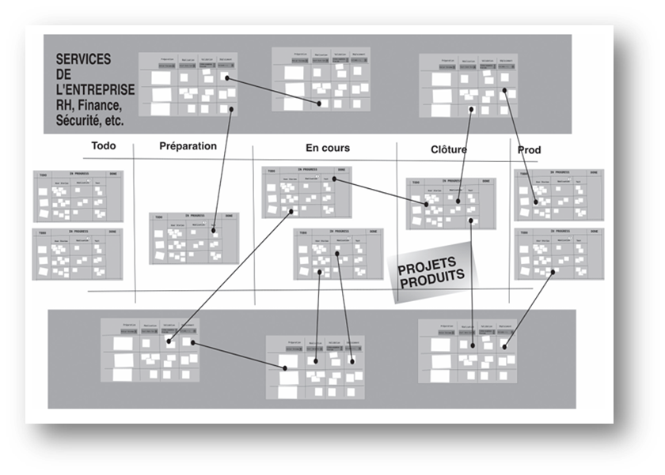

# Agile4Flow : Archétype Flux

✨**Objectif**

L’archétype **Flux** optimise les chaînes de valeur pour servir l’excellence opérationnelle durable et la différenciation par le service dans des contextes plutôt stables d'exploitation.

🧑‍🎓**Ce que vous allez apprendre ici**

- Comment concevoir une organisation stable **sans sacrifier l’agilité**.
- Comment **structurer un réseau de services** en flux à l’échelle.
- En quoi les **classes de service** permettent d’articuler efficience et engagement.

📚**Petit lexique**

- **WIP (Work In Progress)** = volume de travail en cours, à limiter pour éviter l’engorgement.
- **Classe de service** = mécanisme de priorisation différenciée selon le niveau d’urgence ou l’engagement attendu.
- **Chaîne de valeur** = enchaînement des activités qui créent de la valeur pour un utilisateur donné.
- **Backlog** = file d’attente Kanban, outil de coordination et d’adaptation capacitaire.

## Positionnement

**Stratégie orientée service** : Différencier l’offre par un service optimal au meilleur coût par un pilotage **Lean-Agile** des flux. Elle se concentre sur deux axes :

- Excellence opérationnelle
- Différenciation par le service

**Logique dominante** : flux tiré (Kanban).

**Exemples d’organisations** :

- Services IT (infrastructure, support, maintenance).
- Chaîne logistique et production industrielle en environnement agile.
- Opérations nécessitant une forte standardisation des processus et de la flexibilité.

### Caractéristiques clés

**Zone Agile4E privilégiée** : Exploitation

## Design organisationnel Flux

### Structure

🧑‍🎓

**Unité stratégique** : Groupe service

Réseau aligné sur les chaînes de valeur, organisé en systèmes Kanban interconnectés. Pour passer à l’échelle, les équipes se structurent en **groupes multiservices** intégrant ceux qui partagent des processus communs.

**Caractéristiques** : 20 à 40 personnes, 4 à 6 équipes, 6 à 8 services.

🧑‍🎓

**Unité tactique** :

C’est la **chaîne de valeur**, de bout en bout, stable et axée sur l’utilisateur. Elle peut impacter plusieurs actifs.

🌀**Exemple** :
*
Parcours utilisateur, processus métier ou interne, comme l’onboarding collaborateur.
*

🧑‍🎓

**Unité opérationnelle** :

Les équipes demeurent stables et se structurent autour des étapes de la chaîne, délimitées par des frontières claires. Chacune possède la responsabilité et la propriété de leur flux, ainsi que toutes les compétences nécessaires pour l’exploiter et l’améliorer. Elles peuvent se spécialiser pour répondre à des enjeux spécifiques d’efficience. Mais cette spécialisation comporte un risque de recréer des silos à long terme. Pour l’éviter, l’équipe peut instaurer des contraintes explicites, temporaires ou bornées dans le temps, ainsi que des critères de décision — arrêt ou réorientation — pour le Reteaming.

### Capacités organisationnelles

L’enjeu, paradoxal, consiste à préserver l’agilité à grande échelle, tout en recherchant la stabilité pour l’efficience. **Agile4C** appliqué au flux :

- **Réactivité** : Ajustement de la charge à la demande par les limites et le pilotage juste-à-temps par le flux tiré.

    🌀**Exemple** :
*
    Un service de paiements en ligne module sa capacité de traitement en fonction des pics d’activités (fin de mois, promotions).
    *

- **Flexibilité** : Gestion simultanée de plusieurs classes de service au sein d’un même processus, pouvant évoluer.

    🌀**Exemple** :
*
    Un produit SaaS lance une offre premium se démarquant par un support garanti en moins de deux heures.
    *

- **Adaptabilité** : Ajustement dynamique grâce aux buffers, au Slack et à la réallocation capacitaire.
- **Innovation d’efficience** centrée sur le flux, plutôt que sur l’optimisation des ressources.

### Reconnaissance

Le système de reconnaissance repose sur :

- Respect des standards et des délais.
- Respect des engagements et prévisibilité.
- Capacité à se réguler.

### Individu et management

**Style de gestion** : Leadership facilitant, management délégatif.

**Compétences** : La spécialisation devient un atout si la stratégie se concentre davantage sur les opérations que sur le service.

**Mobilité** : Faible à modérée

- La stabilité des rôles prime souvent afin d’optimiser les processus.
- **Changement de poste ou d’équipe occasionnel**, et temporaire pour équilibrer la charge de travail.
- **Mobilité interne plutôt fonctionnelle** (au sein d’un même groupe multiservice).

### Processus

**Pilotage par le flux** : approche en flux tiré déployé à tous les niveaux — du portefeuille d’initiatives stratégiques aux tâches.

**Coordination verticale** basée sur les processus (les cadences de revues), les standards (définition d’entrée et de sortie, limites…), et les procédures.

**Coordination horizontale**

- Couplage par **classe de service** : marqueur de la stratégie orientée service.
- Gestion de la dépendance :

    Le long de la chaîne de valeur, les tâches se spécialisent et s’enchaînent, créant des dépendances linéaires entre équipes, pilotées simplement :

  - Entre deux étapes d’une chaîne de valeur : limite sur la file d’attente intermédiaire
  - Entre deux systèmes Kanban : limite sur la file d’entrées.

- **Backlog distribué** : chaque Kanban dispose de son propre Backlog, relié aux autres pour former un réseau connecté. Il peut recevoir plusieurs sources d’entrées.

**Méthodes privilégiées** : Kanban, DevOps, Lean.

### Résultats : Performance & Culture

#### Performance

La performance vise avant tout à raccourcir les temps de cycle, accroître la réactivité aux demandes et stabiliser la charge de travail.

- **Métriques centrées flux** : Temps de livraison (lead Time), débit de traitement (throughput), prédictibilité des délais (due date Performance).
- **Engagement de services** : Le groupe service porte la responsabilité de son compte de résultat et de ses engagements.
- **Gestion de risques** : prioriser les tâches selon leur impact business grâce au modèle du coût du délai.

Ce niveau de performance s’atteint surtout en exploitation, grâce à la stabilité, et demeure bien plus difficile à maintenir en phase d’expansion.

#### Modèle culturel dominant

Le modèle organisationnel façonne directement la culture, en influençant la répartition du pouvoir et les interactions. Dans une démarche classique axée sur les processus, elle repose sur une logique de contrôle et une hiérarchie de rôles bien définis. La structure formelle, la stabilité et la prédictibilité des résultats sont valorisées. La coordination dépend de procédures et règles, tandis que les changements, initiés par le management, visent surtout à corriger des dysfonctionnements et préserver l’équilibre du système. La dynamique classique est modifiée pour plus d’agilité :

- L’auto-organisation remplace la hiérarchie, avec des rôles opérationnels qui prévalent sur les rôles managériaux.
- Le réseau informel des systèmes Kanban devient plus important que la structure formelle.
- Le contrôle porte sur les chaînes de valeur et leur performance par les équipes, pas sur les individus. Pour cela, elles doivent être propriétaires de leurs processus.

Ce modèle favorise une **culture de flux** qui encourage :

- **L’amélioration continue** : Réduire les gaspillages et améliorer l’efficience.
- **La transparence** : Suivre le travail, visualiser les goulots d’étranglement.
- **Le développement des personnes** et des compétences pour augmenter le potentiel du système.

➿**TechNova**

**Doubler le volume sans perturber le flux** :

Fin 2023, le département Capteurs s’engage sur une stratégie de volume :

« Notre chaîne est stable et nous gérons bien les incidents… mais comment maintenir un Lead Time sous 24 heures quand le volume double ? », s’inquiète le directeur des opérations. La croissance remet en tension l’organisation :

- Goulots d’étranglement sur les incidents urgents.
- Traitements uniformes, sans différenciation.
- Backlog trop centralisé.

En 2024, TechNova choisit l’archétype **Flux** :

Les **unités stratégiques** adoptent un réseau Kanban avec 3 classes de service :

- Urgences critiques (SLA < 4h)
- Incidents majeurs et maintenance planifiée (en moins de 5 jours)
- Incidents mineurs (en moins de 2 semaines)

Pour les **unités tactiques** :

- Aménagement de la chaîne de support : du ticket à la résolution, avec limites WIP et buffers dynamiques à chaque étape.
- Chaque équipe devient propriétaire de son processus, avec des métriques visibles.

**Résultat** :

> En 6 mois, l’entreprise a réduit son Lead Time moyen de 20 %, sans surcharge, malgré la croissance de 35 %.

Ce changement n’a pas nécessité de refonte profonde. La clarification des engagements, l’adaptation du système de pilotage et la restitution aux équipes de la maîtrise de leur flux ont suffi.

### Bénéfices clés

Ce modèle permet de :

- Paralléliser les projets avec un pool de ressources
- Mobiliser plusieurs équipes spécialisées, tout en intégrant les fonctions partagées en flux également
- Absorber interruptions et urgences sans perturber la continuité
- Accélérer les cycles de livraison et d’apprentissages
- Soutenir durablement la performance.

## 👣 Et concrètement, lundi matin ?

**Fonctionnez-vous déjà en Flux ?** Cochez les questions suivantes :

- [ ] Avez-vous mis en place un Kanban pour piloter vos principales chaînes de valeur ?
- [ ] Utilisez-vous des classes de service pour prioriser urgences, incidents et travaux planifiés ?
- [ ] Mesurez-vous régulièrement Lead Time et débit, en toute transparence ?
- [ ] Vos équipes allient-elles stabilité, pluridisciplinarité et maîtrise de leur flux ?
- [ ] Vos processus de coordination (revues, standards) sont-ils partagés ?

**Plus de 3 oui :** vous êtes déjà engagés sur la bonne voie.

**Moins de 3 oui**, pour y parvenir, suivez ces principes :

- **Commencer là où vous êtes**, respecter vos processus actuels.
- **Évoluer par petits pas**, de manière incrémentale.
- **Renforcer le leadership** à tous les niveaux.
- **Visualiser et piloter** votre flux avec vos équipes.

## Implémentations et cadres d’inspiration

Inspirez-vous de l’un de ces modèles :

- Enterprise Service Planning (ESP)
- SaFE orienté flux
- Flight levels de Klaus Leopold
- **Flow** de Mik Kersten
- Kanban@Scale

### SCRIPt de l’organisation Flux

**Structure** :

- Unité stratégique « Groupe Service » = réseau de systèmes Kanban couplés par classes de service.
- Unités tactiques = chaînes de valeur orientées utilisateur.
- unités opérationnelles = équipes stables, pluridisciplinaires, propriétaires de leur flux.

**Capacités** :

- Réactivité = ajustement par limites WIP & flux tiré
- Flexibilité = gestion multi-classes de service
- Adaptabilité = de la capacité à la demande via des buffers dynamiques, et de slack système
- Amélioration continue = innovation d’efficience du flux.

**Reconnaissance** :

Métriques centrées flux :

- Lead Time,
- Throughput,
- Due Date Performance,
- SLA & classes de service

**Individus** :

- Leadership facilitateur & management délégatif.
- Équipes T-shaped, autonomes et responsables.
- Mobilité interne limitée pour préserver la stabilité.

**Processus** :

- Pilotage par le flux tiré = Kanban multi-niveaux du portefeuille à la tâche.
- Coordination verticale = revues, définitions d’entrées/sorties, limites.
- Coordination horizontale = Backlogs interconnectés, ajustement mutuel.
- Boucles adaptatives « Inspect & Adapt ».
