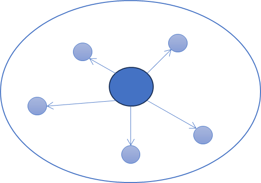
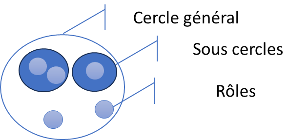
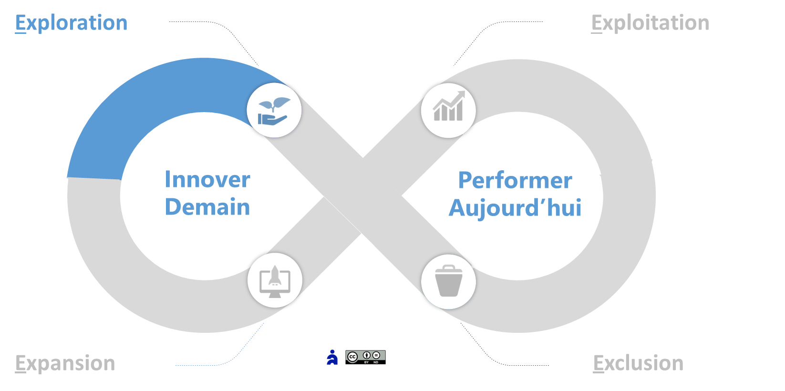

# Agile4Network : Archétype Réseau

✨**Objectif**

L’archétype **Réseau** organise l’entreprise en **cellules stratégiques** visant l’**innovation distribuée**, l’**expérimentation rapide** et l’**autonomie**, tout en maintenant un **alignement stratégique dynamique**.

🧑‍🎓**Ce que vous allez apprendre ici**

- Comment structurer une **organisation distribuée** sans perdre l’alignement stratégique.
- Ce que ce modèle **sacrifie volontairement** (contrôle, standardisation, efficience).

📚**Petit lexique**

- **Cellule** = équipe autonome organisée autour d'une mission spécifique, pouvant apparaître ou disparaître selon les besoins.
- **Backlog réseau** = ensemble de Backlogs locaux coordonnés de manière non hiérarchique.
- **Time to Test Idea** = délai entre l’intuition initiale et un premier apprentissage validé.
- **Leadership réticulaire** = forme de gouvernance distribuée, où la coordination émerge par alignement et influence mutuelle plutôt que par autorité.

## Positionnement

**Stratégie d’innovation** **distribuée :** explorations de nouveaux modèles d’affaires dans des niches émergentes, reposant sur une **différenciation forte**.

**Logique dominante :** entrepreneuriale.

**Exemples d’organisations** :

- coopératives ou franchises,
- incubateurs internes.

L’organisation réseau est le fruit, entre autres, d’une stratégie qui s’est complexifiée, d’une décentralisation qui s’affirme et d’un modèle d’innovation qui s’invite dans l’entreprise.

### Caractéristiques principales

- Spécialisation des unités stratégiques.
- Quasi-autonomie sur leur modèle économique, avec responsabilité directe des résultats.
- Relations latérales multiples, parfois informelles, pour exploiter les leviers du groupe.
- Système de mesure de la performance évaluant l’efficacité et la valeur créée par chaque unité, à travers les prix pratiqués sur le marché ou par des mécanismes internes de prix de transfert.
- Système de gouvernance qui l’oriente et le contrôle : un réseau conçu, sans hiérarchie verticale ni division classique du travail.
- Coûts de coordination plus organiques, mais apparition de coûts de transaction internes.

Cette forme de design reste émergente et n’est pas encore reconnue comme un modèle à part entière. C’est un réseau interne, composé d’unités appartenant à l’entreprise, et non d’une filière externe de partenaires.

### Deux cas d’usage

1. **Réseau de start-ups internes** : Tester plusieurs MVP simultanément.
2. **Réseau d’intraprises** : Exploiter des activités matures en quasi autonomie.

## Design organisationnel Réseau

### Structure

🧑‍🎓

**Unité stratégique** :

C’est un réseau de cellules, **faiblement couplées,** où la logique de marché interne prime sur la hiérarchie.

La structure se réduit au maximum, avec deux modèles opposés :

**Entrepreneuriale**

L’**archétype entrepreneurial** reste centralisé. La collaboration s’appuie sur la supervision directe de l’équipe fondatrice. Les décisions traduisent sa vision et s’opposent à toute structuration formelle, limitant la hiérarchie. Ce fonctionnement favorise les choix rapides et réduit les conflits, mais repose fortement sur quelques individus.

**Holistique (cercle auto-organisé)**

Modèle alternatif : **sociocratie, gouvernance dynamique**.

Le modèle **holistique**, ou **holacratie** propose une vision radicale de la structure : le pouvoir et les responsabilités sont distribués plutôt que centralisés. La gouvernance s’appuie sur des cercles d’équipes auto-organisées, dotés d’une large autonomie. Leurs décisions ne dépendent pas d’une validation hiérarchique.

🧑‍🎓

**Unité tactique/opérationnelle** :

Chaque cellule (ou un pôle) se définit par sa mission, sans niveau tactique intermédiaire comme dans les autres archétypes.

Couplage faible entre cellules

- Elles forment le réseau informel de l’organisation duale.
- Chacune peut fonctionner de manière indépendante tout en étant interconnectée.
- Les équipes peuvent se reconfigurer rapidement selon les besoins émergents.

**Autres types d’équipes** : Équipe mission ou ad hoc

#### Passage à l’échelle

Un réseau se développe de manière organique, par dissolution et reformation de cellules selon les besoins émergents ou les choix stratégiques. Il possède néanmoins une structure, issue de processus formels ou informels. Les relations privilégiées qui s’y nouent, ainsi que cette structure, reflètent la culture du réseau. Dans ce modèle, les connexions comptent autant que les unités elles-mêmes. Alors que les autres formes privilégient la mise en œuvre d’une stratégie existante, le réseau reste plus ouvert et élargit le champ des possibles en matière d’innovation.

### Capacités organisationnelles

L’enjeu consiste à rompre avec le modèle économique dominant du secteur. **Agile4C** appliqué au réseau :

- **Réactivité** : répondre vite aux opportunités et aux défis, activer rapidement la coopération entre cellules.
- **Flexibilité** : reconfigurer les interactions et ajuster les priorités.
- **Adaptabilité** : ajuster et pivoter sur un modèle d’affaires.
- **Proactivité** : initier le changement dès que possible pour accélérer l’apprentissage.
- **Innovation distribuée** : expérimenter en continu son business, en optimisant le flux de tests pour réduire le délai entre une idée et l’apprentissage (Time To Test Idea). L’innovation est distribuée et ouverte, contrairement à l’organisation Projet%2013490eaf28ff8030a8aeecf9206d94ea.md) ciblée sur un objectif.

### Reconnaissance

L’enjeu individuel concerne la réputation et le développement des compétences, surtout relationnelles. La contribution personnelle compte autant que les résultats collectifs. L’enjeu managérial consiste à maintenir l’alignement, en veillant à ce que chaque cellule reste inscrite dans une vision commune.

### Individu

**Un individu peut faire partie de plusieurs cellules**, ce qui constitue un différenciateur majeur par rapport aux autres archétypes. Il y exerce des rôles variés selon les contextes, ce qui réduit fortement l’importance des fiches de poste formalisées. Les rôles restent opérationnels et liés aux missions à accomplir, et certains modèles font même évoluer le niveau de responsabilités d’une cellule à l’autre. Les profils en T sont valorisés pour favoriser l’**autonomie** et la transversalité, à travers la **coopération intercellules**.

**Style de gestion** : à la fois stratégique, entrepreneurial, participatif et adaptatif. Aucun rôle managérial n’est figé : le leadership découle de la mission, non de la position.

### Processus

**Pilotage par la mission** : Les cellules naissent et disparaissent en fonction des objectifs de la mission.

**Coordination horizontale** : Chaque cellule possède son propre Backlog. Le management réticulaire assure la gestion.

**Coordination verticale**

La coordination requise reste bien moindre que dans les autres contextes. Elle se fait par agrégation de tous ces Backlogs au niveau de l’organisation, dans un but d’alignement et d’allocation budgétaire. La direction centralise la coordination verticale.

**Méthode préférée** : Lean Startup et le Design Thinking.

### Résultats : Performance & Culture

#### Performance

L’évaluation de la performance se base sur :

- La viabilité des modèles d’affaires.
- Leur capacité d’expérimentation et d’apprentissage rapide.
- La valeur créée collectivement et entre cellules.

> Le succès ne se mesure pas seulement par des indicateurs financiers, mais par l’aptitude à tester, apprendre et se repositionner.

#### Culture

C’est une culture entrepreneuriale qui assume le risque et stimule l’initiative comme l’innovation. Elle reste très attentive aux évolutions de l’environnement, qui déclenchent des changements portés par les dynamiques du terrain. La cohésion naît d’une vision partagée de l’avenir, d’enjeux et d’objectifs communs, dans un cadre où la structure formelle demeure minimale et le leader en retrait.

## Bénéfices clés

- **Émergence de valeur**.
- **Innovation continue**.
- **Adaptation fluide** : réaffecter les ressources en continu.
- **Alignement stratégique** : cohérence globale par réajustements successifs.
- **Culture entrepreneuriale** : initiative valorisée.

> Il s’adapte particulièrement aux contextes instables, complexes et en évolution, où l’agilité structurelle soutient à la fois survie et différenciation.

➿**TechNova**

**Réseauter pour mieux innover** :

En 2024, l’entreprise explore de nouveaux usages sur le marché **Smart Home**. Plutôt que de lancer un projet centralisé, elle consacre 10 % de sa R&D à cinq cellules autonomes, chacune mandatée pour tester un prototype en moins de trois mois : IoT résidentiel, cloud industriel, IA embarquée… chaque cellule agit comme une mini-startup, responsable de son Backlog, de ses choix et de ses résultats. Sans validation hiérarchique, elles ajustent leur approche et se coordonnent si nécessaire.

**Bilan** : en trois mois, chaque cellule livre un prototype, dont un pilote résidentiel viable dès le quatrième mois.

| **Capacité organisationnelle** | **TechNova — Réseau d’innovation** |
| --- | --- |
| **Réactivité** | MVP IA livré en 3 mois |
| **Flexibilité** | Réallocation de 10 % de R&D en 6 semaines |
| **Adaptabilité** | Pilote déployé en 4 mois |
| **Proactivité** | Cellule de veille IA mobilisée |
| **Amélioration continue** | Time-to-Test-Idea réduit de 30 % |

### Ce qu’on sacrifie en choisissant ce modèle

Un tel modèle suppose des concessions, dont la perte de :

- **Contrôle fin des coûts**
- **Efficience maximale** (on accepte un peu de redondance)
- **Uniformité des processus** (les cellules adaptent leurs méthodes)

## 👣 Et concrètement, lundi matin ?

**Fonctionnez-vous déjà en Réseau ?** Cochez les questions suivantes :

- [ ] Vos équipes exercent-elles une réelle autonomie ?
- [ ] Disposez-vous d’un sponsor exécutif pour cadrer le réseau ?
- [ ] Les métriques de performance des cellules sont-elles partagées publiquement ?
- [ ] Les équipes peuvent-elles se créer ou s’arrêter d’elles-mêmes ?
- [ ] Peuvent-elles coopérer facilement avec d’autres équipes, sans passer par la hiérarchie ?

**Plus de 3 oui**, vous progressez sur le bon chemin !

**Moins de 3 oui**, pour y parvenir, suivez ces principes :

1. Décentraliser la décision dans la cellule.
2. Autoriser la création/fusion rapide sans validation hiérarchique.
3. Placer la confiance au cœur de la coopération.
4. Maintenir l’équilibre entre autonomie des équipes et objectifs stratégiques.

## Implémentations et cadres d’inspiration

Vous pouvez vous inspirer de l’un de ces modèles :

- Agile Organization de Pierre Neis, pour un réseau d’équipes Scrum
- Beta Codex de Niels Pflaeging
- Sociocratie et Holacratie

### SCRIPt de l’organisation Réseau

**Structure** :

- **Organisation** : Réseau de cellules quasi-autonomes
- **Alignement :** Décentralisé autour de la stratégie
- **Equipe :** Pluridisciplinaire, auto organisée, stable

**Capacités** :

- **Réactive** : Réagir rapidement aux opportunités
- **Flexible** : Pouvoir répondre aux demandes spécifiques
- **Adaptabilité** : Pivot sur son business model
- **Proactivité** : Provoquer le changement pour accélérer l'apprentissage
- **Innovation distribuée**

**Reconnaissance** :

- **Performance Managériale :** Viabilité du Business Model, OKR tactique
- **Performance Individuelle** : Réputation individuelle

**Individus** :

- **Leadership** **stratégique** & ajustement mutuel
- **Développement :** Multi compétences, profil en T, Soft skills (autonomie, collaboration)
- **Mobilité :** Multi cellules

**Processus** :

- **Pilotage** : Par la mission
- **Coordination** : Locale et distribuée, Backlog par cellule
- **Méthode privilégiée** : Lean Startup, Scrum selon la maturité
