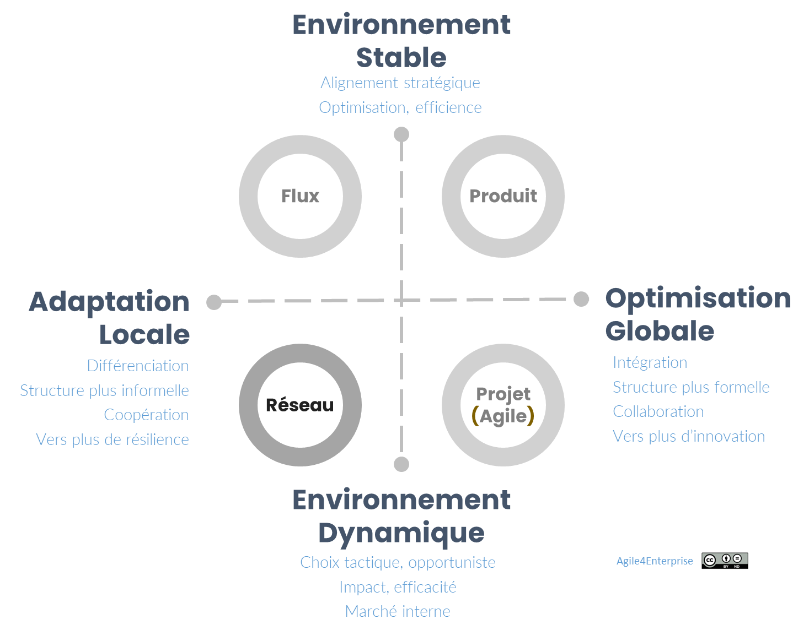

# Agile4Network : Archétype Réseau

Propriétaire: Laurent Morisseau

- Sommaire

<aside>
✨

**Objectif de cette section**

L’**archétype Réseau** est conçu pour les entreprises souhaitant **stimuler l’innovation, l’expérimentation et l’autonomie** en organisant leur structure autour de **cellules stratégiques faiblement couplées**, capables de coopérer tout en conservant leur indépendance.

Il se décline principalement sous deux formes :

- **Réseaux de startups internes** : pour explorer de nouveaux modèles économiques.
- **Réseaux d’intraprises** : pour exploiter durablement des niches différenciées dans un portefeuille stratégique découplé.

Ce modèle offre une **agilité structurelle** maximale et permet une adaptation fluide et continue aux signaux faibles du marché.

</aside>

Modèle des 4 archétypes agiles

# Positionnement stratégique

L’archétype Réseau est aligné avec une **stratégie d’innovation** **distribuée** :

- Basée sur des **business models différenciés** et émergents
- Reposant sur une **différenciation forte** (plutôt que sur l’efficience ou la scalabilité)
- Inscrite dans une **logique entrepreneuriale décentralisée**

<aside>
💡

[**Stratégie orientée innovation**](https://www.notion.so/Explorer-et-comprendre-la-strat-gie-13690eaf28ff81d18468ca20936fdecc?pvs=21)

Les entreprises adoptant cette stratégie s'efforcent de développer des offres uniques et innovantes, ciblant des marchés de niche. Elle est en générale associée à de faibles volumes et de faibles parts de marché. Les entreprises cherchent à se distinguer du business model dominant de leur secteur par de l’innovation distribuée.

</aside>

Le modèle réseau s’applique dans des contextes différents. Ce qui les rassemble, c’est la quasi autonomie d’une unité stratégique vis-à-vis des autres unités et de la fonction corporate concernant leur business model, tout en cherchant à bénéficier de l’avantage d’appartenir à un groupe. Ce dernier point est crucial car sinon il ne bénéficie d’aucun avantage par rapport à ses concurrents. Chaque unité stratégique doit donc développer ses relations pour pouvoir tirer parti du réseau existant et des leviers du groupe, et ainsi avoir accès à des actifs, des ressources, et des compétences clés qui feront la différence.

L’organisation réseau est le fruit, entre autres, d’une stratégie qui s’est complexifiée, d’une décentralisation qui s’affirme et d’un modèle d’innovation qui s’invite dans l’entreprise. Elle met l’accent sur l'importance des liens dynamiques entre les entités, non seulement au sein de l'organisation mais aussi avec des entités externes - partenaires, fournisseurs, et clients. 

<aside>
💡

L'archétype **Réseau** se caractérise par :

- Une spécialisation des unités stratégiques, et une **quasi-autonomie** sur leur business model.
- L’exploitation des synergies internes pour bénéficier d’un effet de levier concurrentiel.
- Une mise en réseau des compétences, ressources et actifs stratégiques. Les relations latérales sont multiples et informelles.
- Un système de mesure de la performance qui évalue l'efficacité et la valeur créée par chaque unité, directement à travers les prix pratiqués sur le marché, ou indirectement par l'intermédiaire de mécanismes internes de fixation des prix de transfert.
</aside>

## Les deux déclinaisons principales de l’archétype Réseau

### Réseau de startups internes

Les startups internes sont conçues comme des entités exploratoires cherchant à tester des business models innovants. Elles combinent :

- **Une approche agile et opportuniste**, typique des startups classiques.
- **Un effet de réseau**, permettant d’accéder aux ressources du groupe, pour bénéficier d’avantages par rapport à ses concurrents.
- **Un objectif de scalabilité**, visant à devenir une unité produit ou à intégrer la zone d’exploitation.

Une startup est à la recherche d’un business model innovant. Son approche est à la fois tactique et opportuniste. Elle n’est pas encore viable financièrement.

<aside>
⚠️

Cela implique qu’une entreprise ne peut pas n’être qu’un réseau de startups internes : La somme d’organisations non viables n’en fait pas une organisation viable. 

</aside>

### **Les caractéristiques clés**

Cycle de vie de l’actif : [Lancement](https://www.notion.so/Design-organisationnel-de-la-zone-Expansion-13f90eaf28ff8097b421cd0166ec489b?pvs=21)

Segment clients : [Novateurs et primo adoptants](https://www.notion.so/Explorer-et-comprendre-la-strat-gie-13690eaf28ff81d18468ca20936fdecc?pvs=21)

Modèle 4E

<aside>
🧰

Les dimensions agiles privilégiées sont l’[**Agilité Tactique](https://www.notion.so/L-agilit-tactique-13490eaf28ff806cb428d9b27abb1f82?pvs=21) & [Opérationnelle](https://www.notion.so/L-agilit-op-rationnelle-13490eaf28ff80e5b767fd273784c80b?pvs=21)**, ****pour **l’**optimisation de la création de valeur.

La zone de management privilégiée est la [zone d’](https://www.notion.so/Design-organisationnel-de-la-zone-Expansion-13f90eaf28ff8097b421cd0166ec489b?pvs=21)[exploration](https://www.notion.so/Le-mod-le-A4E-de-l-agilit-portfolio-13490eaf28ff803a884fc20066900149?pvs=21).

</aside>

### Réseau d’intraprises

Les intraprises sont des unités autonomes ayant prouvé leur viabilité à l’échelle dans la zone d’expansion. Elles cherchent à **exploiter un avantage concurrentiel durable dans la zone d’exploitation tout en restant quasi autonomes** (contrairement aux organisations cherchant à s’intégrer au cœur de métier). On les retrouve principalement dans le cas de portefeuilles stratégiques [découplés](https://www.notion.so/Les-principes-de-design-strat-gique-13e90eaf28ff80628778e05ec7ed18cc?pvs=21).

### **Les caractéristiques clés**

Cycle de vie de l’actif : [Maturité](https://www.notion.so/Design-organisationnel-de-la-zone-Expansion-13f90eaf28ff8097b421cd0166ec489b?pvs=21)

Segment clients : [Majorité tardive](https://www.notion.so/Explorer-et-comprendre-la-strat-gie-13690eaf28ff81d18468ca20936fdecc?pvs=21)

Evolution d’une unité stratégique dans un archétype Réseau

<aside>
💡

La zone de management privilégiée est l’[exploitation](https://www.notion.so/Le-mod-le-A4E-de-l-agilit-portfolio-13490eaf28ff803a884fc20066900149?pvs=21).

Les dimensions agiles privilégiées sont l’[**Agilité Portfolio](https://www.notion.so/L-agilit-Portfolio-18f90eaf28ff8009b702d2aa0eae18cf?pvs=21) & [Stratégique](https://www.notion.so/L-agilit-strat-gique-13490eaf28ff80e2b4d8f6ab581de0f3?pvs=21)**, pour aligner les unités autonomes et l’innovation.

</aside>

Les startups internes évoluent en organisations produit si elles trouvent leur **adéquation produit-marché**. En passant à l’échelle, elles intègrent la **zone d’exploitation** et peuvent basculer vers un **archétype Flux** (différenciation par le service) ou **Produit** (différenciation pas la valeur) :

Stratégie orientée service : [Archétype Flux](https://www.notion.so/Agile4Flow-Arch-type-Flux-13490eaf28ff809bac54ed5deaa8a257?pvs=21)

Stratégie orientée produit : [Archétype Produit](https://www.notion.so/Agile4Product-Arch-type-Produit-13490eaf28ff80b29733f767568ab6a5?pvs=21)

Nous allons donc nous concentrer ici sur le cas plus spécifique du réseau de startups internes.

## Design organisationnel : le modèle SCRIP appliqué au Réseau

### Deux types de structure

L’archétype **Réseau** repose sur des **unités autonomes**, les équipes, organisées en **cellules faiblement couplées**. Deux grands modèles opposés coexistent :

[**Entrepreneuriale**](https://www.notion.so/Design-organisationnel-de-la-zone-Exploration-13f90eaf28ff8012b2fcc13892e9048e?pvs=21)

Exemple : startup

L'**archétype entrepreneurial** est centralisé et dynamique. La collaboration repose sur une supervision directe par l’équipe fondatrice, les décisions reflètent sa vision, et l'organisation résiste à toute structure formelle, limitant la hiérarchie managériale. Cela permet des décisions rapides et évite les conflits, mais repose largement sur quelques personnes. Ce modèle favorise un couplage fort et une centralisation permettant de changer rapidement l'ensemble de l'organisation. Un pivot se fait rapidement. 

[**Holistique**](https://www.notion.so/Design-organisationnel-de-la-zone-Exploration-13f90eaf28ff8012b2fcc13892e9048e?pvs=21)

**Exemple** : Sociocratie, Holacratie

Le modèle **holistique**, ou **holacratie**, propose une vision radicale de la structure organisationnelle, où le pouvoir et les responsabilités sont distribués plutôt que centralisés. Ce modèle repose sur la gouvernance par des cercles d'équipes autoorganisées, chacune possédant une grande autonomie dans la gestion de ses affaires. Une particularité de l’holacratie est que les cercles ont une durée de vie liée à leur mission, et non à une personne.

La **sociocratie** est un autre modèle de gouvernance basé sur des principes similaires de distribution du pouvoir et de prise de décision collective. Ce modèle de gouvernance est également connu sous le terme de **gouvernance dynamique**. 

<aside>
📚

En savoir plus sur le [design organisationnel pour l’exploration](https://www.notion.so/Design-organisationnel-de-la-zone-Exploration-13f90eaf28ff8012b2fcc13892e9048e?pvs=21)

</aside>

- **Coordination horizontale** via ajustement mutuel, backlogs interconnectés, synergies organiques
- **Pilotage par la mission** : les cellules naissent et meurent selon leur raison d’être

<aside>
💡

Unité stratégique

C’est un réseau de cellules.

</aside>

<aside>
💡

Unité tactique/ opérationnelle

C’est une cellule Adhoc autonome définie par sa mission

</aside>

La structure est la plus plate possible, potentiellement sans niveau hiérarchique. Les unités opérationnelles et tactiques sont au même niveau : les cellules du réseau. Il n’y a pas de niveau d’intégration tactique comme pour le produit ou le projet.

- [Couplage faible](https://www.notion.so/Les-principes-de-design-strat-gique-13e90eaf28ff80628778e05ec7ed18cc?pvs=21) entre cellules
    - Ce réseau de cellules constitue le [réseau informelle de l’organisation duale](https://www.notion.so/La-reconfigurabilit-organisationnelle-14390eaf28ff80a3bb7dcfa1a866df07?pvs=21), facilitant ainsi la [reconfigurabilité](https://www.notion.so/La-reconfigurabilit-organisationnelle-14390eaf28ff80a3bb7dcfa1a866df07?pvs=21) et permettant une [agilité organisationnelle](https://www.notion.so/L-agilit-organisationnelle-au-niveau-strat-gique-17790eaf28ff80569d37d43fbed7a8ca?pvs=21).
    - Les cellules autonomes, chacune spécialisée dans une fonction spécifique. Elles peuvent fonctionner de manière indépendante tout en étant interconnectées, permettant une réorganisation rapide et une réponse efficace aux changements internes et externes.
- [Dépendance faible](https://www.notion.so/Minimiser-les-interd-pendances-14390eaf28ff804f9da7d83917dd8232?pvs=21) entre cellules
    - **Les cellules sont pluri fonctionnelles car l’interdépendance principale est mutualisée**. Les dépendances résiduelles entre cellules sont gérées sans processus bien définie, de manière ad hoc, par ajustement mutuel entre équipes.
- [**L’organisation duale dans l’organisation Réseau**](https://www.notion.so/La-reconfigurabilit-organisationnelle-14390eaf28ff80a3bb7dcfa1a866df07?pvs=21)
    
    Dans une organisation en réseau, c'est le réseau informel qui est mis en avant, sans exclure l'existence d'une structure plus formelle. Les équipes peuvent se reconfigurer rapidement en fonction des besoins émergents, tout en maintenant une cohérence et une direction stratégique globale.
    
- **Equipe mission, ad hoc**
    
    Les cellules sont définies par rapport à leur mission, et bien sûr auto organisées.
    
    <aside>
    🧰
    
    En savoir plus sur les caractéristiques au niveau [équipe](https://www.notion.so/L-agilit-op-rationnelle-13490eaf28ff80e5b767fd273784c80b?pvs=21)
    
    </aside>
    
- **Inter cellules pour le passage à l’échelle**
    
    
    
    Un réseau se développe de manière organique, par **dissolution/reformation des cellules** en fonction des besoins. Cependant, même un [réseau a une structure](https://www.notion.so/Design-organisationnel-de-la-zone-Exploration-13f90eaf28ff8012b2fcc13892e9048e?pvs=21), les relations privilégiées qui se développent au sein de ce réseau, et sa structure est fortement liée à la [culture de ce réseau](https://www.notion.so/Les-mod-les-organisationnels-une-approche-culturelle-15e90eaf28ff8007833ff2ce6c1bcea7?pvs=21).
    

### Capacités organisationnelles agiles

<aside>
⚠️

**L’enjeu** : Trouver un business model innovant

</aside>

<aside>
💡

**Réactivité**

Réagir rapidement aux opportunités et défis rencontrés, de par la quasi autonomie des cellules.

Capacité d’activation rapide de coopérations entre cellules.

</aside>

<aside>
💡

**Flexibilité**

Reconfiguration fluide des interactions, ajustement des priorités.

</aside>

<aside>
💡

**Adaptabilité**

Capacité à ajuster et pivoter sur un business model si besoin

</aside>

<aside>
💡

**Proactivité**

Provoquer le changement dès que possible pour accélérer l'apprentissage et ajuster rapidement.

Maximisation de la surface de contact avec l’environnement.

Création d’un écosystème robuste pour explorer de nouvelles opportunités.

</aside>

<aside>
💡

**Amélioration continue**

Elle porte sur sa capacité à expérimenter son business. Il s’agit d’améliorer son processus de flux d’expérimentations pour le rendre le plus efficient possible : réduire la durée entre l’idée et l’apprentissage. On peut parler de Time To Test Idea.

L’innovation est distribuée, contrairement à l’[organisation Projet](https://www.notion.so/Agile4Project-Arch-type-Projet-agile-13490eaf28ff8030a8aeecf9206d94ea?pvs=21) dont l’innovation est ciblée.

</aside>

### Reconnaissance

L’enjeu individuel est celui de la réputation et le développement de compétences, plus particulièrement les soft skills, pour la collaboration inter équipes dans un cadre d’autonomie.

**La réputation et la contribution individuelle**, sont autant valorisées que les résultats collectifs.

L’enjeu managérial va être l’alignement stratégique, s’assurer que chaque cellule s'inscrit dans une vision globale tout en conservant son autonomie.

### Individu

Un individu peut faire partie de plusieurs cellules, c’est un élément différentiateur fort des autres archétypes.  Il existe une logique de pollinisation croisée au sein du réseau.

- La direction adopte un style de leadership stratégique, au niveau du réseau.
- Le leadership adopte un style entrepreneurial, participatif et adaptatif.
- Le management adopte un style réticulaire ou distribué, dans une posture de facilitateur.

La multi compétences et les profils en T sont valorisés dans une organisation réseau pour favoriser l’**autonomie** et la transversalité, au travers la **coopération inter cellules**.

<aside>
🧰

En savoir plus sur les caractéristiques au niveau [management](https://www.notion.so/L-agilit-op-rationnelle-13490eaf28ff80e5b767fd273784c80b?pvs=21)

</aside>

### Processus et coordination

<aside>
💡

**Pilotage par la mission**

Les cellules se créent et s’arrêtent par rapport à la mission qu’on leur fixe ou qu’elles se fixent. Ces missions sont définies au niveau tactique. 

L’alignement est assuré par des missions claires et un cadre souple, permettant aux cellules de se créer, se dissoudre et se recomposer selon les besoins.

</aside>

[**Coordination horizontale](https://www.notion.so/La-coordination-horizontale-14390eaf28ff803ca06ccdf8026760d7?pvs=21),** [le réseau de Backlogs](https://www.notion.so/Le-backlog-un-outil-d-int-gration-ou-de-coordination-14490eaf28ff805e9950ccf8c65367cb?pvs=21)

[Chaque équipe](https://www.notion.so/Le-backlog-un-outil-d-int-gration-ou-de-coordination-14490eaf28ff805e9950ccf8c65367cb?pvs=21) possède son propre Backlog. La coordination horizontale est gérée par du management réticulaire.

[**Coordination verticale**](https://www.notion.so/La-coordination-verticale-14390eaf28ff807b9cafd0f0af71e154?pvs=21)

Le besoin en coordination est par définition beaucoup moins important que dans les autres contextes. La coordination minimum se fait par agrégation de tous ces Backlogs au niveau de l’entreprise, dans un but d’alignement et d’allocation budgétaire. Cette coordination verticale est centralisée par la direction et assurée par des principes stratégiques partagés.

[**Cadence de changement**](https://www.notion.so/Les-4-cadences-du-changement-et-de-l-apprentissage-13b90eaf28ff8091b4cce85974f50938?pvs=21)

Une cadence tactique et opérationnelle uniquement.

<aside>
⚙

Méthode privilégiée : [Lean Startup](https://www.notion.so/Lean-StartUp-18390eaf28ff80bc8928d9d864ef7628?pvs=21) pour l’exploration, Design Thinking de manière plus générale lorsque la mission ne peut se découper en éléments plus élémentaires.

</aside>

## Résultats : Performance & Culture

### Performance

Pour les startups la performance consiste à démontrer ici la viabilité du modèle d'affaires à petite échelle.

Cependant, ce ne sont pas les seules cas de figure de l’entreprise en réseau. De manière plus générale, il s’agit de créer de la valeur mesurable.

<aside>
💡

L’évaluation de la performance repose sur :

- La **viabilité des modèles d’affaires** des cellules.
- La **capacité d’expérimentation** et d’apprentissage rapide.
- La **création de valeur collective et intercellulaire**.
</aside>

> 💡 Le succès n’est pas défini uniquement par des indicateurs financiers, mais par la capacité à tester, apprendre, se repositionner.
> 

### Culture

C’est une culture intrapreneuriale. Les organisations qui privilégient ces valeurs tendent à être dynamiques et prêtes à prendre des risques, en encourageant l'initiative et l'innovation pour s'adapter rapidement aux changements du marché ou de l'environnement.

**Une organisation vivante**

Les organisations sont très sensibles aux évolutions de l’environnement extérieur, ce qui déclenche des changements et met l'organisation en mouvement grâce à des dynamiques provenant du terrain. 

- Le changement est **fluide et permanent**
- La structure s’adapte **par dynamique émergente**, non par transformation planifiée

**Un cadre évolutif**

La vision d’un futur partagé, les enjeux et les objectifs communs sont des facteurs de cohésion dans une organisation où la structure formelle est minimale, avec un leader effacé. Les rôles sont opérationnels et basés sur les missions à accomplir. La contribution individuelle est autant valorisée que la contribution collective.

- Pas de rôle managérial figé
- Leadership basé sur la mission, pas sur la position

<aside>
💡

L’archétype **Réseau** s’appuie sur une **culture intrapreneuriale**, marquée par :

- Une forte **dynamique d’initiative et d’innovation,**
- De l’autonomie, initiative, et prise de risque raisonnée,
- Une **écoute active des évolutions externes,** et une sensibilité aux signaux faibles du marché,
- Une organisation où **le changement est fluide et continu**.
</aside>

<aside>
📚

En savoir plus sur le [modèle du système ouvert, logique de réseau & culture de l’adhocratie](https://www.notion.so/Les-mod-les-organisationnels-une-approche-culturelle-15e90eaf28ff8007833ff2ce6c1bcea7?pvs=21)

</aside>

## Bénéfices d’un archétype en réseau

L'**organisation réseau** est un modèle organisationnel qui favorise une structure flexible, essentielle pour l'agilité organisationnelle.

Il s’oppose aux organisations centralisées, et répond à la tendance croissante de délégation vers des équipes de plus en plus autonomes et autoorganisées. L'équipe est l’unité de base de l'agilité tandis que tout le reste s'organise autour d'elle. Les équipes sont simplement interconnectées, formant un réseau collaboratif plutôt horizontal que vertical.

<aside>
💡

L’**organisation en réseau** apporte :

- Une **agilité structurelle** permettant une adaptabilité structurelle et réactivité stratégique,
- Un **alignement stratégique dynamique** par réajustements successifs,
- Une mise à l’échelle fluide, sans restructuration, par conception ; avec une coordination légère mais efficace, via les missions et les résultats,
- Une émergence de valeur par l’apprentissage collectif,
- Une **répartition efficace des ressources et compétences** à travers le réseau.
</aside>

<aside>
📚

**Steve Denning** décrit cette approche comme la "[loi du réseau](https://www.notion.so/Design-organisationnel-de-la-zone-Exploration-13f90eaf28ff8012b2fcc13892e9048e?pvs=21)", un principe clé de l’agilité organisationnelle.

</aside>

> Ce modèle est idéal pour les environnements incertains, complexes et évolutifs, où l’agilité structurelle est un levier de survie et de différenciation.
> 

## La transformation vers un archétype Réseau

<aside>
⚠️

**La structure réseau**

Cette sixième forme de design organisationnelle est émergente. Elle n’est pas encore identifiée comme un modèle d’organisation à part entière.

</aside>

La transformation vers un **archétype Réseau** implique un **changement profond** de la structure et du mode de fonctionnement de l’organisation. Ce modèle repose sur des **unités stratégiques autonomes**, des **relations faiblement couplées** et une **coopération dynamique** entre cellules. Voici les principaux enjeux de cette transition :

---

### **Reconfigurabilité et structuration du réseau**

- **Dépasser les modèles hiérarchiques classiques** pour adopter une organisation **décentralisée** et **modulaire**.
- **Définir des règles de collaboration souples**, permettant la création, la fusion ou la dissolution rapide des unités (cellules).
- **Maintenir un couplage faible** entre cellules pour assurer **flexibilité et évolutivité** du réseau.

<aside>
👉

**Défi**

Trouver l’équilibre entre autonomie des unités et alignement stratégique global.

</aside>

---

### **Agilité et coordination des interactions**

- **Favoriser l’émergence de collaborations spontanées** entre cellules sans nécessiter d’interventions managériales rigides.
- **Mettre en place un réseau de Backlogs** permettant une synchronisation fluide des priorités et ressources.
- **Développer des mécanismes d’alignement dynamiques**, par exemple basés sur les [**OKR](https://www.notion.so/OKR-un-outil-de-l-agilit-strat-gique-et-tactique-14590eaf28ff80b3b0f7e344d0764762?pvs=21) tactiques, et l’apprentissage collectif**.

<aside>
👉

**Défi**

Assurer une coordination **sans bureaucratie excessive**, tout en maintenant une **clarté stratégique**.

</aside>

---

### **Transformation du leadership et de la gouvernance**

- **Passer d’un management hiérarchique à un leadership distribué** où les rôles évoluent en fonction des besoins du réseau.
- **Valoriser un management réticulaire**, où les leaders agissent comme **facilitateurs de collaboration** et non comme décideurs centralisés.
- **Créer un cadre de gouvernance flexible**, permettant aux cellules de prendre des décisions en autonomie tout en respectant une vision commune.

<aside>
👉

**Défi**

Redéfinir les rôles et responsabilités pour éviter une perte de repères et garantir l’engagement des acteurs.

</aside>

---

### **Apprentissage organisationnel et innovation continue**

- **Encourager l’expérimentation et l’innovation distribuée**, en permettant aux cellules de tester rapidement de nouveaux modèles d’affaires.
- **Créer des boucles de feedback court terme**, favorisant l’amélioration continue et l’ajustement des stratégies locales.
- **Développer une culture d’apprentissage organisationnel**, où les connaissances et les bonnes pratiques circulent librement à travers le réseau.

<aside>
👉

**Défi** 

Éviter la fragmentation des apprentissages et garantir la diffusion efficace des savoirs au sein du réseau.

</aside>

---

### **Pérennisation et passage à l’échelle**

- **Construire un modèle durable**, où le réseau évolue en fonction des besoins du marché sans nécessiter de restructurations lourdes.
- **Définir des métriques adaptées**, basées sur la **valeur créée par le réseau** plutôt que sur la performance individuelle des cellules.
- **Déployer des stratégies d’interconnexion avec l’écosystème externe**, en intégrant **partenaires, clients et fournisseurs** dans la dynamique réseau.

<aside>
👉

**Défi** 

Passer d’un modèle expérimental à un réseau **structuré et scalable**, capable de croître sans perte d’efficacité.

</aside>

---

### **Une transformation profonde**

La transformation vers un **archétype Réseau** ne consiste pas simplement à adopter une **nouvelle structure organisationnelle**. Elle implique un **changement culturel**, un **nouveau mode de coordination**, et une **capacité d’adaptation continue**.

## [Le radar de l’Archétype Réseau](https://www.notion.so/Radar-de-l-entreprise-agile-13490eaf28ff80288f7dcd0fee927567?pvs=21)

Voici la déclinaison du **Radar de l’Entreprise Agile** pour l’**Archétype Réseau**, permettant d’évaluer et de guider la transformation des organisations adoptant une structure en **réseau d’unités stratégiques autonomes**.

Il repose sur **quatre axes** correspondant aux **capacités organisationnelles clés** :

- **Réactif** (capacité à répondre immédiatement aux événements).
- **Flexible** (capacité à ajuster ses relations et interactions internes).
- **Adaptatif** (capacité à évoluer en fonction des besoins et du marché).
- **Proactif** (capacité à anticiper et initier les changements).

Chaque axe est décliné en **cinq niveaux de maturité**, d’**Initial (1) à Optimisé (5)**, illustrant l’évolution vers une organisation en **réseau mature et agile**.

---

## **Les axes du radar appliqués à l’Archétype Réseau**

### **Axe Réactif (court terme)**

➡ **Capacité à activer rapidement les interactions et collaborations au sein du réseau.**

| Niveau | Description |
| --- | --- |
| **1 - Initial** | La coordination entre les unités est **réactive et désordonnée**. Les cellules fonctionnent en silos sans interconnexion efficace. |
| **2 - Émergent** | Premiers mécanismes d’échange d’informations entre cellules, mais sans structure ni formalisation claire. |
| **3 - Structuré** | Les connexions entre unités sont **organisées via des Backlogs interconnectés** et des routines de synchronisation. |
| **4 - Avancé** | **Autonomie des cellules** dans la gestion de leurs relations. Les flux d’interactions sont optimisés en fonction des priorités stratégiques. |
| **5 - Amélioration continue** | Les interactions sont **fluides et auto-adaptatives**, sans nécessiter d’intervention managériale directe. |

💡 **Enjeux clés** : Développer une coordination **agile et fluide** au sein du réseau tout en minimisant les dépendances bloquantes.

---

### **Axe Flexible (moyen terme)**

➡ **Capacité à ajuster les relations et les interconnexions au sein du réseau en fonction des besoins et du contexte.**

| Niveau | Description |
| --- | --- |
| **1 - Initial** | Structure figée, interactions limitées, chaque cellule fonctionne indépendamment sans logique de mise en réseau. |
| **2 - Émergent** | Expérimentation de collaborations ponctuelles et émergence d’accords informels entre cellules. |
| **3 - Structuré** | Cadre formalisé pour les interactions : **reconfiguration fluide des cellules** en fonction des missions. |
| **4 - Avancé** | Réallocation dynamique des ressources et des expertises au sein du réseau, basé sur un cadre partagé. |
| **5 - Amélioration continue** | **Évolution naturelle et continue** des relations entre cellules, favorisant une flexibilité maximale. |

💡 **Enjeux clés** : Permettre un **couplage faible** entre cellules, en assurant une **reconfigurabilité agile** sans rigidité organisationnelle.

---

### **Axe Adaptatif (long terme)**

➡ **Capacité à évoluer et ajuster durablement la structure et les stratégies du réseau.**

| Niveau | Description |
| --- | --- |
| **1 - Initial** | Structure du réseau rigide, les unités stratégiques ne peuvent pas changer leur modèle d’interaction. |
| **2 - Émergent** | Début de différenciation des rôles et responsabilités des cellules, premières expérimentations d’adaptation locale. |
| **3 - Structuré** | L’organisation permet des évolutions progressives **grâce à des mécanismes d’apprentissage collectif**. |
| **4 - Avancé** | Adaptation continue du réseau en fonction des opportunités et des besoins stratégiques. |
| **5 - Amélioration continue** | **Auto-régulation et évolution organique** des cellules pour maximiser la création de valeur. |

💡 **Enjeux clés** : Encourager un **modèle vivant**, évolutif, où le réseau s’adapte aux signaux faibles du marché.

---

### **Axe Proactif (anticipation)**

➡ **Capacité à identifier et initier de nouvelles opportunités en exploitant les synergies du réseau.**

| Niveau | Description |
| --- | --- |
| **1 - Initial** | Aucune anticipation, l’organisation réagit uniquement aux événements externes sans initiative proactive. |
| **2 - Émergent** | Expérimentations ponctuelles d’initiatives autonomes, mais sans structuration claire. |
| **3 - Structuré** | Processus d’exploration structurés pour encourager l’innovation et l’auto-initiation des cellules. |
| **4 - Avancé** | **Systèmes distribués d’innovation**, permettant une génération continue d’initiatives internes. |
| **5 - Amélioration continue** | **L’innovation et la veille stratégique sont intégrées** dans la culture du réseau. |

💡 **Enjeux clés** : Passer d’une logique **réactive** à une dynamique où **le réseau anticipe et crée activement de la valeur**.

---

## **Alignement des axes du radar avec les 4 dimensions agiles**

L’archétype **Réseau** repose principalement sur l’**alignement dynamique** entre les différentes dimensions agiles :

- **Réactif** → **Agilité Opérationnelle** (activation rapide des interactions).
- **Flexible** → **Agilité Tactique** (réajustement des collaborations et réaffectation des cellules).
- **Adaptatif** → **Agilité Stratégique** (évolution structurelle et long terme du réseau).
- **Proactif** → **Agilité Portfolio** (anticipation des opportunités et innovations émergentes).

---

## **Synthèse du radar de l’Archétype Réseau**

📌 **Objectif** : Assurer un **réseau agile, dynamique et réactif**, capable de maximiser les interactions et l’apprentissage collectif.

📌 **Différenciation** : Une structure souple, décentralisée, et auto-évolutive.

📌 **Cadre de maturité** : Une progression vers un modèle **fluide et adaptatif**, où la structure organisationnelle évolue en fonction du marché et des opportunités.

---

# Synthèse de l’archétype Réseau

*Alignement stratégique du modèle organisationnel réseau*

# Les implémentations de cet archétype

<aside>
🔎

Implémentation du Framework [Agile Organization](https://www.notion.so/Agile-Organization-1ab90eaf28ff8003bfade060d325859d?pvs=21) de Pierre Neis

</aside>

<aside>
🔎

Implémentation du Framework [Beta Codex](https://www.notion.so/Design-organisationnel-de-la-zone-Exploration-13f90eaf28ff8012b2fcc13892e9048e?pvs=21) de Niels Pflaeging

</aside>

<aside>
🔎

Implémentation de la Sociocratie et [Holacratie](https://www.notion.so/Holacratie-18990eaf28ff80bab083f63fda00359b?pvs=21)

</aside>

---

# 🔑 Points clés à retenir

**Un modèle basé sur l'autonomie et la collaboration**

- L’**archétype Réseau** repose sur un ensemble d’**unités stratégiques autonomes** organisées en **cellules faiblement couplées**.
- Il favorise une **coopération dynamique**, où chaque cellule développe ses propres synergies et optimise ses interactions internes et externes.

**Deux déclinaisons principales**

- **Réseau de startups internes** : Exploration de nouveaux business models, agilité tactique, et expérimentation rapide.
- **Réseau d’intraprises** : Exploitation d’avantages concurrentiels durables, ancrage dans la maturité et alignement stratégique.

**Un modèle organisationnel fluide et évolutif**

- L’archétype **permet une adaptation rapide aux évolutions du marché** grâce à une **reconfigurabilité organique** des cellules.
- Les unités évoluent au sein du réseau **en fonction de leurs cycles de vie et de leurs interactions avec l’écosystème**.

**Un cadre de management distribué et réticulaire**

- Le leadership repose sur **l’auto-organisation et la responsabilisation des équipes**.
- Les **décisions se prennent de manière distribuée**, favorisant une gouvernance agile et flexible.

**Un alignement stratégique dynamique**

- L’agilité du réseau repose sur **une gestion dynamique des relations intercellules** et un alignement continu grâce aux **OKR et boucles de feedback**.
- L'optimisation passe par **une coordination fluide des Backlogs et un management réticulaire**.

**Un modèle apprenant et innovant**

- Les cellules du réseau sont **des unités d’apprentissage** qui favorisent l’**innovation continue** et la mutualisation des connaissances.
- **L’expérimentation et la veille stratégique** sont intégrées dans la culture du réseau pour anticiper les opportunités et piloter les transformations.

**Un passage à l’échelle organique et structuré**

- L’organisation en réseau permet un **scaling progressif**, où chaque cellule ajuste son périmètre en fonction des besoins du marché.
- **La flexibilité et la modularité** du réseau facilitent son expansion et son adaptation sans restructurations lourdes.