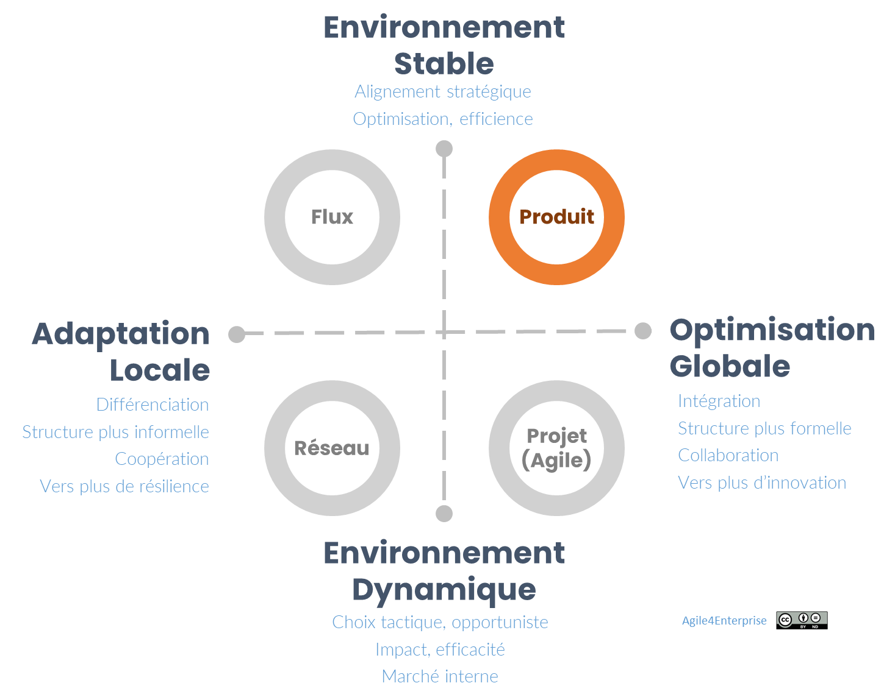
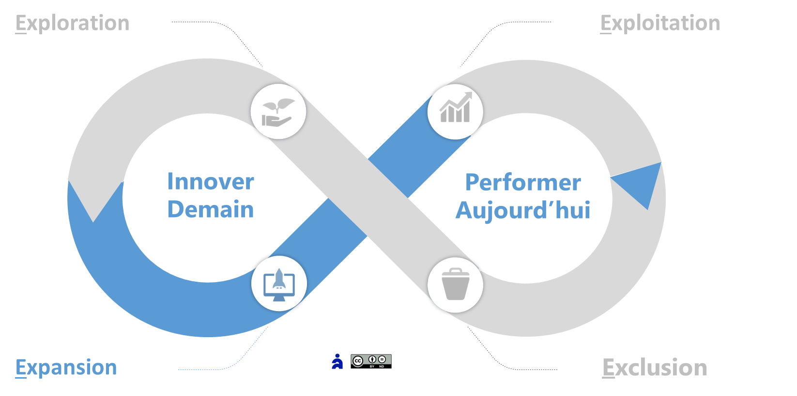
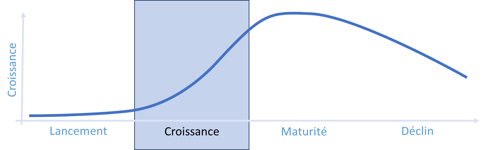
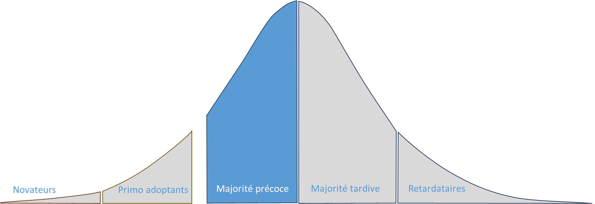
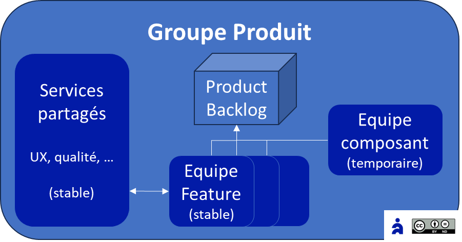
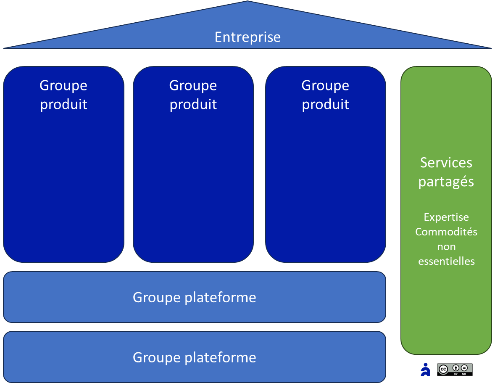

# Agile4Product : Archétype Produit

✨**Objectif**

L’**archétype Produit** guide les organisations qui veulent créer des produits différenciants, centrés sur l’expérience client et la valeur perçue. Il aligne la structure de l’entreprise sur une stratégie de différenciation par le produit, favorisant la scalabilité et l’innovation de continuité.

🧑‍🎓**Ce que vous allez apprendre ici**

- Comment une organisation peut s’aligner sur une **logique produit cohérente et scalable**.
- Les **principes structurels** d’une organisation produit : groupe produit, domaine métier, feature team.

📚**Petit lexique**

- **Backlog unique** = liste consolidée et priorisée des fonctionnalités produit, pilotée par un Product Owner.
- **Product Operating Model (POM)** = structure complète (développement, marketing, support, etc.) dédiée à la croissance d’un produit.
- **Domaine métier** = segment de valeur utilisateur stable au sein du produit, non autonome en tant qu’offre.
- **T-Shaped** = profil combinant une expertise forte dans un domaine et une polyvalence sur d’autres.

## Positionnement

**Stratégie orientée produit :** Différencier l’offre par l’usage et l’expérience utilisateur. L’actif incarne le moteur central de valeur pour l’entreprise et ses clients : produit et business ne font qu’un !

**Logique dominante :** approche « produit ».

**Exemples d’organisations** :

- **Portefeuille de produits digitaux** (ex. Airbnb).
- Unités d’affaires dans des **groupes**.
- Scale-ups
- Éditeurs de logiciels

### Caractéristiques

**Zone Agile4E privilégiée** : **Expansion**

## Design organisationnel Produit

### Structure

🧑‍🎓

**Unité stratégique « Groupe Produit »** :

Unité autonome réunissant toutes les fonctions nécessaires à la croissance de l’actif, de sa base clients et de ses utilisateurs. Certaines de ces fonctions sont intégrées dans les équipes, d’autres relèvent des services partagés du groupe. Ce modèle est également connu sous le nom de Product Operating Model (POM).

🌀**Exemple** :
*

Chez **Amazon**, chaque produit clé (ex. Alexa, AWS, Prime) fonctionne comme un **groupe autonome**.
*

Par définition, une unité gère un seul produit. Elle s’organise autour d’un unique Product Backlog, sous la responsabilité d’un unique Product Owner, avec une structure plate, et un minimum de niveaux hiérarchiques. Le Product Manager, garant de l’organisation produit, détient l’autorité sur le compte de résultat et le pouvoir de décision pour atteindre les objectifs. Son rôle, de niveau senior, implique aussi le pilotage des ressources nécessaires à l’exécution de la stratégie.

🧑‍🎓

**Unité tactique** :

L’espace tactique, lorsqu’il existe, se structure autour de **domaines métiers**.

Un domaine métier représente une composante significative du produit, adressant un segment client, mais sans valeur ni identité propres en dehors de son intégration au produit. Les équipes peuvent livrer des éléments de Backlog utiles aux utilisateurs, mais toujours dans le cadre de l’incrément. On recherche en général un domaine stable, indépendant de toute solution technique particulière.

🌀**Exemple** :
*

**Airbnb** a organisé ses équipes autour de domaines de valeur comme « Expérience voyageur » et « Hôte ».
*

🧑‍🎓

**Unité opérationnelle** :

Équipe pluridisciplinaire, stable, organisée par fonctionnalité, favorisant à la fois l’apprentissage métier et la performance collective.

**Équipe composant** :

Elle intervient lorsque l’état ou la qualité d’un composant empêche son usage efficace par d’autres équipes. Sa mission consiste à refactorer et désendetter ce composant pour qu’il réintègre le Backlog commun. Une fois cette mission accomplie, elle n’a plus de raison d’exister. Sa durée de vie reste donc limitée. La dérive possible : devenir une équipe produit interne ou un groupe plateforme.

#### Groupes plateformes

Il se concentre sur les services communs et les fonctionnalités de commodité utilisés par plusieurs groupes. Contrairement à ces derniers, il ne gère pas de produit ni de compte de résultat propre. Son rôle crée donc une dépendance entre unités, mais permet d’éviter la duplication des rôles, compétences ou composants. Avant de mettre en place un tel groupe, certains critères doivent être examinés :

- Service non essentiel avec dépendances linéaires ou partagées,
- Le coût des délais induits par ces dépendances reste acceptable,
- La prédictibilité du service rendu est assurée (approche en flux privilégiée).

En revanche, les services partagés directement liés aux groupes, comme l’expérience utilisateur ou la qualité, doivent être intégrés dans chaque groupe.

### Capacités organisationnelles

L’enjeu paradoxal consiste à passer à l’échelle — marché et structure interne — tout en préservant l’agilité. **Agile4C** appliqué au Produit :

- **Réactivité** : Intégration rapide des retours utilisateurs.

    🌀**Exemple** :
*

    **Netflix** effectue constamment des tests A/B sur les interfaces pour optimiser l’expérience utilisateur.
    *
- **Flexibilité** : Adaptation permanente de la feuille de route aux usages évolutifs.
- **Adaptabilité** : Reconfiguration selon la croissance du produit et intégration continue des innovations technologiques et marché.

    🌀**Exemple** :
*

    **Apple** ajuste ses produits en fonction des avancées, comme Face ID ou Apple Silicon.
    *
- **Proactivité** : Anticipation des besoins futurs.
- **Innovation de continuité** (usages, fonctionnalités…).

    🌀**Exemple** :
*

    **Tesla** met souvent à jour ses véhicules à distance (OTA — Over The Air) pour les améliorer.
    *

### Reconnaissance

Pour l’individu, l’enjeu central devient la compétition. Il est lié à la contribution au produit, à l’impact métier et au développement de la compétence collective. Cette organisation valorise l’expertise et la performance. Elle vise des résultats supérieurs grâce à la maîtrise technique ou professionnelle. L’avancement repose surtout sur la méritocratie. L’enjeu managérial consiste à atteindre les objectifs et à réduire le Time-To-Market des fonctionnalités.

### Individu

**Style de gestion** : Servant Leadership et subsidiarité.

🌀**Exemple** :
*

Chez **Zappos**, le management laisse les équipes maximiser l’expérience client plutôt que d’imposer des directives rigides.
*

**L’apprentissage multicompétences** : Les profils en T, alliant expertise et polyvalence métier, constituent un véritable atout. Visez l’équilibre entre l’efficience de l’expert et l’efficacité de l’équipe.

🌀**Exemple** :
*

**SpaceX** forme ses ingénieurs sur plusieurs disciplines (propulsion, logiciels embarqués, design structurel).
*

Enfin, les individus recherchent l’autonomie en tant que professionnels.

### Processus

**Pilotage par la valeur** perçue :

- Pilotage fondé sur les données.
- Budget produit alloué de façon progressive, aligné sur l’impact mesurable.
- Gestion du portefeuille d’initiatives stratégiques guidée par la valeur délivrée plutôt que par une feuille de route planifiée.
- **OKR** orientés sur les comportements utilisateurs.

🌀**Exemple** :
*

Google et LinkedIn adaptent constamment leurs algorithmes de recherche et de publication, respectivement, selon l’usage qu’en font les utilisateurs.
*

**Coordination verticale**

- Processus communs (cadences de sprint, de version, etc.).
- Rôle d’intégrateur : un Product Backlog unique avec un Product Owner unique, marqueur du couplage fort du groupe.
- Intégration du produit et alignement sur des objectifs partagés.

**Coordination horizontale**

- Ajustement mutuel (auto-organisation des équipes),
- Des règles explicites (définition de « prêt » et de « fini », cadence de sprint…).

**Gestion de la dépendance**

- **Interdépendance mutualisée** avec les services partagés : Gérée soit par une approche orientée service soit par des processus.
- **Interdépendance réciproque** avec les équipes opérationnelles : Gérée grâce à la pluridisciplinarité, l’auto-organisation et la taille réduite des équipes.

**Organisation duale**

La gestion Produit se distingue de la ligne hiérarchique. Les rôles opérationnels décident du travail à réaliser sans responsabilité RH, tandis que les managers se consacrent à l’amélioration du design organisationnel et de l’efficience des équipes, sans intervenir sur le contenu du travail. Elles peuvent ainsi se reconfigurer rapidement.

**Méthode privilégiée** : Scrum.

### Résultats : Performance & Culture

#### Performance

L’organisation se construit autour de la valeur perçue par la clientèle. Puisque le compte de résultat dépend du produit, les indicateurs clés de performance en dépendent également.

🌀**Exemple** :
*

**Amazon Prime** mesure le taux d’engagement client et la fréquence des commandes pour ajuster son offre.
*

**Problématique de la zone d’expansion** :

Préparer, à terme, l’intégration du produit dans le portefeuille d’exploitation, lorsqu’il existe. Cela impacte autant la performance des deux zones.

🌀**Exemple** :
*

**Google** a intégré YouTube en l’assimilant progressivement à son écosystème (ex. : la monétisation avec Google Ads).
*

#### Modèle culturel dominant

L’organisation produit se présente comme un modèle basé sur les buts relationnels, une logique de marché et une culture du résultat. Elle se concentre sur la compétitivité et l’atteinte des objectifs. C’est un domaine privilégié des OKR. Celles qui adoptent cette logique visent la productivité, la rentabilité et les parts de marché. Compétences et expertises forment des atouts déterminants. Les décisions sont souvent déléguées ou négociées.

Ce modèle favorise une **culture Produit** qui encourage :

- **Innovation continue** : Exploration des usages, test & learn rapide.
- **Centrée utilisateur** : Valeur = usage + expérience perçue.

### Bénéfices clés

- **Scalabilité fluide** : structure modulaire.
- **Alignement fort** : cohérence business ↔ produit.
- **Efficience** : réduction du Time-To-Market fonctionnalité.

## 👣 Et concrètement, lundi matin ?

**Fonctionnez-vous déjà en Produit ?** Cochez les questions suivantes :

- [ ] Un Product Backlog unique pilote-t-il toutes vos équipes ?
- [ ] Mesurez-vous NPS, rétention et usage par fonctionnalité ?
- [ ] Adaptez-vous votre Backlog à chaque retour utilisateur ?
- [ ] Vos équipes combinent-elles pluridisciplinarité et profils en T ?
- [ ] Disposez-vous d’**un OKR produit** couplé à votre budget ?

**Plus de 3 oui** : vous êtes déjà engagés sur la bonne voie.

**Moins de 3 oui**, pour y parvenir, suivez ces principes :

1. Passer de la start-up à la scale-up.
2. Mettre à l’échelle l’organisation produit.
3. Préparer l’intégration dans la zone d’exploitation.

## Implémentations & cadres d’inspiration

Vous pouvez vous inspirer de l’un de ces modèles :

- SAFe, pour une gestion intégrée
- LeSS, pour coordonner plusieurs équipes produit
- Spotify (Agile@Scale), pour la scalabilité organisationnelle

### Vue synthétique SCRIP

**Structure** :

- Unité stratégique autour du produit, d’un domaine métier
- Alignement autour d’un Product Owner et d’un Backlog unique.
- Equipe : pluri disciplinaire, auto organisée, stable

**Capacités** :

- Réactivité : feedbacks utilisateurs et clients
- Flexibilité : usage du produit spécifique
- Adaptabilité : au marché et à la technologie
- Proactivité : au nouveaux usages métier / produit
- Amélioration continue orientée innovation de continuité

**Reconnaissance** :

- Performance managériale : Time To Market (TTM) fonctionnalités, atteinte des objectifs
- Performance individuelle : apprentissages métier / produit

**Individus** :

- Servant leadership et ajustement mutuel
- Développement : multi compétences autour du produit /métier
- Mobilité : Mono équipe, au sein du groupe tactique

**Processus** :

- Pilotage par la valeur (OKR, data-driven)
- Coordination verticale/horizontale autour du Backlog.
- Méthode privilégiée : Scrum
