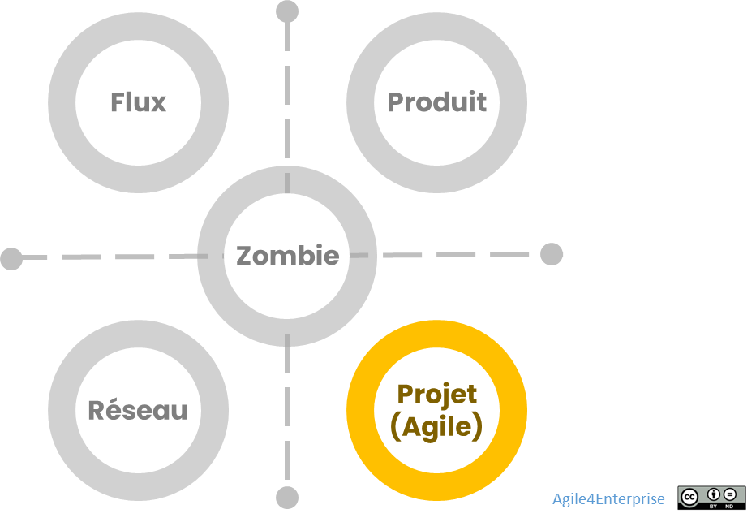

# Agile4Project : Archétype Projet (agile)

Propriétaire: Laurent Morisseau

- Sommaire

<aside>
✨

**Objectif**
L’**archétype Projet** permet à l’entreprise de structurer des **initiatives stratégiques temporaires**, orientées vers l’**exploration** ou le **désengagement**, avec des **objectifs clairs, limités dans le temps** et une forte exigence d’impact.

Il constitue une **interface entre la stratégie et l’action**, offrant un cadre idéal pour tester, pivoter, désengager ou valider des hypothèses stratégiques à moindre risque.
**Différenciation :** 

- Permet d’expérimenter de nouveaux modèles économiques, de faciliter la sortie d’actifs obsolètes, et de transformer les actifs existants.
- Il se distingue des archétypes [Produit](https://www.notion.so/Agile4Product-Arch-type-Produit-13490eaf28ff80b29733f767568ab6a5?pvs=21) (développement pérenne) et [Flux](https://www.notion.so/Agile4Flow-Arch-type-Flux-13490eaf28ff809bac54ed5deaa8a257?pvs=21) (exécution stable), par sa logique de transition, d’exploration et d’agilité tactique.
</aside>

Modèle des 4 archétypes agiles

# Positionnement stratégique

Une organisation projet est une organisation qui se structure autour de ses projets. Un projet étant définit par un objectif et contraint par une date et un budget. L’archétype projet ici est bien sûr une implémentation agile de l’organisation, c’est-à-dire que ses projets sont gérés de manière agile.

| **Exploration** | Identifier de nouveaux business models |
| --- | --- |
| **Exploitation** | Transformer les actifs existants |
| **Exclusion** | Désengager des actifs obsolètes de façon maîtrisée |

## Déclinaisons de l’archétype Projet

L’archétype **Projet** s’applique principalement dans **deux contextes stratégiques distincts**.

### [Zone d’exploration](https://www.notion.so/Design-organisationnel-de-la-zone-Exploration-13f90eaf28ff8012b2fcc13892e9048e?pvs=21)

**Objectif** : Rechercher un business model innovant.

Cycle de vie de l’actif : [Lancement](https://www.notion.so/Design-organisationnel-de-la-zone-Expansion-13f90eaf28ff8097b421cd0166ec489b?pvs=21)

Segment clients : [Novateurs et primo adoptants](https://www.notion.so/Explorer-et-comprendre-la-strat-gie-13690eaf28ff81d18468ca20936fdecc?pvs=21)

Modèle 4E

> *Exemple : Une organisation projet peut être la cible lors d’une alliance stratégique entre deux entreprises. Chaque entreprise conserve son autonomie stratégique tout en collaborant dans le contexte de l’alliance sous forme de projets collaboratifs. Ou encore, entre deux unités stratégiques d’une entreprise pour entrer sur un nouveau marché.*
> 

<aside>
💡

La zone de management privilégiée est l’[exploration](https://www.notion.so/Le-mod-le-A4E-de-l-agilit-portfolio-13490eaf28ff803a884fc20066900149?pvs=21).

Les dimensions agiles privilégiées sont l’[**Agilité Portfolio](https://www.notion.so/L-agilit-Portfolio-18f90eaf28ff8009b702d2aa0eae18cf?pvs=21) & [Stratégique](https://www.notion.so/L-agilit-strat-gique-13490eaf28ff80e2b4d8f6ab581de0f3?pvs=21)**, pour aligner les unités autonomes et l’innovation.

</aside>

### [Zone d’exclusion](https://www.notion.so/Design-organisationnel-de-la-zone-Exploitation-13f90eaf28ff801888b5f5f63d62bfae?pvs=21)

**Objectif** : Désengager un actif pour libérer des ressources stratégiques.

Cycle de vie de l’actif : [Déclin](https://www.notion.so/Design-organisationnel-de-la-zone-Expansion-13f90eaf28ff8097b421cd0166ec489b?pvs=21)

Segment clients : [Retardataires](https://www.notion.so/Explorer-et-comprendre-la-strat-gie-13690eaf28ff81d18468ca20936fdecc?pvs=21)

Modèle 4E

<aside>
💡

La zone de management privilégiée est l’[exclusion](https://www.notion.so/Le-mod-le-A4E-de-l-agilit-portfolio-13490eaf28ff803a884fc20066900149?pvs=21).

La dimension agiles privilégiée est l’[**Agilité Portfolio**](https://www.notion.so/L-agilit-Portfolio-18f90eaf28ff8009b702d2aa0eae18cf?pvs=21), pour piloter le **désengagement maîtrisé** des ressources et leur réallocation.

</aside>

### Zone d’exploitation

Enfin, on retrouve également le mode projet dans la zone d’exploitation pour les projets de transformation appliqués au cœur de métier.

## Design organisationnel : le modèle SCRIP appliqué au Projet

Le design de l’archétype Projet repose sur une **organisation fonctionnelle par compétence** avec une zone tactique d’intégration organisée par projet. Le design [SCRIP](https://www.notion.so/Les-4-arch-types-agiles-14290eaf28ff8004874de93022c243f8?pvs=21) (Structure, Capacités, Reconnaissance, Individu, Processus) permet une lecture complète des dimensions du modèle.

### Structure

Structure type d’une organisation Projet

*Exemple : Une ESN est typiquement une organisation projet.*

<aside>
📚

En savoir plus sur le [design organisationnel pour l’exploration](https://www.notion.so/Design-organisationnel-de-la-zone-Exploration-13f90eaf28ff8012b2fcc13892e9048e?pvs=21)

</aside>

<aside>
💡

Unité stratégique

C’est le **programme** d’initiatives stratégiques (en exploration ou en désengagement).

*Cela peut-être un incubateur, un laboratoire interne…*

</aside>

<aside>
💡

Unité tactique

C’est l’espace d’intégration des projets, agile, temporaire et reconfigurable, piloté par l’impact.

</aside>

- [Couplage faiblement](https://www.notion.so/Les-principes-de-design-strat-gique-13e90eaf28ff80628778e05ec7ed18cc?pvs=21) entre projets
    - Les projets se créent et s’arrêtent par rapport aux résultats qu’on leur fixe ou qu’elles se fixent, leur date de début et de fin, et leur budget. Chaque projet est autonome, avec des objectifs définis.
- Couplage fort au sein d’un projet
    - Réalisé autour du [Backlog](https://www.notion.so/Le-Backlog-un-outil-d-int-gration-ou-de-coordination-14490eaf28ff805e9950ccf8c65367cb?pvs=21) par projet et des [OKR](https://www.notion.so/OKR-un-outil-de-l-agilit-strat-gique-et-tactique-14590eaf28ff80b3b0f7e344d0764762?pvs=21) pour la fixation de l’objectif du projet.
        - OKR stratégique pour le programme.
        - OKR tactique pour le projet.
- [Dépendance faible](https://www.notion.so/Minimiser-les-interd-pendances-14390eaf28ff804f9da7d83917dd8232?pvs=21) entre les projets
    - **L’interdépendance est liée aux services partagés mutualisés**, tels que des compétences rares ne pouvant être intégrées à l’équipe projet. L’objectif est d’optimiser les expertises disponibles sans créer de rigidité.
- [**L’organisation duale](https://www.notion.so/La-reconfigurabilit-organisationnelle-14390eaf28ff80a3bb7dcfa1a866df07?pvs=21) :** structure hiérarchique stable (par pôles de compétences) + réseau dynamique d’équipes projet
    
    Il s'agit du réseau des équipes projet, un réseau dynamique composé d'équipes temporaires et ad hoc. La structure formelle, elle, repose généralement sur une organisation fonctionnelle, structurée en fonction des pools de compétences nécessaires pour constituer les équipes projet. La structure est la ligne hiérarchique, les projets se font là où se font les affaires.
    
    - Décorrélation entre les unités opérationnelles, organisée par pôle de compétences métier ou techniques, et l’espace tactique des projets. C’est généralement une organisation fonctionnelle à la base.
    - L’espace d’intégration constitue le [réseau informelle de l’organisation duale](https://www.notion.so/La-reconfigurabilit-organisationnelle-14390eaf28ff80a3bb7dcfa1a866df07?pvs=21), facilitant ainsi la [reconfigurabilité](https://www.notion.so/La-reconfigurabilit-organisationnelle-14390eaf28ff80a3bb7dcfa1a866df07?pvs=21) et permettant une [agilité organisationnelle](https://www.notion.so/L-agilit-organisationnelle-au-niveau-strat-gique-17790eaf28ff80569d37d43fbed7a8ca?pvs=21). Ce système informel peut évoluer au gré des [OKR tactiques](https://www.notion.so/OKR-un-outil-de-l-agilit-strat-gique-et-tactique-14590eaf28ff80b3b0f7e344d0764762?pvs=21).
    - Chaque projet à son Backlog, qui est un outil de coordination au [niveau chaîne de valeur](https://www.notion.so/Le-Backlog-un-outil-d-int-gration-ou-de-coordination-14490eaf28ff805e9950ccf8c65367cb?pvs=21).
    
    <aside>
    💡
    
    **Organisation duale**
    
    La structure formelle est fonctionnelle, organisée autour des pôles de compétences, tandis que le réseau informel est constitué des équipes projet.
    
    </aside>
    
- **Unité opérationnelle : équipe projet ou d’impact**
    
    Une équipe d’impact se constitue autour d’OKR tactiques, avec un cycle de vie court et une objectif précis. Elle est définie par rapport au résultat qu’elle cherche à atteindre. Elle s’arrête lorsque l’objectif est atteint ou à la fin du cycle tactique. La pluridisciplinarité est obtenue dans l’espace d’intégration. Le chef de projet est un rôle opérationnel d’intégration et de coordination. Ce n’est par une rôle managérial.
    
    Mais les unités opérationnelles, les pôles de compétences, sont stables elles, avec un manager pour s’assurer du développement des compétences.
    
    <aside>
    🧰
    
    En savoir plus sur les caractéristiques au niveau [équipe](https://www.notion.so/L-agilit-op-rationnelle-13490eaf28ff80e5b767fd273784c80b?pvs=21)
    
    </aside>
    

### Capacités organisationnelles agiles

Les **4 capacités organisationnelles clés** sont essentielles pour garantir l’agilité d’une organisation projet :

<aside>
💡

**Réactivité**

Capacité à expérimenter rapidement des hypothèses, à prendre des initiatives.

Time-to-impact réduit

</aside>

<aside>
💡

**Flexibilité**

Réajustement des objectifs tactiques, réallocation de ressources

</aside>

<aside>
💡

**Adaptabilité**

Évolution rapide des objectifs stratégiques.

</aside>

<aside>
💡

**Proactivité**

Création d’un pipeline d’innovations aligné avec la stratégie globale.

</aside>

### Reconnaissance : Valoriser l'impact, pas la hiérarchie

| Enjeu | Démarche associée |
| --- | --- |
| **Individuel** | Basé sur la contribution visible aux OKR tactiques |
| **Équipe** | Célébration des transitions et retours d’expérience collectifs |
| **Apprentissage** | Reconnaissance des enseignements utiles même en cas d’échec |
| **Feedback horizontal** | Rétrospectives, peer-reviews, rituels de clôture |

**L’enjeu individuel** est celui de la réputation et le développement de compétences.

**L’enjeu managérial** porte sur le potentiel combinatoire des compétences et la capacité des équipes à pouvoir mettre en œuvre de nouvelles compétences rapidement.
L’archétype **Projet** repose sur une **culture de l’impact** et de la **contribution individuelle et collective**, où la reconnaissance et la gestion des individus doivent être adaptées à un cadre **temporaire et dynamique**.

Contrairement aux structures plus stables ([Produit](https://www.notion.so/Agile4Product-Arch-type-Produit-13490eaf28ff80b29733f767568ab6a5?pvs=21), [Flux](https://www.notion.so/Agile4Flow-Arch-type-Flux-13490eaf28ff809bac54ed5deaa8a257?pvs=21)), l'archétype **Projet** fonctionne en mode temporaire, avec une logique d’évaluation **axée sur l’impact** et la capacité à **atteindre les objectifs stratégiques**.

**Principes clés de la reconnaissance :**

1. **Pilotage par l’impact** : les individus et équipes sont reconnus sur la base des résultats atteints, et non sur leur temps passé ou leur conformité à un plan.
2. **Valorisation de l’apprentissage** : un projet peut être un succès même s’il échoue, tant qu’il **apporte des enseignements exploitables** (ex. Lean Startup).
3. **Reconnaissance horizontale** : mise en place de **feedbacks continus** entre les membres du projet, plutôt qu’une évaluation uniquement descendante.
4. **Visibilité de la contribution** : l’impact des individus est rendu **visible via les OKR tactiques**, facilitant une reconnaissance basée sur la **création de valeur mesurable**.
5. **Célébration des transitions** : comme un projet est temporaire, **des rituels de clôture** (ex. rétrospective projet, partage des apprentissages) permettent de reconnaître les contributions avant la dissolution de l’équipe.

> **Exemple de reconnaissance agile :**
> 
> - **Mise en avant des contributions clés** lors des rétrospectives projet.
> - **Valorisation des "pivots" et apprentissages** dans les projets exploratoires.
> - **Récompenses basées sur les résultats atteints** (ex. prime d’impact, accès à de nouveaux projets stratégiques).
> - **Systèmes de peer-feedback** pour renforcer la reconnaissance entre membres de l’équipe.

### Individu

Dans une organisation plus stable ([Produit](https://www.notion.so/Agile4Product-Arch-type-Produit-13490eaf28ff80b29733f767568ab6a5?pvs=21), [Flux](https://www.notion.so/Agile4Flow-Arch-type-Flux-13490eaf28ff809bac54ed5deaa8a257?pvs=21)), les individus évoluent dans des **équipes fixes et pérennes**. En mode **Projet**, ils sont **transitoires**, naviguant d’une mission à une autre, ce qui implique **un autre modèle de gestion des talents et des responsabilités plus dynamique**.

**Styles de leadership et d’encadrement :**

- **La direction adopte un style de leadership stratégique** → définit la **vision** et les grandes lignes du projet.
- **Le leadership est entrepreneurial et distribué** → l’équipe **décide elle-même** de ses moyens d’exécution.
- **Le management est orienté réseau** → facilite la mise en relation des talents, plutôt que de diriger en hiérarchie.

L’écueil est de se retrouver avec une organisation matricielle avec un axe compétence et un axe projet, amenant chaque collaborateur ayant deux managers : leur manager compétence et leur chef de projet. Cela pouvait se produire dans le cas des projets longs, avec une organisation qui se fige.

**Les individus doivent être capables de :**

- S’adapter rapidement à **de nouveaux contextes projet**.
- Développer des **compétences transverses** pour maximiser leur impact.
- Fonctionner avec **un haut niveau d’autonomie** et de responsabilité.

**L’évolution des talents et la gestion des compétences**

C’est un modèle de gestion basé sur l’apprentissage et l’évolution :

- **Les individus développent leur expertise** en passant d’un projet à un autre, plutôt qu’en restant dans une structure fixe.
- Les **OKR tactiques** permettent d’orienter les individus vers des projets où ils peuvent **apporter une valeur directe**.
- Une logique de **mobilité fluide** entre projets remplace la gestion classique des carrières (un collaborateur peut facilement passer d’un projet d’exploration à un projet d’exclusion).

<aside>
🧰

En savoir plus sur les caractéristiques au niveau [management](https://www.notion.so/L-agilit-op-rationnelle-13490eaf28ff80e5b767fd273784c80b?pvs=21)

</aside>

### Processus et coordination

<aside>
💡

**Pilotage par l’impact, en vue d’atteindre l’objectif associée à l’initiative stratégique, ajusté à chaque itération.**

</aside>

L’objectif n’est pas le livrable, mais **l’impact stratégique mesurable**, que l’on pilote grâce à des OKR adaptés.

[**Coordination verticale**](https://www.notion.so/La-coordination-verticale-14390eaf28ff807b9cafd0f0af71e154?pvs=21)
La coordination **verticale** repose sur des **rôles d’[intégrateurs](https://www.notion.so/La-coordination-horizontale-14390eaf28ff803ca06ccdf8026760d7?pvs=21)** : ex. chefs de projet agiles, responsables de transformation.

[**Coordination horizontale**](https://www.notion.so/La-coordination-horizontale-14390eaf28ff803ca06ccdf8026760d7?pvs=21)

La coordination horizontale est gérée par du management réticulaire. Elle est assurée par un **réseau informel** et des **cadences de synchronisation régulières**.

[**Cadence de changement**](https://www.notion.so/Les-4-cadences-du-changement-et-de-l-apprentissage-13b90eaf28ff8091b4cce85974f50938?pvs=21)

- Revue opérationnelle quotidienne
- Revue tactique hebdomadaire ou bi mensuelle des initiatives pour ajuster les priorités.
- Revue **trimestrielle** pour évaluer les **OKR tactiques** et piloter l’atteinte des objectifs.

**Méthodes**

Il existe différentes méthodes de gestion de projets agiles :

| **Méthode** | **Idéal pour…** | **Pourquoi ?** |
| --- | --- | --- |
| **DSDM (Dynamic Systems Development Method)** | Projets structurés, compliance, IT | Gestion hybride avec flexibilité sur le périmètre fonctionnel |
| [Shape -Up](https://www.notion.so/Shape-Up-17e90eaf28ff80758f0bd20ba1545584?pvs=21) **** | Petits projets, équipes autonomes | Approche fluide sans Backlog, engagement sur 6 semaines |
| **PMI Agile (PMI-ACP)** | Projets complexes | Standardisation + flexibilité agile |
| **AgilePM** | Gestion agile de projet | Structure + gouvernance pour projets agiles |
| **Scrum** | Gestion agile de projet | Flexibilité sur le périmètre fonctionnel |

## Résultats

### Performance

La performance repose sur le potentiel combinatoire des diverses compétences. Elle repose également sur l’atteinte des objectifs définis à court terme.

- La réussite est mesurée par l’impact stratégique du projet plutôt que par l’achèvement d’un plan préétabli.
- L’atteinte des **OKR tactiques** est un indicateur clé.
- La capacité à **réallouer rapidement les ressources** démontre l’agilité organisationnelle.

### Culture

## 🌱 Culture et mindset

| Valeurs dominantes | Manifestation dans l’organisation projet |
| --- | --- |
| **Intrapreneuriat** | Autonomie, initiative, prise de risque stratégique |
| **Apprentissage continu** | Rétrospective projet, capitalisation, valorisation du pivot |
| **Flexibilité structurelle** | Reconfigurabilité permanente de l’espace d’intégration |
| **Réseau de talents** | Plateforme de compétences plutôt que hiérarchie de commandement |

C’est une culture projet qui reste entrepreneuriale et repose sur une logique de réseau. Les organisations qui privilégient ces valeurs tendent à être dynamiques et prêtes à prendre des risques, en encourageant l'initiative et l'invention pour s'adapter rapidement aux changements du marché ou de l'environnement.

La vision d’un futur partagé, les enjeux et les objectifs communs sont des facteurs de cohésion dans une organisation où la structure formelle est minimale, avec un leader effacé. Les rôles sont opérationnels et basés sur les missions à accomplir. La contribution individuelle est autant valorisée que la contribution collective.

Les organisations sont très sensibles aux évolutions de l’environnement extérieur, ce qui déclenche des changements et met l'organisation en mouvement grâce à des dynamiques provenant du terrain. 

> Une culture de **mobilité, d’impact et de contribution** — compatible avec les environnements incertains, évolutifs et opportunistes. Le changement y est permanent et fluide.
> 

<aside>
📚

En savoir plus sur le [modèle du système ouvert, logique de réseau & culture de l’adhocratie](https://www.notion.so/Les-mod-les-organisationnels-une-approche-culturelle-15e90eaf28ff8007833ff2ce6c1bcea7?pvs=21)

</aside>

# Bénéfices d’un archétype en projet

- Exploration rapide **et sécurisée** de nouveaux marchés ou de nouvelles stratégies.
- Gestion dynamique du portefeuille d’initiatives stratégiques
- Désengagement maîtrisé des actifs non stratégiques
- **Reconfigurabilité organisationnelle**, grâce à l’espace d’intégration et une structuration agile des projets.
- **Pilotage flexible et adaptatif** des ressources et initiatives.
- **Alignement stratégique dynamique**, en réajustant en continu les objectifs et moyens des projets.
- Apprentissage stratégique à travers l’action.

## La transformation vers un archétype Projet

L’approche n’est pas nouvelle. Ici, la transformation consiste à basculer sur un mode de gestion agile de ces projets, ce que nous avons déjà fait avec les transformations agiles opérationnelles, sans aller jusqu’à l’approche produit.

L’évolution vers un modèle **Projet Agile** consiste à :

1. Remplacer les **projets traditionnels** par des **initiatives alignées sur les OKR stratégiques**.
2. Mettre en place une **gouvernance en réseau**, plutôt qu’un contrôle rigide des livrables.
3. Instaurer une **organisation permettant de** fluidifier la gestion des compétences.
4. Structurer les projets autour d’**équipes d’impact**, avec une finalité mesurable et un horizon temporel limité.

## **Radar de l’Archétype Projet :**

- Axe Réactif : Capacité à expérimenter rapidement des hypothèses.
- Axe Flexible : Capacité à ajuster les ressources en fonction des découvertes.
- Axe Adaptatif : Évolution rapide des objectifs stratégiques en phase d’exploration.
- Axe Proactif : Création d’un pipeline d’innovations aligné avec la stratégie globale.

# Synthèse de l’archétype Projet

*Alignement stratégique du modèle organisationnel projet*

# Implémentations de cet archétype

- **Incubateurs stratégiques internes**
- **Plateformes de projets / labs d’innovation**

## Implémentation du modèle Front Back pour une stratégie orientée client

Implémentation du modèle Front Back Agile

<aside>
📚

En savoir plus sur le [modèle Front Back](https://www.notion.so/Le-mix-organisationnel-et-la-logique-dominante-15e90eaf28ff800cbef0fc08b66fb1f3?pvs=21) et de la [stratégie orientée client](https://www.notion.so/Le-mix-organisationnel-et-la-logique-dominante-15e90eaf28ff800cbef0fc08b66fb1f3?pvs=21)

</aside>

---

# 🔑 Points clés à retenir

*Expérimentation stratégique, impact mesurable et reconfigurabilité organisationnelle*

📌 **Objectif du Projet Agile :**

- Explorer ou tester de nouvelles initiatives stratégiques avec **des objectifs définis et limités dans le temps**.
- Se positionner comme un **mécanisme de transition** entre **exploration** et **exclusion**.

📌 **Unité Stratégique et Tactique :**

- **Programme d’Initiatives Stratégiques** pour les projets d’exploration.
- **Équipe d’Impact**, formée autour d’OKR tactiques et d’un **objectif précis**.

📌 **Méthodes privilégiées :**

- **Lean Startup & Design Thinking** pour les projets exploratoires.
- **Kanban** pour gérer les transitions et fermetures d’actifs.
- **Agile Portfolio Management (LPM)** pour aligner les initiatives stratégiques.
- **Shape Up** pour gérer des projets avec engagement court et efficace.

📌 **Cadence de changement :**

- **Revue mensuelle** pour ajuster les priorités.
- **Revue trimestrielle** pour évaluer les **OKR tactiques** et ajuster les stratégies.
- **Rituels de clôture** pour analyser les enseignements et reconnaître les contributions.

📌 **Organisation et Interactions :**

- **Couplage faible** entre projets, mais **fort au sein des équipes** autour d’un objectif clair.
- **Interdépendance mutualisée** via une **"Plateforme de Ressources Projets"** pour partager les expertises.
- **Réseau informel** facilitant la **reconfigurabilité rapide des équipes** et l’**agilité organisationnelle**.

📌 **Reconnaissance :**

- **Évaluation basée sur l’impact** et non sur la hiérarchie.
- **Visibilité des contributions** via des **OKR tactiques** et des **résultats mesurables**.
- **Feedbacks horizontaux** (peer-review, rétrospectives).
- **Rituels de clôture des projets** pour valoriser les réussites et les apprentissages.

📌 **Individu et Leadership :**

- **Leadership entrepreneurial et distribué**, favorisant l'autonomie.
- **Mobilité fluide** entre projets pour accélérer l’apprentissage et la montée en compétences.
- **Gestion des talents par mission**, évoluant selon les opportunités stratégiques.
- **Développement des compétences transverses**, permettant une meilleure réaffectation vers des initiatives stratégiques.

L’archétype **Projet Agile** est un **catalyseur de changement ciblé**, permettant aux entreprises d’expérimenter, d’apprendre et de s’adapter **sans rigidité**.