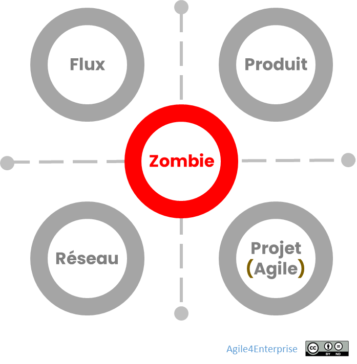

# Agile4Zombie : L’anti-archétype

✨ **Objectif** > Une organisation zombie qui a tout fait… sauf choisir. > Ni flux, ni produit, ni projet, ni réseau. Une organisation zombie a multiplié les initiatives et adopté tous les rituels agiles… sans faire de choix stratégique. ⇒ Elle **ne renonce à rien**, **n’adapte rien**, **ne pilote rien** : elle mime l’agilité, mais reste figée. ⇒ Ce contre-modèle sert à **révéler par contraste** les vraies décisions et renoncements qu’exigent les archétypes vivants.

L’archétype Zombie

> *Le mimétisme agile crée des organisations zombies. Le choix stratégique crée des organisations vivantes.*
> 

## Structure

| **Élément** | **Organisation Zombie** |
| --- | --- |
| **Zone stratégique** | Nulle part : exploration, exploitation et exclusion sont traitées **identiquement**, par mimétisme. |
| **Modèle opératoire** | Simulacre : mêmes rituels Flux, mêmes boards Produit, mêmes OKR Projet, mêmes slogans Réseau… sans cohérence. |
| **Cadence** | Irrégulière : cycles, boucles et revues s’empilent, **sans intégration ni alignement**. |
| **Langage** | Hautement « agilisé » : mots clés et jargons omniprésents, **mais décisions inchangées**, conservatrices. |

## Signes caractéristiques

Comment reconnaître une organisation Zombie concrètement ?

❌ **Portefeuille homogénéisé (ou absence de logique portefeuille) :** tous les actifs sont pilotés de la même façon, sous prétexte de « rationalisation ».

❌ **Artefacts sans intention :** boards Kanban, OKR, daily stand-up… **aucune de ces pratiques n’est reliée à un choix stratégique réel**.

❌ **Rituels sans suite :** revues de sprint, démos, rétrospectives… **aucun apprentissage n’est capitalisé**, tout repart à zéro.

❌ **RH figées :** campagnes de formation agiles, communautés de pratiques, mais **aucun changement des politiques de promotion ni des indicateurs de performance**

## A quoi sert cet anti-archétype ?

Il représente l’organisation qui prétend se transformer mais ne choisit jamais. Un archétype qui n’en est pas un. Il est ce qui **se produit quand le cadre est utilisé sans intention stratégique**. Il révèle :

- Ce que l’on évite en parlant de transformation,
- Les incohérences que l’on maquille en hybridation,
- La fatigue que l’on crée en refusant de trancher.

| **Rôle critique** | **Description** |
| --- | --- |
| **Antagoniste organisationnel** | Devient ce que vous êtes si vous **refusez de choisir** un archétype ou de renoncer à l’ancien monde. |
| **Symptôme mimétique** | **Tout change en surface**, mais la culture et la stratégie profondes restent identiques. |
| **Miroir inversé** | Par contraste, **révèle** les renoncements et les choix qu’un vrai modèle cohérent (Flux, Produit, Projet ou Réseau) impose. |

⚠️ **Shadow Zombie** *Polyglobe Industries, groupe diversifié, a imposé un « KANBAN for all » à toutes ses divisions. Résultat : 15 systèmes Kanban déployés, 120 réunions par mois, des indicateurs unifiés – les équipes ont ressenti une surcharge managériale sans valeur ajoutée et ont cessé de tenir leurs boards à jour.*

## Ce que cet archétype force à interroger

| Tension non résolue | Question clé |
| --- | --- |
| **Transformation sans engagement** | À quoi doit renoncer l’organisation pour qu’elle se transforme vraiment ? |
| **Hybridation désordonnée** | Mon organisation est-elle réellement hybride ou juste incohérente ? |
| **Rituels sans stratégie** | Mes pratiques agiles servent-elles vraiment ? |
| **Conformisme stratégique déguisé** | Mon organisation est-elle vraiment agile… ou simplement en train de différer les vrais choix ? |

➿ **Un cas de zombification** **Contexte :** Polyglobe, en mode zombie, multipliait les daily, retro, board sans impact. **Bascule :** Choix de passer à l’archétype Flux pour la division service. - Arrêt de toutes les cérémonies non-essentielles. La présence aux autres est sur la base du volontariat. - Co-construction d’un **Kanban bout en bout** - Identification de deux classes de service. - Suivi de leurs performances. **Résultat en 3 mois :** - Lead time réduit de 30 % - 40 % de tickets urgents traités dans les SLA - Taux de participation aux cérémonies > 90%

## Ce qu’il ne faut surtout pas faire

❌ **Penser que “c’est un archétype comme les autres”** → C’est un **contre-modèle**, un anti-archétype, pas un modèle opératoire.

❌ **Le tolérer dans la durée** → Il peut être **un état transitoire**, mais pas une solution durable.

❌ **Légitimer la confusion comme stratégie** → Une entreprise ne peut pas tout faire, tout le temps, avec tout le monde, sinon c’est l’appel du vide stratégique ou la tentation de la tactification. La cohérence du Business model et du modèle opératoire amène à arbitrer, à faire des choix assumés. Cela se traduit par le choix d’un archétype.

## Checklist “Chasse aux Zombies” (actions immédiates)

| Action | Responsable | Délai |
| --- | --- | --- |
| 1. **Choisir un archétype** (Flux, Produit, Projet ou Réseau) | CODIR | J+7 |
| 2. **Arrêter** tous les rituels non reliés à cet archétype | PMO | J+14 |
| 3. **Identifier 3 indicateurs clés** alignés à l’archétype | CPO / CTO | J+14 |
| 4. **Renommer un sponsor stratégique** pour chaque zone | DRH & Direction | J+7 |
| 5. **Fusionner** ou **supprimer** les artefacts redondants | Equipe Transformation | J+21 |
| **6. Valider** l’arrêt des rituels en mesurant le taux de cérémonies restantes < 20 % | PMO | M+2 |

---

## Utilisations recommandées

- ✅ **En diagnostic rapide** : repérer les zones « zombies » avant d’engager la vraie transformation.
- ✅ **En formation / coaching** : anti-modèle vivant pour illustrer les pièges.
- ✅ **En workshop stratégique** : pour faire émerger les choix et renoncements nécessaires.

---

###