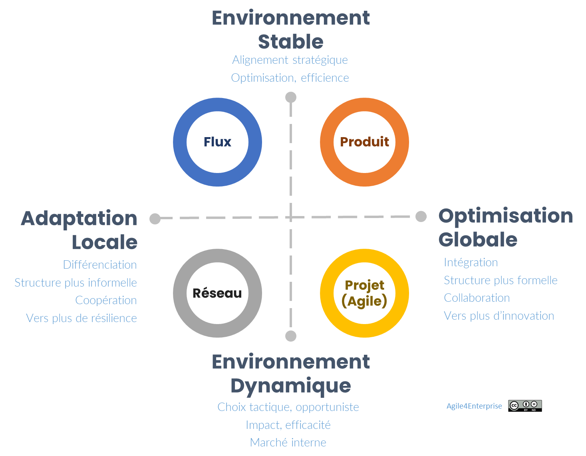

# Identifier votre archétype

Propriétaire: Laurent Morisseau

- Sommaire

<aside>
✨

**Objectif**

Clarifier quatre modèles opératoires (Flux, Produit, Projet, Réseau), pour aligner votre organisation sur sa stratégie dominante, en évitant l’ambiguïté et les hybridations molles.

- **Choisir, c’est renoncer** : chaque archétype a ses forces *et* ses renoncements.
- **Topologie & archétypes** en un coup d’œil pour décider rapidement.
</aside>

<aside>
🧑‍🎓

**Lexique rapide**

- **Backlog** : liste priorisée des tâches à faire.
- **Kanban** : méthode visuelle de gestion de flux avec colonnes et limites.
- **MVP** : Produit Minimum Viable, la version la plus simple permettant de tester une hypothèse.
- **SLA** : Engagement de niveau de service (Service Level Agreement).
- **ROI** : Retour sur investissement.
- **SCRIP** : Leviers structure, capacités, reconnaissance, individu, et processus.
- **ACTE** : Agile Canevas pour la transformation d’entreprise (outil de pilotage du changement)
</aside>

<aside>
❓

Vous reconnaissez-vous ?

- Un backlog produit qui n’avance pas,
- Des équipes Kanban figées,
- Des projets “agiles” qui tournent en rond.

**Ce chapitre** vous aide à repérer votre archétype courant et à décider d’une trajectoire claire, pas à juste cocher des pratiques.

</aside>

# Identifier votre archétype

## Les archétypes comme formes cohérentes de réponse stratégique

Chaque archétype du modèle Agile4X — Projet, Produit, Flux, Réseau — propose **une combinaison claire** entre :

- Un mode d'organisation,
- Une logique stratégique dominante,
- Une temporalité d’action,
- Une manière d’articuler intention et exécution.

Un archétype n’est pas un “modèle universel”. C’est une **forme opératoire** qui devient pertinente **dans un contexte stratégique donné**. Ce qui rend un archétype puissant, ce n’est pas ce qu’il inclut, mais **ce à quoi il renonce pour rester cohérent**.

## Topologie des archétypes

Modèle des 4 archétypes agiles

Chaque organisation peut ainsi identifier son archétype dominant et évaluer les **évolutions possibles** en fonction de sa stratégie et de ses besoins.

- **Axe vertical** :
    - **Haut** : **Agilité optimisée** (*tactique & opérationnelle*) → Privilégie l’exécution, l’efficacité et l’efficience. (Flux, Produit)
    - **Bas** : **Agilité exploratoire** (*stratégique & organique*) → Favorise l’innovation, l’émergence et la flexibilité. (Projet, Réseau)
- **Axe horizontal** :
    - **Gauche** : autonomie locale, résilience (Flux, Réseau)
    - **Droite** : intégration & performance globale (Produit, Projet)

## Les 4 archétypes en un coup d’œil

| Archétype | Contexte idéal | Focus principal | Utile quand… |
| --- | --- | --- | --- |
| **Flux** | Exploitation & services | Optimiser délai et coûts via Kanban | Vous devez fiabiliser une chaîne de valeur existante |
| **Produit** | Expansion & différenciation | Gérer un backlog produit stable | Vous scalez un produit ou service |
| **Projet** | Transformation & impact | MVP rapide avec équipes ad hoc | Vous testez une nouvelle piste |
| **Réseau** |  Exploration & innovation | Cellules autonomes et interactions informelles | Vous voulez décentraliser la décision |

# Mise en œuvre opérationnelle

Plutôt que d'appliquer un modèle unique, utilisez ces archétypes pour :

1. **Diagnostiquez** votre contexte avec la checklist ci-dessous.
2. **Identifier l’archétype dominant** celui qui structure vos interactions principales.
3. **Choisir une trajectoire** : vers quel archétype voulez-vous évoluer ? Pourquoi ?
4. **Adapter le à votre organisation en utilisant l’outil [ACTE](https://www.notion.so/Guide-de-l-outil-ACTE-13490eaf28ff802e8fcde2047f78143b?pvs=21).**
5. **Accompagner le changement** : par des arbitrages explicites et un pilotage stratégique.

<aside>
👉

**Quel est votre archétype actuel et vers quel modèle souhaitez-vous évoluer ?**

</aside>

## Choisir, c’est renoncer. Ne pas choisir, c’est renoncer à son potentiel.

Un archétype n’est pas un catalogue de pratiques, mais un **engagement structurant**.

- **Hybrider sans discernement** dilue votre efficacité.
- **Tensions non assumées** (ex. Scrum vs Kanban dans la même équipe) ne sont pas des bugs, mais des signaux : **Plutôt que de corriger les tensions, il faut les reconnaître, puis décider.**
- **Fake Agile** naît de l’ambiguïté prolongée : ne la laissez pas s’installer.

Ce modèle Agile4X propose une lecture radicale pour aider les organisations à clarifier leurs choix.

<aside>
➿

Après diagnostic, TechNova Capteurs a choisi de passer d’un modèle hybride Flux / Produit a un modèle flux assumé. **Résultat** : un flux de maintenance évolutive corrective maitrisé avec un réel engagement de service.

</aside>

C’est pourquoi vous avez l’anti archétype [Agile4Zombie](https://www.notion.so/Agile4Zombie-L-anti-arch-type-1db90eaf28ff802ebcecd01e11f22848?pvs=21) : ce qui arrive quand on ne choisit pas : Une structure figée dans le reflet d’une transformation jamais assumée. Lorsque l’organisation refuse de choisir, elle s’épuise à tout faire sans logique claire. 

Cependant, les archétypes sont des [modèles idéaux](https://www.notion.so/Agile4X-Les-forces-organisationnelles-14290eaf28ff8004874de93022c243f8?pvs=21), hors spécificités et contingences d’une organisation. Chaque entreprise, chaque stratégie étant spécifique, il se peut que vous ne vous y retrouviez pas dans ces propositions. Il va donc falloir trouver votre propre modèle spécifique, inspiré d’un archétype.

Votre archétype dominant est celui qui est exposé à ces clients, et correspond à votre **priorité stratégique**.

## Et concrètement, lundi matin…

Organisez un atelier pour identifier l’archétype dominant de votre organisation, en répondant à ces questions :

1. **Quel est votre principal défi stratégique ?** (Innovation ciblée ou distribuée, optimisation, mise à l’échelle)
2. **Quelle cadence de décision favorisez-vous ?** (Projets temporaires, flux continu, sprints, autonomie locale, synchronisation trimestrielle)
3. **Comment coordonnez-vous vos équipes ?** (Supervision verticale, collaboration horizontale, coopération, réseau informel)
4. **Quel degré de formalisation ?** (Processus standardisés, organique, mixte…)
5. **Quel type de livrable valide votre performance ?** (MVP, SLA, OKR, ROI …)

Puis c**larifier les tensions** éventuelles : incohérences, zones hybrides, ambiguïtés.

Enfin, identifier le plan d’actions pour une organisation plus cohérente, plus alignée, à piloter avec l’outil ACTE.

---

# 🔑 Points clés à retenir

Le modèle des archétypes Agile4X ne propose pas des options interchangeables. Il offre une grille de lecture pour faire des choix. Et chaque choix implique une renonciation.

- **Un archétype = acte politique**, pas une boîte à outils.
- **Chaque choix implique un renoncement** : anticipez les résistances.
- **Agilité cohérente** = alignement structure ↔ stratégie ↔ pratiques (SCRIP & ACTE).
- **Ne pas choisir**, c’est déjà renoncer à votre potentiel (anti-archétype Zombie).

# Annexes

## Matrice de comparaison des archétypes

| **Critères** | **Flux** | **Produit** | **Projet** | **Réseau** |
| --- | --- | --- | --- | --- |
| **Objectif principal** | Optimiser les chaînes de valeur pour réduire les délais et coûts (flux tiré). | Créer des produits différenciants et centrés sur les besoins des utilisateurs. | Explorer et tester des initiatives stratégiques avec des objectifs limités dans le temps. | Exploiter la synergie des cellules autonomes pour innover et s’adapter rapidement. |
| **Contexte idéal** | Processus opérationnels ou services matures, nécessitant prédictibilité et optimisation (zone d’exploitation). | Environnements innovants, orientés croissance ou différenciation produit (zone d’expansion). | Situations de recherche, innovation ou résolution de problématiques spécifiques (zone d’exploration). | Organisations complexes nécessitant collaboration décentralisée et flexibilité stratégique. |
| **Cycle de vie cible** | Maturité : Exécution et optimisation des processus existants. | Développement et croissance : Passage à l’échelle et évolution produit. | Lancement : Idéal pour les phases exploratoires ou émergentes. | Adaptation continue : Multi-phases selon les besoins émergents. |
| **Structure organisationnelle** | Réseau de systèmes Kanban, avec chaînes de valeur fortement couplées et interdépendances séquentielles. | Organisation produit avec équipes pluridisciplinaires stables et intégrées. | Équipes ad hoc formées pour des résultats spécifiques, faiblement couplées. | Réseau de cellules autonomes, flexibles et faiblement couplées. |
| **Unité stratégique** | Groupe Service : Responsabilité alignée sur les chaînes de valeur métier et classes de service. | Groupe Produit : Responsable de la stratégie produit, incluant développement, marketing et commercial. | Initiative ou programme stratégique : Pilotage par objectif défini. | Réseau de cellules autonomes, opérant comme des mini-startups ou intrapreneurs. |
| **Unité tactique** | Chaîne de valeur : Processus orienté utilisateur ou métier (ex. parcours utilisateur, facturation). | Domaine métier ou domaine de valeur : Composante du produit centrée sur un segment client. | Équipe à impact : Composée d’experts pluridisciplinaires. | Cellule : Unité réactive dédiée à une mission ou un objectif spécifique. |
| **Coordination** | Verticale et horizontale, via Kanban et limites de file d’attente pour aligner les flux. | Un Backlog unique pour prioriser les initiatives et coordonner les équipes. | Faible dépendance mutuelle, avec coordination ad hoc ou réticulaire. | Faible coordination centralisée, mise en avant des interactions informelles et réticulaires. |
| **Indicateurs de performance** | SLA (Service Level Agreements), délai de livraison, variabilité (Due Date Performance). | Satisfaction client, vitesse de mise sur le marché, qualité, rentabilité. | Résultats mesurables (ROI, délai de livraison, qualité de la solution). | Contribution des cellules à la stratégie globale, capacité d’adaptation et d’innovation. |
| **Exemples pratiques** | Optimisation d’une chaîne logistique, service client, maintenance continue. | Développement d’une application mobile, lancement d’un produit SaaS. | Création d’un prototype, étude de marché pour un nouveau segment. | Réseaux d’intraprises, startups internes, initiatives communautaires. |

Cette matrice synthétise les distinctions essentielles pour faciliter l'application des archétypes dans des contextes adaptés à chaque organisation.

## Tout est réseau ?

Le passage de la pyramide au réseau a débuté vers la fin du XXe siècle et constitue la seconde révolution des modèles organisationnels, toujours en cours (la première révolution étant l’arrivée du modèle divisionnel). Nous pourrions considérer que ces archétypes - projet, produit ou flux - sont tous une implémentation du modèle réseau :

- **Réseau de systèmes Kanban** pour l’organisation en flux.
- **Réseau d’équipes pluridisciplinaires autonomes** pour le produit.
- **Réseau d’initiatives stratégiques temporaires** pour le projet, où des équipes ad hoc se forment pour explorer de nouvelles opportunités, tester des innovations ou conduire des transformations spécifiques.

Chaque modèle s’appuie sur des logiques de structuration et de coordination différentes. Ainsi, bien que tous s’inscrivent dans une logique de réseau, ils se distinguent par leurs finalités et modes de coordination spécifiques.

### Du Flux au Réseau

Lorsqu’une organisation Flux ne repose pas sur un engagement de service global type classe de service ou niveau de service, alors cette organisation s’oriente plus vers :

- **Une organisation [Produit](https://www.notion.so/Agile4Product-Arch-type-Produit-13490eaf28ff80b29733f767568ab6a5?pvs=21)**
    
    Si le couplage fort s’articule autour d’un produit, alors on s’oriente vers un développement Produit en Flux. Le modèle est une organisation Produit reposant sur une [**extension verticale**](https://www.notion.so/Kanban-17590eaf28ff8002ac08fead95b04e5a?pvs=21) des systèmes Kanban, avec un Kanban de type Portfolio au niveau du stratégique. 
    
- **Une organisation [Réseau](https://www.notion.so/Agile4Network-Arch-type-R-seau-13490eaf28ff805c8fcfeed28b68a77b?pvs=21)**
    
    S’il n’y a pas de mécanisme de couplage fort autre que l’alignement stratégique, alors on s’oriente vers une organisation Réseau reposant sur une [**extension réseau**](https://www.notion.so/Kanban-17590eaf28ff8002ac08fead95b04e5a?pvs=21) des systèmes Kanban.