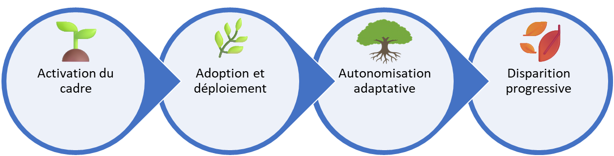

# Le but du cadre est de disparaître

Propriétaire: Laurent Morisseau

- Faire du cadre Agile4Enterprise une **béquille temporaire**, pas une structure figée.
- Réapprendre à **évoluer collectivement** dans l’incertitude, sans dépendance méthodologique.

> Imaginez une organisation qui, sans intervention externe, anticipe les tensions, ajuste ses priorités et crée de la valeur en permanence.
> 
> 
> **Le cadre** existe pour **accélérer** la transformation, **jusqu’à ce que l’organisation n’en ait plus besoin**.
> 

---

### Pourquoi ce cadre existe

1. **Accélérer la mutation** : passer d’une organisation réactive à une organisation pro-active en moins de 18 mois.
2. **Révéler les tensions** invisibles (stratégie vs exécution, alignement vs autonomie).
3. **Ancrer temporairement** : rituels et rôles pour structurer la transformation.
4. **Transférer la compétence** : rendre l’apprentissage agile interne et durable.

---

### Timeline type (0–18 mois)

| Phase | Durée | Objectif clé |
| --- | --- | --- |
| **0–3 mois** | Activation | Installer les rituels et former les rôles de base. |
| **3–9 mois** | Adoption | Faire vivre les ateliers stratégiques et tactiques. |
| **9–12 mois** | Autonomisation | Transférer progressivement les responsabilités. |
| **12–18 mois** | Disparition progressive | Retirer les rôles de transformation et mesurer l’autonomie réelle. |

➿ TechNova **Bénéfice** : en 14 mois, réduction de 35 % des blocages inter-équipes et adoption de rituels de synchronisation. **Clé du succès** : Atelier de transition « Agile4Enterprise off » animé dès le mois 12, piloté par le coach agile d’entreprise, avec simulation de retrait des rôles.

## Fonctions essentielles du Framework

Le cadre est là pour :

- **Évaluer** **les tensions** sous-jacentes, invisibles ou ignorées.
- **Ancrer :** Offrir des points d’ancrage temporaires pour aligner sans figer.
- **Transférer** : former et coacher pour que l’organisation endosse les responsabilités, **le temps que le changement soit devenu une capacité interne**.
- **Retirer** : désinstaller méthodiquement les artefacts, retirer les rôles quand l’autonomie est avérée.

## Pourquoi et quand il doit disparaître

L’agilité est une source d’avantage concurrentiel par la rencontre des compétences stratégiques de l’entreprise avec sa capacité de transformation durable.

Le cadre Agile4Enterprise agit comme un **accélérateur de transformation** : il guide et structure le changement **jusqu’à ce que l’organisation n’ait plus besoin de béquilles méthodologiques** pour apprendre, s’aligner et évoluer de façon autonome.

Le cadre peut être **retiré** lorsque :

1. **Adaptation spontanée** : des boucles de retour fonctionnent naturellement aux niveaux pertinents.
2. **Compétences et capacités ancrées** : le changement fait partie de l’ADN et actionné au quotidien.
3. Les bonnes décisions sont prises au bon niveau au bon moment.
4. **Challenge permanent** : le statu quo est remis en question en continu, à tous les niveaux hiérarchiques.
5. **Opportunité de l’incertitude** : le changement est accueilli comme une source d’innovation.

Alors **le cadre a accompli sa mission.** Et il doit **disparaître pour laisser la place à une organisation vivante et autoorganisée.**

---

# Pour clôturer

> Transformer est un acte temporaire. Piloter par le vivant est une capacité permanente.
> 

Le **succès** d’Agile4Enterprise **ne se mesure pas** :

- au nombre d’équipes formées,
- au nombre de rôles créés,
- au taux d’adoption des outils du cadre.

Il se mesure **au moment où l’organisation peut dire** :

> **“Nous n’avons plus besoin du cadre.
Nous savons choisir et changer ensemble.”**
> 

🔥 À ce moment-là, **Agile4Enterprise** aura disparu. Et c’est ainsi qu’il est censé réussir.