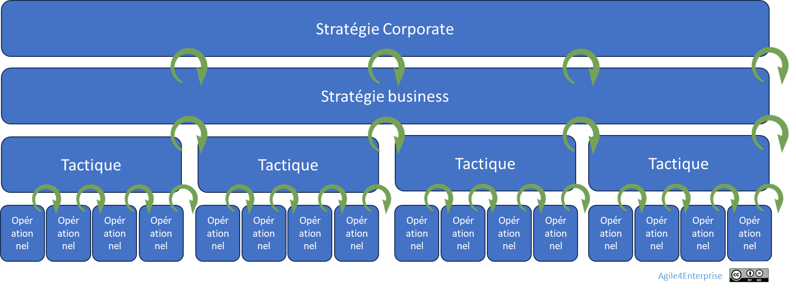
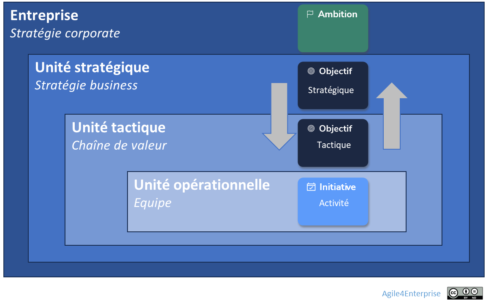
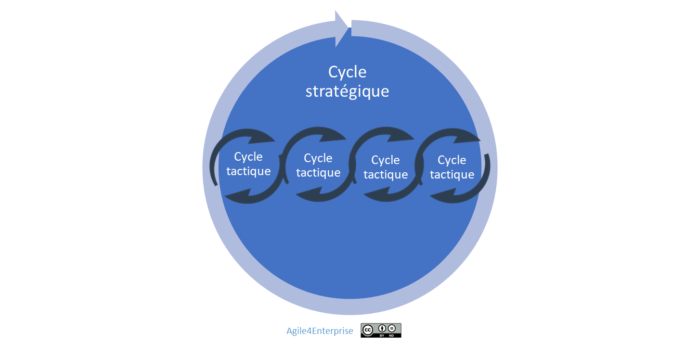

# Agile4B : Les 4 boucles adaptatives

✨ **Objectif** Chaque boucle adaptative combine un niveau de décision, une dimension de l’agilité, et une cadence de changement. Ce chapitre explore les **4 cadences du changement** qui structurent le rythme d’adaptation du système vivant **Agile4Enterprise**.

# **Le cœur battant : les boucles adaptatives**

Agile4B : 4 boucles adaptatives imbriquées

Les **boucles adaptatives** sont le mécanisme vital d’Agile4Enterprise. Chacune articule :

- Une **dimension Agile4D** (Portfolio, Stratégique, Tactique, Opérationnelle),
- Une **cadence** de feedback,
- Un **processus d’ajustement collectif**.

> C’est la synchronisation de ces boucles qui permet à l’entreprise de respirer, d’apprendre et de s'adapter en continu.
> 

## **Une orchestration vivante**

> *"Nos équipes sont agiles, mais nos priorités ne changent jamais au bon moment. On court, sans savoir où.”*
> 

L’agilité d’entreprise ne se décrète pas en multipliant les sprints ou les rituels. Elle émerge d’une synchronisation des boucles à chaque niveau de décisions.

**Un exemple concret de synchronisation :**

1. ***Décision stratégique***
    - *Définition des priorités stratégiques (Objectif : investir dans un nouveau marché).*
    - *Identification des indicateurs de succès (parts de marché, CA).*
2. ***Déploiement tactique***
    - *Déclinaison en OKR produits et chaînes de valeur.*
    - *Réallocation des ressources vers les nouvelles initiatives.*
3. ***Exécution opérationnelle***
    - *Lancement des actions terrain, retours clients rapides.*
4. ***Apprentissage et réajustement global***
    - *Analyse des retours terrain et ajustement de la tactique.*
    - *Intégration des apprentissages dans les prochaines décisions stratégiques.*

Cette cohérence entre tous les niveaux, nous allons la mettre en musique avec les 4 cadences du changement.

# Les 4 cadences du changement

Une entreprise qui évolue durablement :

- Ne laisse pas sa stratégie figée dans les slides,
- Ne laisse pas les équipes s’aligner au hasard,
- Ne multiplie pas les rituels sans vision.

Elle met en œuvre **4 cadences synchronisées** :

| Cadence | Fréquence | Portée |
| --- | --- | --- |
| **Portfolio** | Annuelle | Ajustement des paris stratégiques |
| **Stratégique** | Annuelle + trimestrielle | Cap business et ajustement des priorités |
| **Tactique** | Trimestrielle | Déploiement des initiatives |
| **Opérationnelle** | Hebdo ou bimensuelle | Ajustement en temps réel |

## Principe général

Chaque niveau est **autonome dans sa boucle**, puis se **resynchronise à la fin de celle-ci** :

- Une équipe Scrum s’aligne avec sa chaîne de valeur à la fin du sprint,
- La chaîne de valeur s’aligne avec sa business unit à la fin du trimestre,
- La business unit se réaligne avec le groupe à la revue stratégique annuelle.

Cette synchronisation assure une cohérence entre vision, stratégie et exécution, et permet d’éviter l’écueil d’une agilité cloisonnée à un seul niveau : silos, chaos improvisé, ou rigidité paralysante.

## **Cadence Portfolio – Le tempo des paris de l’entreprise**

🔹 **Boucle adaptative** : Ajuster la stratégie corporate et gérer le portefeuille d’activités en fonction de l’environnement. Cette cadence articule les unités stratégiques et impulse le tempo de transformation à toute l’entreprise.

🔹 **Rythme** : Annuel.
🔹 **Sans elle** : Les sujets sont pilotés de manière indépendante, sans synergie ou mobilité stratégique entre activités, créant des silos entre les unités d’affaires.

**En savoir plus**

💡 **Cadence Portfolio** **Gestion du changement au niveau de la stratégie corporate : Agilité Portfolio**

## **Cadence Stratégique – Le tempo des directions business**

🔹 **Boucle adaptative** : Adapter les orientations stratégiques d’unité business en fonction des retours terrain et des dynamiques marché.

🔹 **Rythme** : Annuel + ajustements trimestriels.

🔹 **Sans elle** : Les décisions de la direction et les actions du terrain se désalignent, et ne s’alimentent plus. Cette cadence réconcilie intention et réalité.

**En savoir plus**

💡 **Cadence stratégique** **Gestion du changement  au niveau de la stratégie business : Agilité Stratégique**

## **Cadence Tactique – Le tempo de l’alignement**

🔹 **Boucle adaptative** : Synchroniser les initiatives concrètes avec les priorités stratégiques, tout en absorbant la réalité terrain.

🔹 **Rythme** : Trimestriel, permettant une exécution souple et des ajustements rapides.

🔹 **Sans elle** : Les équipes tirent dans des directions opposées. La stratégie s’érode dans les frictions de terrain.

**En savoir plus**

💡 **Cadence tactique** **Gestion du changement au niveau de la tactique : Agilité Tactique**

## **Cadence Opérationnelle – Adaptation en continu**

🔹 **Boucle adaptative** : Permettre aux équipes de réagir vite, apprendre localement et s’ajuster en temps réel.

🔹 **Rythme** : Hebdomadaire ou bimensuel, selon les besoins des équipes.

**En savoir plus**

💡 **Cadence Opérationnelle** Gestion du changement au niveau opérationnelle : Agilité Opérationnelle

L'agilité d'entreprise repose sur la **synchronisation de ces boucles**, et non sur une hiérarchie de commandement.

📚 En savoir plus sur ces cadences imbriquées

---

# Et concrètement pour piloter ces boucles ? Les OKR

> *"Le problème, ce n’était pas le rythme, c’était qu’on ne savait pas vers quoi on courait.”*
> 

Les **cadences sont la structure du rythme**. Les **OKR** **(Objectives & Key Results) sont le langage d’orchestration**.

Ils permettent :

- D’articuler vision et exécution,
- De formuler des tensions stratégiques claires,
- D’aligner toutes les unités sur une intention commune.

C’est un outil de gestion agile d’objectifs d’entreprise, permettant de concentrer les efforts sur les initiatives ayant le plus grand impact.  Ils permettent de mettre en place concrètement ces boucles adaptatives :

Le processus OKR

- **Pourquoi ?** Pour aligner les priorités, suivre les apprentissages, et articuler les décisions entre niveaux.
- **Comment ?** Par des cycles courts, itératifs, centrés sur l’impact.
- **Avec quoi ?** Un processus en trois phases : planification, exécution, apprentissage.

## **Les cycles OKR comme pulsations synchronisées**

*Imbrication du cycle stratégique et des cycles tactiques*

Les **cadences de changement** sont mises en musique par des **cycles OKR alignés sur différents niveaux de décision** :

| Niveau | Cadence | Exemple de cycle |
| --- | --- | --- |
| Stratégique | annuel | Cycle OKR business unit |
| Tactique | trimestriel | Cycle OKR produit ou chaîne de valeur |
| Opérationnel | hebdo/bimensuel | revue des résultats clés d’équipe |

> Le niveau Portfolio n’utilise pas de cycle OKR : il oriente par la vision et les arbitrages, pas par des objectifs mesurables.
> 

📚 En savoir plus sur les OKR

---

#