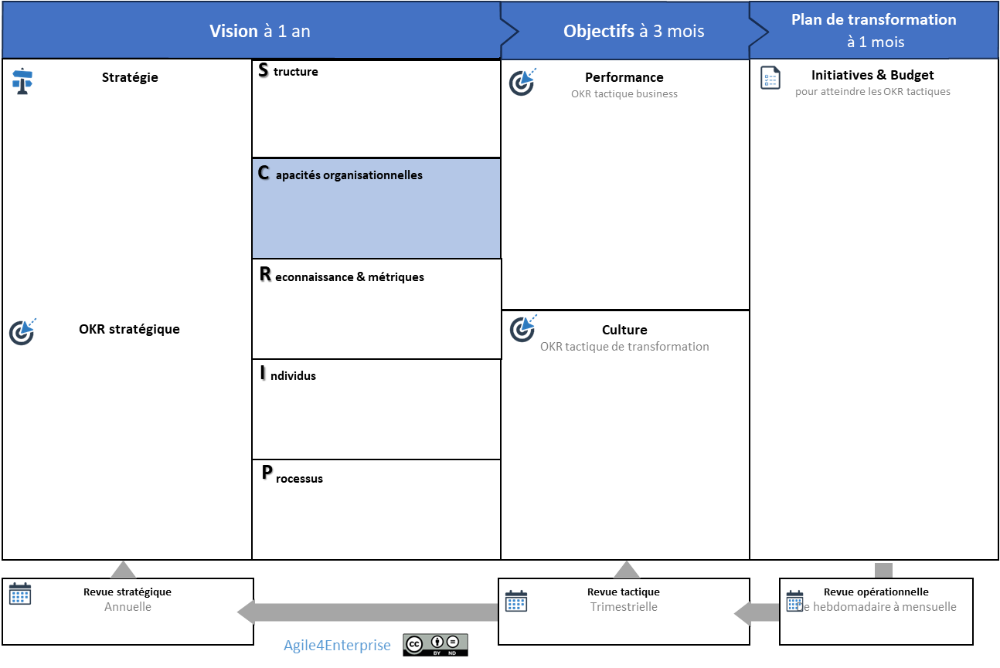
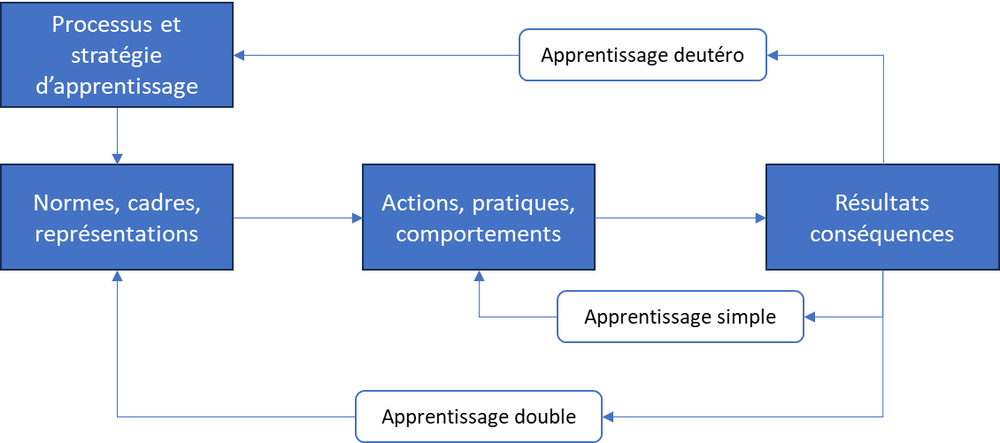
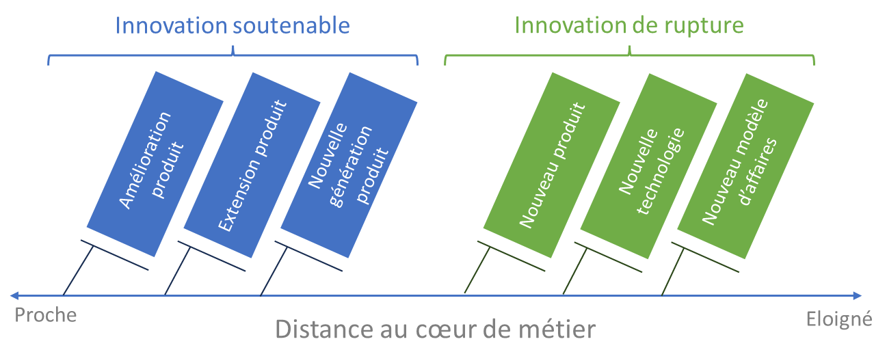

# Agile4C : Les 4 capacités organisationnelles clés

✨**Objectif**

Le but de ce chapitre est d’identifier les **capacités dynamiques** à développer pour une entreprise agile : Réactivité, flexibilité, adaptabilité et proactivité. Ces capacités ne sont pas des compétences isolées, mais les fonctions systémiques d’**Agile4Enterprise**.

🧑‍🎓**Ce que vous allez apprendre ici**

- L’agilité repose sur des **capacités organisationnelles** distinctes.
- En quoi l’alignement entre modèle d’affaires et modèle opératoire est-il essentiel pour performer durablement ?
- Comment distinguer **réactivité, flexibilité, adaptabilité et proactivité** ? Et pourquoi ne s’activent-elles pas de la même manière ?
- Pourquoi une organisation agile sans **Slack ni apprentissage structuré** reste-t-elle vulnérable ?

📚**Petit lexique**

- **Modèle d’affaires** : la façon dont une entreprise crée, délivre et capte de la valeur.
- **Modèle opératoire** : l’ensemble des structures, processus et compétences qui permettent d’exécuter le modèle d’affaires.
- **Capacité organisationnelle** : ce que l’organisation est capable de faire réellement, aujourd’hui, de manière distinctive et reproductible.
- **Réactivité** : capacité à répondre vite à un imprévu ou une opportunité.
- **Flexibilité** : capacité à ajuster sans bouleverser la structure.
- **Adaptabilité** : capacité à transformer durablement le modèle ou la structure.
- **Proactivité** : capacité à explorer, anticiper, agir avant d’y être contraint.
- **Slack** : marge de manœuvre organisationnelle pour absorber l’incertitude ou activer l’innovation.

## Aligner les modèles

La stratégie repose sur deux dimensions fondamentales :

- **L’environnement externe**, qui définit les opportunités et les menaces du marché,
- **Les capacités internes**, qui déterminent la manière de les exploiter.

Une entreprise performante sait relier les deux en alignant son modèle d’affaires à son modèle opératoire.

🧑‍🎓

**Capacité (ou capabilité)** :

Aptitude distinctive d’une organisation à réaliser des activités spécifiques, atteindre ses objectifs ou créer de la valeur de façon particulièrement efficiente et difficile à reproduire.
Elle reflète ce dans quoi le collectif excelle aujourd’hui et ce qui soutient l’accomplissement de sa mission.

Elle regroupe les ressources, processus, connaissances et compétences qui permettent à une entreprise d’agir efficacement dans son environnement.

## Les 4 capacités essentielles

### Réactivité

C’est la capacité à détecter rapidement un signal faible et à y réagir sans inertie. Cela signifie mobiliser aussitôt les ressources nécessaires face à un changement soudain, un événement ou une opportunité.

❓
Être réactif, c’est pouvoir répondre positivement à ces questions :

- Votre organisation sait-elle modifier ses priorités en cas d’imprévu ?
- Disposez-vous de processus intégrés pour les gérer efficacement ?

*Par exemple, une société de conseil IT a réuni en une journée une équipe d’experts pour résoudre une cyberattaque touchant un client majeur, limitant ainsi l’interruption de service à moins de 48 heures.*

### Flexibilité

C’est la capacité d’absorber des variations (plutôt que d’y réagir) sans modifier les structures existantes. Cela signifie suivre des changements progressifs ou temporaires sans transformation profonde.

❓
Être flexible, c’est pouvoir répondre à ces questions :

- Quel est l’impact d’une demande non standard ? Pouvez-vous l’accepter ?
- Quels sont les délais nécessaires pour adapter vos méthodes de travail à des circonstances nouvelles ou variées ?

*Par exemple, un éditeur B2C peut adresser un persona secondaire sans affecter ses engagements de service envers son segment client principal.*

### Adaptabilité

C’est la capacité à évoluer en profondeur pour rester en phase avec un environnement changeant. Cela implique de transformer durablement les modèles d’affaires et ses structures.

❓
Être adaptable, c’est pouvoir répondre à ces questions :

- Votre entreprise est-elle capable de remettre en cause sa stratégie ?
- Avez-vous mis en place des boucles de feed-back pour mesurer et ajuster votre trajectoire ?
- Quelle confiance avez-vous dans votre organisation d’en changer avec succès ?

*Par exemple, un éditeur B2B a repositionné son approche onPremise pour un nouveau modèle de distribution SaaS en moins de 3 mois.*

### Proactivité

C’est la capacité à initier volontairement des cycles d’apprentissage en explorant avant d’y être contraint. Il s’agit d’endosser un rôle actif dans le changement plutôt que de le subir.

❓
Être proactif, c’est pouvoir répondre à ces questions :

- Avez-vous des expérimentations en cours pour anticiper de nouvelles opportunités ?
- Comment les équipes sont-elles encouragées à prendre des initiatives et à tester leurs idées ?
- Quels sont les mécanismes en place pour transformer vos enseignements en innovations ?

*Par exemple, une entreprise de services B2B a lancé une série de « sprints stratégiques » trimestriels. Chacun constitue une équipe multidisciplinaire qui imagine un scénario client futur, avec la liberté de concevoir une réponse sans l’approbation préalable du comité de la direction.*

### Et la résilience ?

Souvent associée à l’agilité, elle recouvre plusieurs définitions :

1. C’est la capacité d’un matériau à se déformer, puis revenir à sa forme initiale
2. Issue de la psychologie, c’est la capacité à rebondir
3. Dans le domaine socioécologique, c’est réussir à se maintenir, à s’adapter et à se transformer dans un environnement fluctuant. Cette notion englobe les concepts de vulnérabilité et de robustesse.

Selon les définitions données, on pourrait ajouter la résilience aux capacités à développer. Ici, nous situons l’agilité comme une réponse à l’évolution continue plutôt qu’au changement de rupture. Ce dernier est conçu pour le « cygne noir », un « événement hautement improbable et rare avec un impact considérable » selon Nassim Taleb.

### Une réponse systémique aux défis de la direction

Les 4 capacités ne doivent pas être développées de manière indépendante. Elles forment un système intégré, où chacune renforce les autres. Car ce sont quatre réponses différentes face au changement continu, et à la gestion du risque dans l’incertitude. Quand elles sont absentes :

- **Pas de réactivité** → escalades chroniques, urgences ingérables, opportunités ratées.
- **Pas de flexibilité** → rigidité des rôles, résistance passive, effet tunnel.
- **Pas d’adaptabilité** → plans figés, perte de pertinence, persistance dans une stratégie obsolète.
- **Pas de proactivité** → innovation superficielle, mode suiveur enclenché, approche défensive, en retard d’un train.

Le résultat ? Des transformations qui échouent, des collaborateurs désengagés, une direction en perte de sens. Autant de points qui font partie de la mission des managers, mais qui devraient rester des exceptions plutôt qu’un quotidien.

➿**TechNova**

**Déjà réactive et adaptable** :

L’IA est arrivée vite. Très vite. En quelques mois seulement, l’entreprise a su lancer un prototype fonctionnel, mobiliser des clients pilotes sur le marché résidentiel, et… créer un nouveau département dédié : **Smart Home**.

Une belle réactivité, suivie d’une adaptabilité réelle — structurée, assumée. Mais elle est intervenue sans démarche proactive, c’est le marché qui a forcé le pas.
Pour aller plus vite, TechNova a court-circuité les processus d’escalade établis pour les capteurs et la domotique, donnant mandat direct aux Product Owners. 

**Résultat** : une exécution rapide, mais localisée. Elle démontre qu’elle sait réagir et s’adapter. Mais pour créer l’avenir, l’entreprise doit aussi apprendre à provoquer le changement, et pas seulement à y répondre.

## Ce qui nourrit ces capacités : apprentissage, innovation et Slack

### Apprentissage organisationnel

Le **changement et l’apprentissage** sont deux facettes indissociables d’un même processus. L’agilité consiste également à apprendre efficacement. Cela repose sur un **système de boucles de rétroaction**, qui se décline en trois types :

- **Simple boucle** : ajuster sans changer le cadre

    *Par exemple, améliorer un processus existant pour réduire les délais de production.*

- **Double boucle** : remettre en cause le cadre

    *Par exemple, changer de modèle économique pour s’adapter aux nouvelles tendances de consommation.*
- **Triple boucle** : apprendre à apprendre au niveau collectif pour améliorer les autres types d’apprentissage.

Dans l’entreprise, il se situe sur deux axes complémentaires, orienté vers :

- **Les clients et le marché** : il porte sur le **modèle d’affaires**.

- **L’intérieur de l’organisation** : il vise le **modèle opératoire**.

🧑‍🎓
L’organisation apprenante met en œuvre les trois boucles d’apprentissage et sait structurer son expérience pour progresser plus vite et mieux. L’entreprise agile, de son côté, n’en active spécifiquement que deux. Elle ne se confond donc pas avec l’organisation apprenante, même si l’apprentissage reste une clé de voûte de ses capacités.

### Les capacités d’innovation au service de l’agilité

L’innovation joue également un rôle clé dans la stratégie et se décline en deux formes :

- **Continue** (ou incrémentale) : renforce le business model existant
- **De rupture** : ouvre la voie à un nouveau modèle d’affaires.

L’entreprise agile ne recherche pas la rupture à tout prix, mais s’appuie surtout sur deux types d’innovations continues pour renforcer sa compétitivité :

- **De continuité** : amélioration incrémentale des offres

    *Par exemple : ajouter de nouvelles fonctionnalités à un produit en réponse aux retours des utilisateurs.*

- **D’efficience** : optimisation des processus internes

    *Par exemple : automatiser certaines tâches pour gagner en délais et réduire les coûts.*

### Slack organisationnel

**Le Slack organisationnel**, c’est la marge de manœuvre qui autorise de :

- Réallouer des ressources à l’imprévu,
- Absorber des chocs sans restructuration brutale,
- Soutenir des apprentissages sans compromettre l’exécution.

Plus qu’un excès de capacité, c’est une réserve stratégique. Le Slack peut se matérialiser de plusieurs manières dans une entreprise :

| **Type de Slack** | **Fonction** | **Impact sur l’agilité** |
| --- | --- | --- |
| **Slack financier** | Trésorerie excédentaire pour absorber les crises | Capacité à financer des opportunités stratégiques, telles que l’innovation |
| **Slack humain** | Effectifs supplémentaires ou polyvalents | Flexibilité dans l’allocation des ressources et gestion de la charge |
| **Slack temporel** | Marges dans les plannings | Favorise l’expérimentation et l’apprentissage |

Il ne suffit pas d’avoir du Slack, encore faut-il l’utiliser de manière intentionnelle pour :

- **Allouer des ressources à des expérimentations** sans pression de rentabilité immédiate.
- **Favoriser la polyvalence des équipes** pour autoriser des ajustements en fonction des besoins.
- **Planifier des cycles de travail basés sur 90 % de la capacité** plutôt que 100 % (ou plus…).
- **Créer un budget incrémental** pour financer les initiatives stratégiques en fonction des résultats réels.

Ce n’est pas un luxe, mais un investissement : une organisation 100 % optimisée devient fragile. L’agilité suppose des marges. Le Slack désigne une inefficacité choisie, donnant à l’entreprise l’agilité nécessaire pour exploiter le changement.

## Rendre ces capacités actionnables avec ACTE

**ACTE**, que nous aborderons plus loin, rend les capacités actionnables. C’est un canevas d’alignement. On peut formuler les 4 capacités comme des objectifs d’adaptation sur un an.

*Par exemple : Feuille de route annuelle trop rigide ? Objectif : intégrer une initiative en moins de 2 mois → capacité visée : Réactivité.*

## 👣 Et concrètement, lundi matin ?

Contextualisez les capacités :

- Que signifie, dans votre contexte, une organisation réactive ?
- Quels sont les obstacles qui vous empêchent, aujourd’hui, de gagner en flexibilité ?
- Comment saurez-vous que votre organisation est devenue proactive dans un an ?

1. Nommez la capacité à renforcer,
2. Identifiez les freins actuels,
3. Cadrez un objectif de transformation clair,
4. Intégrez dans ACTE.

Avec cet outil, les capacités deviennent des critères de conception qui guident l’évolution du modèle opératoire.

## 🔑 Points clés à retenir

- Ces capacités forment le socle du modèle opératoire agile.
- Elles ne sont pas le résultat de l’agilité, elles en sont la condition.
- Elles se construisent par l’apprentissage, l’expérimentation, la respiration.
- Intégrées dans **ACTE**, elles guident la transformation concrète d’une unité stratégique.

> Ce que produit **Agile4Enterprise**, ce ne sont pas des méthodes : ce sont des capacités à changer en continu. Elles transforment le changement maîtrisé en avantage concurrentiel et permettent à l’entreprise d’évoluer en permanence sans être freinée par ses succès passés.

