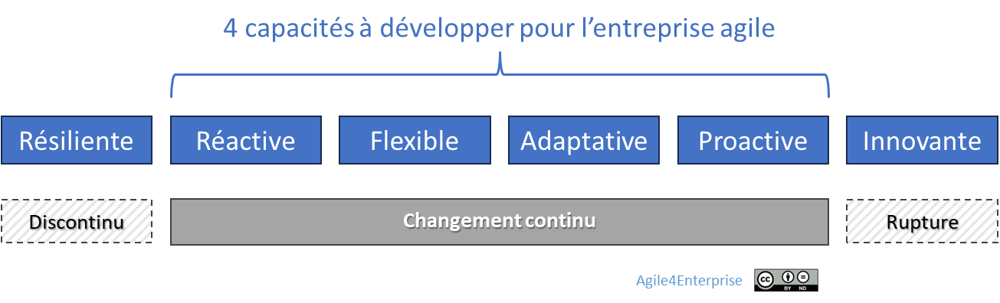
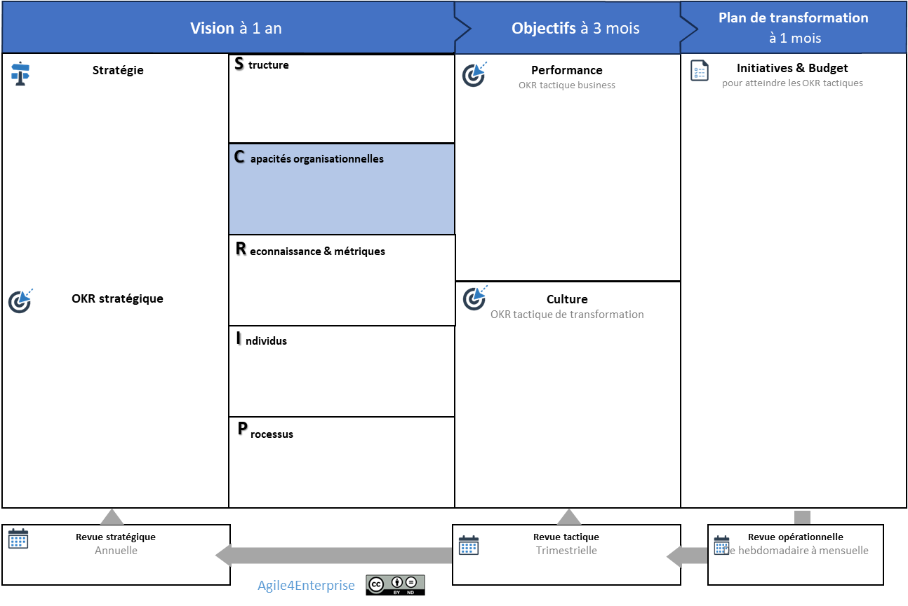

# Agile4C : Les 4 capacités organisationnelles clés

✨ **Objectif** Identifier les **capacités dynamiques vitales** à développer pour une entreprise agile : Réactivité, Flexibilité, Adaptabilité et Proactivité. Ces capacités ne sont pas des compétences isolées mais les fonctions systémiques d’**Agile4Enterprise**.

🧑‍🎓 ### Ce que vous allez apprendre - L’agilité repose sur des **capacités structurelles** distinctes. - En quoi l’**alignement entre modèle d’affaires et modèle opératoire** est essentiel pour performer durablement. - Comment distinguer **réactivité, flexibilité, adaptabilité et proactivité** — et pourquoi elles ne s’activent pas de la même manière. - Pourquoi une organisation agile sans **slack ni apprentissage structuré** reste vulnérable.

📚 ### Petit lexique - **Modèle d’affaires** : la façon dont une entreprise crée, délivre et capte de la valeur. - **Modèle opératoire** : l’ensemble des structures, processus et compétences qui permettent d’exécuter le modèle d’affaires. - **Capacité organisationnelle** : ce que l’organisation est capable de faire réellement, aujourd’hui, de manière distinctive et reproductible. - **Réactivité** : capacité à répondre vite à un imprévu ou une opportunité. - **Flexibilité** : capacité à ajuster sans bouleverser la structure. - **Adaptabilité** : capacité à transformer durablement le modèle ou la structure. - **Proactivité** : capacité à explorer, anticiper, agir avant d’y être contraint. - **Slack** : marge de manœuvre organisationnelle permettant d’absorber l’incertitude ou d’activer l’innovation.

# **Alignement entre modèle d’affaires et modèle opératoire**

Alignement entre le modèle d’affaire et le modèle opératoire

La stratégie d’entreprise repose sur deux dimensions fondamentales :

- **L’environnement externe**, qui définit les opportunités et les menaces du marché,
- **Les capacités internes**, qui déterminent la manière dont elle exploite ces opportunités.

Une entreprise performante sait **relier ses ambitions externes** (son modèle d’affaires) à sa **capacité interne à les exécuter** (son modèle opératoire). **Ces capacités** déterminent la réponse possible de l’organisation et la manière dont elle les exploite. Cet alignement n’est pas figé. Il est dynamique.

💡 **Capacité organisationnelle (ou capabilité)** Une **capacité d’entreprise** définit ce qu'une organisation est capable de faire. Plus précisément, c’est la compétence distinctive d’une entreprise à exécuter des activités spécifiques, à atteindre des objectifs, ou à créer de la valeur d’une manière particulièrement efficiente, difficile à répliquer. C'est ce que l'entreprise excelle à faire aujourd'hui. Une capacité englobe un ensemble de ressources, de processus, de connaissances et de compétences qui permettent à une organisation de fonctionner efficacement dans son environnement. C’est la réponse à : notre entreprise est capable de {la capacité} afin de {la mission}.

# Les 4 capacités vitales du système vivant

Les 4 capacités agiles

## **Réactivité – Réagir vite à l’imprévu**

C’est la capacité de capter rapidement un signal faible, d'y répondre sans inertie. Pour une organisation, elle consiste à répondre efficacement à des changements soudains, des événements inattendus ou des opportunités à saisir en mobilisant rapidement les ressources nécessaires.

❓ **Être réactif, c’est pouvoir répondre à ces questions :** - Votre organisation est-elle capable de modifier ses priorités en cas d’imprévu ? - Disposez-vous de processus intégrés pour gérer efficacement ces imprévus ?

> C’est passer de “**Subir les urgences et les crises”** à “**Répondre aux opportunités sans les subir”.**

## **Flexibilité – Ajuster sans déformer**

C’est la capacité d'absorber des variations (plutôt que d’y réagir) sans changer les structures existantes. Pour une organisation, c’est s’adapter à des changements progressifs ou temporairement sans altérer profondément sa structure ni sa culture.

❓ **Être flexible, c’est pouvoir répondre à ces questions :** - Quel est l’impact d’une demande client non standard ? Pouvez-vous l’accepter ? En combien de temps pouvez-vous y répondre ? - Quels sont les délais nécessaires pour adapter vos méthodes de travail à des circonstances nouvelles ou variées ?

> C’est passer de “**Perdre des opportunités à cause d’une organisation rigide”** à “**Ajuster l’organisation sans tout bouleverser”.**

## **Adaptabilité – Transformer durablement**

C’est la capacité d’évoluer profondément pour rester pertinent dans un environnement mouvant. Pour l’organisation, cela implique une transformation en profondeur pour s’aligner durablement sur les évolutions du marché. Contrairement à la flexibilité qui ajuste les méthodes de travail, l’adaptabilité transforme **les modèles d’affaires et les structures**.

❓ **Être adaptable, c’est pouvoir répondre à ces questions :** - Votre organisation est-elle capable de remettre en question sa stratégie et de l’ajuster en fonction du marché ? - Avez-vous mis en place des boucles de feedback stratégiques pour mesurer et ajuster votre trajectoire ? - Quelle confiance avez-vous dans votre organisation d’accepter et de changer de stratégie avec succès ?

> C’est passer de “**Se laisser dépasser par l’évolution du marché”** à “**Faire évoluer l’entreprise sur le long terme”.**

*Par exemple, un éditeur B2B a repositionné son approche onPremise pour un nouveau modèle de distribution SaaS en moins de 6 mois.*

## **Proactivité – Créer avant d’être contraint**

C’est la capacité de provoquer volontairement des cycles d’apprentissage, d’explorer l’inconnu avant d'y être forcé, en expérimentant pour découvrir au plus tôt. C’est un **principe de mise en action** pour amorcer les boucles d’apprentissage. Car sans mouvement, pas de changement. C’est l’idée d’être un acteur du changement, plutôt que simplement le subir.

❓ **Être proactif, c’est pouvoir répondre à ces questions :** - Avez-vous des expérimentations en cours pour anticiper de nouvelles opportunités ? - Comment les équipes sont-elles encouragées à prendre des initiatives et à tester de nouvelles idées ? - Quels sont les mécanismes en place pour transformer vos apprentissages expérimentaux en améliorations continues ou innovations ?

> C’est passer de “**Être condamné à suivre plutôt qu’à innover”** à “**Anticiper et être acteur du changement”.**

*Par exemple, une entreprise de services B2B a lancé une série de “sprints stratégiques” trimestriels. Chaque sprint réunit une équipe pluridisciplinaire qui explore un futur scénario client, avec la liberté de prototyper une réponse sans validation préalable du COMEX. Deux de ces prototypes ont été intégrés à la feuille de route stratégique.*

### Et la résilience ?

On associe souvent la résilience à l’agilité. Elle a plusieurs définitions :

1. C’est la capacité d’un matériau à se déformer puis revenir à sa forme initiale,
2. La seconde définition, issue de la psychologie, est la capacité à rebondir,
3. Enfin la troisième définition issue du domaine socio écologique, est la capacité à se maintenir, à s’adapter et à se transformer dans un environnement fluctuant. Cette notion englobe les concepts de vulnérabilité et de robustesse.

Selon les définitions données, on pourrait ajouter la résilience aux capacités à développer pour gérer le changement. Pour Hamant, la robustesse est “la capacité à se maintenir stable (sur le court terme) et viable (sur le long terme) malgré les fluctuations”. Ici, nous situons l’agilité comme une réponse au changement continu ou incrémental plutôt qu’au changement de rupture, conçu pour répondre au “cygne noir”, un “événement hautement improbable et rare avec un impact considérable”.

### **Une réponse systémique aux défis de la direction**

Les 4 capacités ne doivent pas être développées de manière indépendante. Elles forment un **système intégré**, où chacune renforce les autres. Car ce sont quatre stratégies de réponse différentes face au changement incrémental et continu, et à la gestion du risque dans l’incertitude.

### Quand les capacités sont absentes…

- **Pas de réactivité** → escalades chroniques, urgences ingérables, opportunités ratées.
- **Pas de flexibilité** → rigidité des rôles, résistance passive, effet tunnel dans les plans.
- **Pas d’adaptabilité** → plans figés, perte de pertinence, persistance dans une stratégie obsolète.
- **Pas de proactivité** → innovation cosmétique, stratégie copiée, approche défensive, innovation en retard.

Autant de points qui font partis de la mission des managers, mais qui devraient être des exceptions plutôt qu’un quotidien.

Le résultat ? Des transformations qui échouent, des collaborateurs désengagés, une direction en perte de sens.

➿ **TechNova : Déjà réactive et adaptable** L’IA est arrivée vite. Très vite. En quelques mois, l’entreprise a su lancer un prototype fonctionnel, mobiliser des clients pilotes, et… créer une nouvelle BU dédiée : **Smart Home**. Une belle réactivité, suivie d’une adaptabilité réelle — structurée, assumée. Mais cette réactivité s’est faite **sans vision proactive**. Il n’y a pas eu d’exploration anticipée, pas de veille ou de scénario préparé : c’est le marché qui a forcé le pas. Pour aller plus vite, TechNova a **court-circuité les processus d’escalade** établis pour les capteurs et la domotique, donnant **mandat direct aux Product Owners**. Résultat : une exécution rapide, mais localisée. Côté domotique, un effort de **flexibilité** a permis d’abandonner la priorisation trimestrielle au profit d’une **planification bimensuelle** pilotée par les retours clients — sans devoir reconfigurer toute la structure. TechNova démontre qu’elle sait **réagir et s’adapter**. Mais pour créer l’avenir, il lui faudra aussi apprendre à **provoquer le changement**, au lieu d’y répondre seulement.

# **Ce qui nourrit ces capacités : apprentissage, innovation et slack**

## Apprentissage organisationnel

D’après le modèle de boucles d’apprentissage collectif de Chris Argyris et Donald Schön

Le **changement et l’apprentissage** sont deux facettes indissociables d’un même processus. L’agilité ne consiste pas uniquement à s’adapter rapidement, mais aussi à apprendre efficacement de chaque adaptation. L’apprentissage organisationnel repose sur un **système de boucles de rétroaction**, qui se décline en trois types d’apprentissage :

- **Simple boucle** (ajuster sans changer le cadre) → Renforce **réactivité** et **flexibilité**

    *Par exemple, améliorer un processus existant pour réduire les délais de production.*

- **Double boucle** (remettre en cause le cadre) → Renforce **adaptabilité** et **proactivité**

    *Par exemple :*

- *Remettre en cause le modèle économique d’une entreprise pour s’adapter aux nouvelles tendances de consommation.*
- *Modifier la structure organisationnelle pour améliorer la prise de décision et la réactivité.*
- Triple boucle → apprendre à apprendre au niveau collectif pour améliorer leurs capacités d'apprentissage simple et double.

L’apprentissage existe sur deux axes complémentaires :

🔹**Orienté vers les clients et le marché** : L’apprentissage porte sur **la chaîne de valeur**.

🔹**Orienté vers l’intérieur de l’organisation** : L’apprentissage porte sur les processus internes, la structure organisationnelle, …

⚠️ L’organisation apprenante implémente, par définition, les 3 boucles d’apprentissages, à tous les niveaux de décisions. C‘est une organisation capable de structurer son apprentissage pour apprendre plus vite et mieux. L’entreprise agile n’implémente que de ces deux boucles. C’est pourquoi elle n’est pas un synonyme d’organisation apprenante, même si l’apprentissage est une clé de voute de l’organisation agile.

## **Les capacités d’innovation au service de l’agilité**

*Adapté du modèle d’innovation de Galbraith*

L'innovation a un rôle à jouer dans la stratégie. On en distingue deux types :

- Les **innovations continues** / incrémentales, qui renforcent le business model de l'entreprise.
- Les **innovations de rupture,** qui ouvrent la voie à un nouveau modèle d’affaires.

L’entreprise agile ne cherche pas l’innovation de rupture à tout prix, mais s’appuie principalement sur deux types innovations incrémentales pour renforcer sa compétitivité :

- **L’innovation de continuité** : amélioration incrémentale des offres

    *Par exemple :*

- *Ajouter de nouvelles fonctionnalités à un produit en réponse aux retours des utilisateurs.*
- *Adapter une offre commerciale pour mieux répondre aux évolutions du marché.*
- **L’innovation d’efficience** : optimisation des processus internes

    *Par exemple :*

- *Automatiser certaines tâches pour gagner en efficacité et réduire les coûts.*
- *Repenser l’organisation des équipes pour améliorer la fluidité du travail et réduire les délais.*

## **Slack organisationnel : une marge de manœuvre vitale**

**Le Slack organisationnel**, c’est la marge de manœuvre qui permet de :

- Réallouer des ressources à l’imprévu ou à l’innovation,
- Absorber des chocs sans restructuration brutale,
- Soutenir des apprentissages sans compromettre l’exécution.

Il ne s’agit pas seulement d’un excès de capacité, mais d’une réserve stratégique permettant d’assurer l’équilibre entre efficacité et adaptabilité. Le Slack peut se matérialiser de plusieurs manières dans une entreprise :

| **Type de Slack** | **Fonction** | **Impact sur l’agilité** |
| --- | --- | --- |
| **Slack financier** | Trésorerie excédentaire pour absorber les crises | Capacité à financer des opportunités stratégiques |
| **Slack humain** | Effectifs supplémentaires ou polyvalents | Flexibilité dans l’allocation des ressources et gestion de la charge |
| **Slack temporel** | Marges dans les plannings et cycles de travail | Favorise l’expérimentation et l’apprentissage |

Le défi n’est pas seulement d’avoir du Slack, mais de l’utiliser de manière intentionnelle :

- **Allouer des ressources à des expérimentations** sans pression de rentabilité immédiate.
- **Favoriser la polyvalence des équipes** pour permettre des ajustements en fonction des besoins.
- **Planifier des cycles de travail basés sur 90% de la capacité** plutôt que 100% (ou plus).
- **Créer un budget agile** avec des investissements incrémentaux permettant de financer des initiatives stratégiques en fonction des évolutions du marché.

Ce n’est pas un luxe, mais un investissement : Une organisation 100% optimisée est fragile. L’agilité suppose des marges. Le Slack est une inefficacité volontaire au service de l’agilité, permettant à l’entreprise de tirer parti du du changement plutôt que le subir.

📚 En savoir plus sur le Slack Organisationnel

📚 Retrouver toutes les informations sur les capacités de l’entreprise agile dans notre wiki.

---

# **Rendre ces capacités actionnables avec ACTE**

Intégration des capacités organisationnelles dans l’outil ACTE

Pour rendre les capacités actionnables dans une organisation, utilisez l’outil **ACTE**. C’est un canevas permettant d’aligner les décisions stratégiques - tactiques et opérationnelles. Dans ce canevas, les 4 capacités peuvent être formulées **comme des objectifs d’adaptation sur un an**, à intégrer dans le modèle opératoire.

*Par exemple :*

- *Roadmap annuelle trop rigide ? Objectif : intégrer une initiative en 2 mois → Capacité visée : Réactivité.*
- *Passage en SaaS ? Objectif : livraison mensuelle ou continue → Capacité visée : Flexibilité + Réactivité.*

## 👣 Et concrètement, lundi matin ?

❓ **Contextualisez les capacités organisationnelles** - **Que signifie, dans votre contexte, une organisation réactive ?** Est-ce une capacité de prise de décision rapide ? Une rapidité d’exécution face aux demandes clients ? - **Quels sont les obstacles qui vous empêchent d’être plus réactif aujourd’hui ?** Processus trop rigides, manque d’autonomie des équipes, systèmes IT obsolètes ? - **Comment saurez-vous que votre organisation est devenue réactive dans un an ?**  A-t-elle pivoter sur une des ses initiatives ?

1. Nommer la capacité à renforcer (dans votre contexte),
2. Identifier les freins actuels,
3. Cadrer un objectif d’évolution clair,
4. Intégrer dans ACTE comme levier de transformation.

Avec cet outil, les capacités organisationnelles deviennent des critères de conception qui guident la transformation du modèle opératoire.